# 2012Rieman

[Feed-Forward 3D Model - 第1讲 前馈式重建模型发展历程](https://www.bilibili.com/video/BV1dG2PBXEoz/?share_source=copy_web&vd_source=eac89beacf4b5ecfa9a66e7ebc9bd301)

[【手撕系列】手撕Transformer - WKQ](https://wkq9411.github.io/2026-01-01/Code-Transformer.html)

## 0. ViT & DPT Head & DINO

> Dosovitskiy A, Beyer L, Kolesnikov A, et al. An image is worth 16x16 words: Transformers for image recognition at scale[J]. arXiv preprint arXiv:2010.11929, 2020.
>
> RANFTL R, BOCHKOVSKIY A, KOLTUN V. Vision Transformers for Dense Prediction[A/OL]. arXiv, 2021[2026-04-26]. http://arxiv.org/abs/2103.13413. DOI:[10.48550/arXiv.2103.13413](https://doi.org/10.48550/arXiv.2103.13413).
>
> Caron M, Touvron H, Misra I, et al. Emerging properties in self-supervised vision transformers[C]//Proceedings of the IEEE/CVF international conference on computer vision. 2021: 9650-9660.

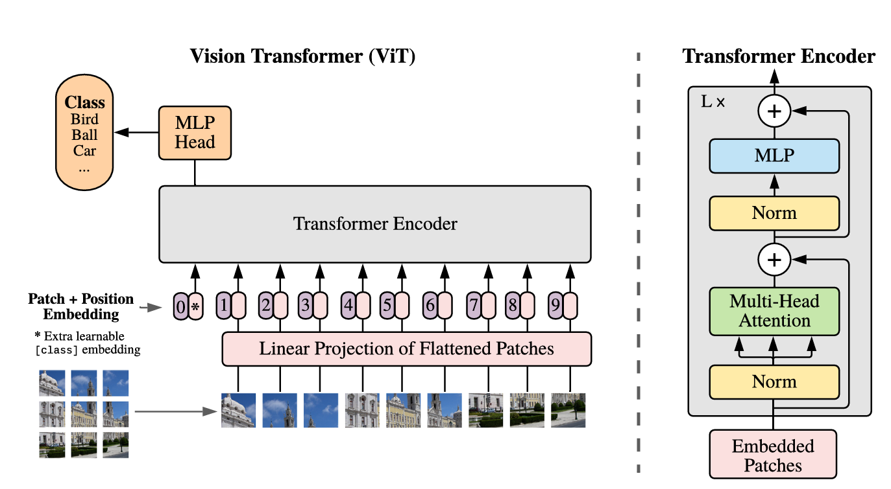

Vision Transformer（ViT）的基本思想是将图像转化为类似文本序列的数据来处理。具体来说，模型首先将输入图像划分为固定大小的patch（如16×16），并将每个patch展平后通过线性映射转换为固定长度的向量表示。为了完成分类任务，在这些patch序列前会额外加入一个特殊的分类token（[CLS]），其最终输出用于表示整张图像的类别。同时，为了保留图像中各个patch的空间位置信息，还需要为序列加入位置编码。

```python
def PatchEmbed_forward(x):
    """
    Patch Embedding 本质上等价于：
        patchify + shared linear projection。

    其中：
        Conv2d(kernel_size=P, stride=P)

    会将每个 P×P patch 映射为一个 D 维 token。
    """
    # x: [B, C, H, W]

    x = Conv2d(
        kernel_size=patch_size,
        stride=patch_size,
    )(x)
    # [B, C, H, W] -> [B, D, H/P, W/P]

    x = flatten_spatial(x)
    # [B, D, H/P, W/P] -> [B, N, D]

    x = norm(x)

    return x
```

随后，这一序列被输入到标准的Transformer Encoder中进行建模，其结构与BERT中的编码器基本一致，通过多层自注意力机制提取全局特征，最终利用[CLS] token的输出进行图像分类预测。

在训练过程中，ViT通常采用预训练与微调相结合的方式。模型先在大规模数据集上进行预训练，以学习通用的视觉特征表示，然后再在具体的下游任务数据集上进行微调，从而适应特定的图像分类任务。这种范式使ViT能够在具备足够数据的情况下取得与甚至超过传统卷积神经网络的性能。

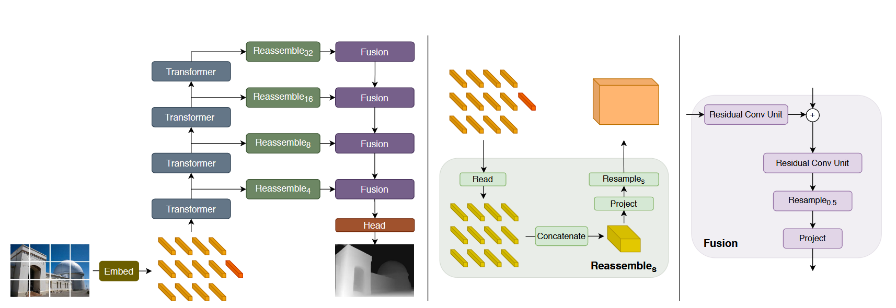

DPT head（Dense Prediction Transformer head）用于将 Transformer 输出的序列特征重建为高分辨率的稠密空间预测，其核心思想是通过**多尺度特征重组与逐层融合**恢复空间结构。传统CNN通过逐步下采样扩大感受野、提取多尺度特征，但在深层会损失空间分辨率与细节，这对密集预测任务不利。为在扩大感受野的同时避免信息丢失，可在编码器中引入Transformer，对Vision Transformer的patch表示进行重组，恢复为多尺度的类图像特征，再结合卷积解码器逐步融合，生成高分辨率的密集预测结果。其整体思路与ViT的“bag-of-words”表示类似，首先将输入图像划分为固定大小的patch，并通过Embedding（线性映射或结合ResNet）映射到特征空间，每个patch对应一个token，且不改变原始分辨率。随后，这些token经过Transformer encoder处理，被重组为不同分辨率的“类图像”特征表示。接着，卷积解码器对这些多尺度特征进行逐步融合，恢复空间结构并生成密集预测，最后通过fusion模块整合不同分辨率的输出。

具体而言，DPT head 由三个关键模块组成：**Reassemble、Fusion 与 Prediction Head**。首先，在 Reassemble 阶段，模型从不同 Transformer 层提取中间特征，并将其从序列形式重新映射回二维空间结构。对于每一层特征，先通过线性投影（project）调整通道维度，再根据对应尺度进行上采样或下采样（resample），从而得到多个不同分辨率的特征图。这一过程本质上实现了从 token 表示到多尺度 feature map 的转换。随后，在 Fusion 阶段，模型对这些多尺度特征进行逐层融合。具体地，每一层特征通过残差卷积单元（Residual Conv Unit）进行局部增强后，与上一层融合结果进行相加，并通过上采样逐步恢复空间分辨率。该过程类似于自顶向下的特征金字塔结构，使高层语义信息与低层空间细节逐步整合。最后，在 Prediction Head 中，融合后的高分辨率特征被进一步映射为目标输出（如深度图或点图），通常通过若干卷积层完成通道压缩与空间映射，从而得到最终的稠密预测结果。

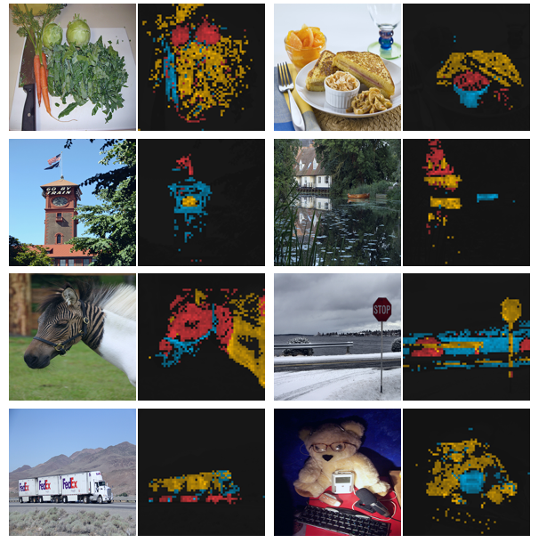

DINO是一种**自监督视觉特征学习方法**，主要用于在**没有人工标注**的情况下训练模型学习图像表示。它常用于训练ViT等视觉骨干网络，使模型能够从大量无标签图像中学到较好的语义特征。简单来说，DINO采用“教师-学生”结构：同一张图像经过不同增强后分别输入教师模型和学生模型，学生模型学习模仿教师模型的输出；教师模型则由学生模型的参数滑动平均更新。通过这种方式，模型可以自动学习图像中的重要区域和语义信息，而不需要类别标签。可以把DINO理解为一种**用于预训练视觉backbone的自监督方法**。经过DINO训练的模型通常具有较强的特征提取能力，后续可以被用于分类、检测、分割、深度估计等下游视觉任务。

<div style="display: flex; gap: 10px;">
  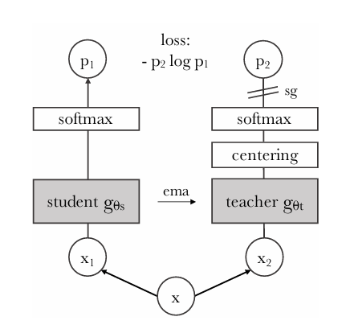
  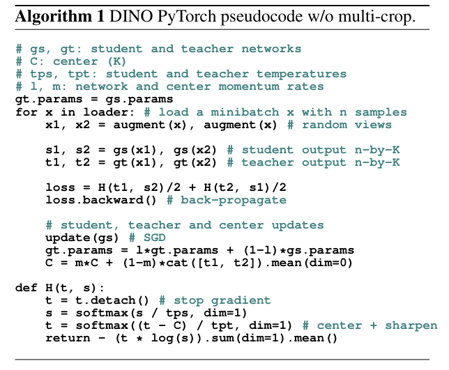
</div>

结合图中的结构可以更直观地理解这一过程：一张输入图像 $x$ 会被随机增强成两个不同视角 $x_1$ 和 $x_2$，分别送入学生网络和教师网络。两者都会经过类似的编码与softmax输出得到概率分布（即对“视觉token类别”的预测）。不同之处在于，教师分支的输出会先经过**centering（中心化）**和**temperature sharpening（温度缩放）**处理，使其分布更加稳定和“尖锐”，同时在反向传播时对教师分支**停止梯度（stop-gradient）**，保证教师只作为“目标”而不被直接更新。随后，训练目标是最小化学生输出与教师输出之间的**交叉熵损失**（图中 $-p_2 \log p_1$），并且是**交叉匹配**的（即用一个视角的教师输出去监督另一个视角的学生输出），从而强制模型学习到对不同增强不变的语义表示。右侧的伪代码进一步说明了训练细节：每个batch中会生成两种增强视角，分别通过学生和教师网络得到输出，然后计算对称的损失 $H(t_1, s_2) + H(t_2, s_1)$。学生网络通过反向传播更新参数，而教师网络则通过EMA从学生参数中缓慢更新。同时，引入一个全局的**center向量**来对教师输出进行去偏移（centering），避免模型输出坍塌（collapse到常数解）。温度参数（student temperature / teacher temperature）则用于控制分布的平滑程度，从而稳定训练。

## 1. PoseNet

> A. Kendall, M. Grimes, and R. Cipolla, *“PoseNet: A Convolutional Network for Real-Time 6-DOF Camera Relocalization,”* in **Proc. ICCV**, 2015.

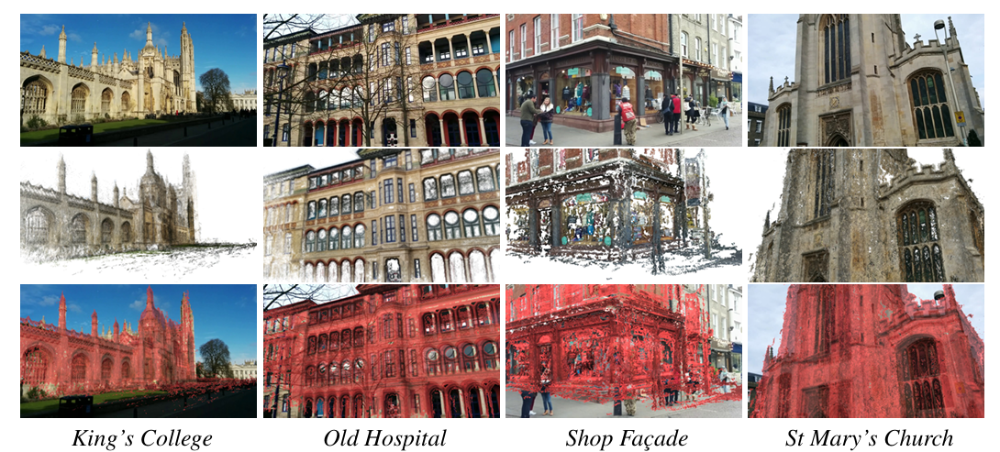

Kendall 等提出的 PoseNet 是将深度学习引入相机重定位（camera relocalization）的开创性工作之一，其核心思想是通过卷积神经网络直接从单幅 RGB 图像回归相机的六自由度位姿（3D 位置 + 四元数表示的旋转）。该方法基于 GoogLeNet 架构，并通过自定义的损失函数联合优化位置与姿态误差，实现端到端训练。相较于传统依赖局部特征匹配（如 SIFT）和几何优化（PnP + RANSAC）的 pipeline，PoseNet 不再显式建模 2D–3D 对应关系，而是通过数据驱动方式隐式学习场景几何与外观之间的映射关系。这种范式在弱纹理或动态环境中具有更强的鲁棒性，但由于缺乏显式几何约束，其预测精度通常低于基于 SfM 的方法。此外，PoseNet 的性能高度依赖训练数据分布，泛化能力有限。

## 2. DUSt3R

> J. Edstedt *et al.*, *“DUSt3R: Geometric 3D Vision Made Easy,”* in **Proc. CVPR**, 2024.

DUSt3R 提出了一种统一的前馈式三维重建框架，其目标是摆脱传统多视图几何方法中对相机参数估计与特征匹配的依赖。该方法采用 Transformer 架构，从输入图像对中直接预测稠密的三维点（通常表示为每个像素对应的 3D 坐标），并通过对称网络结构实现跨视角的一致性约束。

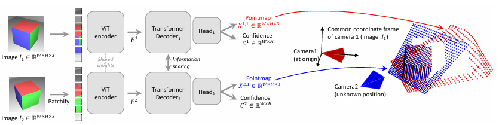

DUSt3R 的核心出发点在于重新审视传统三维重建问题的建模方式。经典 pipeline（SfM + MVS）通常依赖于**特征匹配 → 相机位姿估计 → 三角化 → 稠密重建**这一逐步优化流程，不仅对初始化敏感，而且难以端到端优化。DUSt3R 则提出将该问题整体转化为一个**学习驱动的几何对齐问题（geometric alignment problem）**：给定一对图像，直接预测两幅图像中每个像素对应的三维点，并通过跨视角一致性约束，使得这些点在一个隐式统一坐标系中对齐。

这种思路的关键在于**绕开显式相机参数建模**，不再单独估计相机位姿，而是通过预测的点云之间的关系“隐式编码”相对几何结构，从而实现更简洁的建模范式。这也使得 DUSt3R 成为典型的 **feed-forward 3D reconstruction 模型**。

DUSt3R 采用基于 Transformer 的编码—交互结构，其整体可以分为三个核心模块：

1. **图像编码（Image Encoder）**
   输入为两张图像 $I_1, I_2$，首先通过共享权重的视觉编码器（通常为 ViT）提取高维特征表示。该阶段主要完成局部纹理与语义信息的抽取。
2. **跨视角特征交互（Cross-view Interaction）**
   在编码后的特征基础上，引入 Transformer 结构进行跨视角信息融合。通过自注意力（self-attention）与交叉注意力（cross-attention），模型能够建立两幅图像之间的稠密关联，从而隐式学习像素级 correspondence。
3. **三维点预测（3D Point Head）**
   对于每个输入图像 $I$，模型预测一个三维点图与对应的置信度图，记为 $(X, C)$，其中 $X \in \mathbb{R}^{H \times W \times 3}$ 表示在该图像相机坐标系下的稠密三维点，而 $C \in \mathbb{R}^{H \times W}$ 表示对应点的置信度。需要注意的是，不同视图下的点图分别定义在各自的相机坐标系中，因此跨视角之间满足一个未知的刚体变换关系，而该变换并不被显式建模，而是通过训练过程中的几何一致性约束隐式学习得到。

模型采用**逐像素回归 + 置信度加权**的训练策略，其核心由两部分组成：**尺度归一化的回归损失**与**置信度建模**。

首先，对于每个视图 $v \in \{1, 2\}$ 中的有效像素 $i \in \mathcal{D}^v$，定义回归误差为：

$$
\ell_{\text{regr}}(v, i) = \left\| \frac{1}{z} X_i^{v,1} - \frac{1}{\bar{z}} \bar{X}_i^{v,1} \right\|
$$

其中 $X$ 与 $\bar{X}$ 分别表示预测与真实点图。为了消除尺度歧义（scale ambiguity），论文对点图进行归一化处理，缩放因子定义为：

$$
z = \text{norm}(X^{1,1}, X^{2,1}), \quad \bar{z} = \text{norm}(\bar{X}^{1,1}, \bar{X}^{2,1})
$$

其中：

$$
\text{norm}(X^1, X^2) = \frac{1}{|\mathcal{D}^1| + |\mathcal{D}^2|} \sum_{v \in \{1,2\}} \sum_{i \in \mathcal{D}^v} \| X_i^v \|
$$

该归一化本质上将点云的**平均尺度固定到统一标准**，从而使训练目标仅关注**几何结构而非绝对尺度**。

在此基础上，模型进一步引入置信度 $C_i^{v,1}$，构建最终损失函数：

$$
\mathcal{L}_{\text{conf}} = \sum_{v \in \{1,2\}} \sum_{i \in \mathcal{D}^v} C_i^{v,1} \ell_{\text{regr}}(v, i) - \alpha \log C_i^{v,1}
$$

其中 $\alpha$ 为超参数。为保证置信度为正，采用参数化形式：

$$
C_i^{v,1} = 1 + \exp(c_i^{v,1})
$$

## 3. MASt3R: : Matching and Stereo 3D Reconstruction

> P. Labatut *et al.*, *“MASt3R: Matching and Stereo 3D Reconstruction,”* arXiv preprint, 2024.

MASt3R 在 DUSt3R 框架基础上进一步强调“匹配（matching）”在三维重建中的核心作用，提出了一种结合稠密匹配与立体几何推理的统一模型。该方法不仅预测每个像素的三维坐标，还显式输出跨视角的对应关系，从而使得几何重建过程更具可解释性。通过引入匹配约束，模型能够更准确地处理视角变化较大或纹理重复的场景，并提升深度估计与点云重建的精度。

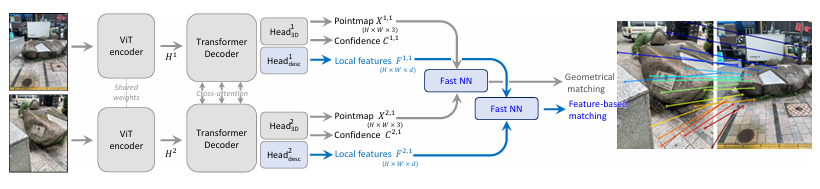

在损失函数设计上，MASt3R 在 DUSt3R 的几何回归基础上，引入显式匹配约束，整体由**点云回归损失**与**匹配损失**两部分组成。

首先，几何部分沿用逐像素回归形式，但在尺度处理上进行了简化：

$$
\ell_{\text{regr}}(v, i) = \left\| \frac{X_i^v - \bar{X}_i^v}{z} \right\|
$$

其中 $z$ 直接采用深度真值的平均尺度进行归一化，而不再像 DUSt3R 中那样分别对预测与真值引入独立的尺度归一化项。这一修改等价于**取消预测与真值之间的双尺度归一化约束**，从而简化训练目标，使模型更加直接地拟合真实几何结构，并结合置信度加权，得到：
$$
\mathcal{L}_{\text{conf}} = \sum_{v \in \{1,2\}} \sum_{i \in \mathcal{D}^v} C_i^v \ell_{\text{regr}}(v, i) - \alpha \log C_i^v
$$

该部分用于约束三维点预测的几何一致性。

在此基础上，MASt3R 引入基于 InfoNCE 的匹配损失，用于显式建模跨视角 correspondence：

$$
\mathcal{L}_{\text{match}} = -\sum_{(i,j) \in \hat{\mathcal{M}}} \log \frac{s_\tau(i,j)}{\sum_{k \in \mathcal{P}^1} s_\tau(k,j)} + \log \frac{s_\tau(i,j)}{\sum_{k \in \mathcal{P}^2} s_\tau(i,k)}
$$

其中：

$$
s_\tau(i,j) = \exp \left( -\frac{1}{\tau} D_i^{1\top} D_j^2 \right)
$$

该损失鼓励每个像素仅与另一视图中的唯一对应像素匹配，从而实现高精度的局部对应关系学习。

最终训练目标为：

$$
\mathcal{L}_{\text{total}} = \mathcal{L}_{\text{conf}} + \beta \mathcal{L}_{\text{match}}
$$
在此基础上，作者进一步提出 MASt3R-SfM，将学习得到的匹配结果引入经典 SfM 框架，以实现多视图场景下的全局一致重建。其核心思想是用学习模型替代传统特征匹配，并保留几何优化过程。具体流程为：首先利用 MASt3R 预测图像对之间的稠密 correspondence，并根据置信度筛选稳定匹配；随后基于这些匹配通过五点法与 RANSAC 估计相机位姿 $(R,t)$；最后在多视图条件下进行 bundle adjustment，实现全局优化。

从方法结构上看，MASt3R-SfM 将三维重建划分为两个阶段：

- MASt3R：提供高质量匹配
- SfM：保证全局几何一致性

相比传统 SfM，其关键改进在于匹配质量显著提升，从而提高位姿估计与重建稳定性；同时相比纯前馈方法，又避免了多视图场景中的累积误差问题。

## 4. Span3R

> *“Span3R,”* arXiv preprint, 2024.

DUSt3R 对每一对图像独立预测点云，这些点云均定义在各自的**局部坐标系（local coordinate）**中，因此在多视图场景下需要额外的 global alignment 才能获得一致结果。而 Span3R 的核心目标是直接预测处于统一全局坐标系中的三维结构，从而消除后续对齐过程。

- DUSt3R：
  $$
  (I_i, I_j) \rightarrow (X_i, X_j) \quad (\text{局部坐标})
  $$

- Span3R：
  $$
  {I_1, \dots, I_t} \rightarrow X_t \quad (\text{全局坐标})
  $$

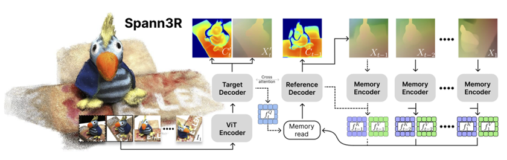

在模型结构上，Span3R 在 DUSt3R 的 Transformer 框架基础上，引入了**空间记忆机制（spatial memory）**，从而实现跨多视图的信息累积与融合。具体而言，Span3R 将前馈过程建模为一个序列化的逐帧推理过程。对于输入图像序列 ${I_t}$，模型首先对当前帧 $I_t$ 编码得到 query 特征 $f_t^q$，并利用该特征从历史帧构建的空间记忆 $\mathcal{M}$ 中检索相关信息，通过注意力机制得到融合特征 $f_t = \text{Attn}(f_t^q, \mathcal{M})$。随后，该特征经过解码器与历史视图进一步交互，实现跨视角的信息融合与几何对齐，最终输出当前帧的点图与置信度 $(X_t, C_t)$。同时，这些结果被写入 memory，用于后续帧的推理，从而在前馈过程中逐步构建一致的全局三维结构。

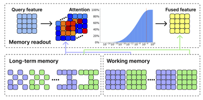

该过程的关键在于 memory 的构建方式。Span3R 将历史信息组织为：

- **Working memory**：近期帧，保证局部一致性
- **Long-term memory**：关键帧，维持全局结构

从而在计算效率与全局一致性之间取得平衡。


## 5. CUT3R

> *“CUT3R,”* arXiv preprint, 2024.

CUT3R 进一步拓展了 DUSt3R 系列方法的统一建模能力，旨在构建一个可同时处理多种三维视觉任务的通用框架。该方法通过共享编码器提取多视图特征，并在统一的表示空间中完成几何推理，从而实现深度估计、点云重建以及相机位姿恢复等任务的联合学习。其关键设计在于通过结构对称性和共享特征空间增强跨视角一致性，使得模型能够在不同输入配置（如单视图、双视图或多视图）下灵活适配。此外，CUT3R 通过统一的损失函数设计，将不同几何任务整合为一个整体优化目标，从而提升模型的泛化能力。该方法代表了从“单一任务模型”向“通用 3D 感知模型”的发展方向，但其性能在不同任务之间可能存在权衡，需要进一步优化任务间的协同关系。

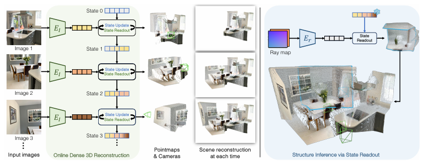

## 6. Fast3R

> *“Fast3R: Fast Feed-forward 3D Reconstruction,”* arXiv preprint, 2024.

Fast3R 关注于提升前馈式三维重建模型的效率与实用性，其核心目标是在保持合理精度的前提下显著降低推理时间与计算资源消耗。该方法通过轻量化网络结构设计（如减少 Transformer 层数或采用更高效的注意力机制）以及优化的特征融合策略，实现快速的三维点云预测与深度估计。相比 DUSt3R 等方法，Fast3R 在推理速度上具有明显优势，使其更适用于实时应用场景（如机器人导航或增强现实）。同时，该方法也探索了在低计算预算下维持几何一致性的策略，体现了工程优化与模型设计之间的平衡。然而，这种轻量化通常伴随着一定精度下降，尤其是在复杂场景或大尺度重建任务中。

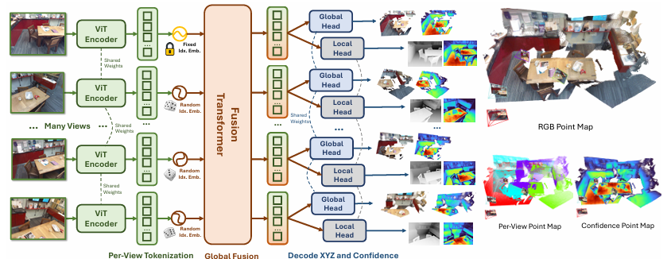

## 7. VGGT: Visual Geometry Grounded Transformer

> *“VGGT: Visual Geometry Grounded Transformer,”* arXiv preprint, 2024.
>
> [CVPR 2025 BEST PAPER\] 论文 + 代码 最详细解析 新手小白友好型 - 知乎](https://zhuanlan.zhihu.com/p/1922807676762567215)

与 DUSt3R、MASt3R 等方法仍围绕特定任务（如点云回归或匹配建模）进行结构设计不同，VGGT 的特殊性在于其从更高层次重新定义了三维视觉问题，不再将深度、位姿或 correspondence 视为独立预测目标，而是统一建模为一个视觉与几何共同约束下的表示学习问题。这种转变使得 VGGT 不依赖于显式的几何分解（如“匹配 → 位姿 → 重建”），而是通过一个统一的 Transformer 架构直接学习多视图之间的结构关系。相比前述方法在不同模块中分别编码几何信息，VGGT 将几何约束内嵌于特征表示本身，使得几何一致性成为表示的一部分，而非额外的优化目标。这种“geometry-grounded representation”的设计，使模型能够在单一框架中同时支持多种三维任务，并具备更强的泛化能力与一致性。

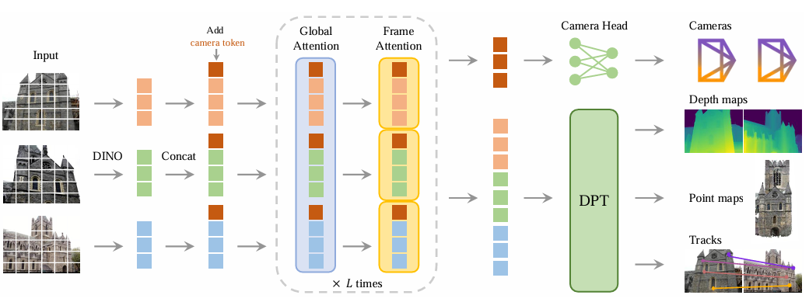

具体而言，VGGT 构建于一个大规模 Transformer 架构之上，其输入为观测同一三维场景的多张 RGB 图像序列。模型的目标是将该图像序列直接映射为统一的三维标注表示，其中包括相机参数、深度图以及点云等几何信息，从而在单一框架内同时完成多种三维视觉任务。

在特征建模阶段，模型首先采用 DINO 预训练的视觉 Transformer 对输入图像进行编码，将每张图像划分为一组 token 表示。同时，引入额外的相机 token 用于显式建模相机参数信息，该 token 在训练过程中学习聚合与该图像相关的位姿特征。通过对第一帧引入特定的可学习 token，模型能够在统一坐标系下表达三维结构，从而实现跨视图几何对齐。


在此基础上，VGGT 对标准 Transformer 结构进行改造，引入交替的帧内自注意力与全局自注意力机制。帧内注意力仅在单张图像内部进行信息交互，而全局注意力则在所有视图之间建立联系。通过这种交替设计，模型能够在局部细节建模与全局结构理解之间取得平衡，从而有效融合多视图信息并捕获跨视角的几何关系。

```python
# tokens 初始形状:
# [B*S, P, C]
# B: batch size
# S: 帧数 / 视角数
# P: 每帧 token 数
# C: token 维度

tokens = patch_embed(images)              # [B*S, P_patch, C]
tokens = concat(camera_tokens,
                register_tokens,
                patch_tokens)             # [B*S, P, C]

outputs = []

for layer in range(depth):

    # 1. Frame attention：每一帧内部做 self-attention
    tokens = tokens.reshape(B*S, P, C)     # [B*S, P, C]
    frame_tokens = FrameBlock[layer](
        tokens
    )                                      # [B*S, P, C]

    # 2. Global attention：所有帧联合做 self-attention
    tokens = frame_tokens.reshape(B, S*P, C)  # [B, S*P, C]
    global_tokens = GlobalBlock[layer](
        tokens
    )                                      # [B, S*P, C]

    # 3. 恢复成多帧结构
    global_tokens = global_tokens.reshape(B, S, P, C)
    frame_tokens = frame_tokens.reshape(B, S, P, C)

    # 4. 拼接 frame/global 特征，供 downstream heads 使用
    out = concat(frame_tokens, global_tokens, dim=-1)  # [B, S, P, 2C]
    outputs.append(out)

    # 5. 下一层继续用 global attention 后的 tokens
    tokens = global_tokens.reshape(B*S, P, C)

return outputs, patch_start_idx
```

在输出阶段，模型通过不同的任务头从统一表示中解码出具体结果。其中，相机头以相机 token 为输入预测相机的内参与外参；DPT 头以图像 token 为输入预测稠密的几何输出（如深度图与点图）；此外，模型还输出用于点跟踪的特征表示，并结合类似 CoTracker 的跟踪模块，实现跨视图的对应关系预测。

在训练过程中，VGGT 通过联合优化相机估计、稠密几何重建以及跨视图跟踪三个任务，从而在统一表示空间中学习多视图几何一致性。首先，在相机位姿估计方面，模型采用基于 Huber Loss 的回归目标，对预测相机参数 $\hat{\mathbf{g}}_i$ 与真实值 $\mathbf{g}_i$ 之间的误差进行约束：
$$
\mathcal{L}_{\text{camera}} = \sum_{i=1}^{N} \left\| \hat{\mathbf{g}}_i - \mathbf{g}_i \right\|_{\epsilon}
$$
其中 $|\cdot|_{\epsilon}$ 表示 Huber 损失，用于在保证精度的同时提高对异常值的鲁棒性。

在稠密几何重建方面，VGGT 同时对深度图与点图进行监督，其损失由三部分组成：**重建误差、梯度一致性约束以及置信度正则项**。对于深度预测，定义为：
$$
\mathcal{L}_{\text{depth}} =
\sum_{i=1}^{N}
\left\|
\Sigma_i^D \odot (\hat{D}_i - D_i)
\right\|
+
\left\|
\Sigma_i^D \odot (\nabla \hat{D}_i - \nabla D_i)
\right\|
-
\alpha \log \Sigma_i^D
$$
类似地，对于点图预测，有：
$$
\mathcal{L}_{\text{pmap}} =
\sum_{i=1}^{N}
\left\|
\Sigma_i^P \odot (\hat{P}_i - P_i)
\right\|
+
\left\|
\Sigma_i^P \odot (\nabla \hat{P}_i - \nabla P_i)
\right\|
-
\alpha \log \Sigma_i^P
$$
其中 $\Sigma$ 表示置信度权重，$\odot$ 为逐元素乘法。前两项分别约束数值一致性与空间梯度一致性，而对数项用于防止置信度退化，从而实现不确定性建模。

在跨视图对应关系方面，VGGT 引入跟踪损失，对所有查询点在不同视图中的位置进行监督：
$$
\mathcal{L}_{\text{track}} =
\sum_{j=1}^{M} \sum_{i=1}^{N}
\left\|
y_{j,i} - \hat{y}_{j,i}
\right\|
$$
其中 $y_{j,i}$ 表示第 $j$ 个查询点在第 $i$ 个视图中的真实位置，$\hat{y}_{j,i}$ 为预测结果。该损失用于强化模型对跨视图 correspondence 的建模能力。

## 8. pi3: Permutation-Equivariant Visual Geometry Learning

> *“pi3: Permutation-Equivariant Visual Geometry Learning,”* arXiv preprint, 2024.

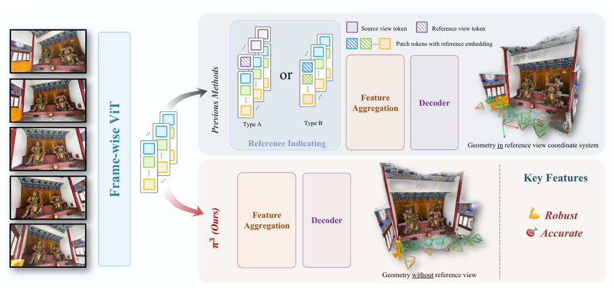

pi3（Permutation-Equivariant Visual Geometry Learning）针对多视图三维理解中“输入顺序敏感”的问题提出了一种具备**置换等效性（permutation equivariance）**的几何学习框架。传统多视图方法（包括部分 Transformer-based 模型）往往隐式依赖输入图像的顺序或配对方式，这在实际应用中会带来不稳定性与泛化问题。pi3 的核心思想是通过设计满足集合输入（set input）性质的网络结构，使模型对输入视图的排列顺序保持等变或不变，从而实现更加稳健的多视图几何推理。具体而言，该方法省略了所有顺序相关的组件（包括但不限于用于区分帧顺序的位置编码、相机token等），在特征聚合与跨视角交互过程中引入对称函数或等变模块，使得模型输出仅依赖于输入集合本身而非其排列方式。这种设计在理论上更符合多视图几何问题的本质（视图集合建模），并在实际中提升了模型在视角数量变化或输入顺序扰动下的稳定性。

在损失函数设计上，pi3 同时从几何结构恢复与相机位姿一致性两个层面对模型进行约束。首先，为解决三维重建中的尺度不确定性问题，模型引入全局尺度对齐机制，并在此基础上定义点云重建损失。具体而言，通过求解最优尺度因子 $s^{*}$，使预测点云与真实点云在统一尺度下尽可能一致，即：
$$
s^{*} = \arg\min_{s} \sum_{i=1}^{N} \sum_{j=1}^{H \times W} \frac{1}{z_{i,j}} \left\| s\hat{\mathbf{x}}_{i,j} - \mathbf{x}_{i,j} \right\|_{1}
$$
在此基础上，点云重建损失定义为：
$$
\mathcal{L}_{\text{points}} = \frac{1}{3NHW} \sum_{i=1}^{N} \sum_{j=1}^{H \times W} \frac{1}{z_{i,j}} \left\| s^{*}\hat{\mathbf{x}}_{i,j} - \mathbf{x}_{i,j} \right\|_{1}
$$
该项约束模型恢复的三维结构在尺度对齐后的准确性。进一步地，为增强局部几何结构的表达能力，引入法线一致性损失，通过约束预测法线与真实法线之间的夹角来提高表面几何的精度：
$$
\mathcal{L}_{\text{normal}} = \sum_{i=1}^{N} \sum_{j=1}^{H \times W} \arccos\left( \hat{\mathbf{n}}_{i,j} \cdot \mathbf{n}_{i,j} \right)
$$
同时，为刻画点图预测的不确定性，模型采用二元交叉熵损失对置信度进行监督：
$$
\mathcal{L}_{\text{conf}} = \frac{1}{NHW} \sum_{i=1}^{N} \sum_{j=1}^{H \times W}
\left[
C_{i,j} \log(\hat{C}_{i,j}) + (1 - C_{i,j}) \log(1 - \hat{C}_{i,j})
\right]
$$
在几何结构之外，pi3 还对多视图之间的相机位姿关系进行约束。具体地，定义基于视图对的相机损失，其由旋转误差与平移误差加权组成：
$$
\mathcal{L}_{\text{cam}} = \frac{1}{N(N-1)} \sum_{i \neq j}
\left(
\mathcal{L}_{\text{rot}}(i,j) + \lambda_{\text{trans}} \mathcal{L}_{\text{trans}}(i,j)
\right)
$$
其中，旋转误差通过旋转矩阵的迹计算两者之间的角度差：
$$
\mathcal{L}_{\text{rot}}(i,j) =
\arccos\left(
\frac{\mathrm{Tr}\left((\mathbf{R}_{i \leftarrow j})^{\top} \hat{\mathbf{R}}_{i \leftarrow j}\right) - 1}{2}
\right)
$$
而平移误差则在尺度对齐后通过 Huber 损失进行约束：
$$
\mathcal{L}_{\text{trans}}(i,j) =
\mathcal{H}_{\delta}\left(
s^{*}\hat{\mathbf{t}}_{i \leftarrow j} - \mathbf{t}_{i \leftarrow j}
\right)
$$
网络训练使用17个跨度广泛的室内、外真实和仿真数据集，64A100 GPUs训练9天，合计使用超过130M张图像(DUS3R使用了8.5M对图像)。

## 9. StreamVGGT

> *“StreamVGGT,”* arXiv preprint, 2025.

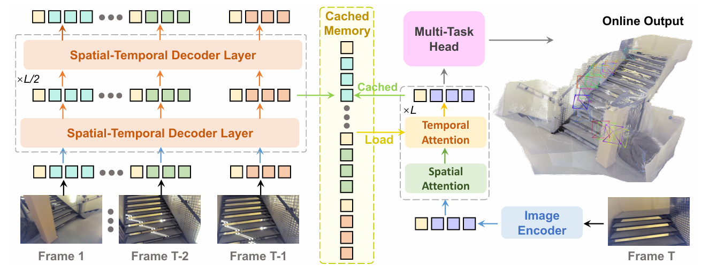

StreamVGGT 在 VGGT 的基础上进一步扩展至**流式（streaming）三维几何建模场景**，旨在处理连续输入（如视频流或逐帧图像序列）下的实时几何理解问题。与传统离线多视图方法不同，StreamVGGT 需要在不完整观测和动态输入条件下逐步更新场景几何表示，因此其核心挑战在于如何在保持全局一致性的同时实现高效的增量推理。该方法通过引入时序建模机制（如递归更新或基于记忆的 Transformer 结构），使模型能够在新视图到来时对已有几何表示进行更新，而无需重新处理全部历史数据。同时，StreamVGGT 结合几何约束与注意力机制，在跨时间与跨视角的信息融合中保持结构一致性，从而实现稳定的在线重建与深度估计。

## 10. FastVGGT

> Y. Shen, Z. Zhang, Y. Qu, and L. Cao, *“FastVGGT: Training-Free Acceleration of Visual Geometry Transformer,”* arXiv preprint arXiv:2509.02560, 2025. 

FastVGGT 的出发点并不是重新设计一个新的三维几何 foundation model，而是针对 VGGT 在长序列输入下的推理效率瓶颈进行加速优化。作者指出，尽管 VGGT 在相机估计、深度预测、点图重建与点跟踪等任务上取得了很强的性能，但其全局注意力机制在输入视图数量增大时会带来显著的时间与显存开销，从而限制了其在大规模多视图重建中的实际应用。为此，FastVGGT 将问题转化为一个更工程化但同样关键的方向：在**不重新训练模型**的前提下，尽可能保留 VGGT 几何建模能力的同时，提高长序列推理效率。

FastVGGT 在整体结构上保持与 VGGT 一致的前馈框架，但在全局注意力（global attention）阶段引入了**token merging 机制**，在不改变模型参数的前提下，通过压缩冗余 token 数量来加速全局注意力计算，以降低跨视图建模的计算复杂度。

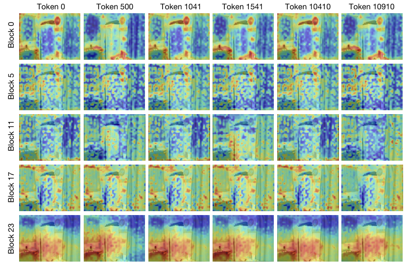

该方法的核心观察是，VGGT 的全局注意力中存在明显的 **token collapse** 现象，即大量 token 在注意力分布上表现出高度相似性，导致模型在跨视图交互时执行了大量冗余计算。基于这一现象，FastVGGT 引入 training-free token merging 机制，在推理阶段对相似 token 进行合并，从而减少后续全局注意力中的计算量。与直接套用通用视觉 Transformer 的 token merging 方法不同，FastVGGT 强调三维几何任务对空间一致性和跨视角对应关系更加敏感，因此专门设计了面向 3D 任务的 token 划分与合并策略，以尽量避免对几何预测质量造成破坏。

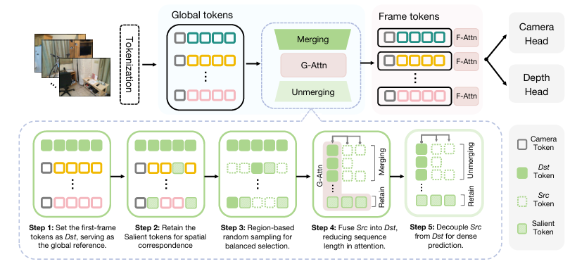

其整体流程仍保持 VGGT 的前馈结构，但在全局注意力（G-Attn）阶段对 token 进行动态压缩与恢复，从而减少冗余计算。具体而言，输入图像首先被 tokenization 转换为多视图的全局 token 集合。随后，在进入全局注意力之前，模型将 token 划分为三类：目标 token（Dst）、源 token（Src）与显著 token（Salient）。其中，Dst token 作为代表性节点完整参与全局注意力计算；Src token 则被视为冗余信息，不直接参与注意力，而是通过相似性被合并到对应的 Dst token 中；Salient token 则对应关键区域，始终保留并参与计算，以避免几何信息损失。在具体操作上，首先选取第一帧的部分 token 作为初始 Dst token，并根据特征区分度筛选出 top-k 重要 token；随后通过区域采样补充 Dst token，以保证空间覆盖；接着在全局注意力中，将 Src token 融合到最相似的 Dst token 中，实现 token merging，从而显著降低参与计算的 token 数量；最后再通过 unmerging 操作恢复 token 结构，使后续帧内注意力（F-Attn）与各任务头（如相机与深度预测）仍能使用完整表示。

## 11. MapAnything

> N. Keetha *et al*., *“MapAnything: Universal Feed-Forward Metric 3D Reconstruction,”* arXiv preprint arXiv:2509.13414, 2025; 3DV 2026. ([arXiv](https://arxiv.org/abs/2509.13414?utm_source=chatgpt.com))

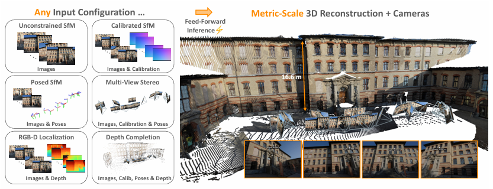

MapAnything 的核心目标，是把以往彼此割裂的多种三维任务（见上图左侧）统一到一个**通用的前馈式 metric 3D 重建框架**中。与 DUSt3R、MASt3R、VGGT 等方法通常面向某一类固定输入的单一任务不同，MapAnything 允许模型同时接收一张或多张图像，以及可选的几何先验输入，例如相机内参、相机位姿、深度图或部分重建结果，并直接回归场景的**度量三维结构与相机参数**。因此，它的特别之处不在于仅仅提升某一个单项任务，而在于尝试能否用一个统一模型，以同一种前馈推理方式覆盖 SfM、MVS、单目 metric depth、相机定位、深度补全等十余类任务。

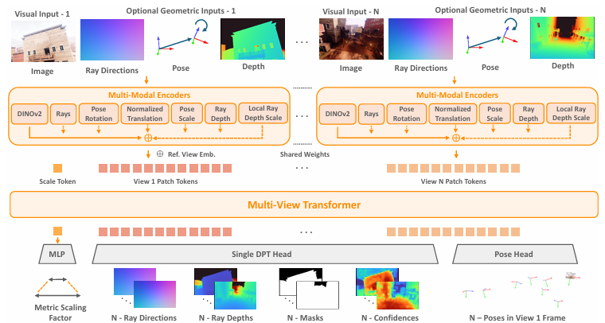

MapAnything 将多视图三维重建统一表示为一个从多模态输入到几何变量的函数映射。具体而言，模型输入包括 $N$ 个 RGB 图像 $\mathcal{I}$，以及可选的几何先验信息，如相机内参 $\hat{\mathcal{K}} = (\hat{K}_i)$、相机位姿（以第一帧为参考坐标系）$\hat{\mathcal{Q}} = (\hat{Q}_i)$ 与 $\hat{\mathcal{T}} = (\hat{T}_i)$，以及每个像素的射线深度 $\hat{\mathcal{D}} = (\hat{D}_i)$。在此基础上，模型学习一个统一映射：
$$
f_{\text{MapAnything}}(\mathcal{I}, \hat{\mathcal{K}}, \hat{\mathcal{Q}}, \hat{\mathcal{T}}, \hat{\mathcal{D}})
= \{\, m,\ (R_i, \bar{D}_i, \hat{P}_i^N)_{i=1}^{N} \,\}
$$
其中，$m \in \mathbb{R}$ 表示全局尺度因子，$R_i \in \mathbb{R}^{3 \times H \times W}$ 表示每个像素对应的射线方向，$\bar{D}_i \in \mathbb{R}^{H \times W}$ 为归一化深度，$\hat{P}_i^N$ 表示在图像坐标系中的相机位姿参数。基于上述输出，可以逐步恢复三维结构。首先，在相机坐标系下，通过射线方向与深度计算局部点图：
$$
\bar{L}_i = R_i \cdot \bar{D}_i \in \mathbb{R}^{3 \times H \times W}
$$
该表示对应于每个像素沿视线方向的三维点，但仍处于等比例（up-to-scale）空间中。随后，利用预测的相机位姿，将局部点图变换到统一的世界坐标系中：
$$
\bar{X}_i = O_i \cdot \bar{L}_i + T_i
$$
其中 $O_i$ 表示由四元数 $Q_i$ 转换得到的旋转矩阵。最后，通过全局尺度因子 $m$ 对所有视图进行统一尺度恢复，得到最终的 metric 三维点：
$$
X_i^{\text{metric}} = m \cdot \bar{X}_i, \quad i \in [1, N]
$$
从物理意义上看，该过程体现了一种**分解式几何建模策略**：

- $R_i$：建模视线方向（几何结构）
- $\bar{D}_i$：建模相对深度（局部形状）
- $(Q_i, T_i)$：建模视图间关系（位姿）
- $m$：恢复全局尺度（metric consistency）

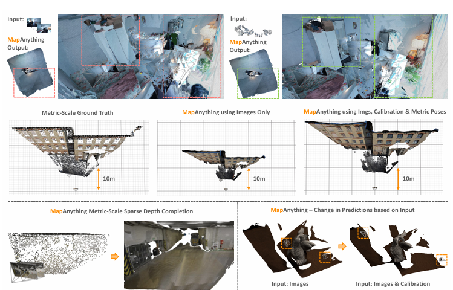

MapAnything 能够根据输入中提供的几何先验动态调整三维重建结果，在仅依赖图像时恢复相对结构，而在引入相机或尺度信息后实现高精度的 metric 重建，体现出其统一多任务与多输入形式的能力。

## 12. InfiniDepth

> Yu H, Lin H, Wang J, et al. InfiniDepth: Arbitrary-Resolution and Fine-Grained Depth Estimation with Neural Implicit Fields[J]. arXiv preprint arXiv:2601.03252, 2026.

在InfiniDepth 进一步关注一个此前被忽视的问题：现有深度估计方法本质上仍然是“离散网格预测（discrete grid prediction）”，也就是说，大多数方法只能在固定分辨率的像素网格上预测深度：$D \in \mathbb{R}^{H \times W}$。输出分辨率提高时，高频几何细节容易丢失，上采样又会引入模糊，加之点云密度分布不均，最终导致 Novel View Synthesis 中出现空洞与伪影。

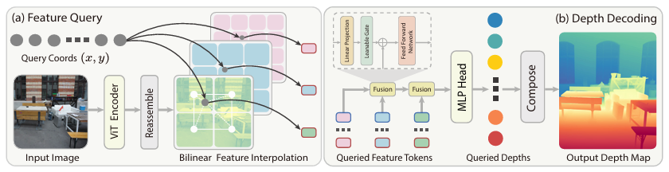

InfiniDepth 的核心创新在于通过一个**多尺度局部隐式解码器（Multi-Scale Local Implicit Decoder）**模块，将深度表示从“离散二维网格”提升为“连续隐式场（continuous implicit field）”。即模型不再直接预测固定分辨率 depth map，而是学习一个连续函数：
$$
d_I(x,y)=N_\theta(I,(x,y))
$$
```python
# Multi-Scale Local Implicit Decoder
# 输入:
#   features: DINOv3 intermediate features
#   basic_feat: [B, 128, H/4, W/4]
#   coords: [B, N, 2], normalized to [-1, 1], order = [y, x]
# 输出:
#   pred: [B, N, 1]

def multi_scale_local_implicit_decoder(features, basic_feat, patch_h, patch_w, coords):

    # 1. 取最后一层 DINO token
    dino_tokens = features[-1][0]                    # [B, P, C]

    # 2. token map 化
    dino_feat = dino_tokens.permute(0, 2, 1)          # [B, C, P]
    dino_feat = dino_feat.reshape(B, C, patch_h, patch_w)
                                                        # [B, C, H/16, W/16]

    # 3. 防止 grid_sample 越界
    coords = coords.clone()
    coords = clamp(coords, -1 + eps, 1 - eps)         # [B, N, 2]

    # 4. grid_sample 需要坐标顺序 [x, y]
    grid = coords.flip(-1).unsqueeze(1)               # [B, 1, N, 2]

    # 5. 从 DINO 低分辨率语义特征中采样
    q_dino = grid_sample(
        dino_feat,
        grid,
        mode="bilinear",
        align_corners=False
    )                                                  # [B, C, 1, N]

    q_dino = q_dino[:, :, 0, :].permute(0, 2, 1)       # [B, N, C]

    # 6. 从 BasicEncoder 高分辨率局部特征中采样
    q_basic = grid_sample(
        basic_feat,
        grid,
        mode="bilinear",
        align_corners=False
    )                                                  # [B, 128, 1, N]

    q_basic = q_basic[:, :, 0, :].permute(0, 2, 1)     # [B, N, 128]

    # 7. 多尺度特征融合
    q_feat = concat([q_dino, q_basic], dim=-1)          # [B, N, C + 128]

    # 8. point-wise MLP 隐式解码
    pred = MLP(q_feat)                                 # [B, N, 1]

    return pred
```

即模型以输入图像 $I$ 与任意连续二维坐标 $(x,y)$ 为输入，直接输出该位置的深度值，从而摆脱传统离散深度图的分辨率限制。

具体而言，模型首先利用 Vision Transformer（如 DINOv3 ViT-Large）对输入图像进行编码，并从多个中间层提取特征，构建一个多尺度特征表示。不同于仅使用单层特征的方法，该设计同时保留了浅层的高分辨率细节信息与深层的全局语义信息，为后续连续查询提供充分的几何与上下文支撑。

在此基础上，对于任意查询坐标 $(x,y)$，模型在各尺度特征图上通过双线性插值获取对应位置的局部特征，从而得到一组跨尺度的特征表示。这一过程可以理解为在连续空间中对离散特征进行“采样”，使模型能够在任意分辨率下进行查询。

随后，模型对这些多尺度特征进行层级式融合，从高分辨率特征逐步整合到低分辨率特征，使局部几何细节与全局语义信息逐步结合。最终，融合后的特征被输入一个轻量级 MLP 头，直接回归该坐标 $(x,y)$ 对应的深度值。


## 13. LingBot-Map

> L.-Z. Chen *et al*., *“Geometric Context Transformer for Streaming 3D Reconstruction,”* arXiv preprint arXiv:2604.14141, 2026.

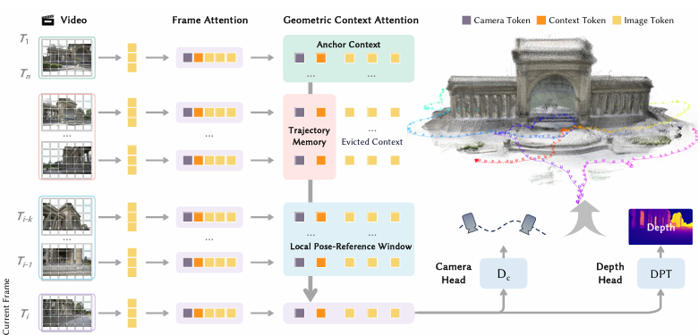

LingBot-Map 关注的问题与 DUSt3R、VGGT、MapAnything 这类方法有所不同。前面的方法大多面向**有限张图像的多视图重建**，而 LingBot-Map 更强调**流式场景下的长序列三维重建**：输入是一段持续到来的视频流，模型需要在不回看全部历史帧的情况下，持续输出稳定的相机位姿与点云结果。论文将这一问题明确表述为 streaming 3D reconstruction，并强调该任务同时要求几何精度、时间一致性与推理效率。

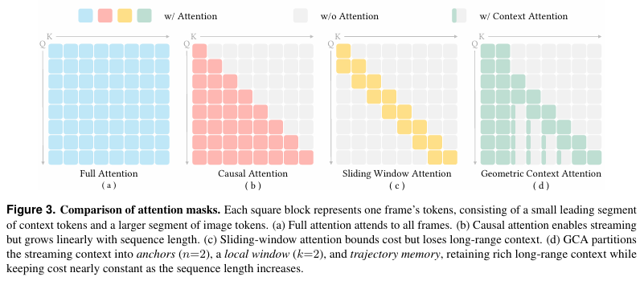

该方法的核心设计是一个 **Geometric Context Transformer (GCT)**。与普通的全局 Transformer 不同，LingBot-Map 并不试图让当前帧与所有历史 token 做完全对称的全局交互，而是构造了三种具有明确几何意义的上下文：**anchor context**、**pose-reference window** 和 **trajectory memory**。其中，anchor context 用于维持当前重建结果的坐标锚定，pose-reference window 提供局部时域内的稠密几何线索，而 trajectory memory 则负责保留长时序轨迹信息，用于抑制累积漂移。也就是说，它不是单纯追求“更大的注意力范围”，而是把 SLAM 中常见的局部约束、参考帧机制和长期轨迹一致性显式地编码进 Transformer 的上下文结构中。

```
GCTStream.inference_streaming
│
├── GCTStream: clean_kv_cache()
│
├── GCTStream: Phase 1: scale / anchor frames
│   └── GCTStream/GCTBase: forward(scale_images)
│       └── AggregatorStream
│           ├── AggregatorStream: patch_embed
│           ├── AggregatorStream: add camera/register/scale tokens
│           ├── AggregatorStream: frame attention
│           ├── AggregatorStream: global causal attention
│           │   ├── AggregatorStream / FlashInferBlock: initialize KV cache
│           │   ├── FlashInferBlock / KVCacheManager: write scale-frame KV
│           │   └── KVCacheManager: build anchor context
│           └── GCTBase: output tokens → heads
│
└── GCTStream: Phase 2: streaming frames
    └── GCTStream: for each frame
        ├── GCTStream: decide keyframe / non-keyframe
        ├── GCTStream: non-keyframe → skip_append=True
        └── GCTStream/GCTBase: forward(single_frame)
            └── AggregatorStream
                ├── AggregatorStream: patch_embed
                ├── AggregatorStream: add camera/register/scale tokens
                ├── AggregatorStream: frame attention
                ├── AggregatorStream: global causal attention
                │   ├── FlashInferBlock / KVCacheManager: read anchor context
                │   ├── FlashInferBlock / KVCacheManager: read pose-reference window
                │   ├── FlashInferBlock / KVCacheManager: read trajectory memory
                │   ├── FlashInferBlock / SDPABlock: attend current frame to visible KV
                │   ├── FlashInferBlock / KVCacheManager: if keyframe, append current KV
                │   └── KVCacheManager: evict old patch tokens
                └── GCTBase: output tokens → heads
```

## 14. DROID-SLAM in the Wild

> M. Li, Z. Zhu, M. Pollefeys, and D. Barath, *“DROID-SLAM in the Wild,”* arXiv preprint arXiv:2603.19076, 2026.

DROID-SLAM in the Wild 关注的是传统 SLAM 在真实动态场景中的鲁棒性问题。经典 SLAM 通常假设场景静态，而现实环境中存在行人、车辆、物体运动以及遮挡，这会导致特征匹配错误、位姿估计漂移甚至跟踪失败。该工作在 DROID-SLAM 的基础上进行扩展，核心目标是在不依赖预定义动态物体类别的情况下，让系统自动识别哪些区域对几何优化是不可靠的，从而实现面向真实动态场景的实时 RGB SLAM。论文报告该系统在动态杂乱场景中取得了 SOTA 的相机位姿与场景几何表现，并能以约 10 FPS 实时运行。

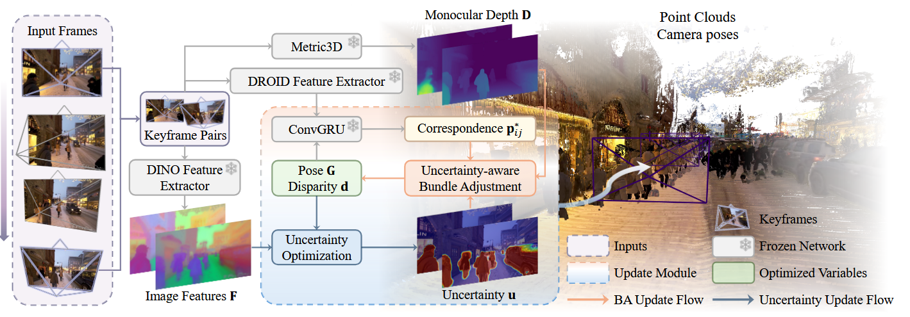

方法上，该工作提出了 **differentiable uncertainty-aware bundle adjustment**。与传统 SLAM 中把所有观测点等权用于 BA 不同，该方法为每个像素估计不确定性，并将其引入优化过程。其关键思想是：如果某一区域在多视图特征中表现出不一致，说明它可能来自动态物体、遮挡区域或几何不可靠区域，那么该区域在位姿优化和重建中的权重应被降低。这样，系统不需要显式语义分割动态物体，而是通过多视图视觉特征的不一致性自动估计像素级 uncertainty。

从结构上看，DROID-SLAM in the Wild 可以理解为在原 DROID-SLAM 的前端跟踪与后端 BA 中加入了不确定性建模。前端仍然负责建立帧间对应关系与运动估计，后端则通过带不确定性权重的 bundle adjustment 联合优化相机位姿和场景结构。相比基于静态假设的优化目标，该方法实际上将重投影误差变为一种 uncertainty-weighted residual，使可靠的静态区域主导优化，而动态或不稳定区域对最终结果的影响被抑制。

在传统 SLAM 中，BA 的目标是联合优化相机位姿与三维点，使多视图之间的重投影误差最小。DROID-SLAM 将这一思想推广为**稠密 BA**：它不只优化稀疏特征点，而是对图像中大量像素的深度与相机位姿进行联合优化。

具体而言，对于每一帧图像，DROID-SLAM 维护两个核心状态变量：
$$
G_i, \quad d_i
$$
其中 $G_i$ 表示第 $i$ 帧的相机位姿，$d_i$ 表示该帧的逆深度图。同时，系统会构建一个 frame graph，用边 $(i,j)$ 表示两帧之间存在共视关系。对每一条边，模型根据当前的位姿与深度，可以把第 $i$ 帧中的像素投影到第 $j$ 帧中，从而得到一个由刚体运动诱导的像素对应关系。

这一对应关系可以写成：
$$
\mathbf{p}_{ij}
=
\Pi_c
\left(
G_{ij}
\circ
\Pi_c^{-1}(\mathbf{p}_i, d_i)
\right)
$$
其中 $\Pi_c^{-1}$ 表示根据像素位置与深度反投影到三维空间，$G_{ij}$ 表示从第 $i$ 帧到第 $j$ 帧的相对位姿，$\Pi_c$ 则表示重新投影到图像平面。这个式子本质上就是：
$$
\text{pixel} \rightarrow \text{3D point} \rightarrow \text{another view pixel}
$$
DROID-SLAM 的网络会预测一个稠密的 2D correspondence / flow revision 以及对应的 confidence map。然后，Dense BA layer 的目标就是调整所有相关帧的位姿 $G$ 与逆深度 $d$，使由当前几何状态投影得到的位置 $\mathbf{p}_{ij}$ 尽量接近网络预测的目标对应位置。其优化目标可以理解为：
$$
\min_{G,d}
\sum_{(i,j)\in \mathcal{E}}
\left\|
\mathbf{p}_{ij}(G,d) - \mathbf{p}^{*}_{ij}
\right\|_{\Sigma_{ij}}^{2}
$$
其中 $\mathcal{E}$ 是 frame graph 中的边集合，$\mathbf{p}^{*}_{ij}$ 是网络预测的目标匹配位置，$\Sigma_{ij}$ 表示网络预测的置信度权重。也就是说，DROID-SLAM 不是直接把网络输出当作最终位姿，而是把网络输出作为 BA 的观测约束，再通过优化得到更一致的位姿与深度。DROID-SLAM in the Wild 的论文也总结了这一点：DROID-SLAM 会预测 2D dense correspondence 和 confidence map，并通过 differentiable BA 联合优化相机位姿与逆深度。

“可微分”的关键在于，DROID-SLAM 并不是把 BA 当作一个外部黑盒优化器，而是把它写成网络中的一个可反向传播模块。具体做法是对上述非线性目标进行线性化，并使用 Gauss-Newton 求解增量：
$$
\Delta x
=
(H+\lambda I)^{-1} b
$$
然后用该增量更新相机位姿与逆深度。由于这个求解过程中的投影、雅可比、正规方程构建和线性求解都被实现为可微操作，所以训练时梯度可以从最终的轨迹/深度误差反传到前面的网络模块。

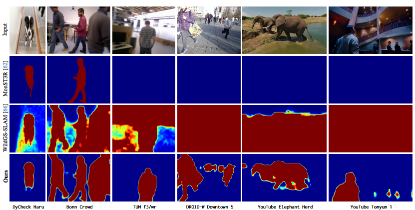

DROID-SLAM 是**端到端训练**的，但它不是直接监督网络输出位姿，而是训练网络学会预测 BA 所需要的 **correspondence residual** 和 **confidence**，再通过可微分 Dense BA 得到更新后的 pose 与 depth。

训练流程可以概括为：

$$
\text{image sequence}
\rightarrow
\text{feature / correlation}
\rightarrow
\text{ConvGRU iterative update}
\rightarrow
(\mathbf{p}_{ij}^{*}, \mathbf{w}_{ij})
\rightarrow
\text{Differentiable DBA}
\rightarrow
(G,d)
$$

其中网络主要预测：

$$
\mathbf{p}_{ij}^{*} \quad \mathbf{w}_{ij}
$$

即稠密目标对应关系，以及每个 correspondence 的置信度。随后 DBA 层根据这些预测量优化相机位姿 和像素级逆深度。DROID-SLAM 原文明确将系统描述为通过 Dense Bundle Adjustment layer 对 camera pose 和 pixelwise depth 进行 recurrent iterative updates。

训练时，每次输入一段短视频序列，系统从初始 pose/depth 出发，反复执行若干次迭代更新。每一步中，ConvGRU 根据当前状态、相关性特征和上下文特征预测 correspondence correction 与 confidence；DBA 再求解 Gauss-Newton 更新，得到新的 pose/depth。由于 BA 层是可微的，最终的 pose/depth 误差可以反传到前面的特征提取器和 ConvGRU 更新网络。

监督信号主要来自数据集提供的 ground-truth camera poses 和 depths/disparities。也就是说，训练目标不是简单的 optical flow loss，而是让经过多轮 differentiable BA 后得到的轨迹和深度接近真值。这样训练出来的网络学到的是：如何产生有利于几何优化的 correspondence 与 confidence。

DROID-SLAM in the Wild 的核心是在原始 DROID-SLAM 的 BA 中引入像素级动态不确定性：
$$
\Sigma_{ij}^{\text{uncer}}
=
\operatorname{diag}
\left(
w_{ij}\cdot \frac{1}{u_{ij}}
\right)
$$
其中 $u_{ij}$ 表示动态 uncertainty。动态区域由于不满足刚体运动假设，会产生不稳定 correspondence，因此模型通过增大 $u_{ij}$ 自动降低这些区域在 BA 中的权重，从而避免动态物体干扰位姿与深度优化。

不同于直接依据 reprojection residual 判断动态区域，论文进一步利用跨视图 DINOv2 特征相似度构建 uncertainty loss：
$$
E_{\text{sim}}(u')
=
\sum_{(i,j)\in\mathcal{E}}
\frac{
1-\frac{F_i\cdot F_j}{\|F_i\|_2\|F_j\|_2}
}{
u_i' \cdot u_j'
}
$$
即特征越不一致 → uncertainty 越高 → BA 权重越低。

## 15. MASt3R-Fusion

> ZHOU Y, LI X, LI S, 等. MASt3R-Fusion: Integrating Feed-Forward Visual Model with IMU, GNSS for High-Functionality SLAM[A/OL]. arXiv, 2025[2026-05-27]. https://arxiv.org/abs/2509.20757. DOI:[10.48550/ARXIV.2509.20757](https://doi.org/10.48550/ARXIV.2509.20757).

MASt3R-Fusion **的核心是把 MASt3R 这类前馈点图回归模型产生的强几何先验，接入传统概率多传感器融合框架中**。论文指出，DUSt3R、MASt3R、VGGT 等模型能够直接从图像恢复 pointmap，但这类视觉模型仍容易受到尺度一致性、弱纹理和长序列漂移问题影响；因此 MASt3R-Fusion 将 feed-forward pointmap regression 与 IMU、GNSS 等传感器紧耦合，构建一个同时支持实时定位、度量尺度感知和全局一致建图的 SLAM 系统。

系统整体分为两个阶段：实时 SLAM 和全局优化。实时阶段中，输入图像先经过 MASt3R 预测 pointmap 与 dense matching，然后通过相邻帧 pointmap alignment 完成 tracking，并在滑动窗口内建立 Sim(3) 视觉约束，同时紧耦合 IMU 预积分因子和边缘化先验；全局阶段则利用实时阶段保存的视觉、IMU 信息，再加入 loop closure 与 GNSS 约束，形成全局 factor graph，以实现漂移抑制和全局一致轨迹。

其视觉前端沿用 MASt3R 的两视图模型：图像首先被编码为 token，随后两图联合解码得到 pointmap 与 descriptor map：

$$
F_i = F_{\text{enc}}(I_i)
$$

$$
X_i^{ij}, X_j^{ij}, D_i^{ij}, D_j^{ij} = F_{\text{dec}}(F_i, F_j)
$$

其中 $X$ 是 2D-to-3D pointmap，$D$ 是像素级 descriptor，用于后续精细匹配。由于 pointmap 已经提供了较强的 3D 结构先验，系统可以先基于射线邻近性做 dense matching，再用 descriptor 做局部细化，从而得到比传统特征点更稠密、更强的跨视角关联。

MASt3R-Fusion 最核心的几何建模是 **pointmap alignment**。传统 BA 优化的是相机位姿和大量 landmark depth，而这里每一帧已经由 MASt3R 给出了一个 up-to-scale 的点图，因此优化对象主要变成相机位姿与每帧尺度。论文将每帧维护为：

$$
\mathcal{K} = \{(X_i, S_i)\}
$$

$$
S_i = \begin{bmatrix} sR & t \\ 0 & 1 \end{bmatrix} \in \text{Sim}(3)
$$

其中 $X_i$ 是该帧 pointmap，$S_i$ 是 camera-to-world 的 Sim(3) 变换。这个变换先把相机坐标系下的点缩放到统一尺度，再变换到世界坐标系。

因此，它和 BA 的区别可以概括为：**BA 是"相机位姿 + 点深度"联合优化；MASt3R-Fusion 是"相机位姿 + pointmap 尺度"优化**。这样做的前提是 feed-forward 模型已经提供了相对可靠的无尺度三维结构，因此系统不再需要为每个 landmark 显式参数化深度，从而显著简化优化问题。论文也明确指出，这种 pointmap-alignment 约束不包含点深度变量，而是在图像对之间建立相对独立的约束。

为了把视觉约束和 IMU/GNSS 放进同一个因子图，论文进一步将 Sim(3) 视觉约束转换到 metric-scale 的 $SE(3) \times \mathbb{R}$ 表示中。也就是把

$$
S \in \text{Sim}(3)
$$

等价表示为：

$$
(T, s) \in SE(3) \times \mathbb{R}
$$

并通过李代数之间的线性变换 $\Lambda$ 将 Sim(3) 视觉 Hessian 映射为 SE(3)+scale 状态上的因子，从而可以与 IMU 预积分、GNSS 位置测量统一优化。

## 16. HorizonStream: Long-Horizon Attention for Streaming 3D Reconstruction

> CHENG C, TAO P, YAO N, 等. HorizonStream: Long-Horizon Attention for Streaming 3D Reconstruction[A/OL]. arXiv, 2026[2026-09-07]. https://arxiv.org/abs/2605.23889.

[论文](https://arxiv.org/abs/2605.23889) · [项目主页](https://3dagentworld.github.io/horizonstream/) · [代码](https://github.com/3DAgentWorld/HorizonStream)

HorizonStream 面向严格因果、有限内存的在线三维重建。模型持续接收 RGB 帧，在时刻 $t$ 根据当前帧、历史观测和固定大小的内部状态预测相机位姿 $\hat{\mathbf T}_t\in SE(3)$ 与稠密深度 $\hat D_t$。流式重建在短片段上通常可以维持稳定输出，序列继续增长后，局部匹配误差会传入位姿，尺度偏差会累积成全局漂移，循环状态和 KV cache 也会逐渐被陈旧信息占据。

这类问题来自几何证据不同的有效时间。像素对应随视角变化快速失效，运动线索可以跨越若干帧，场景结构和尺度则需要在更长时间内保持稳定。滑动窗口只保留最近 $W$ 帧，证据离开窗口便立即消失。周期刷新会切断跨窗口历史。无门控循环状态持续累加旧信息，因果 softmax 注意力还可能把权重集中到少量早期 token 上。

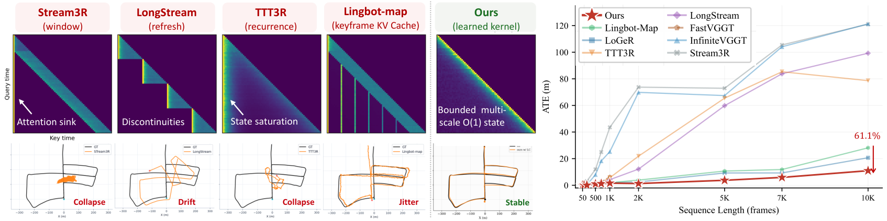

论文用 **evidence influence kernel** 表示第 $i$ 帧证据对时刻 $t$ 的影响，并将它分解为空间选择和时间传播

$$
K(t,i)=K_{\mathrm{spatial}}(t,i)K_{\mathrm{time}}(t,i)
$$

$K_{\mathrm{spatial}}$ 根据图像内容与相对三维位置选择可靠的局部对应，$K_{\mathrm{time}}$ 决定这些证据在状态中保留多久。HorizonStream 围绕这个分解建立三个模块。Geometric Local Attention 处理窗口内匹配，Geometric Linear Attention 维护跨窗口状态，Metric Readout Token 从长期状态中读取尺度和位姿。

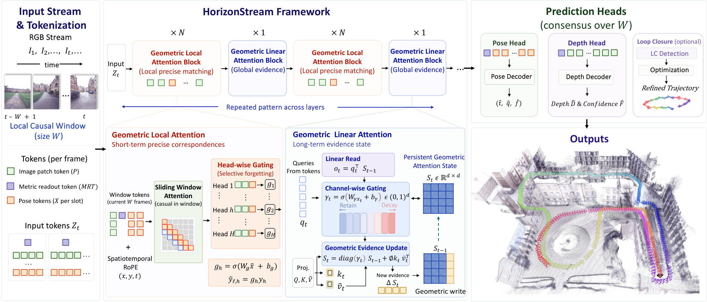

网络采用 ViT-L 主干，并从 VGGT 与 DINOv2 初始化。每帧包含图像 patch token、pose token 和 Metric Readout Token。frame block 负责单帧内部建模，global block 交替使用局部几何注意力和长程线性注意力。经过时空融合的特征进入 DPT head，最终输出深度与相机位姿。

Geometric Linear Attention 把历史几何压缩在固定大小的状态 $\mathbf S_t$ 中。每个时刻先衰减旧状态，再写入当前帧由 key 和 value 编码的几何证据

$$
\mathbf S_t=
\operatorname{diag}(\boldsymbol\gamma_t)\mathbf S_{t-1}
+\phi(\mathbf k_t)\tilde{\mathbf v}_t^\top,
\qquad
\mathbf o_t=\mathbf q_t^\top\mathbf S_t
$$

其中保留率由当前特征预测

$$
\boldsymbol\gamma_t=
\sigma(\mathbf W_\gamma\mathbf x_t+\mathbf b_\gamma)
$$

$\boldsymbol\gamma_t$ 是逐通道向量，第 $c$ 个通道中的历史证据按照下式传播

$$
K_{\mathrm{time}}^{(c)}(t,i)=
\prod_{j=i+1}^{t}\gamma_j^{(c)}
$$

当平均保留率为 $\bar\gamma^{(c)}$ 时，对应的有效记忆长度可以写成

$$
\tau^{(c)}=-\frac{1}{\log\bar\gamma^{(c)}}
$$

低保留率通道快速覆盖旧内容，用于保存短时对应和局部运动。高保留率通道缓慢变化，用于传递场景结构和尺度。每个通道独立学习时间尺度后，同一个固定状态可以同时容纳瞬时信息与长期信息。状态大小不随输入序列增长，每个新窗口都重复执行相同的读取、衰减和写入过程。

窗口内的稠密对应由 Geometric Local Attention 处理。它为每个注意力头预测可靠性门

$$
g_h=\sigma(\mathbf W_g\bar{\mathbf x}+b_g),
\qquad
\tilde{\mathbf y}_h=g_h\mathbf y_h
$$

当某个注意力头集中到噪声对应或 attention sink 时，较低的门值会削弱它写入后续特征的内容。位置编码采用时空 RoPE。图像 patch 的位置由时间、行坐标和列坐标共同表示，query 与 key 分别沿三个轴旋转，使注意力能够根据相对时空偏移建立局部对应。时间索引周期性重置，Metric Readout Token 与 pose token 使用零坐标。

每帧的 Metric Readout Token 参与长程线性注意力，尺度头从该 token 预测正尺度

$$
\hat s=\exp\left(g\left(\mathbf z^{\mathrm{metric}}\right)\right)
$$

预测尺度同时作用于相机平移和深度

$$
\hat{\mathbf t}=\hat s\hat{\mathbf t}^{\mathrm{raw}},
\qquad
\hat D=\hat s\hat D^{\mathrm{raw}}
$$

Metric Readout Token 能够读取跨窗口状态中的高保留通道，尺度估计因此可以利用长于当前窗口的几何历史。相机位姿由局部窗口内的 pose token 联合估计。位姿头聚合这些 token，输出当前帧相对窗口上下文的一致变换，减少逐帧串联相对位姿产生的累计误差。

模型使用 48 帧训练片段，并在推理时处理超过一万帧的序列。局部注意力始终面对固定窗口，长程信息压缩进固定状态，因此显存占用不随历史帧数持续增长，总计算量随输入帧数线性增加。论文还提供可选的回环模块，利用早期 DINOv2 特征检索重访帧，将网络预测的局部修正转成回环约束，再通过位姿图优化调整全局轨迹。

## 世界模型Q&A

> [ICLR2026 世界模型标准大讨论](https://b23.tv/oidb6Ch)

### 世界模型的发展历程

**第一阶段：心理学与控制论中的“内部模型”思想**

世界模型的思想并不是深度学习时代才出现的。早期认知科学中已经有类似观点：智能体需要在内部构造外部现实的小尺度模型，用来预判事件、比较行动方案并指导行为。这个思想后来进入控制、机器人和强化学习领域，逐渐演变成“internal model / forward model / world model”等概念。

这一阶段的核心思想是：
$$
\text{internal model} \approx \text{simulate before act}
$$
也就是：行动前先在内部模拟可能后果。

**第二阶段：模型强化学习与 Dyna 架构**

1990 年前后，世界模型思想开始进入强化学习体系。Schmidhuber 在 1990 年的工作中讨论了用自监督循环神经网络学习环境模型，并将其用于动态强化学习和规划。

1991 年，Sutton 提出 Dyna 架构，把 learning、planning 和 reacting 统一起来：智能体既可以从真实经验学习，也可以用学到的模型生成模拟经验，再用模拟经验更新策略。

Dyna 的结构可以概括为：
$$
\text{real experience}
\rightarrow
\text{learn model}
\rightarrow
\text{simulated experience}
\rightarrow
\text{improve policy}
$$
这个阶段已经明确了世界模型的基本价值：**用模型内部试错替代一部分真实试错**。

**第三阶段：深度世界模型，学习压缩表征与梦中训练**

2018 年，Ha 和 Schmidhuber 的论文《World Models》把“world model”这个术语推向深度学习社区。他们用生成模型学习环境的压缩空间和时间表示，并展示智能体可以在自己模型生成的“梦境”中训练策略，再迁移回真实环境。

这一步的重要性在于，它把世界模型具体化为一个神经网络系统：
$$
o_t \rightarrow z_t
$$
也就是：先把高维观测压缩成潜在状态，再在潜在状态中预测未来，最后基于潜在状态决策。

**第四阶段：latent dynamics + planning，从像素到控制**

2019 年左右，PlaNet 和 Dreamer 系列把世界模型进一步推进到视觉控制任务。PlaNet 学习从像素输入到潜在动力学，并在潜在空间中规划；Dreamer 则进一步让智能体在想象轨迹中学习行为策略。

DreamerV3 在 2023 年提出，目标是用一个较通用的世界模型算法解决大量不同任务；论文称其在 150 多个任务上表现强，并能够通过“想象未来场景”来改进行为。

这一阶段的范式可以概括为：
$$
\text{learn latent world model}
\rightarrow
\text{imagine trajectories}
\rightarrow
\text{optimize behavior}
$$
重点已经不是“生成逼真画面”，而是**在潜在空间里进行高效决策**。

**第五阶段：MuZero，把世界模型从“重建世界”转向“服务规划”**

MuZero 是一个关键转折。它不要求模型预测完整环境状态，而是只预测对规划有用的量：reward、value、policy。DeepMind 介绍 MuZero 时强调，它在不知道环境动力学规则的情况下，通过 learned model 和 tree search 解决 Go、chess、shogi 和 Atari。

MuZero 的思想非常重要：
$$
\text{world model} \neq \text{reconstruct everything}
$$
而是：
$$
\text{world model} \approx \text{predict what matters for planning}
$$
因此，一个世界模型不一定要还原真实世界的所有细节；它只要能支持正确规划，就已经具备世界模型属性。

**第六阶段：从强化学习世界模型到基础世界模型**

2022 年以后，世界模型开始和自监督学习、视频生成、多模态大模型结合。LeCun 的 JEPA 路线主张在抽象表征空间中预测，而不是像素级生成；I-JEPA 用图像块之间的表征预测学习语义表征，V-JEPA 则进一步在视频中预测抽象表示。

OpenAI 在 2024 年提出“video generation models as world simulators”的观点，认为扩展视频生成模型是构建通用物理世界模拟器的一条路径。

Google DeepMind 的 Genie 系列则更直接地走向“可交互世界生成”：Genie 被称为可以从未标注互联网视频中训练出的生成式交互环境模型，能够生成 action-controllable worlds；后续 Genie 3 被 DeepMind 描述为 general purpose world model，可生成可实时探索的交互环境。

这一阶段的变化是：
$$
\text{world model for RL}
\rightarrow
\text{world model as interactive simulator}
$$
也就是说，世界模型不再只是某个智能体内部的小模块，而开始变成一种可生成、可交互、可扩展的环境模拟基础模型。

### Q0: 从自动驾驶看：为什么世界模型突然变热门？

自动驾驶的发展可以粗略分成三条路线：**规则 pipeline → 端到端模仿学习 → VLA / 世界模型**。世界模型变热，本质上是因为前两类方法都遇到了瓶颈。

**1. 传统 pipeline：人定义规则，系统按模块执行**

早期自动驾驶通常是模块化 pipeline：
$$
\text{Perception} \rightarrow \text{Prediction} \rightarrow \text{Planning} \rightarrow \text{Control}
$$
也就是先感知目标，再预测轨迹，再规划路径，最后控制车辆。

它的优点是结构清楚、可解释、可调试。但问题也很明显：**大量规则需要人工设计**。真实道路不是封闭棋盘，而是开放世界。人可以写规则处理红绿灯、车道线、行人、车辆让行，但很难穷举所有 corner case。

所以 pipeline 的核心瓶颈是：
$$
\text{现实复杂度} \gg \text{人工规则覆盖能力}
$$
它不是完全不能用，而是越往开放城区、复杂交互、长尾场景走，系统越容易变成大量 if-else 和补丁工程。

**2. 端到端模仿学习：从人写规则变成数据驱动**

之后端到端开始兴起，基本思想是直接学习：
$$
\pi_\theta(a_t \mid o_t)
$$
也就是从观测 $o_t$ 直接输出动作 $a_t$。

这类方法的吸引力很强：既然人写规则写不完，那就让模型从大规模驾驶数据中学习人类驾驶行为。Tesla FSD v12 之后的端到端叙事就是这个方向的代表之一；Wayve 也长期主张端到端自动驾驶。

但端到端模仿学习有三个关键问题。

第一，数据需求极大。模型要覆盖足够多道路、天气、交通参与者和驾驶风格。

第二，corner case 天然稀缺。越危险、越关键的场景，在真实数据里越少：
$$
P(\text{corner case}) \ll P(\text{normal case})
$$
这导致模型在普通场景下表现很好，但在低频高风险场景中不稳定。

第三，黑箱问题严重。模型学到的是：
$$
o_t \rightarrow a_t
$$
但你很难知道它内部到底形成了什么因果理解。它是在理解“前方儿童可能冲出”，还是只是拟合了视觉纹理与方向盘角度之间的相关性？这很难验证。

所以端到端模仿学习的瓶颈是：
$$
\text{高性能} \neq \text{可理解、可验证、可控}
$$
**3. VLA：给端到端加语言，但语言不是万能解释器**

接下来出现了 VLA，Vision-Language-Action，即：
$$
(o_t, l_t) \rightarrow a_t
$$
或者：
$$
\text{Vision} + \text{Language} \rightarrow \text{Action}
$$
它的动机很自然：既然端到端模型内部不可见，那就引入语言，让模型能描述场景、解释意图、输出中间推理，例如：

> 前方有行人，右侧车辆并线，因此减速等待。

这确实提高了交互性和一定程度的可解释性。但问题是，**语言解释不等于世界理解**。

VLA 的核心问题有几个。

第一，语言可能只是事后合理化。模型可以说出听起来合理的解释，但这不保证动作真的是由这个原因导致的：
$$
\text{plausible explanation} \neq \text{causal mechanism}
$$
第二，语言带宽太低。真实驾驶涉及连续几何、速度、加速度、遮挡、可行驶空间、交互博弈，这些东西很难完全压缩成自然语言。

第三，语言不是物理动力学。比如“前车可能减速”这句话不等于模型真的掌握了：
$$
s_{t+1}=f(s_t,a_t)
$$
也不等于它能稳定预测其他车辆、行人和自车动作共同作用后的未来状态。

第四，VLA 仍然可能缺少闭环推演能力。它可以解释当前场景，却未必能在内部模拟：

> 如果我现在加速、减速、左变道，分别会发生什么？

也就是它未必具备：
$$
p(s_{t+1:t+H}\mid s_t,a_{t:t+H})
$$
因此，VLA 解决了一部分“可交流性”问题，但没有根本解决“可验证的未来预测”和“闭环规划”问题。

一句话说：

> **VLA 让模型更会说，但不保证模型真的会想；世界模型则要求模型能在行动前模拟后果。**

**4. 世界模型**

世界模型正好补上端到端自动驾驶最缺的东西：**可预测的未来、可生成的长尾、可闭环验证的环境模型**。

世界模型在自动驾驶中要学习的是：
$$
p(s_{t+1:t+H}\mid s_t,a_{t:t+H})
$$
也就是：在当前驾驶场景下，如果自车执行某个动作序列，未来世界会怎样演化。

这带来三个直接价值。

第一，它可以做未来预测。自动驾驶不是只看当前帧，而是必须判断未来几秒：

- 行人会不会横穿？
- 前车会不会急刹？
- 右侧车辆会不会并线？
- 自车变道后是否会产生冲突？

第二，它可以生成 corner case。真实世界中的危险场景少，但世界模型可以生成可控的长尾场景，用来训练和测试自动驾驶系统。Wayve 的 GAIA-1 就明确提出用 video、text 和 action 输入生成真实驾驶场景，并支持对自车行为和场景特征进行控制。

第三，它可以支持闭环训练与验证。NVIDIA Cosmos 这类 world foundation model 明确面向 autonomous vehicles、robots 等 physical AI 场景，NVIDIA 也提到 Cosmos 可用于合成数据生成、闭环训练和车端推理。

所以，世界模型火起来不是偶然的，而是因为自动驾驶行业意识到：
$$
\text{只学习人怎么开车} \quad \text{不够}
$$
还必须学习：
$$
\text{世界会如何回应我的动作}
$$

### Q1：世界模型的核心是否是"学习世界的结构规律并预测未来"？

世界模型的确是在学习世界的结构规律，但这个说法还不够精确。原因在于，几乎所有模型都在某种意义上学习结构规律：分类模型学习类别边界，生成模型学习数据分布，语言模型学习文本中的统计与语义结构，三维重建模型学习空间几何与外观结构。因此，如果仅仅把世界模型定义为"学习世界的结构规律"，这个定义会过宽，无法把世界模型与普通预测模型、生成模型或表征模型区分开。

更准确地说，世界模型的核心是：**学习动作如何改变世界状态**。也就是说，世界模型不仅要理解"世界是什么样的"，还要理解"如果智能体采取某个动作，世界会如何变化"。

可以形式化为：

$$
p(s_{t+1} \mid s_t, a_t)
$$

其中，$s_t$ 表示当前世界状态，$a_t$ 表示智能体采取的动作，$s_{t+1}$ 表示动作之后的下一时刻世界状态。这个公式强调的是：世界模型关注的不是单纯的观测变化，而是**状态、动作与后果之间的因果关系**。

进一步说，观测 $o_t$ 通常只是世界状态 $s_t$ 的一个投影：

$$
o_t \sim p(o_t \mid s_t)
$$

因此，世界模型真正关心的链条不是：

$$
o_t \rightarrow o_{t+1}
$$

而是：

$$
s_t \xrightarrow{a_t} s_{t+1} \rightarrow o_{t+1}
$$

也就是说，模型不能只学习"画面下一帧会怎样"，而应该学习"动作如何导致世界状态发生变化，并进一步产生新的观测"。

这一点也是世界模型与普通视频生成模型的重要区别。一个视频生成模型可能学习的是：

$$
p(x_{t+1} \mid x_t)
$$

它可以生成连续、逼真的画面，但这并不意味着它真正理解了世界的动态机制。它可能只是学习到了像素连续性、运动惯性或数据中的统计模式。真正的世界模型需要建模：

$$
p(s_{t+1} \mid s_t, a_t)
$$

也就是 action-conditioned dynamics，即动作条件化的状态动力学。

因此，世界模型的关键不只是"预测未来"，而是能够回答反事实问题：

> 如果我在当前状态下执行动作 $a_t$，世界会怎样变化？

这种能力是规划和决策的基础。例如，智能体可以在模型内部模拟多个候选动作的后果，并选择预期收益最高的动作：

$$
a^* = \arg\max_a \mathbb{E}\left[\sum_{k=0}^{H} \gamma^k r_{t+k}\right]
$$

这里的本质不是完全避免试错，而是把一部分试错从真实世界转移到模型内部。真实世界中的试错可能成本高、危险或不可逆，而模型内部的试错主要消耗计算资源：

$$
C_{\text{model}} \ll C_{\text{real}}
$$

所以，世界模型的价值不是"不试错"，而是让智能体能够在行动前先进行内部推演，从而降低真实交互成本，提高规划能力和泛化能力。

综上，原始表述"世界模型的核心是学习世界的结构规律"是对的，但需要进一步收紧。更规范的表述应为：

> **世界模型是智能体学习到的关于世界可预测结构与因果动态的内部模型。它的核心是学习动作对潜在世界状态的影响，从而支持预测、反事实推演、规划和决策。**

也可以更简洁地概括为：

$$
\boxed{
\text{World Model}
\approx
\text{Action-Conditioned Latent Dynamics}
}
$$

即：**世界模型的本质，是学习 action 对 latent world state 的因果作用。**

### Q2 为什么世界模型一定需要预测未来？

在强化学习中，一个动作的价值通常定义为：
$$
Q^\pi(s_t,a_t)
=
\mathbb{E}
\left[
\sum_{k=0}^{H}\gamma^k r_{t+k}
\mid s_t,a_t
\right]
$$
这个公式说明：评价动作 $a_t$，必须看它在未来带来的累计收益。也就是说，**没有对未来后果的估计，就无法真正判断动作好坏**。

如果一个系统只知道当前观测 $o_t$，但不知道动作会把世界带向哪里，它最多只能做反应式控制：
$$
a_t = \pi(o_t)
$$
这种策略在简单任务中可以有效，但它本质上是把“未来后果”压缩进经验映射里。它不是不依赖未来，而是**把未来预测隐式化了**。

世界模型则把这件事显式化：
$$
s_{t+1}=f_\theta(s_t,a_t)
$$
然后通过内部 rollout 比较不同动作：
$$
a^*
=
\arg\max_{a_{t:t+H}}
\mathbb{E}
\left[
\sum_{k=0}^{H}\gamma^k r_{t+k}
\right]
$$

### Q3 世界模型的技术路线大概是？

当前世界模型的发展路线，正在逐步形成与大语言模型相似的技术范式：

$$
\text{Pre-training} \rightarrow \text{Post-training}
$$

其核心思想在于，模型首先通过大规模数据学习世界的通用规律，再进一步学习如何在该世界中进行决策与行动。因此，现代世界模型本质上可以理解为"物理世界中的 Foundation Model 与行为系统的结合"。

为了理解这一点，需要回溯大语言模型的发展过程。LLM 的预训练目标通常写为：

$$
p(x_t \mid x_{<t})
$$

即根据历史 token 预测下一个 token。通过海量互联网文本数据，模型逐渐习得语言中的统计结构、语义关系、知识分布与推理模式。此阶段的重点并非完成某个具体任务，而是建立一种通用的世界知识表征。因此，LLM 的 Pre-training 本质上是在学习世界中的统计规律与语义结构。

然而，仅有预训练还不足以让模型真正具备稳定的行为能力。一个仅经过预训练的语言模型，虽然"知道很多"，却不一定能够遵循用户指令、满足安全约束、进行长期规划或与真实环境交互。因此，大语言模型还需要进一步进行 Post-training，包括 Instruction Tuning、RLHF（Reinforcement Learning from Human Feedback）以及 Agent 能力训练等。其核心目标通常表示为：

$$
\max_\pi \mathbb{E}[r]
$$

即通过奖励优化，让模型输出更加符合人类偏好与任务目标。因此，LLM 的整体技术结构可以概括为"表征学习 \rightarrow 行为对齐"——模型先学习世界是什么样，再学习应该如何行动。

世界模型的发展本质上正在复现这一结构。区别在于，大语言模型学习的是语言世界，而世界模型学习的是物理世界及其动态规律。因此，世界模型的核心问题不再是 $p(x_t \mid x_{<t})$，而是：

$$
p(s_{t+1} \mid s_t, a_t)
$$

即：在当前状态与动作条件下，未来世界将如何变化。这里 $s_t$ 表示当前世界状态，$a_t$ 表示智能体动作，$s_{t+1}$ 表示下一时刻世界状态。这意味着，世界模型的核心不是简单预测下一帧画面，而是学习动作如何导致世界状态演化。

因此，世界模型与普通视频生成模型存在本质区别。普通视频生成更关注 $p(x_{t+1} \mid x_t)$，它学习的是视觉连续性与时序统计结构；而世界模型强调的是 $p(s_{t+1} \mid s_t, a_t)$，即 action-conditioned dynamics（动作条件化动力学）。

在数据层面，世界模型通常依赖 $(o_t, a_t, o_{t+1})$ 形式的数据，其中 $o_t$ 为当前观测，$a_t$ 为执行动作，$o_{t+1}$ 为下一时刻观测。模型需要从这些数据中学习世界的空间结构、时间连续性、物理规律以及动作与状态变化之间的因果关系。例如，在自动驾驶场景中，模型不仅需要理解车道、车辆和行人的空间关系，还需要理解方向盘转动、制动或加速如何改变车辆未来状态，即 $a_t \rightarrow \Delta s_t$。

因此，世界模型的 Pre-training 阶段，本质上是在学习世界如何因动作而演化。

然而，仅仅能够预测未来仍然不足以支撑真实任务，因为"知道未来会发生什么"并不等于"知道应该怎么做"。因此，世界模型同样需要 Post-training。这一阶段的核心是策略学习 $\pi(a_t \mid s_t)$，即：在当前世界状态下，应该采取什么动作。通常，这一阶段通过强化学习进行优化：

$$
\max_\pi \mathbb{E}\left[\sum_t r_t\right]
$$

其目标是让智能体获得长期累计收益最大化。

与此同时，现代世界模型通常还会结合内部轨迹推演（Internal Rollout）进行规划。模型会在内部模拟未来状态 $s_t \rightarrow s_{t+1} \rightarrow s_{t+2} \rightarrow \cdots$，并比较不同动作序列带来的未来结果，从而选择最优动作 $a^* = \arg\max_a \mathbb{E}[R]$。这一过程的本质可以概括为：在真实行动之前，先在模型内部"想象未来"。这也是世界模型区别于传统反应式模型的重要特征。

此外，世界模型同样存在"行为对齐"问题。例如，在自动驾驶中，一个系统不仅要能够到达目标位置，还需要满足安全、平稳、合规以及符合人类驾驶习惯等要求。因此，世界模型的 Post-training 实际上也在解决 Human Preference Alignment，即让模型行为符合人类社会规范与偏好。

从整体结构来看，大语言模型与世界模型之间存在非常清晰的对应关系：LLM 的 token prediction 对应世界模型的 future-state prediction；LLM 的文本语料对应世界模型的视频与交互数据；LLM 的 RLHF 对应世界模型中的行为对齐；LLM 的 Chain-of-Thought 对应世界模型中的内部 rollout。但两者之间也存在一个根本区别：大语言模型的目标是生成合理的语言，而世界模型的目标是预测可行动的未来。因此，世界模型必须进一步满足实时性、闭环控制、物理一致性、长期稳定性与安全约束等要求。换句话说，大语言模型本质上是生成系统，而世界模型本质上是生成系统与控制系统的结合。

当前，世界模型正在向"World Foundation Model"方向发展。代表性路线包括 NVIDIA Cosmos、Wayve GAIA、DeepMind Genie 等，其共同趋势是"Large-scale World Pretraining \rightarrow General Embodied Intelligence"，即先通过大规模数据学习通用世界规律，再迁移到机器人、自动驾驶与具身智能等具体任务。

因此，从技术发展的角度看，世界模型实际上正在形成一种与 LLM 高度相似的统一范式：

$$
\boxed{
\text{Pre-training}
\rightarrow
\text{Post-training}
}
$$

其中，Pre-training 负责学习 $p(s_{t+1} \mid s_t, a_t)$，即世界如何演化；而 Post-training 负责学习 $\pi(a_t \mid s_t)$，即在该世界中应如何行动。

因此，可以将世界模型概括为：面向物理世界的基础模型与行为决策系统，其核心目标是在内部建立可用于预测、规划与闭环控制的未来世界模拟能力。
