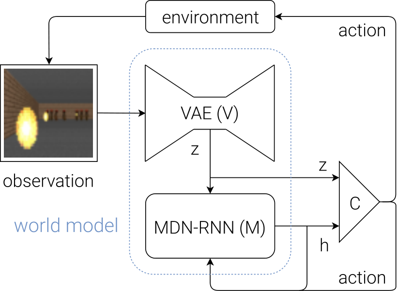
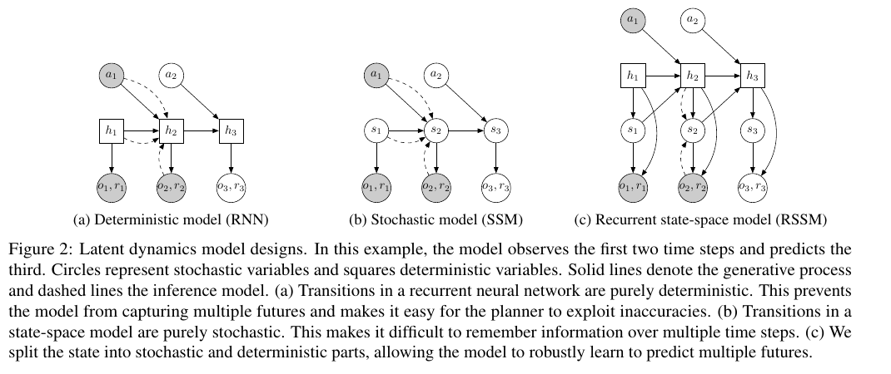
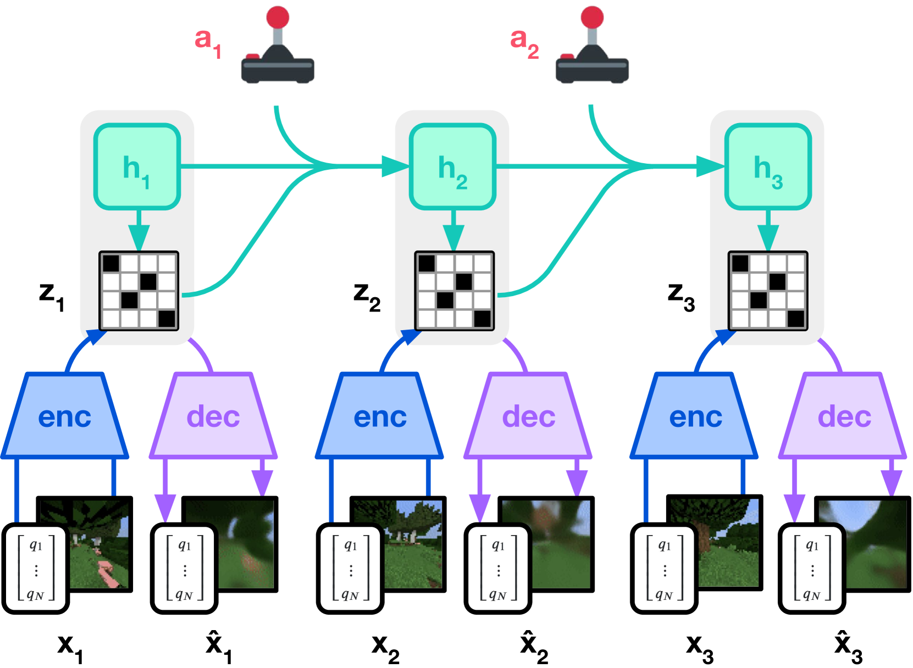
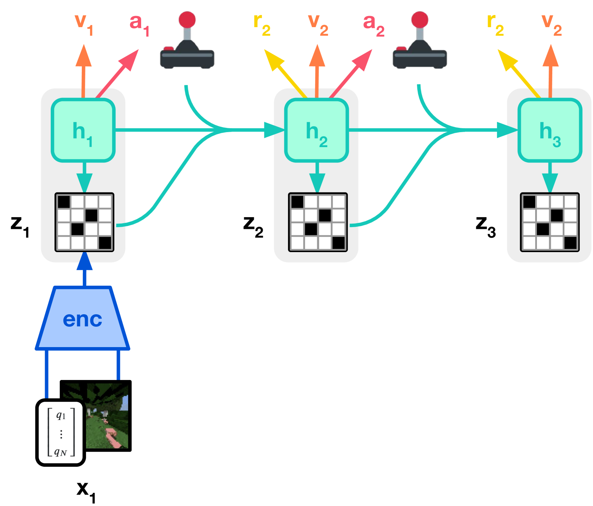
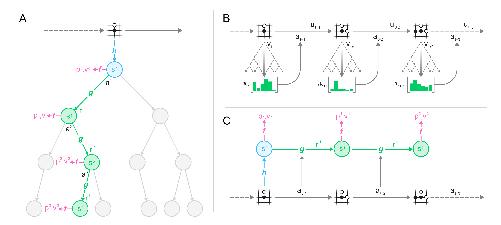
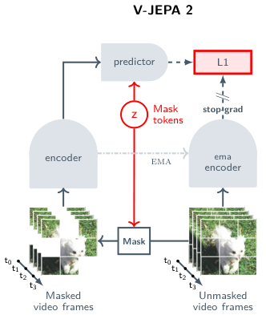
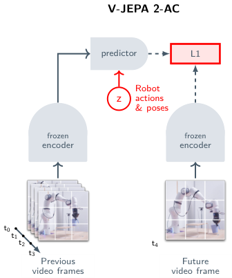
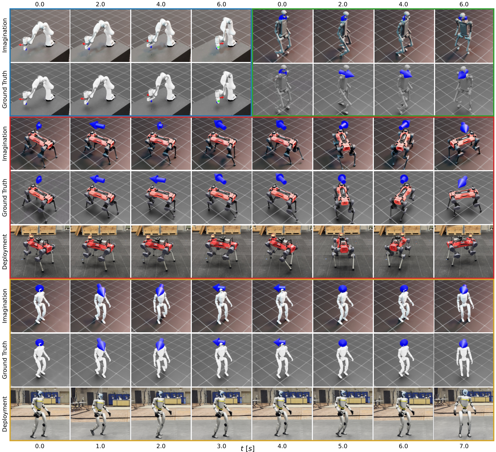

# World Model

## 0. World Models

> HA D, SCHMIDHUBER J. World Models[A/OL]. arXiv, 2018[2026-09-11]. https://arxiv.org/abs/1803.10122.

[论文](https://arxiv.org/abs/1803.10122) · [项目主页](https://worldmodels.github.io/)

World Models 将智能体拆成视觉模型、记忆模型和控制器。视觉模型用变分自编码器把当前画面 $x_t$ 压缩为潜变量 $z_t$。记忆模型接收 $z_t$、动作 $a_t$ 和循环状态 $h_t$，通过混合密度循环网络预测下一时刻潜变量的条件分布。控制器读取当前潜变量和记忆状态，输出环境动作。

这套结构先用真实交互数据分别训练视觉模型和记忆模型，再冻结二者，在记忆模型生成的潜在轨迹中优化控制器。控制器接触到的是 $z_t$ 与 $h_t$ 组成的紧凑状态，环境的视觉变化由记忆模型滚动生成。图中的信息流从观测编码开始，经过控制器产生动作，再由动作与当前潜变量共同更新记忆。智能体由此能够在学习到的动态模型中反复执行策略，而无需为每次策略更新重新采集同等规模的真实交互。

## 1. PlaNet

> HAFNER D, LILLICRAP T, FISCHER I, et al. Learning Latent Dynamics for Planning from Pixels[C]//Proceedings of the 36th International Conference on Machine Learning. PMLR, 2019, 97: 2555–2565.

[论文](https://proceedings.mlr.press/v97/hafner19a.html) · [代码](https://github.com/google-research/planet)

PlaNet 从图像中学习潜在动力学，并直接在潜在空间执行在线规划。编码器根据历史观测与动作估计当前状态，转移模型把当前潜在状态和候选动作递推到未来，观测模型与奖励模型分别重建画面并预测回报。规划只读取潜在状态和奖励预测，无需为每条候选动作序列生成完整图像，因此能够并行评估大量未来轨迹。

PlaNet 的循环状态空间模型将状态写成确定性记忆 $h_t$ 与随机潜变量 $s_t$ 的组合。确定性分量根据上一时刻的状态和动作递推，先验分布从历史预测当前潜变量，后验分布再用当前观测修正它

$$
h_t=f(h_{t-1},s_{t-1},a_{t-1}),\qquad
s_t\sim p(s_t\mid h_t),\qquad
s_t\sim q(s_t\mid h_t,o_t).
$$

$h_t$ 保存跨时间的上下文，$s_t$ 表达部分可观测条件下仍未确定的状态及多种可能未来，二者共同供观测模型与奖励模型读取。随机潜变量能够表示数据随机性和观测歧义，但不等同于经过标定的认知不确定性估计。Dreamer 系列直接继承了这套 RSSM，近期以视频扩散模型为主干的 WAM 则用 Transformer 历史 token 与缓存承担长期记忆，用扩散或流匹配噪声表达多模态未来，延续了相同的功能分工，但不再显式维护 $h_t$ 与 $s_t$。

每个控制时刻，PlaNet 使用交叉熵方法维护一组动作序列分布，采样候选序列并在动力学模型中滚动，根据累计预测奖励筛选较优样本，再用这些样本更新动作分布。控制器只执行最终序列的第一个动作，收到下一帧观测后重新估计状态并规划。训练中的 latent overshooting 将多步先验预测与未来后验状态对齐，使动态模型直接学习跨越多个时间步的潜在转移。

## 2. DreamerV3

> HAFNER D, PASUKONIS J, BA J, et al. Mastering Diverse Domains through World Models[A/OL]. arXiv, 2023[2026-09-11]. https://arxiv.org/abs/2301.04104.

[论文](https://arxiv.org/abs/2301.04104) · [代码](https://github.com/danijar/dreamerv3)

DreamerV3 使用循环状态空间模型组织感知与动态预测。编码器把观测 $x_t$ 映射为离散随机表示 $z_t$，循环状态 $h_t$ 根据上一时刻的表示和动作持续更新。二者拼接后构成模型状态，并同时预测观测、奖励和回合是否继续。动态预测器只根据循环状态估计下一步表示，使模型可以脱离真实观测继续向前展开。

行为学习从经验回放中的模型状态出发。Actor 在想象轨迹中采样动作，世界模型递推后续状态、奖励和终止信号，Critic 估计这些轨迹的回报，随后用回报更新 Actor 与 Critic。图中的上半部分对应世界模型从真实序列学习表示和动态，下半部分对应策略在抽象状态序列中学习。DreamerV3 还统一处理不同量级的观测、奖励和回报，使同一套学习过程能够跨越离散动作、连续控制和视觉输入任务。

## 3. MuZero

> SCHRITTWIESER J, ANTONOGLOU I, HUBERT T, et al. Mastering Atari, Go, Chess and Shogi by Planning with a Learned Model[J]. Nature, 2020, 588: 604–609. DOI: 10.1038/s41586-020-03051-4.

[论文](https://arxiv.org/abs/1911.08265)

MuZero 用表示函数、动态函数和预测函数构成可搜索的隐空间模型。表示函数把历史观测编码为初始隐状态。动态函数接收隐状态和候选动作，递推新的隐状态并预测即时奖励。预测函数从每个隐状态输出策略分布和状态价值。隐状态只需要保留奖励、策略和价值预测所需的信息，训练目标不要求它重建输入画面或对应某个预先定义的环境状态。

规划阶段在隐空间中运行蒙特卡洛树搜索。搜索用动态函数展开候选动作，用预测函数评估节点，并根据访问计数形成改进后的搜索策略。与环境交互后，轨迹被写入经验回放。训练时重新展开当时执行过的动作序列，使奖励预测贴近真实奖励，使策略与价值预测贴近搜索得到的策略和实际回报。图中依次展示了模型内搜索、真实环境交互和经验回放训练，三部分共享同一组表示、动态与预测网络。

## 4. Genie

> BRUCE J, DENNIS M, EDWARDS A, et al. Genie: Generative Interactive Environments[A/OL]. arXiv, 2024[2026-09-11]. https://arxiv.org/abs/2402.15391.

[论文](https://arxiv.org/abs/2402.15391) · [项目主页](https://sites.google.com/view/genie-2024/)

Genie 从没有动作标签的视频中学习可逐帧控制的生成环境。视频分词器先把连续画面压缩成离散时空 token。潜在动作模型观察相邻帧之间的变化，将能够解释画面转移的因素量化为有限的离散动作。动力学模型再接收历史视频 token 和潜在动作，按自回归方式预测下一帧 token。

训练时，潜在动作模型负责从视频变化中找出控制变量，动力学模型负责学习这些变量如何改变场景。推理时可以移除潜在动作编码器，直接向动力学模型输入选定的离散动作，连续生成受控画面。模型内部使用交替的空间注意力和时间注意力。空间注意力处理单帧中的对象与布局，时间注意力沿同一空间位置连接不同帧，从而把长视频的计算量控制在可扩展范围内。

## 5. π0

> BLACK K, BROWN N, DRIESS D, et al. π0: A Vision-Language-Action Flow Model for General Robot Control[A/OL]. arXiv, 2024[2026-09-11]. https://arxiv.org/abs/2410.24164.

[论文](https://arxiv.org/abs/2410.24164) · [项目主页](https://www.physicalintelligence.company/blog/pi0) · [代码](https://github.com/Physical-Intelligence/openpi)

π0 在预训练视觉语言模型旁加入独立的动作专家。图像与语言指令进入视觉语言主干，机器人本体状态和带噪动作序列进入动作专家，两组 token 通过 Transformer 的自注意力交换信息。视觉语言主干提供物体、场景和指令表征，动作专家把这些条件转换为一段连续控制轨迹。

动作生成采用条件流匹配。训练时先把真实动作片段与高斯噪声线性混合，再让网络预测从当前带噪样本指向真实动作的速度场。推理从随机噪声出发，沿预测速度场进行数值积分，最终得到完整动作片段。动作片段中的各个时刻可以相互注意，使模型能够联合表示抓取、移动和接触过程中连续变化的控制量。

训练数据混合多个机器人平台、不同操作任务和开放机器人数据。预训练阶段让同一个策略学习跨本体的视觉、语言和动作对应关系，后训练阶段使用更集中且质量更高的数据调整具体技能。不同机器人的状态和动作先映射到统一 token 维度，再由相同的视觉语言主干和动作专家处理，输出端按对应机器人的动作维度还原控制指令。

## 6. V-JEPA 2

> ASSRAN M, BARDES A, FAN D, et al. V-JEPA 2: Self-Supervised Video Models Enable Understanding, Prediction and Planning[A/OL]. arXiv, 2025[2026-09-11]. https://arxiv.org/abs/2506.09985.

[论文](https://arxiv.org/abs/2506.09985) · [代码](https://github.com/facebookresearch/vjepa2)

V-JEPA 2 在表征空间预测被遮挡的视频内容。输入视频被切成时空块并随机移除一部分 token，编码器只处理可见区域。预测器结合可见表征和表示遮挡位置的 token，恢复缺失区域的目标表征。目标由编码器的指数滑动平均副本产生，损失仅作用于被遮挡位置。模型学习预测对象状态和运动结构，不需要逐像素生成未来画面。

动作条件版本 V-JEPA 2-AC 冻结预训练视频编码器，并在机器人交互数据上训练新的预测器。预测器接收历史视频表征、机器人动作和末端状态，以块因果注意力递推未来帧的表征。模型预测一段候选动作对应的未来状态后，模型预测控制器比较终点表征与目标图像表征的距离，选择代价较低的动作序列并滚动执行。两幅图分别对应无动作视频预训练和机器人动作条件建模，前者提供视觉与运动表征，后者学习动作对表征变化的影响。

## 7. Robotic World Model

> LI C, KRAUSE A, HUTTER M. Robotic World Model: A Neural Network Simulator for Robust Policy Optimization in Robotics[A/OL]. arXiv, 2025[2026-09-11]. https://arxiv.org/abs/2501.10100.

[论文](https://arxiv.org/abs/2501.10100) · [项目主页](https://sites.google.com/view/roboticworldmodel)

Robotic World Model 面向低维机器人观测和连续控制。模型用 GRU 汇总一段历史观测与动作，从隐藏状态预测下一时刻观测分布。内部自回归沿历史序列更新循环状态，外部自回归把模型生成的观测重新送回网络，继续产生更长的未来轨迹。训练时也让模型接触自身预测形成的输入，使长时展开时的状态分布更接近策略优化阶段实际遇到的分布。

策略训练从真实数据中的观测开始，在世界模型中递归采样动作与后续观测，并根据预测轨迹计算奖励。策略随后用这些想象交互更新，再回到真实系统收集新数据。图中并列给出模型生成的轨迹、仿真环境演化和真实机器人执行过程，连接了数据采集、动态模型训练、想象轨迹生成与策略优化。

## 8. DreamZero

> YE S, GE Y, ZHENG K, et al. World Action Models are Zero-shot Policies[A/OL]. arXiv, 2026[2026-09-11]. https://arxiv.org/abs/2602.15922.

[论文](https://arxiv.org/abs/2602.15922) · [项目主页](https://dreamzero0.github.io/) · [代码](https://github.com/dreamzero0/dreamzero)

DreamZero 在视频扩散骨干中联合预测未来视频和机器人动作。模型读取视觉历史与语言指令，让视频分支生成接下来可能发生的画面，让动作分支输出与这些视觉变化对齐的控制序列。两类 token 在同一个时空模型中交互，动作学习因此可以利用视频预训练获得的对象运动、接触和场景变化表征。

训练数据同时包含带动作的机器人轨迹和只有视频的示范。带动作轨迹建立视觉变化与执行器命令之间的对应关系，视频数据继续训练未来画面的生成能力。推理时，模型根据最新相机观测和任务指令联合生成未来帧与动作，执行一段动作后重新读取真实观测并再次预测。图中展示了视频预测与动作预测共享的生成过程，以及模型从不同机器人和人类视频中吸收运动信息后用于闭环控制的路径。
