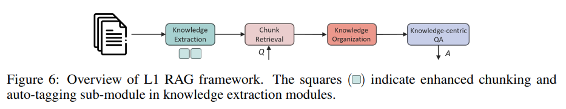
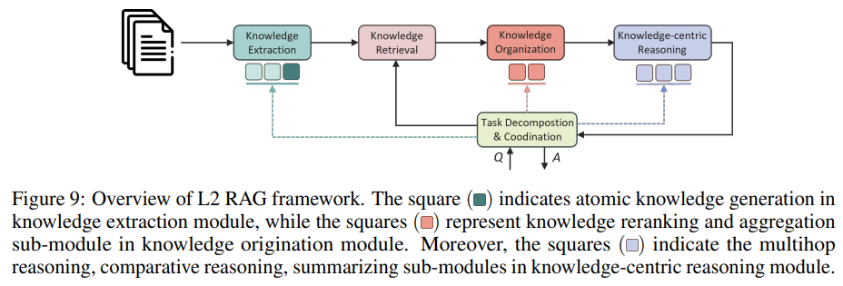
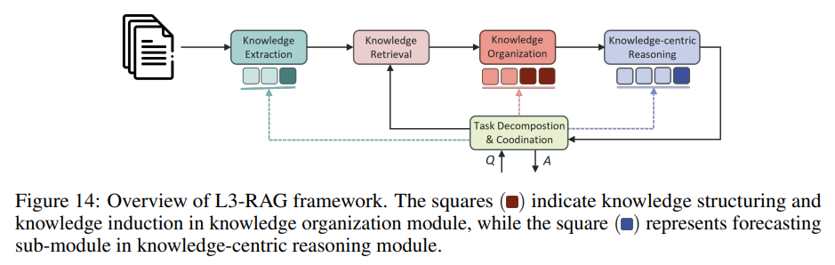

# GRAG技术调研

参考：[火山引擎-开发者社区](https://developer.volcengine.com/articles/7470360277234499610)

智能问答系统依赖大规模知识库快速提取信息，并生成自然流畅的回答。**RAG（检索增强生成）**无需大规模训练，仅需更新知识库即可保持知识的时效性，同时提高答案的可验证性和可信度。

传统 RAG 存在以下问题：

1. 检索不精确：简单的相似性检索模型容易漏掉重要信息或引入噪声数据。

2. 生成效率低下：无关或低质量的上下文增加了生成负担，降低了回答的质量和速度。

3. 查询复杂度：单次检索难以串联多个文本片段，形成连贯的、全面的回答。

   信息呈链条状依赖。在规则挖掘等领域，规则常呈现链条状形态，文本中也存在类似情况。例如，问题 q 与文段 a 相关，a 与文段 b 相关，但 q 与 b 无直接关联迹象。这意味着仅通过 q 无法直接找到 b。

[GraphRAG](https://github.com/microsoft/graphrag)及其优化版本，如 [LightRAG](https://github.com/HKUDS/LightRAG) 与 [nano-GraphRAG](https://github.com/gusye1234/nano-graphrag) 等引入 **知识图谱（KG）**，强化实体、社区与文本片段的关联，提升信息检索的召回率与准确性。同时，**KAG** 等变体也在优化信息整合方式，为用户带来更优质的检索体验。

| 特性         | 传统 RAG                | GraphRAG            |
| ------------ | ----------------------- | ------------------- |
| 数据存储     | 向量数据库（Embedding） | 图数据库（GraphDB） |
| 检索方式     | 语义相似性搜索          | 关系查询+图遍历     |
| 关系推理     | 弱，主要基于文本相关性  | 强，可进行逻辑推理  |
| 结果可解释性 | 较低                    | 高，可视化知识路径  |
| 幻觉问题     | 可能较高                | 相对较低            |

## 1. GraphRAG 微软

- github：https://github.com/microsoft/graphrag
- 论文：From Local to Global: A Graph RAG Approach to Query-Focused Summarization https://arxiv.org/pdf/2404.16130
- 项目文档：microsoft.github.io/graphrag/

微软团队开源的一种结合了检索增强生成（RAG）技术和知识图谱的先进框架。它旨在通过利用外部结构化知识图谱来增强大型语言模型（LLMs）的性能，有效解决模型可能出现的 “幻觉” 问题、领域知识缺失以及信息过时等问题。GraphRAG 的核心目的在于从数据库中检索最相关的知识，以增强下游任务的答案质量，提供更准确和丰富的生成结果。

- **GraphRAG 工作原理**

1. 索引建立阶段：在 GraphRAG 的索引建立阶段，主要目标是从提供的文档集合中提取出知识图谱，并构建索引以支持后续的快速检索。这一阶段是 GraphRAG 工作流程的基础，其效率和准确性直接影响到后续检索和生成的质量。

   - `文本块拆分`：首先，原始文档被拆分成多个文本块，这些文本块是 GraphRAG 处理的基本单元。根据微软的研究，每个文本块的大小和重叠度可以调整，以平衡处理速度和输出质量。

   - `实体与关系提取`：利用大型语言模型（LLM），对每个文本块进行分析，提取出实体和关系。这一步骤是构建知识图谱的关键，涉及到命名实体识别（NER）和关系抽取（RE）技术。

   - `生成实体与关系摘要`：为提取的实体与关系生成简单的描述性信息，这些信息将作为图节点的属性存储，有助于后续的检索和生成过程。

   - `社区检测`：通过社区检测算法，如 Leiden 算法，识别图中的多个社区。这些社区代表了围绕特定主题的一组紧密相关的实体和关系。

   - `生成社区摘要`：利用 LLM 为每个社区生成摘要信息，这些摘要提供了对数据集全局主题结构和语义的高层次理解，是回答高层次查询问题的关键。

2. 图构建阶段：

   - 将检索到的信息（非结构化文本、知识图谱节点）构造成动态图结构。
   - 节点表示：检索到的实体、主题或文档片段。
   - 边表示：实体之间的语义关系或推理路径。

2. 查询处理阶段

   查询处理阶段是 GraphRAG 工作流程的最终环节，它决定了如何利用已建立的索引来回答用户的查询。

   - `本地搜索`（Local Search）：针对特定实体的查询，GraphRAG 通过扩展到相关实体的邻居和相关概念来推理，结合结构化数据和非结构化数据，构建用于增强生成的上下文。
   - `全局搜索`（Global Search）：对于需要跨整个数据集整合信息的复杂查询，GraphRAG 采用 Map-Reduce 架构。首先，利用社区摘要独立并行地回答查询，然后将所有相关的部分答案汇总生成全局性的答案。

## 2. **LightRAG** 香港大学

- 论文：LightRAG: Simple and Fast Retrieval-Augmented Generation https://arxiv.org/abs/2410.05779v1
- Github 地址：https://github.com/HKUDS/LightRAG

LightRAG 在信息之间保持关系，能产生更优质的答案，同时其计算效率也更高。与之前的 RAG 模型相比，LightRAG 引入了多项创新功能：

- `图增强文本索引`：通过将图结构纳入文本索引，LightRAG 能够建立相关实体之间的复杂关系，从而提升系统的上下文理解能力。
- `双层检索系统`：LightRAG 采用双层检索机制，能够同时处理低层（具体细节）和高层（抽象概念）的查询。例如，它不仅可以回答 “谁写了《傲慢与偏见》？” 这样具体的问题，也能应对 “人工智能如何影响现代教育？” 这样抽象的问题。
- `增量更新算法`：该模型**使用增量更新算法，以便在不重建整个数据索引的情况下，快速整合最新信息**。这种方法能够选择性地索引新或修改过的内容，尤其适用于动态环境，比如新闻或实时分析，数据变化频繁的场景。

> LightRAG 的轻量化特性使其能够快速处理大规模知识库并生成文本，减少了计算成本，适合更多开发者和小型企业使用。

LightRAG 的架构主要分为两个部分：基于图的文本索引和双层检索。其工作流程可以总结如下：

1. `图形文本索引`：将原始文本文件分割成小块，便于高效检索。

2. `知识图谱构建`：利用大语言模型（LLM）进行实体和关系的提取，并生成文本的键值对（K, V）。

3. `信息检索`：通过生成的键值对进行检索，包括：
   - `详细层面`：关注于文档的具体小部分，允许精确的信息检索。
   - `抽象层面`：关注整体意义，帮助理解不同部分之间的广泛连接。

通过这两种检索方式，LightRAG 能够在小文档部分中找到相关信息，并理解不同文档之间的更大、相互关联的概念。

## 3. **KAG** 蚂蚁

- KAG 论文地址：https://arxiv.org/pdf/2409.13731KAG
- Github地址：https://github.com/OpenSPG/KAG

KAG 是基于 OpenSPG 引擎和大型语言模型的逻辑推理问答框架，用于构建垂直领域知识库的逻辑推理问答解决方案。KAG 可以**有效克服传统 RAG 向量相似度计算的歧义性和 OpenIE 引入的 GraphRAG 的噪声问题**。KAG 支持逻辑推理、多跳事实问答等，并且明显优于目前的 SOTA 方法。

KAG 的目标是在专业领域构建知识增强的 LLM 服务框架，支持逻辑推理、事实问答等。KAG 充分融合了 KG 的逻辑性和事实性特点，其核心功能包括：

- **知识与 Chunk 互索引结构，以整合更丰富的上下文文本信息。**建立知识图谱结构与原始文本块之间的互索引关系，让图结构中的实体、关系等与文本块中的内容相互关联，增强知识的语义连通性和检索的准确性。
- 利用概念语义推理进行知识对齐，缓解 OpenIE 引入的噪音问题
- 支持 Schema-Constraint 知识构建，支持领域专家知识的表示与构建
- 逻辑符号引导的混合推理与检索，实现逻辑推理和多跳推理问答

在私有知识库的背景下，非结构化数据、结构化信息和业务专家经验经常共存。KAG 参考了 DIKW 层次结构，将 SPG 升级为对 LLM 友好的版本。

针对新闻、事件、日志、图书等非结构化数据，以及交易、统计、审批等结构化数据，结合业务经验和领域知识规则，KAG 采用布局分析、知识抽取、属性规范化、语义对齐等技术，将原始业务数据与专家规则融合成统一的业务知识图谱。

这使得它能够兼容同一知识类型（如实体类型、事件类型）上的无模式信息抽取和模式约束的专业知识构建，并支持图结构和原始文本块之间的跨索引表示。

这种相互的索引表示有助于基于图结构的倒排索引的构建，促进逻辑形式的统一表示和推理。

KAG 框架包括 kg-builder、kg-solver、kag-model 三部分：

- **kg-builder** 实现了一种对大型语言模型（LLM）友好的知识表示，在 DIKW（数据、信息、知识和智慧）的层次结构基础上，升级 SPG 知识表示能力，在同一知识类型（如实体类型、事件类型）上兼容无 schema 约束的信息提取和有 schema 约束的专业知识构建，并支持图结构与原始文本块之间的互索引表示，为推理问答阶段的高效检索提供支持。
- **kg-solver** 采用逻辑形式引导的混合求解和推理引擎，该引擎包括三种类型的运算符：规划、推理和检索，将自然语言问题转化为结合语言和符号的问题求解过程。在这个过程中，每一步都可以利用不同的运算符，如精确匹配检索、文本检索、数值计算或语义推理，从而实现四种不同问题求解过程的集成：检索、知识图谱推理、语言推理和数值计算。

## 4. **nano-GraphRAG**

- Github 地址：https://github.com/gusye1234/nano-graphrag

nano-GraphRAG 是一款简洁且易于定制的 GraphRAG 实现。微软开源的 GraphRAG 官方版本中对于阅读与定制修改都非常的不友好。nano-GraphRAG 项目的目的是**呈现了一个更为精简、高效、清晰的 GraphRAG 版本**，同时保留了其核心特性。如何不考虑测试的代码，那么 nano-GraphRAG 的代码量大约只有 800 行。并且它短小精悍，易于扩展，支持异步操作，且完全采用类型注解。

对于高级用户，nano-graphrag 提供了一系列自定义选项。可以替换默认组件，例如 LLM 函数、嵌入函数和存储组件。这种灵活性能够根据特定需求定制系统，并将其无缝集成到您的项目中。nano-graphrag 非常适合对 GraphRAG 感兴趣的人学习和使用，它的简洁性、易用性和可定制性使其成为开发人员选择 GraphRAG 的平替选择。

## 5. PIKE-RAG 微软亚洲研究院

- PIKE-RAG 论文地址：https://arxiv.org/abs/2501.11551
- 项目地址：https://github.com/microsoft/PIKE-RAG
- 官方推文：https://www.microsoft.com/en-us/research/articles/pike-rag/?utm_source=chatgpt.com

仅依靠直接检索不足以从专业语料库中提取深度领域特定知识并进行逻辑推理。为了解决这个问题，提出了 PIKE-RAG (sPecalized KnowledgE and Rationale Augmented Generation) 方法，该方法专注于提取、理解和应用领域特定知识，同时构建连贯的推理逻辑以逐步引导 LLM 获得准确的响应。

PIKE-RAG框架主要由几个基本模块组成，包括文档解析、知识抽取、知识存储、知识检索、知识组织、以知识为中心的推理以及任务分解与协调。通过调整主模块内部的子模块，可以实现侧重不同能力的RAG系统，以满足现实场景的多样化需求。

**创新点：**

1. **多层次异构知识库构建**：PIKE-RAG 通过构建多层次、多粒度的知识库，支持多模态数据的存储和推理，解决了传统 RAG 在处理专业领域知识时的局限性。 
2. **任务驱动的系统搭建策略**：根据任务的知识提取、理解和利用难度，PIKE-RAG 将任务分为不同层级，采用分
3. **自我进化的领域知识学习机制**：系统能够从交互日志中自动提取领域知识，并通过微调 LLMs，将新知识融入模型，以持续优化推理性能。

**工作流程：**

1. **Level-0: 知识库构建：**知识库被构建为一个多层次的异质图，包括信息资源层、语料库层和蒸馏知识层。每个层次代表不同的信息粒度和抽象级别。

   - **信息资源层**：捕获多样化的信息源，建立跨源的引用关系。
   - **语料库层**：将解析的信息组织成段落和块，保留文档的原始层次结构，并集成多模态内容。、
   - **蒸馏知识层**：将语料库进一步提炼为结构化的知识形式（如知识图、原子知识和表格知识），以支持高级推理。

2. **Level-1: 事实性问题回答**

   

   - **增强分块**：通过迭代分块算法，迭代地将文本分割成小块，保持上下文的连贯性并生成每个分块的摘要。
   - **自动标记**：使用 LLMs 提取关键因素并生成语义标签，以缩小查询和语料库之间的领域差距。
   - **多粒度检索**：在多层异构图上执行多粒度检索，以提高检索精度。

3. **Level-2: 可链接推理问题回答**

   

   - **知识原子化**：将文档分块中的知识原子化，生成相关问题作为知识索引。

   - **知识感知任务分解**：根据知识库内容选择最有效的分解策略，动态管理任务分解，将复杂任务拆分为更小、可管理的子任务。

4. **Level-3: 预测性问题回答**

   

   - **知识结构和归纳：**在知识组织模块中，通过结构化和归纳知识，支持高级分析和预测任务。通过分类和时间序列分析，优化知识的使用。
   - **预测子模块：**在知识中心推理模块中，引入预测子模块，以支持基于知识的预测。通过历史数据和逻辑推理，生成未来的预测。

5. **Level-4: 创造性问题回答**

   - **多智能体规划**：引入多智能体系统，从不同角度进行推理，生成创新解决方案。

## 6. Deep-searcher

github地址：https://github.com/zilliztech/deep-searcher

DeepSearcher 结合推理 LLM（OpenAI o1、o3-mini、DeepSeek、Grok 3、Claude 3.7 Sonnet、QwQ 等）和向量数据库（Milvus、Zilliz Cloud 等）对隐私数据进行搜索、评估和推理，提供高精度答案和综合报告。该项目适用于企业知识管理、智能问答系统和信息检索场景。

- **私密数据搜索**：在保证数据安全的前提下，最大化利用企业内部数据，必要时可整合线上内容，获得更精准的答案。
- **矢量数据库管理**：支持Milvus等矢量数据库，可进行数据分区，实现高效检索。
- **灵活的嵌入选项**：兼容多种嵌入模型以供最佳选择。
- **多种LLM支持**：支持DeepSeek、OpenAI等大型模型，用于智能问答和内容生成。
- **文档加载器**：支持本地文件加载，网络爬取功能正在开发中。