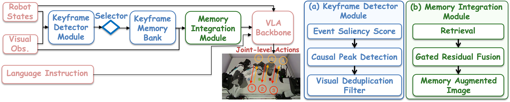
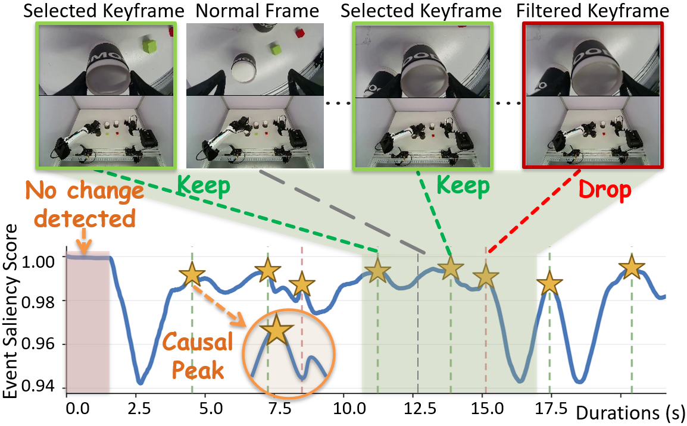
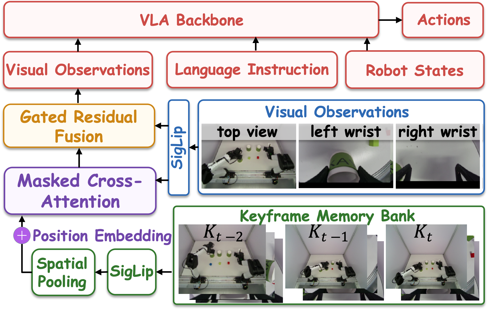

# KEMO 事件驱动关键帧记忆

长时程操作中，当前画面往往不足以确定下一步动作。机械臂面对相同的桌面布局时，可能尚未抓取目标，也可能已经完成放置并准备处理下一个物体。短时间视觉窗口会丢失较早的操作结果，完整保存视频历史又会让注意力开销随序列长度持续增长。KEMO 将已经发生的任务转换压缩成少量关键帧，使 VLA 在生成动作时同时读取当前观测、语言指令和按时间排列的事件记忆。设当前观测为多视角图像与机器人状态 $o_t=\{I_t,s_t\}$，动作块长度为 $H$，记忆库包含截至时刻 $t$ 已接收的关键帧 $\mathcal M_t$，策略写成

$$
\pi_\theta\!\left(a_{t:t+H}\mid o_t,\ell,\mathcal M_t\right).
$$

*图 1  KEMO 从机器人状态和视觉观测中选择事件关键帧，将有序记忆融合到 VLA 的当前图像特征中。图源为 Zeng 等的 KEMO。*

关键帧检测从机器人运动中的停顿开始。抓取、放置、覆盖和释放通常伴随末端减速，关节位置序列 $q_t$ 可以给出最近窗口内的平均位移和事件显著性

$$
\bar\delta_t=\frac{1}{w}\sum_{i=0}^{w-1}
\left\|q_{t-i}-q_{t-i-1}\right\|_2,
\qquad
S_t=\frac{1}{1+\bar\delta_t}.
$$

$S_t$ 的局部峰值构成候选事件。检测器等待一个很短的后续窗口确认峰值，因此整个过程保持因果，只使用已经到达的机器人状态。单纯依靠减速会把等待、微调和重复停顿都收入记忆。KEMO 随后用冻结的 DINOv2 比较候选帧 $I_{c_i}$ 与上一张已接收关键帧 $I_{k_{i-1}}$。令 $\phi(\cdot)$ 为视觉特征，二者的余弦距离为

$$
d_i=1-
\frac{\phi(I_{c_i})^\top\phi(I_{k_{i-1}})}
{\|\phi(I_{c_i})\|_2\,\|\phi(I_{k_{i-1}})\|_2}.
$$

只有 $d_i$ 超过视觉变化阈值时，候选帧才进入记忆库。相邻事件之间还保留一段抑制时间，避免一次抓取中的多次停顿产生重复记录。这套检测不依赖子任务标签，也不在线调用语言模型分解步骤。运动减速提供可能发生状态转换的时刻，视觉差异确认场景确实产生了可见变化。

*图 2  运动显著性的因果峰值给出候选时刻，视觉去重保留发生明显场景变化的关键帧。图源为 Zeng 等的 KEMO。*

记忆库只保留最近的 $K$ 个已接收事件，并维持它们的时间顺序。每张关键帧由基础策略原有的 SigLIP 视觉编码器生成 patch token，空间平均池化再把一帧压缩成少量记忆 token。未填满的槽位由最近关键帧补齐，同时用二值掩码阻止填充位置参与注意力。第 $j$ 个记忆槽加入可学习的时间位置向量 $p_j$，拼接后的记忆表示为

$$
M_t=\left[
P\!\left(E(I_{k_1})\right)+p_1;
\ldots;
P\!\left(E(I_{k_K})\right)+p_K
\right].
$$

当前图像 token $X_t$ 作为查询，记忆 token 作为键和值。掩码交叉注意力先从历史事件中检索与当前画面相关的信息，门控残差再决定每个通道需要写回多少记忆

$$
X_t^{m}=\operatorname{CrossAttn}(X_t,M_t;m),
\qquad
\widehat X_t=X_t+
\sigma\!\left(g([X_t;X_t^{m}])\right)\odot X_t^{m}.
$$

门控投影的初始偏置使记忆分支在训练开始时保持较小幅度，预训练 VLA 可以先沿用原有的当前帧表示，再逐步学习何时读取历史。融合后的 $\widehat X_t$ 直接替换基础策略中的图像 token，语言模型结构和输入前缀长度保持不变。记忆计算量由固定槽位数约束，历史轨迹继续增长时，注意力输入不会随原始帧数同步增长。

*图 3  关键帧经过共享视觉编码器和空间池化形成记忆，当前图像通过掩码交叉注意力检索历史，并由门控残差完成融合。图源为 Zeng 等的 KEMO。*

关键帧还参与训练样本加权。长任务的动作误差在阶段切换附近更容易影响后续步骤，因此 KEMO 使用同一组事件索引同时构造记忆和强调转换邻域。设单步动作块的流匹配损失为 $\ell_t$，时刻 $t$ 到最近关键帧的距离不超过窗口 $\Delta$ 时赋予权重 $\lambda$，训练目标为

$$
\mathcal L=
\frac{\sum_t w_t\ell_t}{\sum_t w_t},
\qquad
w_t=
\begin{cases}
\lambda, & \min_i|t-k_i|\le\Delta,\\
1, & \text{其他情况}.
\end{cases}
$$

推理时，每个控制周期先更新事件显著性，候选帧通过视觉筛选后写入记忆，随后当前观测查询这组关键帧并生成下一段动作。训练与推理共享同一套事件定义，记忆中的状态转换和损失中被强调的时间区域因而保持一致。论文在六项双臂长时程任务中比较了无记忆策略、均匀采样历史、最近帧历史和事件关键帧记忆。事件选择在任务成功率和阶段完成率上取得最高结果，消融实验同时显示门控融合与转换邻域加权分别提供增益。

**参考文献**

1. Y. Zeng, M. Ye, Y. Chen, Y. Shentu, P. Wu, Z. Yan, and Z. Li. [KEMO: Event-Driven Keyframe Memory for Long-Horizon Robot Manipulation with VLA Policies](https://arxiv.org/abs/2606.23589). arXiv, 2026.
