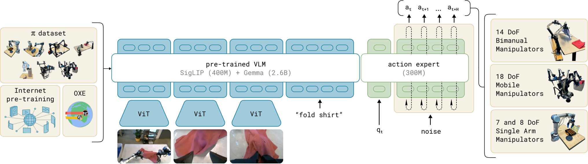

# WAM 中的观测、任务与动作对齐

世界动作模型接收相机、机器人状态和任务条件，同时生成未来动作与未来画面。模型结构通常从已经整理好的轨迹样本开始讲，因此最先需要确定的是每个训练样本在真实系统中的含义。设控制时刻为 $t$，多路相机图像为 $I_t^{1:V}$，关节位置、末端状态等本体观测为 $q_t$，语言指令或目标图像为 $g$，未来 $H$ 步动作构成动作块 $A_t$，未来 $K$ 帧图像构成视觉目标 $Y_t$。一个 WAM 样本可以写成

$$
\begin{aligned}
o_t &= \{I_t^{1:V},q_t\},\\
A_t &= \{a_t,\ldots,a_{t+H-1}\},\\
Y_t &= \{I_{t+1},\ldots,I_{t+K}\}.
\end{aligned}
$$

这里的下标必须来自传感和控制时间轴。相机时间戳表示曝光时刻，本体状态插值到对应时刻，动作 $a_t$ 表示随后一个控制区间内真正送给执行器的命令。设相机曝光时间为 $\tau_t^I$，采集、推理和传输延迟分别为 $\Delta_{cap}$、$\Delta_{net}$ 和 $\Delta_{tx}$，动作开始生效的时刻满足

$$
\begin{aligned}
\tau_t^a
&=\tau_t^I+\Delta_{cap}+\Delta_{net}+\Delta_{tx},\\
q_t&=\operatorname{interp}\!\left(q,\tau_t^I\right).
\end{aligned}
$$

按照文件序号拼接图像与动作会引入固定相位差，时间戳和延迟标定共同确定真正的监督关系。任务条件的时间尺度更长。整段任务共用一句指令时，$g$ 属于轨迹片段；长任务发生阶段切换时，应在切换点重新切分样本，使取物、移动和放置等局部动作获得对应的语义条件。

图像进入模型后被切成 patch token，多相机系统为每一路视角保留相机标识，并为历史帧加入时间位置。关节角、关节速度、夹爪状态和底盘状态组成固定次序的向量，经归一化和线性投影得到本体 token。把任务、图像和本体状态写进同一条 Transformer 序列时，可以表示为

$$
\begin{aligned}
z_g &= E_g(g)+m_g,\\
z_I^v &= E_I(I_t^v)+m_I+c_v+p_t,\\
z_q &= E_q(\mathcal N_e(q_t))+m_q+e_e,\\
Z_t &= [z_g,\{z_I^v\}_{v=1}^{V},z_q].
\end{aligned}
$$

$E_g$、$E_I$ 和 $E_q$ 是各模态编码器，$m$ 表示模态身份，$c_v$ 表示相机视角，$p_t$ 表示时间位置，$e_e$ 表示机器人类型，$\mathcal N_e$ 保存对应机器人的归一化规则。$π_0$ 将图像与状态投影到语言 token 所在的特征空间，连续动作交给独立的 action expert。Octo 则以输入适配器处理语言、目标图像和观测历史，再由块状注意力控制不同 token 的读取关系。共同特征宽度建立注意力接口，附加编码和掩码继续保留每种数据的来源与时刻。

*图 1  π0 将多视角图像和语言送入预训练视觉语言主干，本体状态与带噪动作进入动作专家，两组 token 在注意力层中交换信息。图源为 Black 等的 π0。*

本体状态的向量顺序需要在数据层固定下来。不同机器人即使都提供七维动作，也可能分别表示关节位置、关节增量或末端位姿增量。末端平移依赖基坐标系或工具坐标系，旋转可以使用欧拉角、轴角或四元数，夹爪通道也可能表示宽度、速度或开合指令。每个 embodiment 因而需要独立的状态与动作 schema，记录单位、坐标系、控制频率和有效维度。若 $d_e$ 是机器人 $e$ 的有效动作维数，$M_e$ 是维度掩码，送入模型的动作块为

$$
\widetilde A_t=M_e\odot\mathcal N_e(A_t),
\qquad
(M_e)_j=\mathbf 1[j\le d_e].
$$

缺失维度由掩码隔离，归一化统计只由训练集计算，机器人类型通过 $e_e$ 或独立适配器进入模型。主干参数可以共享，执行器语义仍由 schema 和反归一化过程保持稳定。

语义任务 $g$ 决定模型应该让哪一种未来发生。语言指令沿用 VLM 的 tokenizer 和文本编码器，目标图像沿用视觉编码器并加入 goal 类型标识。Octo 因而可以在同一主干中接收语言指令或目标图像。RT-2 进一步把机器人动作表示成文本 token，使视觉问答样本与机器人轨迹能够使用相同的自回归输出格式联合训练。语言 token 提供物体类别、空间关系和任务意图，观测 token 给出当前场景，动作监督把这些语义落到执行器命令。若一条指令包含多个阶段，数据标注需要让当前观测足以判断阶段进度，或显式加入历史观测与已完成子任务。只重复输入整句指令而缺少阶段信息，会让相同语义条件对应多组相互冲突的局部动作。

动作的编码方式取决于输出模型。RT-2 一类自回归 VLA 对每个动作维度量化，再用离散 token 表示控制命令。逐时刻、逐维度量化会把高频动作块展开成很长的序列。FAST 先沿时间维对归一化动作块做离散余弦变换 $C=\operatorname{DCT}(\widetilde A_t)$，再量化并压缩频域系数。$π_0$ 保留连续动作，在流匹配时把真实动作块与高斯噪声连接为

$$
A_t^{\tau}=\tau\widetilde A_t+(1-\tau)\epsilon,
\qquad
\epsilon\sim\mathcal N(0,I),
$$

并学习条件向量场 $v_\theta(A_t^{\tau},o_t,g,e)$，推理时从噪声出发积分得到整段动作。离散 token 复用语言模型的交叉熵训练与自回归解码，连续 action expert 保留控制量的细粒度，并行生成动作块。

WAM 在这套接口上加入未来视觉变量，直接学习联合条件分布

$$
\begin{aligned}
\mathcal P_t
&=p_\theta(Y_t,A_t\mid o_{\le t},g,e),\\
\mathcal L_{WAM}
&=\lambda_Y\mathcal L_{video}
+\lambda_A\mathcal L_{action}.
\end{aligned}
$$

确定性与不确定性在这条条件分布中处于不同位置。一次推理已经取得的观测历史 $o_{\le t}$、任务条件 $g$ 和机器人类型 $e$ 是本轮生成的已知条件，经过编码器与注意力后形成上下文 $c_t$。未来视频和动作仍包含遮挡后的物体状态、接触结果、执行误差以及多种可行操作方式，因此生成器还接收随机变量 $\xi$。

$$
\begin{aligned}
c_t &= F_\theta(o_{\le t},g,e),\\
(Y_t,A_t) &= G_\theta(c_t,\xi),
\qquad \xi\sim p(\xi).
\end{aligned}
$$

观测中的确定性来自已经发生的像素值、关节读数和历史顺序，它们在一次前向过程中形成固定输入。传感噪声、遮挡和部分可观测性仍会让同一组输入对应多个真实状态。采用 RSSM 时，这种区别会被显式写成确定性记忆 $h_t$ 与随机潜变量 $z_t$，其中循环状态保存历史，观测后验描述当前隐状态的可能分布。

$$
\begin{aligned}
h_t &= f(h_{t-1},z_{t-1},a_{t-1}),\\
z_t &\sim q_\phi(z_t\mid h_t,o_t).
\end{aligned}
$$

视频扩散式 WAM 通常不再单独维护这对状态。历史 token 与缓存承担确定性记忆，扩散或流匹配的初始噪声承担多样化采样，随机性由生成过程传播到未来画面和动作。它能够表示多模态未来，但采样分散程度不直接等于经过标定的传感器置信度或分布外不确定性。

任务条件通常以确定的 token 序列进入模型。同一句整理桌面可以对应不同的抓取顺序和运动轨迹，歧义由 $p_\theta(Y_t,A_t\mid c_t)$ 中的多个可行未来表达。若系统在上层额外预测子任务 $u_t$，任务不确定性才会显式成为分布 $p(u_t\mid o_{\le t},g)$。动作记录也遵循相同区分。数据集中的 $A_t$ 是一次已经执行的确定样本，策略学习的是条件动作分布。离散 VLA 用分类概率表示候选动作 token，流匹配模型从随机初值积分出连续动作块。

$$
\begin{aligned}
p(a_{t,j}=b\mid c_t)
&=\operatorname{softmax}(\ell_{t,j})_b,\\
A_t^0 &\sim\mathcal N(0,I),\\
\frac{dA_t^\tau}{d\tau}
&=v_\theta(A_t^\tau,c_t).
\end{aligned}
$$

部署时，模型从分布中选出一个动作块并转换为确定的执行器命令。执行后的真实观测重新进入 $c_{t+1}$，此前关于接触、物体运动和控制误差的不确定性随之被新证据修正。闭环更新把长时间开放式预测改成反复进行的条件预测与状态校正，因此观测负责收缩不确定性，任务约束可接受的未来，动作分布保留多种实现路径，最终下发的控制量则是确定值。

DreamZero 以预训练视频扩散模型为主干，为机器人状态和动作增加编码器与解码器，并在同一个自回归时序模型中联合去噪未来视频块和动作块。历史画面、语言条件与本体状态构成干净上下文，视频块和动作块共享时间索引参与预测。动作执行后，真实相机观测替换缓存中的预测画面，下一次动作块从新的真实状态继续生成。视觉监督表达物体与机器人随时间的变化，动作监督把这种变化连接到执行器命令，两者通过共享上下文和注意力交互形成对应关系。

*图 2  DreamZero 以视频、语言和本体状态为条件，同时生成未来视频与连续动作，并利用不同机器人和人类视频扩展视觉经验。图源为 Ye 等的 DreamZero。*

因此，编码对齐发生在数据进入 Transformer 之前，也持续存在于模型内部。数据层把曝光、本体状态、执行器命令和任务片段放回同一时间轴。接口层统一坐标系、单位、控制频率与有效维度。表示层用各自编码器把不同模态投影到共同特征宽度，再以模态、视角和时间标识区分来源。训练层让动作块与其引起的视觉未来共享条件并接受各自监督。任何一层出现错位，网络都可能在训练损失正常下降的同时学到错误的控制语义。

落到数据管线时，一条轨迹应同时保存原始时间戳、相机内外参、机器人状态 schema、动作 schema、任务片段边界和 embodiment 标识。图像保持原始采样时刻，本体状态按时间插值，动作按照实际生效区间切块，缺失相机或动作维度由 mask 标出。训练样本生成后还需要回放检查，让 $I_t$、$A_t$ 与 $I_{t+1}$ 按时间顺序可视化，并把动作反归一化到真实单位。这样的检查能在训练开始前发现符号反向、坐标系混用、夹爪定义冲突和固定延迟，也让后续更换动作 tokenizer、VLM 主干或视频模型时仍沿用同一份具身数据语义。

**参考文献**

1. D. Hafner et al. [Learning Latent Dynamics for Planning from Pixels](https://arxiv.org/abs/1811.04551). 2019.
2. A. Brohan et al. [RT-1: Robotics Transformer for Real-World Control at Scale](https://arxiv.org/abs/2212.06817). 2022.
3. A. Brohan et al. [RT-2: Vision-Language-Action Models Transfer Web Knowledge to Robotic Control](https://arxiv.org/abs/2307.15818). 2023.
4. Octo Model Team et al. [Octo: An Open-Source Generalist Robot Policy](https://arxiv.org/abs/2405.12213). 2024.
5. K. Black et al. [$\pi_0$: A Vision-Language-Action Flow Model for General Robot Control](https://arxiv.org/abs/2410.24164). 2024.
6. K. Pertsch et al. [FAST: Efficient Action Tokenization for Vision-Language-Action Models](https://arxiv.org/abs/2501.09747). 2025.
7. S. Ye et al. [World Action Models are Zero-shot Policies](https://arxiv.org/abs/2602.15922). 2026.
