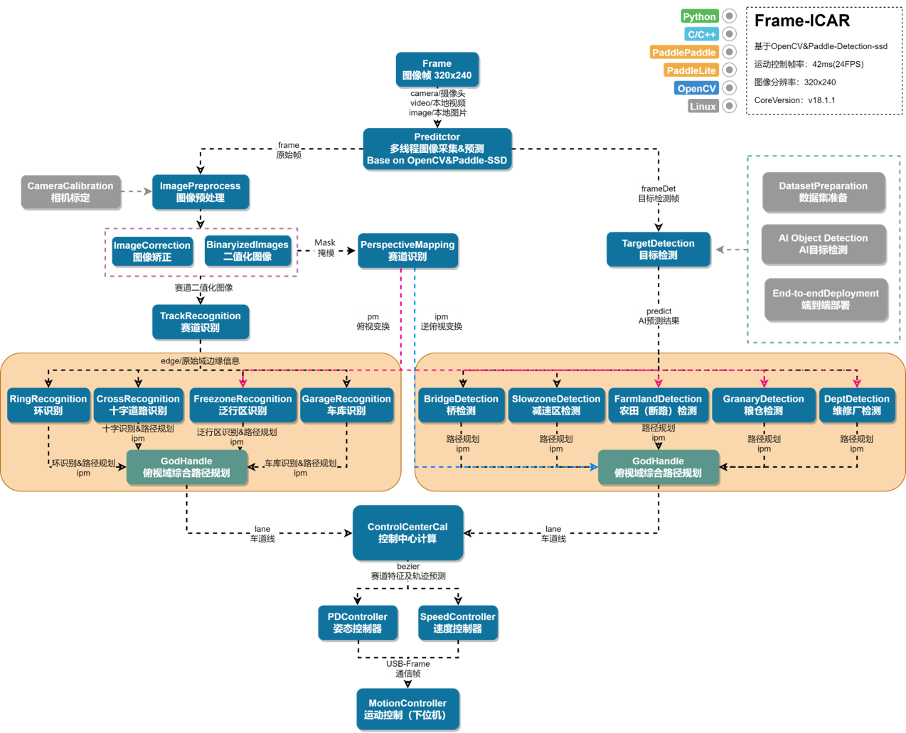

# C++多线程技术在大学生智能汽车竞赛中的应用与优化

> [p-xiexin/icar-pd](https://github.com/p-xiexin/icar-pd)
>
> [第十八届全国大学生智能汽车竞赛完全模型组 - 武汉理工大学花海队相关工作](https://github.com/coollingomg/The-18th-Smart-Car-Competition-complete-model-group)

## 多线程技术概述

多线程编程是现代计算机程序设计中的重要技术之一，它允许程序同时执行多个任务，充分利用多核处理器的性能优势。在全国大学生智能汽车竞赛这样对实时性要求较高的应用场景中，多线程技术显得尤为重要。通过合理的线程设计，我们可以实现图像采集、AI推理、车道线识别、串口通信等多个任务的并行处理，有效提升竞赛车辆的控制精度和响应速度。

自C++11标准引入以来，C++在语言层面提供了对多线程编程的原生支持。相比于传统的pthread或Windows线程API，C++11标准库提供了更加简洁、安全且跨平台的多线程编程接口。这些标准化的接口不仅降低了多线程编程的复杂度，还提供了更好的类型安全保障和异常处理机制。

C++标准库中的多线程支持主要包含在`<thread>`、`<mutex>`、`<condition_variable>`、`<atomic>`、`<future>`等头文件中。这些头文件提供了线程创建与管理、同步机制、原子操作、异步任务处理等完整的多线程编程工具链，能够满足绝大多数应用场景的需求。

## C++多线程核心类介绍

### std::thread类

`std::thread`是C++11引入的核心线程类，它提供了创建和管理线程的基本功能。该类的构造函数可以接受各种可调用对象（函数指针、函数对象、Lambda表达式等）作为线程执行的入口点。创建线程后，我们可以通过`join()`方法等待线程执行完毕，或通过`detach()`方法将线程分离，使其在后台独立运行。

线程的生命周期管理是多线程编程中的重要环节。一个`std::thread`对象必须在其析构前调用`join()`或`detach()`，否则程序会调用`std::terminate()`导致异常终止。这种设计确保了程序员必须明确处理每个线程的生命周期，避免了资源泄露和未定义行为。

### std::mutex类族

互斥量（Mutex）是多线程编程中最基础的同步原语，用于保护共享资源免受并发访问的影响。C++标准库提供了多种互斥量类型，包括`std::mutex`、`std::recursive_mutex`、`std::shared_mutex`等，以适应不同的应用场景。

`std::mutex`是最基本的互斥量类型，提供了独占访问机制。当一个线程获得互斥量的锁定后，其他线程必须等待直到该锁被释放。`std::recursive_mutex`允许同一线程多次锁定同一个互斥量，这在递归函数或复杂的函数调用链中非常有用。`std::shared_mutex`支持共享锁定模式，允许多个线程同时进行读访问，但写访问仍然是独占的。

### std::lock_guard和std::unique_lock

直接操作互斥量容易导致死锁或忘记释放锁等问题，因此C++标准库提供了RAII（资源获取即初始化）风格的锁管理类。`std::lock_guard`是最简单的锁管理器，它在构造时自动获取锁，在析构时自动释放锁，确保了异常安全性。

`std::unique_lock`提供了更高级的锁管理功能，支持延迟锁定、条件锁定、超时锁定等特性。它还可以与条件变量配合使用，实现更复杂的同步模式。虽然`std::unique_lock`的开销略高于`std::lock_guard`，但其灵活性使其在复杂的同步场景中不可替代。

### std::condition_variable

条件变量是一种高级同步机制，允许线程等待某个条件成立。它通常与互斥量配合使用，实现线程间的通信和协调。当条件不满足时，线程可以调用`wait()`方法进入睡眠状态；当条件发生变化时，其他线程可以调用`notify_one()`或`notify_all()`方法唤醒等待的线程。

条件变量解决了忙等待（busy waiting）的问题，避免了CPU资源的浪费。在生产者-消费者模式、线程池、事件驱动等场景中，条件变量都发挥着重要作用。需要注意的是，条件变量可能出现虚假唤醒（spurious wakeup），因此通常需要在循环中检查条件是否真正满足。

## 大学生智能汽车竞赛中的多线程应用实例

第十八届全国大学生智能汽车竞赛百度完全模型组竞速赛以“智慧农业”为主题，设置了兼具挑战性与创新性的任务赛道。比赛分为线上与线下两个阶段，线上阶段主要在百度飞桨平台完成目标检测模型训练与优化，线下阶段则将模型成果应用于实体赛道中的自动驾驶小车控制。

线下赛场采用室内封闭式循环赛道，沿途布置了多种三维农业场景元素，例如车辆维护站、农田、动物出没区、坡道以及粮仓等。这些元素通过统一标准的标志牌进行提示，要求参赛车模在自主行驶过程中，实时识别标志并做出相应动作，如减速、变道、进入指定区域完成任务等。赛道不仅包含平整路面，还融合了锥桶路径、坡道等特殊路段，对车模的感知、决策与控制能力提出了综合要求。

该赛题的核心挑战在于——如何在复杂多变的赛道环境中，保证目标识别的准确性与响应速度，并在有限时间内完成全部任务。这既考验了参赛团队在计算机视觉与深度学习方面的能力，也需要对路径规划、运动控制等算法进行充分优化。我的算法正是围绕这一目标展开设计，旨在在保持高精度感知的同时，实现稳定高效的任务执行。

### 传统架构的局限性

在早期的竞赛作品中，许多团队采用单线程架构来处理所有任务。这种设计方式虽然实现简单，但存在明显的性能瓶颈。在单线程模式下，图像采集、图像处理、AI推理、车道线识别、控制决策等任务必须串行执行，整个系统的处理频率受到最慢环节的制约。

特别是当引入深度学习目标检测算法后，AI推理往往成为最耗时的环节。即使车道线识别等基础视觉处理能够达到很高的帧率，整个控制循环的频率仍然被AI推理的处理速度所限制，导致车辆控制的实时性严重下降，在高速行驶或复杂赛道场景下容易出现控制滞后的问题。



为了解决单线程的效率问题，百度赛方提供的一个baseline采用了一个简单的多线程方案，将AI推理放在独立的线程中执行。然而，这种设计仍然存在关键缺陷：主控制线程依然需要等待AI推理结果才能做出最终的控制决策。

在这种架构下，虽然AI推理不再阻塞图像采集，但控制频率仍然受到AI线程处理速度的制约。当AI推理线程处理速度较慢时，整个系统的控制响应频率就会下降，出现典型的"短板效应"。这在竞赛中是致命的，因为高频的控制响应是保证车辆稳定行驶的关键因素。

### 图像采集线程的高效实现

`CaptureInterface`类实现了专门的图像采集线程。该线程持续从摄像头设备读取图像帧，并通过条件变量机制与主线程进行同步。在`run()`方法中，我们可以看到典型的生产者模式实现：

```cpp
_thread = std::make_unique<std::thread>([this](){
    while(_loop)
    {
        std::shared_ptr<cv::Mat> frame = std::make_shared<cv::Mat>(Size(COLSIMAGE, ROWSIMAGE), CV_8UC3);
        *_cap >> *frame;
        if(frame->empty())
        {
            std::cout << "faild to capture frame" << std::endl;
            break;
        }
        std::unique_lock<std::mutex> lock(_mutex);
        _frame = frame;
        cond_.notify_all();
    }
});
```

这种设计确保了图像采集的连续性，为后续的并行处理提供稳定的数据源。即使某个处理线程出现短暂延迟，图像采集线程仍能独立运行，避免丢帧现象影响竞赛成绩。通过智能指针管理图像内存，系统能够安全地向多个处理线程分发图像数据，支持车道线识别和AI推理的并行处理。

### 高频串口通信线程

`SerialInterface`类管理着与底层舵机和电机的串口通信。在竞赛中，控制指令的及时传达直接影响车辆的行驶稳定性，因此串口通信被设计为独立的高频线程：

```cpp
_thread_send = std::make_unique<std::thread>([this]{
    _driver->carControl(0, 1500);
    while(_loop)
    {
        if(_sound)
        {
            _driver->buzzerSound(_sound);
            _sound = 0;
        }
        _driver->carControl(_speed, _servo_pwm);
        std::this_thread::sleep_for(std::chrono::milliseconds(5));
    }
});
```

5毫秒的发送间隔（200Hz频率）确保了控制指令的高频传输，这个频率远高于AI推理的处理频率，体现了分离式设计的优势。即使AI推理以10-20Hz的频率运行，车辆的基础控制仍能以200Hz的频率执行，大大提升了竞赛车辆的控制精度和稳定性。

### 主线程的双模式控制策略

**异步模式（默认状态）**：在这种模式下，主线程完全专注于基础的车道线识别和路径规划，不与AI线程进行任何同步等待操作：

```cpp
// 异步模式：基础控制全速运行
Mat frame = captureInterface.get_frame();
detection.setFrame(frame);  // 仅传递图像给AI线程，不等待结果

// 车道线识别和控制决策以最高频率执行
trackRecognition.trackRecognition(imageBinary, 0);
controlCenterCal.controlCenterCal(trackRecognition);
motionController.Angle_Controller(controlCenterCal, trackRecognition, roadType);

// 立即发送控制指令，不受AI线程影响
serialInterface.set_control(-motionController.motorSpeed, motionController.servoPwm);
```

在异步模式下，主线程的处理频率完全取决于车道线识别算法的速度，通常可以达到50-100Hz。AI线程在后台独立运行，即使出现处理延迟也不会影响基础控制的执行频率。

**同步模式（特殊任务状态）**：当检测到特殊竞赛元素时，主线程会切换到同步模式，开始与AI线程进行结果同步：

```cpp
// 检查是否进入特殊任务状态
if (depotDetection.depotDetection(trackRecognition, imgaeCorrect)) {
    if (roadType == RoadType::BaseHandle) {
        serialInterface.buzzerSound(1);  // 蜂鸣器提醒
    }
    roadType = RoadType::DepotHandle;    // 切换到特殊处理模式
    
    // 同步模式：获取AI线程的最新处理结果
    std::shared_ptr<DetectionResult> ai_results = detection.getLastFrame();
    
    // 基于AI结果调整控制策略
    motionController.motorSpeed = depotDetection.get_speed();
} else {
    // 返回异步模式
    if(roadType != RoadType::BaseHandle) {
        roadType = RoadType::BaseHandle;
        AI_enable = false;  // 关闭AI同步
    }
}
```

这种双模式设计的核心在于：系统在绝大部分时间里以最高效率运行基础控制，只有在确实需要AI能力时才付出同步的代价。这样既保证了基础性能，又不浪费AI的感知能力。

### 协同机制的性能优化

整个协同机制还包含了多项性能优化措施：

**条件变量的高效使用**：AI线程使用带超时的条件变量等待，避免无限期阻塞：

```cpp
while (_frame == nullptr) {
    if (cond_.wait_for(lock, std::chrono::seconds(1)) == std::cv_status::timeout) {
        std::cout << "ai wait for frame time out" << std::endl;
        break;  // 超时则跳出，保证线程活性
    }
}
```

**智能的数据流控制**：图像数据通过智能指针安全传递，避免多余的内存拷贝：

```cpp
std::shared_ptr<cv::Mat> frame = std::make_shared<cv::Mat>(Size(COLSIMAGE, ROWSIMAGE), CV_8UC3);
// ... 图像采集 ...
std::unique_lock<std::mutex> lock(_mutex);
_frame = frame;  // 智能指针赋值，高效且安全
cond_.notify_all();
```

**结果缓存机制**：AI线程的检测结果会被缓存，主线程可以在需要时快速获取最新结果，避免重复等待。

## 竞赛中多线程设计的实际效果

在大学生智能汽车竞赛的实际测试中，这种创新的分离式多线程设计展现出了显著的性能优势。相比于传统的单线程或耦合式多线程方案，该设计在以下方面表现突出：

**控制频率的显著提升**：车道线识别和基础控制的处理频率不再受AI推理速度限制，能够达到50-100Hz的高频控制，大幅提升了车辆在高速行驶时的稳定性。

**系统鲁棒性的增强**：即使AI推理线程因为复杂场景而出现处理延迟，基础控制循环仍能正常运行，避免了因AI处理异常而导致的车辆失控风险。

**资源利用效率的优化**：多核处理器的计算能力得到充分利用，车道线识别、AI推理、图像采集等任务真正实现了并行处理，系统整体吞吐量显著提升。

然而，这种设计也带来了新的挑战。线程间的同步协调变得更加复杂，需要仔细处理不同数据源的时间戳对齐问题。同时，调试和测试的难度也有所增加，需要开发专门的多线程调试工具和测试方法。在竞赛准备过程中，我们投入了大量时间来优化线程间的协作机制和异常处理逻辑。

