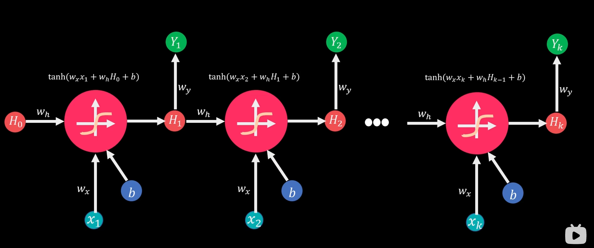

## 循环神经网络（RNN）

[史上最详细循环神经网络讲解（RNN/LSTM/GRU） - 知乎 (zhihu.com)](https://zhuanlan.zhihu.com/p/123211148)

[[数之道 09]揭开循环神经网络RNN模型的面纱](https://www.bilibili.com/video/BV1YK411F7Tg?vd_source=eac89beacf4b5ecfa9a66e7ebc9bd301)

序列数据需要考虑其本身的顺序性，例如天气、股价、语言文本等。MLP（多层感知器）和CNN（卷积神经网络）在设计上并不专门针对序列数据，而是更适用于处理结构化数据（例如特征向量）或具有空间结构的数据（例如图像）：

1. **参数共享**：
   - MLP中的每个神经元与上一层的所有神经元连接，每个连接都有自己的权重。这意味着在处理序列数据时，模型的参数数量会随着序列长度的增加而大幅增加，容易导致过拟合。
   - CNN中的卷积操作采用参数共享的方式，即卷积核在图像的不同位置使用相同的权重。这种参数共享的机制使得CNN能够有效地提取图像中的局部特征，但在序列数据中，通常没有明显的局部结构可供参数共享。
2. **固定输入大小**：
   - MLP和CNN通常期望输入数据具有固定的大小和形状。而对于序列数据，例如文本或时间序列，其长度可以变化，并且不具有固定的空间结构，这使得直接应用MLP和CNN变得困难。

虽然MLP和CNN在原理上可以用于处理序列数据，但它们并不是最优选择。相比之下，循环神经网络（RNN）和其变种（如长短期记忆网络 LSTM 和门控循环单元 GRU）更适合处理序列数据。RNN具有循环连接，能够处理变长序列数据，并且能够在序列中捕获长期依赖关系，因此在文本处理、时间序列分析等领域广泛应用。

RNN在每期计算中会同时考虑当期输入值和前期状态值，并利用相同的模型架构循环下去。除了前面的语言分析领域外，在金融领域可以利用RNN对股票、原油价格等时间序列数据进行分析、预测；在视觉处理方面可以将CNN模型与RNN模型相结合，对静态物体进行识别，再生成该图片所展示动态内容的描述。

### 简单RNN模型

其中，

- $x_{t}$是输入层的输入；
- $h_{t}$是隐藏层的输出，其中$h_{0}$是计算第一个隐藏层所需要的，通常初始化为全零；
- $y_{t}$是输出层的输出

下面是RNN模型的计算步骤：

1. **初始化隐藏状态**：首先，将初始隐藏状态$h_{0}$设为零向量或随机向量。

2. **逐步处理序列**：对于序列中的每个时间步$t$，执行以下步骤：

   a. **计算隐藏状态**：根据当前时间步的输入$x_{t}$和上一个时间步的隐藏状态$h_{t-1}$，计算当前时间步的隐藏状态$h_{t}$：
   $$
   h_{t} = f(W_{hx}x_{t} + W_{hh}h_{t-1} + b_{h})
   $$
   其中，$W_{hx}$是输入到隐藏状态的权重矩阵，$W_{hh}$是隐藏状态到隐藏状态的权重矩阵，$b_{h}$是隐藏状态的偏置向量，$f$是激活函数，通常为sigmoid函数或tanh函数。

   b. **计算输出**：根据当前时间步的隐藏状态$h_{t}$，计算当前时间步的输出$y_{t}$：
   $$
   y_{t} = g(W_{hy}h_{t} + b_{y})
   $$
   其中，$W_{hy}$是隐藏状态到输出的权重矩阵，$b_{y}$是输出的偏置向量，$g$是输出层的激活函数，通常为softmax函数（用于分类任务）或恒等函数（用于回归任务）。

3. **重复步骤2直至处理完整个序列**。

RNN模型的核心在于隐藏状态$h_{t}$的递归计算，它能够保留序列中之前时间步的信息，并在当前时间步使用这些信息来预测输出。这使得RNN模型能够有效地处理变长序列数据，并捕获序列中的时间依赖关系。

其中，$h_{t}$表示隐藏状态，$x_{t}$表示输入，$y_{t}$表示输出，$W_{hx}$、$W_{hh}$、$W_{hy}$分别表示输入到隐藏状态、隐藏状态到隐藏状态、隐藏状态到输出的权重矩阵，$b_{h}$和$b_{y}$分别表示隐藏状态和输出的偏置向量，$f$和$g$分别表示激活函数。

$$
\begin{aligned}
&\Delta W=-\eta\frac{\partial S}{\partial Y_{predict}}*\frac{\partial Y_{predict}}{\partial H_{k}}*\boxed{\frac{\partial H_{k}}{\partial H_{k-1}}*\frac{\partial H_{k-1}}{\partial H_{k-2}}*......*\frac{\partial H_{2}}{\partial H_{1}}}*\frac{\partial H_{1}}{\partial W} \\
&\Delta b = -\eta \frac{\partial S}{\partial Y_{\text{predict}}} * \frac{\partial Y_{\text{predict}}}{\partial H_{k}} * \frac{\partial H_{k}}{\partial b} \\
&\frac{\partial H_{k}}{\partial H_{k-1}}=\mathrm{tanh}^{\prime}(w_{x}x_{k}+w_{h}H_{k-1}+b)*w_{h}
\end{aligned}
$$
其中，$\eta$表示学习率，$S$表示损失函数，$Y_{\text{predict}}$表示预测值，$H_{k}$表示隐藏状态，$W$表示权重，$x_{k}$表示输入，$w_{x}$和$w_{h}$分别表示输入到隐藏状态和隐藏状态到隐藏状态的权重，$b$表示偏置，$\text{tanh}'$​​表示tanh函数的导数。

RNN结构可以是下列不同的组合：

在进行模型训练的过程中，可以使用反向传播的方法对参数进行调整，对RNN来说称为BPTT，可以通过梯度下降和链式法则计算出每次权重调整的大小。同时RNN也会陷入与深度神经网络相同的问题中——梯度消失、梯度爆炸。

1. **梯度消失**：
   - 当RNN处理长序列数据时，反向传播过程中梯度会通过时间步长链式传播回隐藏状态和输入，而梯度会被激活函数（如tanh函数）和权重矩阵（如权重矩阵的特征值小于1）所缩放。
   - 如果梯度在传播过程中持续缩小（小于1），则会导致梯度消失，即梯度变得非常接近于零。这会使得在训练过程中，网络无法有效地学习到长期依赖关系。
2. **梯度爆炸**：
   - 反之，如果梯度在传播过程中持续增大（大于1），则会导致梯度爆炸，即梯度变得非常大。这会导致参数更新过大，损害模型的稳定性和性能。

为了缓解梯度消失和梯度爆炸问题，可以采取以下策略：

- 使用梯度裁剪（gradient clipping）：限制梯度的大小，防止梯度爆炸。
- 使用更复杂的RNN结构，如长短期记忆网络（LSTM）和门控循环单元（GRU），它们具有更好地捕捉长期依赖关系的能力。
- 使用其他优化算法，如自适应学习率算法（如Adam）。
- 缩短序列长度，以减少梯度传播过程中的时间步数。

### 长短时记忆网络（LSTM）

[Pytorch_lstm详细讲解_pytorch lstm-CSDN博客](https://blog.csdn.net/weixin_43332715/article/details/121913800)

**RNN**的特殊性在于，它的权重是共享的。抛开W_o不谈，因为它在某时刻的梯度不会出现问题（某时刻并不依赖于前面的时刻），但是W_s和W_x就不一样了，每一时刻都由前面所有时刻共同决定，是一个相加的过程，这样的话就有个问题，当距离长了，计算最前面的导数时，最前面的导数就会消失或爆炸，但当前时刻整体的梯度并不会消失，因为它是求和的过程，当下的梯度总会在，只是前面的梯度没了，但是更新时，由于权值共享，所以整体的梯度还是会更新，**通常人们所说的梯度消失就是指的这个，指的是当下梯度更新时，用不到前面的信息了，因为距离长了，前面的梯度就会消失，也就是没有前面的信息了，但要知道，整体的梯度并不会消失，因为当下的梯度还在，并没有消失。**

**一句话概括：**RNN的梯度不会消失，RNN的梯度消失指的是当下梯度用不到前面的梯度了，但DNN靠近输入的权重的梯度是真的会消失。

**LSTM（Long Short-Term Memory，长短期记忆**）是一种用于处理序列数据的深度学习模型，特别适用于解决传统循环神经网络（RNN）中的梯度消失和梯度爆炸等问题。它由德国学者Hochreiter和Schmidhuber于1997年提出，并在之后的发展中被广泛应用于各种序列建模任务，如语言建模、机器翻译、语音识别等。

LSTM的核心思想是引入了一个称为**记忆单元（Memory Cell）**的结构，该单元可以在长序列中保持信息，并通过门控机制来控制信息的流动和保持，有选择性的存储信息。

Sigmoid函数可以返回[0,1]区间的值，tanh可以返回[-1,1]区间的值，因此Sigmoid函数可以作为闸门来控制信息流出的比例，而tanh能够控制信息的增减方向。LSTM增加了记忆状态C这一元素，本期记忆状态$C_t$由上期状态值$C_{t-1}$通过遗忘门过滤到本期的部分，加上本期新增的部分决定。 

下面是三个门控单元的公式，以及细胞状态和隐藏状态的更新公式：

1. **输入门（Input Gate）**：输入门决定了新信息如何流入细胞状态。它根据当前输入和先前隐藏状态来决定更新哪些信息。

$$
  i_t = \sigma(W_{xi}x_t + W_{hi}h_{t-1} + b_i)
$$

其中：

- $i_t$ 是输入门的输出，表示有多少新的信息应该被加入到细胞状态中。
- $x_t$是当前时间步的输入特征。
- $h_{t-1}$是上一个时间步的隐藏状态。
- $W_{xi}$ 和$W_{hi}$是输入特征和上一个时间步隐藏状态的权重矩阵。
- $b_i$是输入门的偏置项。
- $\sigma$ 是 Sigmoid 函数，将输入的加权和压缩到[0, 1]的范围内。

2. **遗忘门（Forget Gate）**：遗忘门决定了细胞状态中哪些信息需要被遗忘。它根据当前输入和先前隐藏状态来决定遗忘哪些信息。

$$
  f_t = \sigma(W_{xf}x_t + W_{hf}h_{t-1} + b_f)
$$

其中：

- $f_t$ 是遗忘门的输出，表示前一个时间步的细胞状态中有多少信息应该被保留。
- $W_{xf}$ 和 $W_{hf}$ 是输入特征和上一个时间步隐藏状态的权重矩阵。
- $b_f$ 是遗忘门的偏置项。

3. **输出门（Output Gate）**：输出门决定了从细胞状态到隐藏状态的信息流。它根据当前输入和先前隐藏状态来决定输出哪些信息。

$$
  o_t = \sigma(W_{xo}x_t + W_{ho}h_{t-1} + b_o)
$$

  其中：

- $o_t$ 是输出门的输出，表示在当前时间步细胞状态中的哪些部分会被输出到隐藏状态中。
- $W_{xo}$ 和 $W_{ho}$ 是输入特征和上一个时间步隐藏状态的权重矩阵。
- $b_o$ 是输出门的偏置项。

4. **细胞状态更新（Cell State Update）**：

$$
  C_t = f_t \odot C_{t-1} + i_t \odot u_t \\
  u_t = \text{tanh}(W_{xc}x_t + W_{hc}h_{t-1} + b_c)
$$

其中：

- $C_t$ 是当前时间步的细胞状态。
- $\odot$ 表示逐元素相乘。
- $W_{xc}$ 和 $W_{hc}$ 是输入特征和上一个时间步隐藏状态的权重矩阵。
- $b_c$ 是细胞状态的偏置项。
- $\text{tanh}$ 是双曲正切函数，用于生成候选细胞状态，将其压缩到[-1, 1]的范围内。
- 总之，遗忘门输出的$f_t$(Sigmoid)把控着更新信息的比例，tanh函数控制着大小和方向。

5. **隐藏状态更新（Hidden State Update）**：

$$
  h_t = o_t \odot \text{tanh}(C_t)
$$

其中：

- $h_t$ 是当前时间步的隐藏状态。

这些公式描述了 LSTM 中门控机制的计算过程，以及如何更新细胞状态和隐藏状态。通过这些公式，LSTM 能够有选择地更新和保留信息，从而更好地捕捉长期依赖关系。

***问：LSTM模型如何有效缓解梯度消失和梯度爆炸？***

核心是判断$C_t$对$C_{t-1}$导数的乘积部分和简单RNN模型相比是否更容易产生梯度消失、爆炸。
$$
\Delta W = -\eta \frac{\partial s}{\partial V_{\text{predict}}} * \frac{\partial Y_{\text{predict}}}{\partial H_{k}} * \frac{\partial H_{k}}{\partial c_{k}} * \boxed{\frac{\partial c_{k}}{\partial c_{k-1}} * \frac{\partial c_{k-1}}{\partial c_{k-2}} * \ldots * \frac{\partial c_{2}}{\partial c_{1}}} * \frac{\partial c_{1}}{\partial W} \\
\begin{aligned}
& c_k = c_{k-1}^*f_k + u_t^*i_t \\ \\
& \frac{\partial c_{k}}{\partial c_{k-1}} = \frac{\partial f_{k}}{\partial c_{k-1}}*c_{k-1} + f_{k} + \frac{\partial i_{k}}{\partial c_{k-1}}*u_{k} + \frac{\partial u_{k}}{\partial c_{k-1}}*i_{k} = \\
& \sigma^{\prime}(w_f*[H_{k-1},x_k])*w_f*o_{k-1}*tanh^{\prime}(c_{k-1})*c_{k-1} \\
& + f_k \\
& + \sigma^{\prime}(w_{u}*[H_{k-1},x_{k}])*w_{u}*o_{k-1}*tanh^{\prime}(c_{k-1})*u_{k} \\
& + \sigma^{\prime}(w_i*[H_{k-1},x_k])*w_i*o_{k-1}*tanh^{\prime}(c_{k-1})*i_k
\end{aligned}
$$
LSTM模型导数的连乘部分由以上四个部分组成，计算的结果要么在[0,1]区间内，要么大于1。这样混合连乘的结果一般更加稳定，不容易出现梯度消失和爆炸的问题。

