# RoboMaster 轮腿步兵机器人控制系统工程报告

  <iframe src="https://player.bilibili.com/player.html?bvid=BV1hx4y1r7qY&autoplay=0&muted=1" title="RoboMaster 轮腿步兵机器人项目演示" loading="lazy" allow="autoplay; fullscreen; picture-in-picture" allowfullscreen></iframe>

## 摘要

这套轮腿底盘面向 RoboMaster 步兵机器人的快速机动与姿态稳定。机械系统以左右对称五连杆腿连接驱动轮，控制系统把关节编码器和惯性测量转换为虚拟腿状态，再由随腿长调度的 LQR 生成轮端力矩与虚拟髋部力矩。腿长、横滚、航向和双腿同步由独立反馈通道补充，VMC 最后把虚拟广义力映射为四个关节电机的力矩指令。STM32F4 与 FreeRTOS 承担实时状态更新和控制计算，CAN 总线完成六个执行器的反馈采集与电流下发。

我们用单腿模型核对运动学与 VMC 映射，用双腿模型检查矢状面闭环。样机实验覆盖机构装配、腿长调节、双腿协同和自平衡站立，模型与样机共同呈现从关节反馈到执行器电流的控制链。

## 1 系统结构与信号流

轮腿机器人同时具有轮式底盘的高机动性和腿式机构的可变构型。每个控制周期先把编码器量校正为关节角与角速度，再由五连杆正运动学得到虚拟腿长、腿角及其变化率。LQR 和腿长反馈在虚拟坐标中生成纵向轮端力矩、轴向支撑力与虚拟髋部力矩，VMC 随后把轴向力和髋部力矩投影到四个关节。航向控制在左右轮之间加入反对称力矩，横滚与双腿同步分别修改腿长参考和左右髋部力矩。

<table><thead><tr><th>层级</th><th>输入</th><th>核心计算</th><th>输出</th></tr></thead><tbody><tr><td>机构状态</td><td>关节角与关节角速度</td><td>五连杆闭环几何与速度雅可比</td><td>左右虚拟腿长、倾角及变化率</td></tr><tr><td>机体状态</td><td>惯性测量、轮速、虚拟腿状态</td><td>姿态解算、速度滤波与状态组装</td><td>纵向平衡状态、横滚、航向与接地状态</td></tr><tr><td>运动控制</td><td>状态参考与反馈状态</td><td>变腿长 LQR、腿长反馈、航向串级反馈、双腿同步</td><td>轮端总力矩、虚拟髋部总力矩和轴向支撑力</td></tr><tr><td>执行器分配</td><td>轮端力矩与左右虚拟腿广义力</td><td>轮端差动力矩叠加、VMC 转置雅可比与统一限幅</td><td>两个轮电机和四个关节电机的电流目标</td></tr><tr><td>实时执行</td><td>传感器与执行器报文</td><td>周期调度、模式切换、反馈更新与 CAN 通信</td><td>闭环电流指令和运行状态</td></tr></tbody></table>

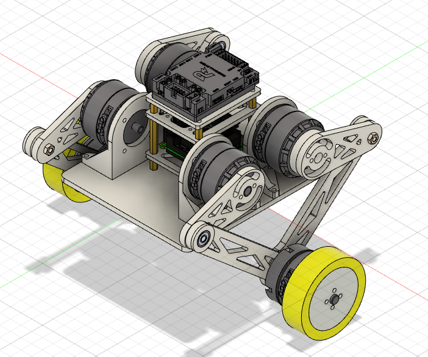

机械设计把驱动电机和主动关节布置在机身附近，降低腿部摆动惯量。左右腿共享同一套几何表达和控制接口，安装方向差异在编码器方向与力矩符号层处理。虚拟腿由五连杆末端到机身铰接中心的向量定义，腿长变化承担高度调节，虚拟腿倾角承担机体平衡与冲击响应。

## 2 五连杆运动学与 VMC

### 2.1 闭环几何

单腿由机身基座和四根活动连杆构成。$A$ 与 $E$ 是两个主动基座转轴，$B$、$C$、$D$ 构成被动铰接点，远端连杆在轮轴点 $C$ 闭合。基座宽度为 $b$，主动角为 $q_1$ 与 $q_4$，连杆长度依次为 $l_1$ 至 $l_4$。取

$$
\mathbf p_A=
\begin{bmatrix}
0\\0
\end{bmatrix},
\qquad
\mathbf p_E=
\begin{bmatrix}
b\\0
\end{bmatrix}
$$

并定义单位方向向量

$$
\mathbf e(q)=
\begin{bmatrix}
\cos q\\
\sin q
\end{bmatrix}
$$

两个中间关节的位置为

$$
\mathbf p_B=\mathbf p_A+l_1\mathbf e(q_1),
\qquad
\mathbf p_D=\mathbf p_E+l_4\mathbf e(q_4)
$$

末端关节 $C$ 同时满足 $\|\mathbf p_C-\mathbf p_B\|=l_2$ 与 $\|\mathbf p_C-\mathbf p_D\|=l_3$。令 $\mathbf d=\mathbf p_D-\mathbf p_B$，$d=\|\mathbf d\|$，$\hat{\mathbf d}=\mathbf d/d$，并取与其正交的单位向量 $\hat{\mathbf d}_{\perp}$。圆交点形式的闭环解为

$$
a=\frac{l_2^2-l_3^2+d^2}{2d},
\qquad
h=\sqrt{l_2^2-a^2}
$$

$$
\mathbf p_C=\mathbf p_B+a\hat{\mathbf d}
\pm h\hat{\mathbf d}_{\perp}
$$

符号由机构装配支路固定。以两主动关节轴的中点 $O$ 为虚拟腿原点，虚拟腿长 $L$ 与相对机身水平轴的几何角 $\alpha$ 为

$$
\mathbf r=\mathbf p_C-\mathbf p_O,
\qquad
L=\|\mathbf r\|,
\qquad
\alpha=\operatorname{atan2}(r_y,r_x)
$$

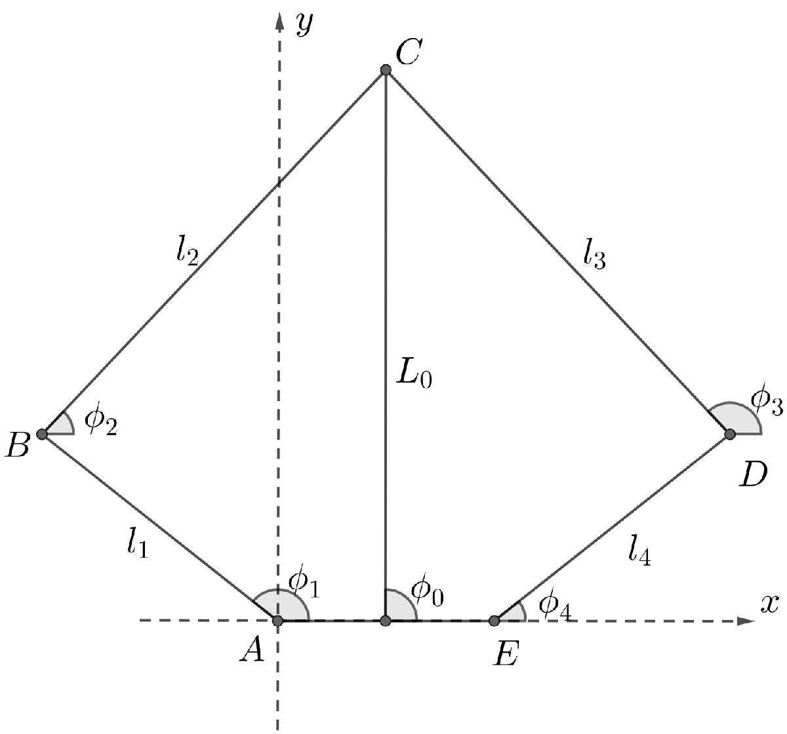

图中的 $\phi_1$、$\phi_4$、$L_0$ 与 $\phi_0$ 分别对应本文的 $q_1$、$q_4$、$L$ 与 $\alpha$。

### 2.2 速度映射

将主动关节与虚拟腿坐标分别写为

$$
\mathbf q=
\begin{bmatrix}
q_1\\q_4
\end{bmatrix},
\qquad
\mathbf z=
\begin{bmatrix}
L\\\alpha
\end{bmatrix}
=\mathbf f(\mathbf q)
$$

对正运动学求导得到构型相关雅可比

$$
\dot{\mathbf z}=
\mathbf J(\mathbf q)\dot{\mathbf q},
\qquad
\mathbf J(\mathbf q)=\frac{\partial \mathbf f}{\partial \mathbf q}
$$

嵌入式反馈链以闭式几何表达直接计算 $L$、$\alpha$、$\dot L$ 和 $\dot\alpha$，避免在控制周期内数值求解闭链约束，并为状态反馈、腿长控制和接地估计提供同一组机构状态。

### 2.3 虚拟力到关节力矩

VMC 在虚拟腿坐标中定义轴向力与绕虚拟髋部的力矩。令单腿虚拟广义力为 $\mathbf w_i=[F_i,T_{h,i}]^{\mathsf T}$，关节力矩为 $\boldsymbol\tau_i$。根据虚功一致性

$$
\delta W_i
=\mathbf w_i^{\mathsf T}\delta\mathbf z_i
=\boldsymbol\tau_i^{\mathsf T}\delta\mathbf q_i,
\qquad
\delta\mathbf z_i=\mathbf J_i\delta\mathbf q_i
$$

可得

$$
\boldsymbol\tau_i
=\mathbf J_i^{\mathsf T}(\mathbf q_i)\mathbf w_i
=\mathbf J_i^{\mathsf T}(\mathbf q_i)
\begin{bmatrix}
F_i\\T_{h,i}
\end{bmatrix}
$$

左右腿分别执行该映射。轴向力维持腿长并承担重力，虚拟髋部力矩同时接收纵向平衡和双腿同步修正。映射后的关节力矩经过方向校正和统一幅值限制，再换算为电机电流指令。

## 3 变腿长 LQR

### 3.1 等效动力学

纵向平衡模型把整车约化为驱动轮、虚拟腿和机体刚体。虚拟腿倾角相对竖直方向记为 $\theta$，轮轴纵向位移记为 $x$，机体俯仰角记为 $\phi$。状态与输入写为

$$
\mathbf s=
\begin{bmatrix}
\theta&\dot\theta&x&\dot x&\phi&\dot\phi
\end{bmatrix}^{\mathsf T},
\qquad
\mathbf u=
\begin{bmatrix}
T_w^{\Sigma}&T_h^{\Sigma}
\end{bmatrix}^{\mathsf T}
$$

$T_w^{\Sigma}$ 表示轮端纵向总力矩，$T_h^{\Sigma}$ 表示两条虚拟腿共享的平衡总力矩。腿长改变等效腿杆重心到轮轴与机体连接点的力臂，状态矩阵和输入矩阵因此随平均腿长 $\bar L$ 变化。在直立平衡点附近线性化后得到

$$
\dot{\mathbf s}=\mathbf A(\bar L)\mathbf s+\mathbf B(\bar L)\mathbf u
$$

离散化后写为

$$
\mathbf s_{k+1}=\mathbf A_d(\bar L)\mathbf s_k
+\mathbf B_d(\bar L)\mathbf u_k
$$

### 3.2 增益调度

每个离散腿长工作点独立求解二次型最优控制问题

$$
\mathcal J=\sum_k
\left(
\mathbf e_k^{\mathsf T}\mathbf Q\mathbf e_k
+\mathbf u_k^{\mathsf T}\mathbf R\mathbf u_k
\right),
\qquad
\mathbf e_k=\mathbf s_k-\mathbf s_k^{\star}
$$

由离散 Riccati 方程得到反馈矩阵 $\mathbf K(\bar L)$。为了避免在微控制器上在线求解，每个增益元素在离线阶段按腿长拟合为三次多项式

$$
K_{ij}(\bar L)
=a_{ij,0}+a_{ij,1}\bar L+a_{ij,2}\bar L^2+a_{ij,3}\bar L^3
$$

运行时只需读取左右腿长的平均值并计算多项式，即可得到当前构型的反馈矩阵。控制输出采用参考状态与反馈状态之差

$$
\begin{bmatrix}
T_w^{\Sigma}\\T_h^{\Sigma}
\end{bmatrix}
=\mathbf K(\bar L)
\left(\mathbf s^{\star}-\hat{\mathbf s}\right)
$$

两路总力矩在左右侧对称分配

$$
\bar T_w=\frac{1}{2}T_w^{\Sigma},
\qquad
\bar T_h=\frac{1}{2}T_h^{\Sigma}
$$

这种调度保留了腿长变化对平衡动力学的主要影响，同时把在线计算限制在矩阵乘法和低阶多项式求值。运行时以平均腿长求值反馈矩阵，基准腿长参考同时受独立上下限约束。

## 4 复合运动控制

### 4.1 纵向平衡与速度指令

纵向遥控输入先经过死区和低通处理，再积分形成位置参考。车辆运动时，速度参考与位置参考同步向前推进。遥控回中后，速度参考立即归零，位置参考在短暂跟随当前估计位置后保持，用于抑制持续滑移。LQR 同时利用虚拟腿倾角、纵向位置、纵向速度和机体俯仰状态生成 $T_w^{\Sigma}$ 与 $T_h^{\Sigma}$。轮端承担平移与倒立摆支撑，虚拟髋部协调腿和机体的相对姿态。

### 4.2 航向串级反馈

航向控制采用角度外环和角速度内环。外环把航向误差转换为目标偏航角速度，内环利用陀螺仪反馈生成左右轮的差动力矩

$$
\omega_z^{\star}=\mathcal C_{\psi}(\psi^{\star}-\psi)
$$

$$
\Delta T_w=\mathcal C_{\omega}(\omega_z^{\star}-\omega_z)
$$

$$
T_R=\bar T_w+\Delta T_w,
\qquad
T_L=\bar T_w-\Delta T_w
$$

差动力矩只改变左右轮的反对称分量，双轮共同分量仍由纵向 LQR 决定。

### 4.3 腿长、横滚与双腿同步

横滚角误差先转换为左右腿的反对称长度修正

$$
\Delta L_{\gamma}=\mathcal C_{\gamma}(\gamma^{\star}-\gamma)
$$

$$
L_L^{\star}=L_0^{\star}+\Delta L_{\gamma},
\qquad
L_R^{\star}=L_0^{\star}-\Delta L_{\gamma}
$$

单腿长度反馈把长度误差转换为轴向支撑力。触地时加入重力前馈，离地时去掉该项并把腿长切换到预设参考

$$
F_i=\mathcal C_L(L_i^{\star}-L_i)+F_{g,i}
$$

双腿同步使用几何角 $\alpha$ 的左右差值进行串级反馈。角度差先产生相对角速度参考，角速度差再产生虚拟髋部差动力矩 $\Delta T_h$。两条腿先均分 LQR 的虚拟髋部总力矩，再叠加反对称修正

$$
T_{h,R}=\bar T_h+\Delta T_h,
\qquad
T_{h,L}=\bar T_h-\Delta T_h
$$

这种分配抑制两侧机构在冲击和装配误差下的不同步运动。

### 4.4 接地判别与模式切换

接地判别把虚拟腿支撑力投影到竖直方向，并结合机体竖直加速度和轮端等效质量估计法向力。离散实现采用上一控制周期的支撑力与名义髋部力矩。令平均虚拟腿角为 $\theta$，等效腿长为 $L$，则竖直支撑项可写为

$$
P_{z,k}=(F_{L,k-1}+F_{R,k-1})\cos\theta_k
+\frac{\bar T_{h,k-1}}{L_k}\sin\theta_k
$$

轮端竖直加速度采用降低微分噪声的简化模型

$$
a_{w,z,k}=a_{b,z,k}
+2\dot L_k\dot\theta_k\sin\theta_k
+L_k\dot\theta_k^2\cos\theta_k
$$

由此得到法向力估计

$$
\hat N_k=P_{z,k}+m_{eq}(g+a_{w,z,k})
$$

接触状态使用上下阈值形成滞环

$$
\hat N_k<N_{off}\Rightarrow\text{离地},
\qquad
\hat N_k>N_{on}\Rightarrow\text{触地},
\qquad
N_{off}<N_{on}
$$

触地状态使用完整状态反馈、轮端驱动力矩和重力前馈。离地状态把轮端电流置零，只保留与虚拟腿倾角相关的反馈和预设腿长。落地后重新锁定当前航向参考，避免旧航向误差在触地瞬间产生突变转矩。安全模式直接清零全部轮端与关节电流。基准腿长参考受设计区间约束，各执行器电流在下发前分别限幅。

## 5 状态估计与嵌入式执行

### 5.1 姿态与机构状态

惯性测量先经过安装矩阵校正和加速度低通，再由四元数姿态解算得到航向、俯仰与横滚。关节编码器经过机械零位和安装方向校正，正运动学据此重建左右虚拟腿长与几何角，速度雅可比重建相应变化率。将左右腿几何角取平均为 $\bar\alpha$，纵向平衡角由机构几何和机体俯仰共同确定

$$
\theta=\bar\alpha-\frac{\pi}{2}-\phi
$$

$$
\dot\theta=\dot{\bar\alpha}-\dot\phi
$$

左右腿的平均状态进入矢状面模型。腿角与腿角速度差进入双腿同步反馈，横滚外环由惯性测得的横滚角生成反对称腿长参考，再由两侧腿长反馈分别闭环。

### 5.2 纵向速度估计

平衡反馈采用双轮平均线速度的一阶低通结果

$$
v_w=\frac{v_L+v_R}{2},
\qquad
\hat v=\mathcal L(v_w),
\qquad
\hat x_{k+1}=\hat x_k+T_c\hat v_k
$$

低通后的双轮平均速度 $\hat v$ 进入纵向平衡反馈，积分结果 $\hat x$ 进入位置反馈。两项状态使用同一轮端速度来源，保持位置与速度反馈的一致性。

### 5.3 实时执行顺序

实时系统由周期任务和 CAN 中断共同执行。惯性更新保持较高优先级，底盘控制在周期 $T_c$ 内依次完成模式选择、状态切换、反馈重建、参考量生成、控制求解和电流下发。CAN 中断持续刷新轮端与关节电机的编码器、转速、电流和温度，控制周期末分别发送轮端与关节电流目标。设备诊断与观测输出由低优先级周期任务处理。

<table><thead><tr><th>执行域</th><th>主要输入</th><th>周期内工作</th><th>输出</th></tr></thead><tbody><tr><td>惯性更新</td><td>陀螺仪与加速度计</td><td>坐标校正、滤波和姿态解算</td><td>姿态角、角速度与线加速度</td></tr><tr><td>底盘控制</td><td>姿态、编码器与遥控参考</td><td>机构解算、状态估计、LQR、VMC 与限幅</td><td>轮端和关节电流目标</td></tr><tr><td>CAN 中断</td><td>电机反馈报文</td><td>解析编码器、转速、电流与温度</td><td>最新执行器状态</td></tr><tr><td>设备诊断</td><td>通信更新时间</td><td>遥控与执行器在线状态监测</td><td>故障标志与声学告警</td></tr></tbody></table>

这种顺序保证控制计算读取最近一次姿态和电机反馈。遥控帧越界时，输入通道归零并进入失能档。通信监测依据报文更新时间登记遥控器与执行器超时。遥控接收超时时重启接收，执行器超时保留为故障标志并进入声学告警查询。失能模式统一清零六路执行电流。

## 6 仿真与样机验证

### 6.1 分层仿真

单腿模型先验证闭环几何、腿长与倾角反馈以及 VMC 力矩映射。Simscape 子系统用主动转动副连接大小腿杆件，并在末端闭合轮轴关节。关节力矩作为输入，主动关节角与角速度作为反馈。

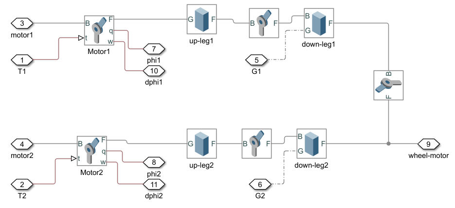

完整双腿模型在 Simulink 中连接机体、左右五连杆、驱动轮与轮地接触，再把变腿长 LQR、腿长反馈、双腿同步和关节力矩限幅接入同一闭环。模型同时加入斜坡、俯仰扰动和水平扰动，用于观察平衡状态与机构状态的耦合响应。

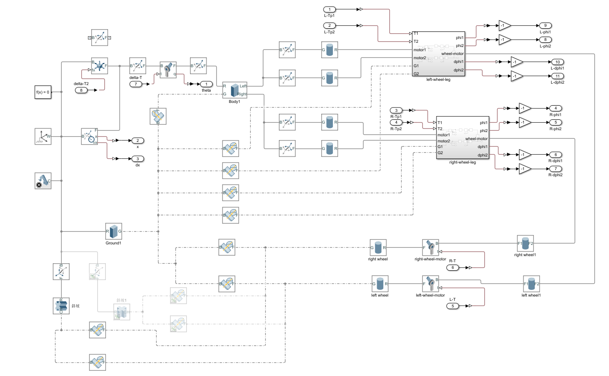

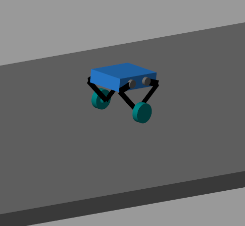

### 6.2 样机实验

验证样机按照相同五连杆拓扑完成装配，两个驱动轮位于腿部末端，关节驱动、主控和惯性器件布置在机身区域。实验按机构解算、单腿长度、双腿同步和整机平衡逐级接入控制链。

#### 6.2.1 机构状态解算

手动改变单腿末端位置时，关节编码器更新两个主动关节角，闭式运动学同步计算虚拟腿长与几何角。上位机显示腿长、腿角和两个关节角，用于对照机构几何关系核对解算结果。实验记录表明，末端位置变化时，关节反馈能够连续转换为相应的虚拟腿状态。

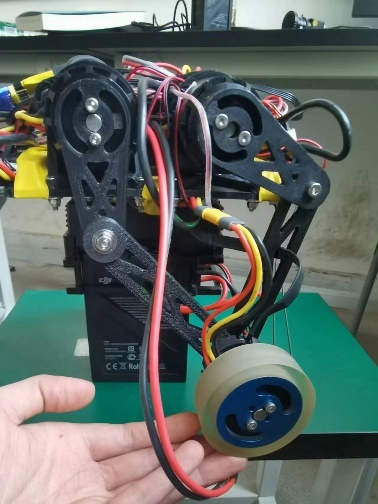

#### 6.2.2 腿长闭环

腿长反馈接入后，单腿在承载机身的条件下保持给定高度。长度误差经反馈控制生成虚拟腿轴向力，再由 VMC 映射为两个主动关节的修正力矩。

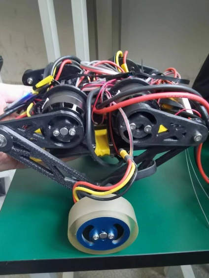

#### 6.2.3 双腿同步

样机离地架起后，手动改变一侧腿的几何角，观察另一侧腿在同步反馈作用下的姿态响应。该过程用于核对两侧机构解算、角度差反馈和虚拟髋部力矩分配的信号链。

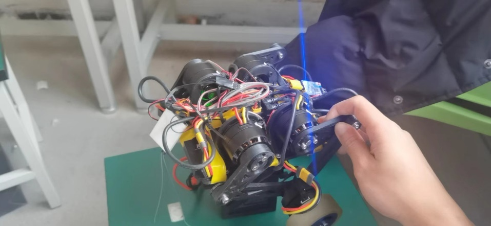

#### 6.2.4 原地平衡

整机落地进入平衡状态后，LQR 平衡反馈与腿长支撑同时工作。样机在原地站立过程中通过轮端前后运动持续修正机体倾倒趋势。

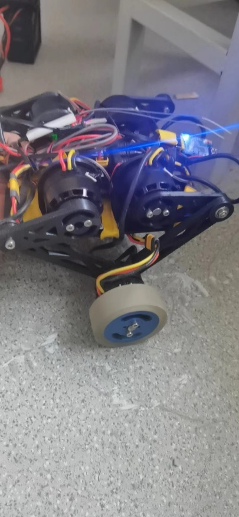

实验记录包括机体前倾角、前倾角速度和轮关节力矩。前倾角与角速度围绕平衡位置变化，轮关节力矩在正负方向持续调整。三组曲线分别呈现姿态状态量与轮关节力矩随时间的变化。

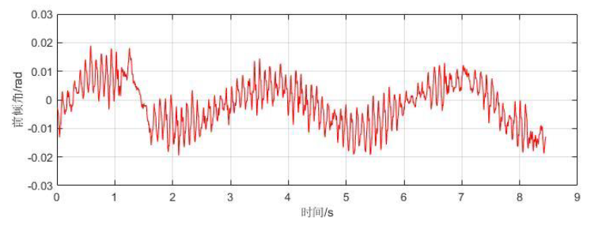

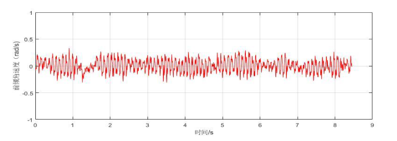

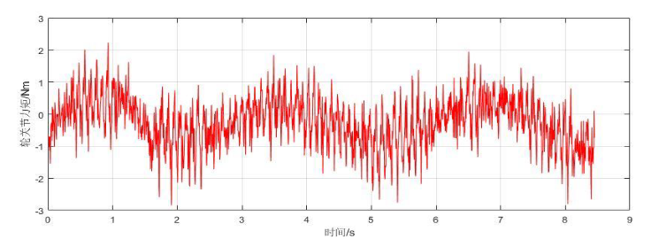

## 7 系统总结

五连杆闭式运动学和速度雅可比把关节反馈统一为虚拟腿状态。变腿长 LQR 生成纵向轮端力矩与虚拟髋部力矩，腿长、横滚、航向和双腿同步反馈分别处理高度、横滚、航向与左右腿相对运动。VMC 将虚拟广义力映射为四个关节目标，轮端共同力矩承担纵向驱动，左右轮的反对称力矩完成航向控制。

单腿仿真核对运动学与虚功映射，双腿多体模型覆盖轮地接触、坡面和外力扰动。嵌入式系统以惯性测量、关节编码器与轮速重建反馈状态，根据接地状态切换控制结构，再通过 CAN 接收执行器反馈并下发六路电流目标。样机完成腿长调节、双腿协同与原地平衡，串联了建模、控制求解、实时调度和机电执行。
