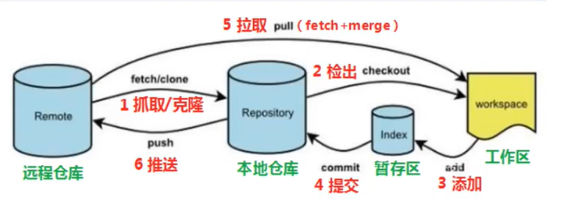

# Git分布式版本控制工具

> 参考视频：[Git学习-哔哩哔哩](https://www.bilibili.com/video/BV1MU4y1Y7h5?p=1&vd_source=d13fed8345cf3fc82c8c32365f9b43ef)
>
> 参考文档：[Git 教程 | 菜鸟教程](https://www.runoob.com/git/git-tutorial.html)

## 简介

### 版本控制器方式

- **集中式版本控制工具**，如SVN、CVS

  ​		版本库是集中存放在中央服务器的，team里每个人work时从中央服务器下载代码，时必须联网才能工作，局域网或互联网。个人修改然后提交到中央管理库。

- **分布式版本控制工具**，如Git

  ​		分布式版本控制系统没有“中央服务器”，每个人的电脑上都是一个完整的版本库，这样工作的时候，无需联网了。多人协作只需要各自的修改推送给对方，就能互相看到对方的修改了。

### Git工作流程图



```powershell
1. clone（克隆）：从远程仓库中克隆代码到本地仓库
2. checkout（检出）：从本地仓库中检出一个仓库分支然后进行修订
3. add（添加）：在提交前先将代码提交到暂存区
4. commit（提交）：提交到本地仓库。本地仓库中保存修改的各个历史版本
5. fetch（抓取）：从远程库抓取到本地仓库，不进行任何的合并动作，一般操作比较少
6. pull（拉取）：从远程库拉到本地库，自动进行合并（merge），然后放到工作区，相当于fetch+merge
7. push（推送）：修改完成后，需要和团队成员共享代码时，将代码推送到远程仓库
```

## 安装配置

### 安装

> 官网链接：[Git - Downloads (git-scm.com)](https://git-scm.com/downloads)

### 配置用户信息

```shell
git config --global user.name "p-xiexin"
git config --global user.email "1014575731@qq.com"
```

### 查看配置信息

```shell
git config user.name
git config user.email
```

### 解决中文乱码问题

> 参考链接：[git 显示中文和解决中文乱码 - 知乎 (zhihu.com)](https://zhuanlan.zhihu.com/p/133706032)

1. 打开Git Bash执行下面命令

```shell
git config --global core.quotepath false
```

2. 菜单中修改

​		在`git bash`的界面中右击空白处，弹出菜单，选择`选项->文本->本地Locale`，设置为`zh_CN`，而旁边的字符集选框选为`UTF-8`。

## 文件状态


## 常用操作指令

* 创建仓库命令

  ```shell
  git init			   	   #初始化git本地仓库
  git clone			    #拷贝一份远程仓库，也就是下载一个项目。
  ```

* 提交与修改

  ```shell
  git add					#添加文件到暂存区
  git status			   #查看仓库当前的状态，显示有变更的文件。
  git diff				 #比较文件的不同，即暂存区和工作区的差异。
  git commit 			#提交暂存区到本地仓库。
  git reset 			   #回退版本。
  git rm				   #将文件从暂存区和工作区中删除。
  git mv				  #移动或重命名工作区文件。
  ```

* 提交日志

  ```shell
  git log						#查看历史提交记录
  git blame <file>	 #以列表形式查看指定文件的历史修改记录
  ```

* 远程操作

  ```shell
  git remote				#远程仓库操作
  git fetch 				  #从远程获取代码库
  git pull				   #下载远程代码并合并
  git push				 #	上传远程代码并合并
  ```

## 建立本地仓库

* 本地建立

  ```shell
  git init
  ```

* 远程克隆

  ```shell
  git clone [URL]
  ```

## 本地仓库提交回退

* 提交本地仓库

  ```shell
  git add <file>
  #git rm [-r] --cached <file>将文件从暂存区移除，-r用来移除文件夹
  git add commit -m "注释说明"
  ```

* 查看提交日志

  ```shell
  git log [option]
  			options:
  						--all	#显示所有分支
  						--pretty=oneline	#将提交信息显示为一行
  						--abbrev-commit		#使得输出的commitid更简短
  						--graph				#以图的形式显示
  git reflog   #显示所有操作日志
  ```

* 版本回退

  ```shell
  git reset --hard [commitid]
  ```

* 忽略特定文件

  1. 工作目录下建立`.gitignore`文件
  2. `.gitignore`中加入忽略的文件

## 分支

* 查看分支

  ```shell
  git branch
  ```

* 新建分支

  ```shell
  git branch [分支名]
  ```

* 删除分支

  ```shell
  git branch -d [分支名]				#需要做各种检查
  git branch -D [分支名]				#强制删除
  ```

* 切换分支

  ```shell
  git checkout [分支名]
  git checkout -b [分支名] 		#创建并切换到
  ```

* 合并分支

  ```shell
  git merge [dev01]			#把dev01分支合并到当前分支
  ```

## SSH密钥

1. 生成SSH公钥

   1. `ssh-keygen -t rsa`
   2. 不断回车选择默认设置
      * 如果公钥已近存在，则自动覆盖

2. 在`~/.ssh`下生成3各文件

   ```shell
   id_rsa						#本地密钥
   id_rsa.pub				#公钥
   known_hosts
   ```

3. 将id_rsa.pub中的内容全选复制，并粘贴远端

## 远程仓库

* 关联远程仓库

  ```shell
  git remote add origin [URL]		#origin为给远程仓库取的名字，规范为origin
  ```

* 查看远程仓库

  ```shell
  git remote
  ```

* 将本地仓库同步到远程仓库

  ```shell
  git push origin main
  #完整指令如下：
  git push [-f] [--set-upstream] [远端名称 [本地分支名 : 远端分支名]]
  					-f							  #强制
  					-set--upstream		#推送到远端的同时建立起和远端分支的关联关系
  					#远端名称一般为 origin
  					#当本地分支名与远端分支名相同时，可省去冒号，只写一个分支名
  ```

* 将远程仓库同步到本地

  ```shell
  git fetch					#将远程分支拉到本地，此时会出现origin/main的分支
  git merge origin/main			#合并分支
  ```

  ```shell
  git pull					#等价于上面两条指令
  ```

  ```shell
  git fetch/pull [远端名称(origin)] [远端分支名(不指定则抓取所有分支)]
  ```

## .gitignore忽略规则修改后不生效的解决办法

 项目在开发过程中会需要增加被忽略的文件或者目录，可是当我们把忽略规则加入.gitignore文件后发现不起作用。原因是.gitignore只能忽略那些原来没有被track的文件，如果某些文件已经被纳入了版本管理中，则修改.gitignore是无效的。那么解决方法就是先把本地缓存删除（改变成未track状态）。
```bash
git rm -r --cached .
git add .
git commit -m 'update .gitignore'
```


## 解决“ssh:connect to host github.com port 22: Connection timed out”

在wsl中使用git clone远程仓库的时候，出现错误：

```bash
# pxx @ Relax in ~/Documents [13:38:01]
$ git clone git@github.com:gaoxiang12/slambook2.git
Cloning into 'slambook2'...
ssh: connect to host github.com port 22: Connection timed out
fatal: Could not read from remote repository.
```

网上搜索这个报错，发现很多人遇到这个问题，大概有2个原因和对应解决方案，这里针对自己的问题写出一种

### 使用GitHub的443端口

22端口可能被防火墙屏蔽了，可以尝试连接GitHub的443端口。

我使用如下命令，去看连接过程中发生了什么，-v表示verbose，会打出详细日志

```bash
# pxx @ Relax in ~/Documents [14:04:37] C:255
$ ssh -vT git@github.com
OpenSSH_8.2p1 Ubuntu-4ubuntu0.9, OpenSSL 1.1.1f  31 Mar 2020
debug1: Reading configuration data /etc/ssh/ssh_config
debug1: /etc/ssh/ssh_config line 19: include /etc/ssh/ssh_config.d/*.conf matched no files
debug1: /etc/ssh/ssh_config line 21: Applying options for *
debug1: Connecting to github.com [20.205.243.166] port 22.
```

可以看到连接卡在了如上地方，我换成443端口去连接就一切正常

```bash
# pxx @ Relax in ~/Documents [14:12:10] C:130
$ ssh -vT -p 443 git@github.com
OpenSSH_8.2p1 Ubuntu-4ubuntu0.9, OpenSSL 1.1.1f  31 Mar 2020
debug1: Reading configuration data /etc/ssh/ssh_config
debug1: /etc/ssh/ssh_config line 19: include /etc/ssh/ssh_config.d/*.conf matched no files
debug1: /etc/ssh/ssh_config line 21: Applying options for *
debug1: Connecting to github.com [20.205.243.166] port 443.
debug1: Connection established.
debug1: identity file /home/pxx/.ssh/id_rsa type 0
debug1: identity file /home/pxx/.ssh/id_rsa-cert type -1
debug1: identity file /home/pxx/.ssh/id_dsa type -1
debug1: identity file /home/pxx/.ssh/id_dsa-cert type -1
debug1: identity file /home/pxx/.ssh/id_ecdsa type -1
debug1: identity file /home/pxx/.ssh/id_ecdsa-cert type -1
debug1: identity file /home/pxx/.ssh/id_ecdsa_sk type -1
debug1: identity file /home/pxx/.ssh/id_ecdsa_sk-cert type -1
debug1: identity file /home/pxx/.ssh/id_ed25519 type -1
debug1: identity file /home/pxx/.ssh/id_ed25519-cert type -1
debug1: identity file /home/pxx/.ssh/id_ed25519_sk type -1
debug1: identity file /home/pxx/.ssh/id_ed25519_sk-cert type -1
debug1: identity file /home/pxx/.ssh/id_xmss type -1
debug1: identity file /home/pxx/.ssh/id_xmss-cert type -1
debug1: Local version string SSH-2.0-OpenSSH_8.2p1 Ubuntu-4ubuntu0.9
kex_exchange_identification: Connection closed by remote host
```

给`~/.ssh/config`文件里添加如下内容，这样ssh连接GitHub的时候就会使用443端口。

```text
Host github.com
  Hostname ssh.github.com
  Port 443
```

如果`~/.ssh`目录下没有config文件，新建一个即可。


