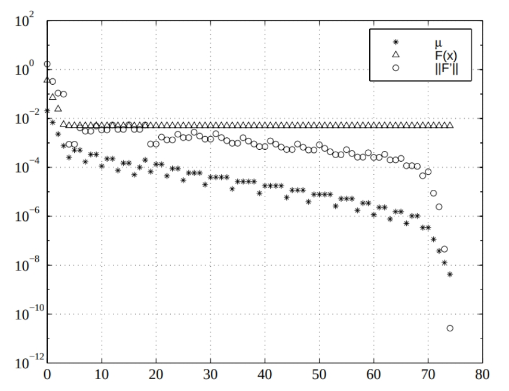

## 视觉SLAM十四讲

### 程序报错及其解决

#### 安装slambook1中的Sophus库

在编译高翔提供的不带模板类的Sophus库时出现了如下问题

```bash
/usr/bin/c++  -DSophus_EXPORTS -I/usr/include/eigen3  -O3 -DNDEBUG  -fPIC   -Wall -Werror -Wno-unused-variable                    -Wno-unused-but-set-variable -Wno-unknown-pragmas  -o CMakeFiles/Sophus.dir/sophus/se2.cpp.o -c /home/pxx/Documents/slambook-master/3rdparty/Sophus/sophus/se2.cpp
/usr/bin/c++  -DSophus_EXPORTS -I/usr/include/eigen3  -O3 -DNDEBUG  -fPIC   -Wall -Werror -Wno-unused-variable                    -Wno-unused-but-set-variable -Wno-unknown-pragmas  -o CMakeFiles/Sophus.dir/sophus/so2.cpp.o -c /home/pxx/Documents/slambook-master/3rdparty/Sophus/sophus/so2.cpp
/home/pxx/Documents/slambook-master/3rdparty/Sophus/sophus/so2.cpp: In constructor ‘Sophus::SO2::SO2()’:
/home/pxx/Documents/slambook-master/3rdparty/Sophus/sophus/so2.cpp:32:26: error: lvalue required as left operand of assignment
   32 |   unit_complex_.real() = 1.;
      |                          ^~
/home/pxx/Documents/slambook-master/3rdparty/Sophus/sophus/so2.cpp:33:26: error: lvalue required as left operand of assignment
   33 |   unit_complex_.imag() = 0.;
      |                          ^~
make[2]: *** [CMakeFiles/Sophus.dir/build.make:66：CMakeFiles/Sophus.dir/sophus/so2.cpp.o] 错误 1
make[2]: *** 正在等待未完成的任务....
make[2]: 离开目录“/home/pxx/Documents/slambook-master/3rdparty/Sophus/build”
make[1]: *** [CMakeFiles/Makefile2:91：CMakeFiles/Sophus.dir/all] 错误 2
make[1]: 离开目录“/home/pxx/Documents/slambook-master/3rdparty/Sophus/build”
make: *** [Makefile:144：all] 错误 2
```

这个错误发生在编译 Sophus 库的 `so2.cpp` 文件时。错误信息表明在 `so2.cpp` 中，`unit_complex_.real()` 和 `unit_complex_.imag()` 试图作为左值进行赋值，但它们实际上并不是左值。

具体来说，错误的代码部分是：

```c++
cppCopy codeunit_complex_.real() = 1.;
unit_complex_.imag() = 0.;
```

问题原因： 对于较新版本的 Eigen 库，`real()` 和 `imag()` 函数返回复数的实部和虚部的  常量引用，因此它们不能直接用作赋值的左值。

解决方法： 你可以尝试以下的修复方式，将上述代码替换为：

```c++
cppCopy code
unit_complex_ = std::complex<double>(1., 0.);
```

这样，你直接为 `unit_complex_` 赋予一个新的复数值，而不是尝试修改其实部和虚部。


#### slambook1/ch5/jointMap 编译出现问题

出现的错误提示很长，这里只需要看到最前面的错误信息

```bash
[ 50%] Building CXX object CMakeFiles/joinMap.dir/joinMap.cpp.o
In file included from /usr/include/pcl-1.10/pcl/pcl_macros.h:77,
                 from /usr/include/pcl-1.10/pcl/point_types.h:42,
                 from /home/pxx/Documents/slambook-master/ch5/joinMap/joinMap.cpp:8:
/usr/include/pcl-1.10/pcl/pcl_config.h:7:4: error: #error PCL requires C++14 or above
    7 |   #error PCL requires C++14 or above
      |    ^~~~~
In file included from /usr/include/pcl-1.10/pcl/console/print.h:44,
                 from /usr/include/pcl-1.10/pcl/conversions.h:53,
                 from /usr/include/pcl-1.10/pcl/common/io.h:48,
                 from /usr/include/pcl-1.10/pcl/io/file_io.h:41,
                 from /usr/include/pcl-1.10/pcl/io/pcd_io.h:44,
                 from /home/pxx/Documents/slambook-master/ch5/joinMap/joinMap.cpp:9:
/usr/include/pcl-1.10/pcl/pcl_config.h:7:4: error: #error PCL requires C++14 or above
    7 |   #error PCL requires C++14 or above
```

这个错误很明确：使用的 Point Cloud Library (PCL) 版本要求至少使用 C++14 标准。如果编译设置没有指定使用 C++14 或更高版本，那么会遇到这个错误。


#### slambook2/ch6 Sophus库出现问题

```bash

In file included from /usr/local/include/sophus/types.hpp:7,
                 from /usr/local/include/sophus/rotation_matrix.hpp:9,
                 from /usr/local/include/sophus/so3.hpp:6,
                 from /usr/local/include/sophus/se3.hpp:6,
                 from /home/pxx/Documents/slambook2/ch8/direct_method.cpp:2:
/usr/local/include/sophus/common.hpp:36:10: fatal error: fmt/format.h: 没有那个文件或目录
   36 | #include <fmt/format.h>
      |          ^~~~~~~~~~~~~~
compilation terminated.
ninja: build stopped: subcommand failed.
```

在CMakeLists.txt中添加如下命令即可

```cmake
target_link_libraries(XXX Sophus::Sophus)
```

解释`Sophus::Sophus` 和 `${Sophus_INCLUDE_DIRS}`的差异

1. **Sophus::Sophus**：

    这是一个目标（或者称为库目标），当你在 `target_link_libraries` 中使用它时，你实际上是在链接一个库。这种表示方法通常与 CMake 的 "modern" 模式相关，其中导入的库提供了它们的接口和依赖关系。在这种情况下，`Sophus::Sophus` 将自动设置包括头文件路径、库路径、依赖项等所需的所有信息。这也是为什么当你使用它时，不再需要手动指定包含路径或其他链接标志。

2. **${Sophus_INCLUDE_DIRS}**：

    这个变量提供了Sophus头文件的路径。当你使用 "classic" CMake 模式时，你可能需要这样的变量来手动设置头文件的路径，例如使用 `include_directories(${Sophus_INCLUDE_DIRS})`。

现代的 CMake 推荐使用第一种方式，即所谓的 "target-based" 方法，因为它更加模块化并减少了全局设置，从而避免了可能的冲突。而当使用 `Sophus::Sophus` 这样的导入目标时，它不仅会链接库，还会自动添加所需的包含路径和其他相关的编译标志。

所以，当你使用 `Sophus::Sophus` 时，其实已经包含了 `${Sophus_INCLUDE_DIRS}` 的内容，因此不需要再额外指定。


#### slambook2/ch9 g2o库中CSparse相关函数和类定义未找到

修改如下：

```cmake
#SET(G2O_LIBS g2o_csparse_extension g2o_stuff g2o_core cxsparse) 原本高博的写法
SET(G2O_LIBS g2o_csparse_extension g2o_stuff g2o_core cxsparse g2o_solver_csparse)
```


#### slambook2/ch10 g2o_viewer没有被正确安装

安装 g2o_viewer 需要依赖于 libglviewer

因为在cmake的文件中只有找到了 libglviewer依赖 才会编译 g2o_viewer

但是 libglviewer-dev找不到

```bash
# pxx @ pxx-pc in ~/Downloads/g2o-master/build/bin [12:46:35] C:100
$ sudo apt-get install libeigen3-dev libsuitesparse-dev qtdeclarative5-dev qt5-qmake libqglviewer-dev

正在读取软件包列表... 完成
正在分析软件包的依赖关系树       
正在读取状态信息... 完成       
没有可用的软件包 libqglviewer-dev，但是它被其它的软件包引用了。
这可能意味着这个缺失的软件包可能已被废弃，
或者只能在其他发布源中找到

E: 软件包 libqglviewer-dev 没有可安装候选
```

使用如下命令搜索相关的包

```bash
# pxx @ pxx-pc in ~/Downloads/g2o-master/build/bin [12:54:37] C:130
$ apt-cache search libqglviewer-dev
libqglviewer-dev-qt5 - OpenGL 3D viewer library based on Qt5 - development files
```

这里使用apt安装后，重新从源码编译安装g2o库即可


但是安装后依旧无法使用，并且出现了如下的error：

```bash
# pxx @ pxx-pc in ~/Documents/slambook2/ch10 on git:master x [14:46:40] 
$ g2o_viewer sphere.g2o 
g2o_viewer: error while loading shared libraries: libg2o_viewer.so.0.1: cannot open shared object file: No such file or directory
```

重新执行以下命令即可

```bash
sudo ldconfig
```

此外，需要修改 pose_graph_g2o_lie_algebra.cpp 文件54行的部分，添加 return true语句

```C++
class VertexSE3LieAlgebra : public g2o::BaseVertex<6, SE3d> {
public:
    EIGEN_MAKE_ALIGNED_OPERATOR_NEW

    virtual bool read(istream &is) override {
        double data[7];
        for (int i = 0; i < 7; i++)
            is >> data[i];
        setEstimate(SE3d(
            Quaterniond(data[6], data[3], data[4], data[5]),
            Vector3d(data[0], data[1], data[2])
        ));
        return true;
    }
```

另外：[关于信息矩阵(来自CSDN)](https://blog.csdn.net/jdy_lyy/article/details/119259128)

#### slambook2/ch11 DBow3的链接问题

首先先安装好DBow3，可以在https://github.com/rmsalinas/DBow3下载

但是编译后仍然出现以下报错

```bash
# pxx @ pxx-pc in ~/Documents/slambook2/ch11/build on git:master x [0:35:33] 
$ make   
Scanning dependencies of target loop_closure
[ 16%] Building CXX object CMakeFiles/loop_closure.dir/loop_closure.cpp.o
make[2]: *** 没有规则可制作目标“/usr/local/lib/libDBoW3.a”，由“loop_closure” 需求。 停止。
make[1]: *** [CMakeFiles/Makefile2:80：CMakeFiles/loop_closure.dir/all] 错误 2
make: *** [Makefile:84：all] 错误 2
```

这是由于高博给出的demo里使用的是3rdparty中的链接文件，离线链接文件使用`.a`静态链接文件`libDBoW3.a`会更好，所以只要把ch11中的`CMakeLists.txt`静态链接改为动态链接即可：

```cmake
# set( DBoW3_LIBS "/usr/local/lib/libDBoW3.a" )
set( DBoW3_LIBS "/usr/local/lib/libDBoW3.so" )
```


#### slambook2/ch12 的各种问题

首先需要安装octomap库，[git链接](https://github.com/OctoMap/octomap)

然后需要修改CMakeLists.txt

主要是两个部分，一个是将cpp版本提升为14，另一个是为可执行文件链接fmt库，这里都不再赘述

##### 1. cmake ..时，vtk的问题

```bash
-- The imported target "vtkRenderingPythonTkWidgets" references the file
   "/usr/lib/x86_64-linux-gnu/libvtkRenderingPythonTkWidgets.so"
but this file does not exist.  Possible reasons include:
* The file was deleted, renamed, or moved to another location.
* An install or uninstall procedure did not complete successfully.
* The installation package was faulty and contained
   "/usr/lib/cmake/vtk-7.1/VTKTargets.cmake"
but not all the files it references.

-- The imported target "vtk" references the file
   "/usr/bin/vtk"
but this file does not exist.  Possible reasons include:
* The file was deleted, renamed, or moved to another location.
* An install or uninstall procedure did not complete successfully.
* The installation package was faulty and contained
   "/usr/lib/cmake/vtk-7.1/VTKTargets.cmake"
but not all the files it references.

-- The imported target "pvtk" references the file
   "/usr/bin/pvtk"
but this file does not exist.  Possible reasons include:
* The file was deleted, renamed, or moved to another location.
* An install or uninstall procedure did not complete successfully.
* The installation package was faulty and contained
   "/usr/lib/cmake/vtk-7.1/VTKTargets.cmake"
but not all the files it references.
```

使用命令查找VTK如下

```bash
# pxx @ pxx-pc in ~ [16:32:16] C:1
$ dpkg -l | grep vtk
ii  libvtk6.3                                     6.3.0+dfsg2-5build2                   amd64        VTK libraries
ii  libvtk7-dev                                   7.1.1+dfsg2-2ubuntu1                  amd64        VTK header files
ii  libvtk7-java                                  7.1.1+dfsg2-2ubuntu1                  amd64        Visualization Toolkit - A high level 3D visualization library - java
ii  libvtk7-jni                                   7.1.1+dfsg2-2ubuntu1                  amd64        Visualization Toolkit - A high level 3D visualization library - java
ii  libvtk7-qt-dev                                7.1.1+dfsg2-2ubuntu1                  amd64        VTK header files, containing Qt files
ii  libvtk7.1p                                    7.1.1+dfsg2-2ubuntu1                  amd64        VTK libraries
ii  libvtk7.1p-qt                                 7.1.1+dfsg2-2ubuntu1                  amd64        VTK libraries, Qt files
ii  python3-vtk7                                  7.1.1+dfsg2-2ubuntu1                  amd64        Python bindings for VTK
ii  tcl-vtk7                                      7.1.1+dfsg2-2ubuntu1                  amd64        Tcl bindings for VTK
ii  vtk7                                          7.1.1+dfsg2-2ubuntu1                  amd64        Binaries for VTK7
```

可以通过创建两个软链接来解决

```bash
sudo ln -s /usr/lib/python2.7/dist-packages/vtk/libvtkRenderingPythonTkWidgets.x86_64-linux-gnu.so /usr/lib/x86_64-linux-gnu/libvtkRenderingPythonTkWidgets.so
```

```bash
sudo ln -s /usr/bin/vtk7 /usr/bin/vtk 
```


##### 2. 运行dense_mono时段错误

参考：[运行ch12 单目稠密建图的程序时出现段错误（核心已转储） · Issue #178 · gaoxiang12/slambook2](https://github.com/gaoxiang12/slambook2/issues/178)

```bash
read total 202 files.
*** loop 1 ***

进程已结束，退出代码为 139 (interrupted by signal 11: SIGSEGV)
```

注意到CMakeLists.txt中有这样一行

```bash
set(CMAKE_CXX_FLAGS "-std=c++14 -march=native -O3")
```

`-march=native`：作用大概是对代码生成的可执行文件专门为当前处理器进行优化，并且不向后兼容。

- `march` 是指定CPU类型的标志。编译器会为该特定类型的CPU生成优化的代码。
- `native` 表示编译器应自动检测运行编译的机器的CPU类型，并为该特定CPU优化代码。这意味着生成的二进制文件在其他架构或型号的CPU上可能不会运行得那么好，因为它是特别为编译机器的CPU优化的。

而在源码Update()函数中，需要一个返回值bool，但是函数内部没有return，优化后，好像缺少返回值会导致各种奇怪的错误。

这里在函数最后补上`return true`，重新编译后，运行正常

```c++
// 对整个深度图进行更新
bool update(const Mat &ref, const Mat &curr, const SE3d &T_C_R, Mat &depth, Mat &depth_cov2) {
    for (int x = boarder; x < width - boarder; x++)
        for (int y = boarder; y < height - boarder; y++) {
            // 遍历每个像素
            if (depth_cov2.ptr<double>(y)[x] < min_cov || depth_cov2.ptr<double>(y)[x] > max_cov) // 深度已收敛或发散
                continue;
            // 在极线上搜索 (x,y) 的匹配
            Vector2d pt_curr;
            Vector2d epipolar_direction;
            bool ret = epipolarSearch(
                ref,
                curr,
                T_C_R,
                Vector2d(x, y),
                depth.ptr<double>(y)[x],
                sqrt(depth_cov2.ptr<double>(y)[x]),
                pt_curr,
                epipolar_direction
            );

            if (ret == false) // 匹配失败
                continue;

            // 取消该注释以显示匹配
            // showEpipolarMatch(ref, curr, Vector2d(x, y), pt_curr);

            // 匹配成功，更新深度图
            updateDepthFilter(Vector2d(x, y), pt_curr, T_C_R, epipolar_direction, depth, depth_cov2);
        }
    return true;
}
```


### SO(3)的伴随性质

[SO(3) 的伴随性质 · v1otusc.github.io](https://v1otusc.github.io/2020/07/08/SO(3)-的伴随性质/)


## ORB-SLAM2

### 从源码安装编译

#### 错误1 C++标准问题

```bash
/usr/local/include/sigslot/signal.hpp:109:79: error: ‘decay_t’ is not a member of ‘std’
/usr/local/include/sigslot/signal.hpp:109:79: note: suggested alternative: ‘decay’
 constexpr bool is_weak_ptr_compatible_v = detail::is_weak_ptr_compatible<std::decay_t<P>>::value;
                                                                               ^~~~~~~
                                                                               decay
/usr/local/include/sigslot/signal.hpp:109:87: error: template argument 1 is invalid
 constexpr bool is_weak_ptr_compatible_v = detail::is_weak_ptr_compatible<std::decay_t<P>>::value;
                                                                                       ^
/usr/local/include/sigslot/signal.hpp:109:92: error: ‘::value’ has not been declared
 constexpr bool is_weak_ptr_compatible_v = detail::is_weak_ptr_compatible<std::decay_t<P>>::value;
                                                                                            ^~~~~
/usr/local/include/sigslot/signal.hpp:109:92: note: suggested alternative: ‘valloc’
 constexpr bool is_weak_ptr_compatible_v = detail::is_weak_ptr_compatible<std::decay_t<P>>::value;
                                                                                            ^~~~~
                                                                                            valloc
```

github上面的解决方法[error: ‘slots_reference’ was not declared in this scope · Issue #387 · UZ-SLAMLab/ORB_SLAM3 (github.com)](https://github.com/UZ-SLAMLab/ORB_SLAM3/issues/387)


#### 错误2 头文件包含问题

```bash	
ORB_SLAM2/src/System.cc:315:20: error: ‘usleep’ was not declared in this scope
 usleep(5000);
```

找到对应的System.cc加入  #include<unistd.h>

在source文件的开头增加include

```c++
#include <unistd.h>
```

需要增加unistd.h的文件有：

{

​	Examples/Monocular/mono_euroc.cc
​	Examples/Monocular/mono_kitti.cc
​	Examples/Monocular/mono_tum.cc
​	Examples/RGB-D/rgbd_tum.cc
​	Examples/Stereo/stereo_euroc.cc
​	Examples/Stereo/stereo_kitti.cc
​	src/LocalMapping.cc
​	src/LoopClosing.cc
​	src/System.cc
​	src/Tracking.cc
​	src/Viewer.cc

}

根据实际情况更改


#### 错误3 更改LoopClosing.h

```bash
/usr/include/c++/8/bits/stl_map.h: In instantiation of ‘class std::map<ORB_SLAM2::KeyFrame*, g2o::Sim3, std::less<ORB_SLAM2::KeyFrame*>, Eigen::aligned_allocator<std::pair<const ORB_SLAM2::KeyFrame*, g2o::Sim3> > >’:
/home/wang/SLAM/src/ORB_SLAM2/src/LoopClosing.cc:439:21:   required from here
/usr/include/c++/8/bits/stl_map.h:122:21: error: static assertion failed: std::map must have the same value_type as its allocator
       static_assert(is_same<typename _Alloc::value_type, value_type>::value,
                     ^~~~~~~~~~~~~~~~~~~~~~~~~~~~~~~~~~~~~~~~~~~~~~~~
CMakeFiles/ORB_SLAM2.dir/build.make:134: recipe for target 'CMakeFiles/ORB_SLAM2.dir/src/LoopClosing.cc.o' failed
```

具体原因不详，在网上找到解决办法：打开LoopClosing.h，将

```bash
typedef map<KeyFrame*,g2o::Sim3,std::less<KeyFrame*>,
        Eigen::aligned_allocator<std::pair<const KeyFrame*, g2o::Sim3> > > KeyFrameAndPose;

```

改为

```bash
typedef map<KeyFrame*,g2o::Sim3,std::less<KeyFrame*>,
        Eigen::aligned_allocator<std::pair<KeyFrame *const, g2o::Sim3> > > KeyFrameAndPose;
```


#### 错误4 Pangolin版本问题

```bash
CMake Error at CMakeLists.txt:45 (find_package):
  Found package configuration file:

    /usr/local/lib/cmake/Pangolin/PangolinConfig.cmake

  but it set Pangolin_FOUND to FALSE so package "Pangolin" is considered to
  be NOT FOUND.  Reason given by package:

  Pangolin could not be found because dependency Eigen3 could not be found.
```


是因为之前从源码下载安装的 pangolin 是0.6版本，需要重新安装 0.5 版本的pangolin。

```bash
// 到Pangolin文件夹下
cd build
sudo make uninstall
```

运行完上面指令后

```javascript
usr/local/include
usr/local/lib/cmake
```

两文件夹下的`pangolin`文件夹以及文件夹里面的子文件夹变为空,删除`pangolin`空文件夹

```bash
sudo rm -r "文件夹名称"
```

可以从这里下载Pangolin v0.5[Release v0.5 · stevenlovegrove/Pangolin (github.com)](https://github.com/stevenlovegrove/Pangolin/releases/tag/v0.5)

也可以直接clone之后使用以下命令检出v0.5版本

```bash
git checkout v0.5
```

**FFmpeg问题相关**

安装v0.5版本编译的时候可能会出现以下问题，与FFmpeg相关

```bash
/home/pxx/Downloads/Pangolin/src/video/drivers/ffmpeg.cpp:501:33: error: ‘CODEC_FLAG_GLOBAL_HEADER’ was not declared in this scope; did you mean ‘AV_CODEC_FLAG_GLOBAL_HEADER’?
  501 |         stream->codec->flags |= CODEC_FLAG_GLOBAL_HEADER;
      |                                 ^~~~~~~~~~~~~~~~~~~~~~~~
      |                                 AV_CODEC_FLAG_GLOBAL_HEADER
```

这里可以选择在使用cmake时禁用与FFmpeg相关的选项（但是这样做了依旧有其他错误）

```bash
cmake -DBUILD_PANGOLIN_FFMPEG=OFF ..
```

github中给出的方案是修改CMakeLists[ffmpeg问题(github.com)](https://github.com/stevenlovegrove/Pangolin/issues/27)


#### 错误5 找不到 -lEigen3::Eigen

```bash
/usr/bin/ld: 找不到 -lEigen3::Eigen
collect2: error: ld returned 1 exit status
make[2]: *** [CMakeFiles/ORB_SLAM2.dir/build.make:393：../lib/libORB_SLAM2.so] 错误 1
make[1]: *** [CMakeFiles/Makefile2:250：CMakeFiles/ORB_SLAM2.dir/all] 错误 2
make: *** [Makefile:84：all] 错误 2
```

从源码安装eigen3

安装包下载网址：
http://eigen.tuxfamily.org/index.php?title=Main_Page
在该网站中，可以下载任意版本对应的文件

运行命令：

```
sudo cp -r /usr/local/include/eigen3/Eigen /usr/local/include 
```

注意：参考cp指令 cp -r /usr/men /usr/zh 将目录/usr/men下的所有文件及其子目录复制到目录/usr/zh中

上个命令的说明：
因为eigen3 被默认安装到了usr/local/include里了（或者是usr/include里，这两个都差不多，都是系统默认的路径），在很多程序中include时经常使用#include <Eigen/Dense>而不是使用#include <eigen3/Eigen/Dense>所以要做下处理，否则一些程序在编译时会因找不到Eigen/Dense而报错。上面指令将usr/local/include/eigen3文件夹中的Eigen文件递归地复制到上一层文件夹（直接放到/usr/local/include中，否则系统无法默认搜索到 -> 此时只能在CMakeLists.txt用include_libraries(绝对路径了)）

如果依旧报错，查看错误4是否解决了

#### 错误6 momotonic_clock()被替代

```bash
error: ‘std::chrono::monotonic_clock’ has not been declared    87 |         std::chrono::monotonic_clock::time_point t1 = std::chrono::monotonic_clock::now();
```

出现这个问题的原因是C++版本之间存在区别。

在C++11版里已经没有momotonic_clock了，有steady_clock作为替代。

我是在这里得到解决思路的：c++ - ‘std::chrono::monotonic_clock’ has not been declared - Stack Overflow

所以orb-slam的作者在代码中使用了ifdef来判断用户的C++版本（大概是这个意思）：

```c++
#ifdef COMPILEDWITHC11
        std::chrono::steady_clock::time_point t1 = std::chrono::steady_clock::now();
#else
        std::chrono::monotonic_clock::time_point t1 = std::chrono::monotonic_clock::now();
#endif
 
        //Pass the image to the SLAM system
        SLAM.TrackMonocular(im,tframe);
 
#ifdef COMPILEDWITHC11
        std::chrono::steady_clock::time_point t2 = std::chrono::steady_clock::now();
#else
        std::chrono::monotonic_clock::time_point t2 = std::chrono::monotonic_clock::now();
#endif
```

这里在报错的文件开头加上相关的宏定义即可`#define  COMPILEDWITHC11`

或者搜索COMPILEDWITHC11
然后把monotonic_clock 换成 steady_clock

```C++
/*
#ifdef COMPILEDWITHC11
            std::chrono::steady_clock::time_point time_Start_Process = std::chrono::steady_clock::now();
#else
            std::chrono::monotonic_clock::time_point time_Start_Process = std::chrono::monotonic_clock::now();
#endif
*/
// 替换成下面的：
	std::chrono::steady_clock::time_point time_Start_Process = std::chrono::steady_clock::now();
```


### 运行示例

ORB-SLAM2提供了KITTI/TUM/EuRoC数据集下的运行示例。官方文档[Monocular Examples](https://github.com/raulmur/ORB_SLAM2#4-monocular-examples) [Stereo Examples](https://github.com/raulmur/ORB_SLAM2#5-stereo-examples) [RGB-D Example](https://github.com/raulmur/ORB_SLAM2#6-rgb-d-example)提供了详细的在不同数据集上运行的教程。注意不同的相机类型对应着不同的数据集，也对应着不同的运行方法。

以[TUM数据集](https://vision.in.tum.de/data/datasets/rgbd-dataset/download)中的fr1/desk视频序列为例。找到其中fr1/desk序列，点击tgz下载压缩文件，之后进行解压。

**1. 单目示例**

根据教程中所述，运行单目TUM示例的命令为

```shell
./Examples/Monocular/mono_tum Vocabulary/ORBvoc.txt Examples/Monocular/TUMX.yaml PATH_TO_SEQUENCE_FOLDER

./Examples/Monocular/mono_tum Vocabulary/ORBvoc.txt Examples/Monocular/TUM1.yaml ~/Downloads/rgbd_dataset_freiburg1_xyz  
```

对应不同的具体视频序列需要对该命令进行调整：

- 调整TUMX.yaml：如果视频序列是freiburg1(fr1)目录下的，则改为TUM1.yaml;如果视频序列是freiburg2(fr2)目录下的，则改为TUM2.yaml;如果视频序列是freiburg3(fr3)目录下的，则改为TUM3.yaml;
- 调整PATH_TO_SEQUENCE_FOLDER：将其改为刚才解压后视频序列文件夹的路径。

**2. RGB-D示例**

```shell
./Examples/RGB-D/rgbd_tum Vocabulary/ORBvoc.txt Examples/RGB-D/TUMX.yaml PATH_TO_SEQUENCE_FOLDER ASSOCIATIONS_FILE

./Examples/RGB-D/rgbd_tum Vocabulary/ORBvoc.txt Examples/RGB-D/TUM1.yaml ~/Downloads/rgbd_dataset_freiburg1_desk/ ./Examples/RGB-D/associations/fr1_desk.txt
```

对应不同的具体视频序列需要对该命令进行调整：

- 调整TUMX.yaml：如果视频序列是freiburg1(fr1)目录下的，则改为TUM1.yaml;如果视频序列是freiburg2(fr2)目录下的，则改为TUM2.yaml;如果视频序列是freiburg3(fr3)目录下的，则改为TUM3.yaml;
- 调整PATH_TO_SEQUENCE_FOLDER：将其改为刚才解压后视频序列文件夹的路径。
- 调整PATH_TO_SEQUENCE_FOLDER ASSOCIATIONS_FILE：将其改为该序列associations文件的路径。associations文件是用来将RGB图像和Depth图像一一对应起来的文件。ORB-SLAM2库Examples/RGB-D/associations/中提供了几个视频序列的associations文件，其中包含fr1/desk序列。所以此处就不需要自己生成了。


## 手写VIO视觉SLAM

[SLAM 中的 Kalman Filter 推导 (xiaotaoguo.com)](https://xiaotaoguo.com/p/slam-kalman-filter/)

### ch1 VIO概述

以视觉与IMU（惯性测量单元）融合实现里程计(Visual_Inertial Odometry)

- **IMU：**以较高频率（>100Hz）返回被测量物体的角速度与加速度，但是受自身温度、零偏、振动等因素的干扰，积分得到的**平移和旋转容易飘移**。

- **视觉：**以图像的形式记录数据，频率低（30Hz、60Hz），通过图像**特征点或像素**推断相机运动。

| 方案 | IMU                                                          | 视觉                                                         |
| ---- | ------------------------------------------------------------ | ------------------------------------------------------------ |
| 优势 | 快速响应（>100Hz）<br />不受成像质量影响<br />角速度普遍比较准确<br />可估计绝对尺度 | 不产生漂移<br />直接测量旋转和平移                           |
| 劣势 | 存在零偏<br />定精度IMU积分位姿发散<br />高精度价格昂贵      | 收图像遮挡、运动物体干扰<br />单目视觉无法测量尺度<br />单目纯旋转运动无法估计<br />快速运动时易丢失 |
| 应用 | 短时间、快速的运动                                           | 长时间、慢速的运动                                           |

因此，可以**利用视觉定位信息来估计IMU的零偏，减少IMU由零偏导致的发散和累计误差；IMU则可以为视觉提供快速运动时的定位**。

tips：由于`SE(3)`李代数性质复杂，在VIO中，通常使用`SO(3)+t`的形式表达旋转和平移。对平移部分使用矢量更新而非SE(3)上的更新。


### ch2 IMU传感器

#### 工作原理

1. **MEMS加速度计工作原理**

- 测量原理可以用一个简单的质量块+弹簧+指示器来表示；
- 加速度计测量值为弹簧拉力对应的加速度；
- MEMS加速度计利用电容或者电阻桥来等原理测量加速度；
- 假设IMU坐标系就是ENU坐标系(东北天坐标系)，$R_m=I$    $g=(0, 0, -9.81)$
  
    静止时有：$a=0$  $a_m=-g$
    
    自由落体时有：$a=g$  $a_m=0$

2. **陀螺仪工作原理**

- 陀螺仪主要用来测量物体的旋转角度度，按测量原理分为有**振动陀螺仪，光纤陀螺仪**等；

- 低端MEMS陀螺上一般采用振动陀螺原理，通过测量Coriolis force(科氏力)来间接得到角速度；

    ​	MEMS陀螺仪：一个**主动运动轴**+一个**敏感轴**

    


- 音叉陀螺仪：音叉中间为旋转轴，左右有两个质量块，做相反的正弦运动，所受科氏力方向相反；

    ​	实际上，两个质量块不可能完全一致，也就是说陀螺仪的测量可能会受到外部加速度的影响，即常称的**G-sensitivity**

    加速度计由于不存在主动运动轴上的高速运动，因此收到科氏力的影响可以忽略。

#### 误差模型

##### 确定性误差

可以事先标定，包括bias，scale...

**Bias**:理论上，当没有外部作用时，IMU传感器的输出应该为0。但是实际数据存在一个偏置b，其对位姿估计的影响为：
$$
v_{err}=b_at\\p_{err} = \frac{1}{2}b_at^2
$$

Scale：可以看成是实际数值和传感器输出值之间的比值

**Misalignment Errors**：多轴IMU传感器制作的时候，由于制作工艺的问题，会使得 **$xyz$ 轴可能不垂直**
$$
\begin{bmatrix}l_{ax}\\l_{ay}\\l_{az}\end{bmatrix}=\begin{bmatrix} s_{xx}&m_{xy}&m_{xz}\\m_{yz}&s_{yy}&m_{yz}\\m_{zx}&m_{zy}&s_{zz} \end{bmatrix} \begin{bmatrix} a_x\\a_y\\a_z \end{bmatrix}+\begin{bmatrix} b_{ax}\\b_{ay}\\b_{az} \end{bmatrix}
$$
其他确定性误差：Run-to-Run、In Run、Temperature-Dependent

*误差标定*

1. 六面法标定加速度

    六面法是指将加速度计的3个轴分别朝上或者朝下放置一段时间，采集6个面的数据完成标定(假设各个轴都是正交的)：
    $$
    b=\frac{l_f^{up}+l_f^{down}}{2}\\s=\frac{l_f^{up}-l_f^{down}}{2·||g||}
    $$

    

​	考虑到轴间误差的时候，可以利用**最小二乘**把**12个变量**求出来。

2. 六面法标定陀螺仪

​	和加速度计六面法原理基本相同，不同的是陀螺仪的真实值由高精度转台提供，六面则是指各个轴顺、逆时针旋转。

3. 温度相关参数标定

- 目的：对传感器估计的bias和scale进行**温度补偿**，获取不同时刻的bias和scale值，绘制成曲线。

- 两种标定方法：

    **soal method**：控制恒温室的温度值，然后读取传感器数值进行标定。

    **ramp method**：记录一段时间内线性升温和降温时传感器的数据来进行标定。


##### 随机误差

通常假设噪声服从高斯分布，包括高斯白噪声、bias随机游走...

1. 高斯白噪声

    IMU 数据连续时间上受到一个均值为 0，方差为 σ，**各时刻之间相互独立的高斯过程** n(t)。

​	实际上，IMU传感器获取的数据为离散采样，离散和连续高斯白噪声的方差存在一定的关系${\sigma}_d=\sigma\frac{1}{\sqrt{\Delta t}}$

2. Bias随机游走

    通常使用**维纳过程**来建模bias随时间连续变化的过程，**离散时间下称之为随机游走**
    $$
    \dot{b}(t)=n(t)=\sigma_b\omega(t) \quad \text{ω是方差为1的白噪声 }
    $$
    同样的，离散时间和连续时间的转换为${\sigma}_{bd}=\sigma_b\sqrt{\Delta t}$
    
2. 随机游走和高斯白噪声对比

    1. **随机游走**（Random Walk）是一种随机过程，其中一个物体在每个时间步骤中按照随机方向移动。通常，每一步的移动是基于前一步的位置，因此它具有记忆性。随机游走可以用来模拟许多现实生活中的情况，如股票价格的波动或物体的随机漫步。
    2. **高斯白噪声**是一种随机信号，其特点是在不同时间点上的值是相互独立且服从高斯分布（正态分布）的。这意味着每个时间点上的值都是随机的，没有记忆性，而且其概率分布是正态分布，因此它的值可以是任何实数，而且通常呈现出均值为零的性质。
    
    因此，主要的区别在于随机游走具有记忆性，每一步都受前一步的影响，而高斯白噪声没有记忆性，每个时间点上的值都是相互独立的，并且遵循正态分布。这两种随机过程在不同领域和应用中都有各自的用途。

*误差标定*

**艾伦方差标定**：Allan 方差法是 20 世纪 60 年代由美国国家标准局的 David Allan 提出的，它是一种基于时域的分析方法。
具体的流程如下：

1. 保持传感器绝对静止获取数据。
2. 对数据进行分段，设定时间段的时长。
3. 将传感器数据按照时间段进行平均。
4. 计算方差，绘制艾伦曲线。


#### 数学模型

1. 加速度计的误差模型

    导航系G为东北天，$g^G=(0, 0, -9.81)^T$
    
    理论测量值为：
    $$
    a_m^B=R_{BG}(a^G-g^G)
    $$
    如果考虑高斯白噪声，bias以及尺度因子则：

$$
a_m^B=S_aR_{BG}(a^G-g^G)+n_a+b_a
$$

​	通常假设尺度因子为单位矩阵**I**

2. 陀螺仪的误差模型

    考虑尺度因子，高斯白噪声以及bias，陀螺仪的误差模型如下
    $$
    \omega_m^B=S_g\omega^B+n_g+b_g
    $$
    低端传感器，考虑到加速度对陀螺仪的影响，即g-灵敏度：
    $$
    \omega_m^B=S_g\omega^B+s_{ga}a^B+n_g+b_g
    $$
    

#### VIO中的IMU模型

忽略scale的影响，只考虑白噪声和bias随机游走:
$$
\boldsymbol{\tilde{\omega}}^b=\boldsymbol{\omega}^b+\mathbf{b}^g+\mathbf{n}^g\\\mathbf{\tilde{a}}^b=\mathbf{q}_{bw}(\mathbf{a}^w+\mathbf{g}^w)+\mathbf{b}^a+\mathbf{n}^a
$$
上标g表示gyro，a表示acc，w表示在世界坐标系world，b表示imu机体坐标系body。IMU真实值为ω，a，测量值为$\mathbf{\tilde\omega},\mathbf{\tilde a}$。


运动模型的离散时间处理有两种方式：欧拉法和中值法

- 中值法：两个相邻时刻k到k+1的位姿是用第k时刻的测量值`a, ω`来计算
    $$
    \mathbf{p}_{wb_{k+1}} = \mathbf{p}_{wb_k} + \mathbf{v}^w_k \Delta t + \frac{1}{2} \mathbf{a} \Delta t^2\\
    \mathbf{v}^w_{k+1} = \mathbf{v}^w_k + \mathbf{a} \Delta t\\
    \mathbf{q}_{wb_{k+1}} = \mathbf{q}_{wb_k} \otimes \begin{bmatrix} 1 \\ \frac{1}{2} \boldsymbol{\omega} \Delta t \end{bmatrix}\\
    \mathbf{a} = \mathbf{q}_{wb_k} (\mathbf{a}^b_k - \mathbf{b}^a_k) - \mathbf{g}^w\\
    \boldsymbol{\omega} = \boldsymbol{\omega}^b_k - \mathbf{b}^g_k
    $$

- 使用mid-point方法，即两个相邻时刻k到k+1的位姿使用两个时刻的测量值`a, ω`的平均值来计算
    $$
    \mathbf{a} = \frac{1}{2} \left( \mathbf{q}_{wb_k} (\mathbf{a}^b_k - \mathbf{b}^a_k) - \mathbf{g}^w + \mathbf{q}_{wb_{k+1}} (\mathbf{a}^b_{k+1} - \mathbf{b}^a_k) - \mathbf{g}^w \right)\\
    \boldsymbol{\omega} = \frac{1}{2} \left( (\boldsymbol{\omega}^b_k - \mathbf{b}^g_k) + (\boldsymbol{\omega}^b_{k+1} - \mathbf{b}^g_k) \right)
    $$
    

#### IMU数据仿真

>  [仿真代码点这里](https://github.com/HeYijia/vio_data_simulation  )

​	第一章的作业中提到了旋转积分的两种形式，一种是使用四元数进行更新，另一种则是使用李群李代数来更新。这里再提出一种新的方式：欧拉角形式。
$$
\boldsymbol{\vartheta}_{wb}\prime=\boldsymbol{\vartheta}_{wb}+E_{wb}·\boldsymbol{\omega}\Delta t
$$
​	其中$\boldsymbol{\vartheta}=(\psi_{roll}, \theta_{pitch}, \phi_{yaw})^T$,$E_{wb}$表示将IMU body坐标系下的角速度转化为欧拉角速度（关于为什么需要左乘这样的一个矩阵，主要是跟欧拉角表示姿态会存在奇异性问题，其计算方法跟欧拉角的旋转顺序有关）。

1. 绕**惯性坐标系的z轴**旋转$\phi$,得到新的坐标系$b^1$:

$$
\mathbf{x}_b^1 &= \begin{bmatrix}
\cos \phi & \sin \phi & 0 \\
-\sin \phi & \cos \phi & 0 \\
0 & 0 & 1 \\
\end{bmatrix} \mathbf{x}_b^0= R(\phi) \mathbf{x}_b^0
$$

2. 绕**新的坐标系$b^1$的y轴**旋转$\theta$，得到坐标系$b^2$:

$$
\mathbf{x}_b^2 &= \begin{bmatrix}
\cos \theta & 0 & -\sin\theta \\
0 & 1 & 0 \\
\sin\theta & 0 & \cos\theta \\
\end{bmatrix} \mathbf{x}_b^1= R(\theta) \mathbf{x}_b^1
$$

3. 绕**新的坐标系$b^2$的y轴**旋转$\psi$，得到坐标系$b^3$，即body坐标系:

$$
\mathbf{x}_b^3 &= \begin{bmatrix}
1 & 0 & 0 \\
0 & \cos\psi & \sin\psi \\
0 & -\sin\psi & \cos\psi \\
\end{bmatrix} \mathbf{x}_b^2= R(\psi) \mathbf{x}_b^2
$$


4. 综合起来得到：

$$
\mathbf{x}_b=R(\psi)R(\theta)R(\phi)\mathbf{x}=R(\psi, \theta, \phi)\mathbf{x}
$$

同样的，惯性系下的**欧拉角速度转化到body坐标系**下的公式为：
$$
\begin{align*}\boldsymbol{\omega} &= R(\psi) R(\theta) \begin{bmatrix}0 \\0 \\\frac{d\phi}{dt} \\\end{bmatrix} + R(\psi) \begin{bmatrix}0 \\\frac{d\theta}{dt} \\0 \\\end{bmatrix} + 
\begin{bmatrix}\frac{d\psi}{dt} \\0 \\0 \\\end{bmatrix} \\&= 
\begin{bmatrix}1 & 0 & -\sin\theta \\0 & \cos\psi & \sin\psi \cos\theta \\0 & -\sin\psi & \cos\psi \cos\theta \\
\end{bmatrix} \begin{bmatrix}\frac{d\psi}{dt} \\\frac{d\theta}{dt} \\\frac{d\phi}{dt} \\\end{bmatrix}\end{align*}
$$


### ch3 基于BA的VIO融合

#### 最小二乘问题求解


上图是SBA论文中算法的简单流程，注意到图中框选的部分，实际上这里使用的是**引入阻尼的高斯牛顿法**来进行求解。

##### 梯度下降

梯度下降法是在机器学习中经常用到的一种方法，解决的是无约束最优化问题，梯度下降法认为梯度的反方向就是下降最快的方向，所以每次将变量沿着梯度的反方向移动一定距离，目标函数便会逐渐减小，最终达到最小。与之相对应的是约束最优化问题。

对**目标函数**进行一阶泰勒展开
$$
f(\theta + \Delta\theta) \approx f(\theta) + \nabla f(\theta)^T \Delta\theta
$$
如果我们想要找到一个方向,使得$f(\theta+\Delta \theta)$比$f(\theta)$小，我们可以选择$\Delta \theta$为梯度的反方向，即$- \nabla f(\theta)$，为了控制向梯度反方向移动的步长，引入了学习率$\alpha$，因此我们可以把$\Delta \theta$写为$- \alpha \nabla f(\theta)$，其中$\alpha$是一个很小的正数。这样就得到了梯度下降法的更新规则：
$$
\theta_{\text{next}} = \theta - \alpha \nabla f(\theta)
$$
在实际应用中，我们通常只使用泰勒展开的一阶项，因为它提供了在当前点附近函数值下降最快的方向。更高阶的泰勒展开可以提供更精确的近似，但在梯度下降法中通常不需要，而且计算也会更复杂。例如，牛顿法就是使用了泰勒展开的二阶项来更精确地估计函数的最小值，它考虑了函数的曲率，从而可以更快地收敛。

tips：

​	雅各比矩阵式梯度的一个推广，用于向量值函数，当目标函数 $f(\theta)$ 是标量值函数时，雅各比矩阵简化为梯度向量的转置。在这种情况下，雅各比矩阵是一个行向量，而梯度通常表示为列向量。但是，两者在数学上表示相同的概念：函数在各个方向上的变化率。


**1. 最速下降法**

最速梯度下降法（Steepest Gradient Descent）是梯度下降法的一种变体，它在每一步中选择最优的步长，即学习率，来确保在当前梯度方向上取得最大的函数值下降。这通常涉及到在每一步中解决一个一维优化问题来确定最佳步长。

最速梯度下降法的更新公式与梯度下降法相似，但是学习率在每一步都会重新计算，以确保最大程度的函数值下降：
$$
\theta_{\text{next}} = \theta - \alpha^* \nabla f(\theta)
$$
其中 α* 是通过解决以下优化问题得到的最优步长：
$$
\alpha^* = \arg\min_{\alpha>0} f(\theta - \alpha \nabla f(\theta))
$$
从下降方向的条件可知：$Jd=||J||\cos{\theta}$，θ表示下降方向和梯度方向的夹角，当θ=π(即梯度的反方向)，有：
$$
\Delta{x}=\frac{-J^T}{||J||}
$$
即梯度的负方向为最速梯度下降方向。缺点是最优值附近振荡，收敛慢。


锯齿现象：


**2. 牛顿法**

牛顿法（Newton's method），也称为牛顿-拉弗森方法（Newton-Raphson method），是一种在实数域和复数域上求解方程的迭代方法。在优化问题中，牛顿法用于寻找函数的极值点。当应用于最优化问题时，特别是寻找无约束问题的局部最小值，牛顿法通过使用函数的一阶导数（梯度）和二阶导数（Hessian矩阵）来寻找极值点。
$$
\theta_{\text{next}} = \theta - \left[H f(\theta)\right]^{-1} \nabla f(\theta)
$$
$H f(\theta)$是目标函数的Hessian矩阵，即梯度的导数或者说是目标函数的二阶导数矩阵。

牛顿法的关键在于它使用了二阶导数信息，这使得它在接近极小值点时通常比只使用一阶导数的梯度下降法收敛得更快。在局部最优点**x**附近，如果$x+\Delta x$是最优解，则对$\Delta x$的导数等于0，对二阶泰勒展开求一阶导：
$$
\frac{\partial}{\partial \Delta x} \left( f(x) + J\Delta x + \frac{1}{2} \Delta x^T H\Delta x \right) = J^T + H\Delta x = 0
$$
进一步，若矩阵H非奇异，得到：
$$
\Delta{x}=-H^{-1}J^T
$$
牛顿法的计算步骤如下：
- 给定初始值 $x_0$ 和精度阈值 $\epsilon$，设置 $k=0$。
- 计算梯度 $g_k$ 和矩阵 $H_k$。
- 如果 $||g_k||<\epsilon$ 即在此点处梯度的值接近于0，则达到极值点处，停止迭代。
- 计算搜索方向 $d_k=-H_k^{-1}g_k$。
- 确定步长 $\alpha_k$ 和下一个迭代点 $x_{k+1}=x_k+\alpha_kd_k$。
- 令 $k=k+1$ 并返回步骤2。

然而，牛顿法也有一些缺点：

1. 计算Hessian矩阵及其逆可能在计算上非常昂贵，特别是参数的维度很高时。

2. Hessian矩阵需要是非奇异的，并且为了保证收敛到局部最小值，Hessian矩阵应该是正定的。

    我们判断牛顿法的迭代方向是否朝着函数值下降的方向移动，也就是将迭代方向和当前点的梯度值做内积，如果小于0就说明是下降方向。

    迭代方向和当前点的梯度值做内积为：
    $$
    \nabla f(x)^T \Delta x=-\nabla f(x)^T\nabla^2f(x)^{-1}\nabla f(x)
    $$
    要想使它小于0，等式右边就是海塞矩阵正定的条件，这个要求是很强的，因此并不能保证牛顿法的迭代方向一定沿着函数值下降的方向。

3. 牛顿法不保证全局收敛，它可能会收敛到鞍点，而不是局部最小值。


**3. 阻尼牛顿法**

阻尼牛顿法（Damped Newton method）是牛顿法的一个变种，它通过引入一个步长因子来控制每次迭代中参数更新的幅度。这个步长因子通常被称为阻尼因子，它有助于提高牛顿法的全局收敛性，特别是当迭代点远离最优解时。

然而，在某些情况下，直接这样更新可能会导致迭代过程中的不稳定，尤其是当海森矩阵 $H f(\theta)$不是正定的或者我们不处于函数的二次收敛区域内时。

为了解决这个问题，阻尼牛顿法引入了一个步长因子$\mu$，通常在(0, 1]范围内。每次迭代的方向仍然采用$d_k$
$$
\mu = \arg\min_{\mu} f\left(\theta - \mu \left[Hf(\theta)\right]^{-1} \nabla f(\theta)\right)
$$
阻尼牛顿法的算法步骤如下：
- 给定初始值 $x_0$ 和精度阈值 $\epsilon$，设置 $k=0$。
- 计算梯度 $g_k$ 和矩阵 $H_k$。
- 如果 $||g_k||<\epsilon$ 即在此点处梯度的值接近于0，则达到极值点处，停止迭代。
- 计算搜索方向 $d_k=-H_k^{-1}g_k$。
- 一维搜索确定步长 $\mu_k$ 和下一个迭代点 $x_{k+1}=x_k+\mu_kd_k$。
- 令 $k=k+1$ 并返回步骤2。

阻尼牛顿法的优点是收敛速度快，但是需要计算海森矩阵的逆，计算量和存储量都很大。


**4. 高斯牛顿法**

高斯-牛顿法是求解非线性最小二乘问题的一种方法，它的基本思想是用泰勒级数展开式去近似地代替非线性回归模型，用雅各比矩阵的乘积来近似代替牛顿法中的二阶Hessian矩阵。
$$
\mathbf{J}^T \mathbf{J}\Delta{\mathbf{x}_{gn}}=\mathbf{-J^T f}\\ \mathbf{H}\Delta \mathbf{x}_{gn}=\mathbf{b}
$$
具体推导看到《机器人学中的状态估计》这本书4.3.1或《视觉SLAM十四讲中》第六讲。

这里对比一下牛顿法和高斯牛顿法：

**牛顿法**

- 牛顿法用于一般的非线性优化问题。它的出发点是直接针对目标函数（通常是误差函数）进行操作。
- 为了找到最小值点，它使用了二阶泰勒级数来近似目标函数。
- 基于这个近似，我们求解增量Δ*x*使得该近似最小。
- 对于这个增量的求解，我们需要用到目标函数的梯度（一阶导数）和Hessian矩阵（二阶导数）。

**高斯-牛顿法**

- 高斯-牛顿法特别用于求解非线性最小二乘问题。它的出发点是一个残差向量。
- 它首先对残差函数进行一阶泰勒展开。
- 之后，我们希望最小化这个展开式的范数的平方，这就形成了一个二次型的最小二乘问题。
- 为了解决这个问题，这里使用了残差的雅各比矩阵来近似Hessian矩阵。
- 基于这个近似，我们可以求解增量Δ*x*。


**5. 列文伯格-马夸尔特（Levenberg-Marquardt）改进高斯牛顿法：**
$$
(\mathbf{J}^T \mathbf{J}+\mu \mathbf{I})\Delta \mathbf{x_{lm}}=-\mathbf{J}^T\mathbf{f}
$$
随着$\mu$变大,海塞矩阵所占比重相对较小,此时:
$$
\Delta \mathbf{x}_{lm}=-\frac{1}{\mu} \mathbf{J}^T \mathbf{f} 
$$
即最速下降(即负梯度)中非常小的一个步长。当$\mu=0$时,则恢复为通常的高斯牛顿更新。 列文伯格-马夸尔特法通过缓慢增加$\mu$的值,可以在海塞矩阵近似较差或病态的情况下工作。

**阻尼因子初始值的选取**

阻尼因子$\mu$的大小是相对于$\mathbf{J}^T \mathbf{J}$的元素而言的。半正定的信息矩阵$\mathbf{J}^T \mathbf{J}$特征值$\lbrace \lambda_j \rbrace$和对应的特征向量为$\lbrace v_j \rbrace$。对$\mathbf{J}^T \mathbf{J}$做特征值分解后有：$\mathbf{J}^T \mathbf{J}=\mathbf{V} \Lambda \mathbf{V}^T$
$$
\begin{align}
(J^T J + \mu I) \Delta \mathbf{x}_{lm} &= -J^T f \\
(V \Lambda V^T + \mu I) \Delta \mathbf{x}_{lm} &= -F' \\
(V \Lambda V^T + \mu V V^T) \Delta \mathbf{x}_{lm} &= -F' \\
V (\Lambda + \mu I) V^T \Delta \mathbf{x}_{lm} &= -F' \\
\Delta \mathbf{x}_{lm} &= -V (\Lambda + \mu I)^{-1} V^T F' \\
&= - \begin{bmatrix} v_1 & \dots & v_n \end{bmatrix}
\begin{bmatrix}
\frac{1}{\lambda_1 + \mu} & & \\
& \frac{1}{\lambda_2 + \mu} & \\
& & \ddots \\
& & & \frac{1}{\lambda_n + \mu}
\end{bmatrix}
\begin{bmatrix}
v_1^T  \\
v_2^T  \\
\vdots \\
v_n^T 
\end{bmatrix} F'^T\\
&= - \sum_{j=1}^{n} \frac{v_j^T F'^T}{\lambda_j + \mu} v_j \quad 
\end{align}
$$
其中：
$$
F'(x) = (J^T f)^T = (J^T f)_{1 \times m \times m \times 1} = 1 \times 1
$$
tips：高博还给出了使用SWM直接求逆和最小二乘的方法。

所以一个简单的$\mu_0$初始值的策略为：
$$
\mu_0=\tau \cdot \max{\lbrace(\mathbf{J}^T \mathbf{J})_{ii}} \rbrace
$$
通常，按需设定$\tau [10^{-8}, 1]$

**阻尼因子的更新策略**

阻尼因子的更新策略实际上是通过比例因子来确定的：
$$
\rho = \frac{F'(x) - F(x + \Delta x_{lm})}{L(0) - L(\Delta x_{lm})}\\
&= \frac{\text{实际下降}}{近似下降}
$$
其中：
$$
\begin{align}
L(0) - L(\Delta x_{lm}) &= -\Delta x_{lm}^T J^T f - \frac{1}{2} \Delta x_{lm}^T J^T J \Delta x_{lm} \\
&=^{b = -J^T f}  \frac{1}{2} \Delta x_{lm}^T (-2b + (J^T J + \mu I - \mu I) \Delta x_{lm})\\
&= \frac{1}{2} \Delta x_{lm}^T (\mu \Delta x_{lm} + b)
\end{align}
$$
首先比例因子分母始终大于0，如果：

- $\rho < 0$，则$F(x) \uparrow$，应该$\rho \uparrow \rarr \Delta x \downarrow$，增大阻尼减小步长。
- 如果$\rho>0$且比较大，减小$\mu$，让LM接近Gauss-Newton使得系统更快收敛。
- 反之，如果是比较小的正数，则增大阻尼，缩小迭代补偿。

Marquadt策略：
$$
\begin{align*}
\text{if } \rho &< 0.25 \\
\mu &:= \mu \times 2 \\
\text{elseif } \rho &> 0.75 \\
\mu &:= \mu / 3
\end{align*}
$$


Nielsen策略
$$
\begin{align*}
\text{if } \rho &> 0 \\
\mu &:= \mu \times \max\left\{ \frac{1}{3}, 1 - (2\rho - 1)^3 \right\} ; \\
\nu &:= 2 \\
\text{else} \\
\mu &:= \mu \times \nu\\
\nu &:= 2 \times \nu
\end{align*}
$$


##### 鲁棒核函数

> 最小化误差项的二范数平方和作为目标函数存在一个严重的问题:如果出于误匹配等原因,某个误差项给的数据是错误的，它相关的变量会使目标函数下降更多，算法将更倾向于优化错误的数据，导致最后的结果发散。于是就有了核函数的存在。核函数能够减小这些异常值对估计结果的负面影响。具体的方式是，把原先误差的二范数度量替换成一个增长没有那么快的函数,同时保证自己的光滑性质(不然无法求导)。因为它们使得整个优化结果更为稳健,所以又叫它们鲁棒核函数(Robust Kernel)。

鲁棒核函数直接作用在残差上，最小二乘函数就变成了如下形式：
$$
\min_{x} \frac{1}{2} \sum_{k} \rho \left( \|f_k(x)\|^2 \right)
$$


#### VIO残差函数的构建


​	在视觉SLAM十四讲中，我们已知了状态的初始信息，即特征点的三维坐标以及相机的位姿，后续根据相机的移动得到许多测量值即特征点在不同图像上的图像坐标，得到以上信息后构建误差函数，利用最小二乘得到状态量的最优估计。

​	在VIO中，IMU的频率是远大于相机的频率的，如图中的红色点，在两幅图之间我们还有许多IMU的数据，对两幅图之间的IMU数据进行积分，得到两幅图像之间的一个约束。但是积分会导致前面提到的误差模型（两个相邻IMU数据之间的）发生变化。

​	首先看一下带权重（方差）的残差计算：
$$
r = \left\| f(\mathbf{x}) \right\|^2_{\Sigma}
= f(\mathbf{x})^{\mathrm{T}} \Sigma^{-1} f(\mathbf{x})
$$
​	基于滑动窗口的VIO Bundle Adjustment误差传递矩阵：


$$
\min_{\mathbf{X}} \underbrace{ \rho \left( \left\| \mathbf{r}_p - \mathbf{J}_p\mathbf{X} \right\|^2_{\Sigma_p} \right)}_{\text{prior}} + \underbrace{\sum_{i \in B}  \rho \left( \left\| \mathbf{r}_b(\mathbf{Z}_{b_i, b_{i+1}}, \mathbf{X}) \right\|^2_{\Sigma_{b_i, b_{i+1}}} \right)}_\text{IMU error} + \underbrace{ \sum_{(i,j) \in F} \rho \left( \left\| \mathbf{r}_f(\mathbf{Z}^{c_j}_i, \mathbf{X}) \right\|^2_{\Sigma^{c_j}_i} \right)}_\text{image error}
$$
​	求误差传递矩阵是为了求协方差矩阵（后文将会给出），得到协方差矩阵后可以把不同物理量的损失函数加在一起，一起优化，增大低方差数据的比重。

##### 系统需要优化的变量

为了节约计算量采用滑动窗口形式的Bundle Adjustment，在i时刻，滑动窗口内待优化的系统状态量定义如下：
$$
\mathbf{X} = \left[ \mathbf{x}_n, \mathbf{x}_{n+1}, \ldots, \mathbf{x}_{n+N}, \lambda_{m+1}, \ldots, \lambda_{m+M} \right]\\

\mathbf{x}_i = \left[ \mathbf{p}_{wb_i}; \mathbf{q}_{wb_i}; \mathbf{v}_{wi} \mathbf{b}^a_i; \mathbf{b}^g_i \right]^{\mathrm{T}}, \quad i \in \left[ n, n + N \right]
$$

- $x_i$包含i时刻IMU机体在惯性坐标系中的位置、速度、姿态以及IMU机体坐标系中的加速度和角速度的偏置量估计；

    $\mathbf{x}_i$是一个15维的向量，而不是16维的，这是因为四元数只取了虚部，在优化问题中，我们通常对四元数进行归一化，使得 ∥*q*∥=1。这样，四元数就存在一个约束条件。因此，如果已知四元数的三个分量（通常是虚部），第四个分量（实部）可以通过这个约束条件计算得到。

- n，m分别是集体状态量、路标在滑动窗口里的起始时刻；

- N是滑动窗口中的关键帧数量，M是滑动窗口内所有关键帧观测到的路标数量($\lambda$为逆深度)。

##### 视觉重投影误差

定义：一个特征点在**归一化相机坐标系下的估计值**与观测值的差：
$$
\mathbf{r}_c=\begin{bmatrix}\frac{x}{z}-u\\ \frac{y}{z}-v \end{bmatrix}
$$
特征点在**归一化相机坐标系**与在**相机坐标系**下的坐标关系为：
$$
\begin{bmatrix}x\\y\\z\end{bmatrix}=\frac{1}{\lambda}\begin{bmatrix}u\\v\\1 \end{bmatrix}
$$
其中$\lambda=1/z$称为逆深度，使用逆深度有以下好处：

- **测量对深度的敏感度降低**：在XYZ坐标系中，对远处的点进行测量，深度的不确定性会显著影响到测量的准确性。相反，使用逆深度时，由于深度的倒数被用作参数，因此即使对于远距离的点，其对测量的贡献也相对较小，从而在某种程度上降低了噪声的影响。

- **线性化误差**：在状态估计中，逆深度参数化下的误差函数对状态的变化更加线性，特别是在使用Jacobian矩阵或Hessian矩阵时。这意味着在逆深度参数化下，优化问题的线性近似在每次迭代中更加准确，从而有利于快速收敛。

- **参数敏感度**：逆深度形式使得参数对于测量的敏感度分布更加均匀，特别是在深度变化较大时。在XYZ坐标系中，深度的小变化（尤其是远处的物体）可能导致重投影误差的大变化，这会影响优化算法的稳定性。

在VIO中，特征点逆深度在地i帧中初始化得到，在第j帧中又被观测得到，预测其在第j帧中的坐标以及视觉重投影误差为：
$$
\begin{bmatrix}
x_{c_i} \\
y_{c_i} \\
z_{c_i} \\
1
\end{bmatrix}
= T_{bc}^{-1} T_{wb_j}^{-1} T_{wb_i} T_{bc}
\begin{bmatrix}
\frac{1}{\lambda} u_{c_i} \\
\frac{1}{\lambda} v_{c_i} \\
\frac{1}{\lambda} \\
1
\end{bmatrix}
$$

$$
\mathbf{r_c} = 
\begin{bmatrix}
\frac{x_{c_j} - u_{c_j}}{z_{c_j}} \\
\frac{y_{c_j} - v_{c_j}}{z_{c_j}}
\end{bmatrix}
$$

##### IMU预积分量


​	关于预积分的由来、意义，误差传递函数的推导看这个[预积分 - 知乎 (zhihu.com)](https://zhuanlan.zhihu.com/p/570565628#:~:text=预积分这个概念第一次提出是在T.Luptonand,中的论文中%2C将预积分理论应用到其设计的VIO系统中.传统直接积分形式中%2C是关于世界坐标系的%2C需要知道初始的旋转等状态%2C这需要初始化过程来确定.并且由于IMU是高频的信息%2C但VIO系统位姿输出不要求和IMU同频%2C通过预积分技术可以不需要知道初始状态%2C将一段时间的IMU测量当做一次观测.)
$$
\begin{align*}
\mathbf{p}_{wb_j} &= \mathbf{p}_{wb_i} + \mathbf{v}^w_i \Delta t + \int_{t \in [i,j]} \int (\mathbf{q}_{wb_t} \mathbf{a}^b_t - \mathbf{g}^w) dt^2 \\
\mathbf{v}^w_j &= \mathbf{v}^w_i + \int_{t \in [i,j]} (\mathbf{q}_{wb_t} \mathbf{a}^b_t - \mathbf{g}^w) dt \\
\mathbf{q}_{wb_j} &= \int_{t \in [i,j]} \mathbf{q}_{wb_t} \otimes \begin{bmatrix} 0 \\ \frac{1}{2}\boldsymbol{\omega}^b_t \end{bmatrix} dt
\end{align*}
$$
> 从式子中我们可以看到，想要求解j时刻的状态，必须要使用i时刻的状态$q_{wb_i}$，一旦i时刻的状发生变化，都需要重新进行积分运算。而在基于优化方法的SLAM后端中，需要不断迭代求解当前时刻状态，因此状态在一次求解过程中就会发生多次变化，运算量较大。

​	可以将积分时的参考坐标系从世界坐标系变换到第i时刻的IMU坐标系，积分公式中的积分项则变成相对于第i时刻的姿态：
$$
\mathbf{q}_{wb_t} = \mathbf{q}_{wb_i} \otimes \mathbf{q}_{b_i;b_t}\\ \\
\begin{align*}
\mathbf{p}_{wb_j} &= \mathbf{p}_{wb_i} + \mathbf{v}^w_i \Delta t - \frac{1}{2}\mathbf{g}^w \Delta t^2 + \mathbf{q}_{wb_i} \int_{t \in [i,j]} \int (\mathbf{q}_{b_i;b_t} \mathbf{a}^b_t) dt^2 \\
\mathbf{v}^w_j &= \mathbf{v}^w_i - \mathbf{g}^w \Delta t + \mathbf{q}_{wb_i} \int_{t \in [i,j]} (\mathbf{q}_{b_i;b_t} \mathbf{a}^b_t) dt \\
\mathbf{q}_{wb_j} &= \mathbf{q}_{wb_i} \int_{t \in [i,j]} \mathbf{q}_{b_i;b_t} \otimes \begin{bmatrix} 0 \\ \frac{1}{2}\boldsymbol{\omega}^b_t \end{bmatrix} dt
\end{align*}
$$
将一段时间内的IMU数据直接积分起来就得到了**积分量**，预积分量仅仅跟IMU测量有关：
$$
\begin{align*}
\boldsymbol{\alpha}_{b_i;b_j} &= \int_{t \in [i,j]} \int (\boldsymbol{q}_{b_i;b_t} \mathbf{a}^{b_t}) dt^2 \\
\boldsymbol{\beta}_{b_i;b_j} &= \int_{t \in [i,j]} (\boldsymbol{q}_{b_i;b_t} \mathbf{a}^{b_t}) dt \\
\boldsymbol{q}_{b_i;b_j} &= \int_{t \in [i,j]} \boldsymbol{q}_{b_i;b_t} \otimes \begin{bmatrix} 0 \\ \frac{1}{2} \boldsymbol{\omega}^{b_t} \end{bmatrix} dt
\end{align*}
$$
重新整理积分公式可以得到：
$$
\begin{equation*}
\begin{bmatrix}
\mathbf{p}_{wb_j} \\
\mathbf{v}^{w}_j \\
\mathbf{q}_{wb_j} \\
\mathbf{b}^{a}_j \\
\mathbf{b}^{g}_j
\end{bmatrix}
=
\begin{bmatrix}
\mathbf{p}_{wb_i} + \mathbf{v}^{w}_i \Delta t - \frac{1}{2}\mathbf{g}^{w}\Delta t^2 + \mathbf{q}_{wb_i} \boldsymbol{\alpha}_{b_i;b_j} \\
\mathbf{v}^{w}_i - \mathbf{g}^{w}\Delta t + \mathbf{q}_{wb_i} \boldsymbol{\beta}_{b_i;b_j} \\
\mathbf{q}_{wb_i} \boldsymbol{q}_{b_i;b_j} \\
\mathbf{b}^{a}_i \\
\mathbf{b}^{g}_i
\end{bmatrix}
\end{equation*}
$$
使用mid-point 方法，可以得到**预积分的离散形式**：
$$
\begin{align*}
\boldsymbol{\omega} &= \frac{1}{2}\left((\boldsymbol{\omega}_{b_k} - \mathbf{b}^{g}_{k}) + (\boldsymbol{\omega}_{b_{k+1}} - \mathbf{b}^{g}_{k})\right) \\
\mathbf{q}_{b_k;b_{k+1}} &= \mathbf{q}_{b_k;b_k} \otimes \begin{bmatrix} 1 \\ \frac{1}{2}\boldsymbol{\omega}\delta t \end{bmatrix} \\
\mathbf{a} &= \frac{1}{2} \left( \mathbf{q}_{b_k;b_k} (a^{b_k} - \mathbf{b}^{a}_{k}) + \mathbf{q}_{b_k;b_{k+1}} (a^{b_{k+1}} - \mathbf{b}^{a}_{k}) \right) \\
\boldsymbol{\alpha}_{b_k;b_{k+1}} &= \boldsymbol{\alpha}_{b_k;b_k} + \boldsymbol{\beta}_{b_k;b_k} \delta t + \frac{1}{2}a\delta t^2 \\
\boldsymbol{\beta}_{b_k;b_{k+1}} &= \boldsymbol{\beta}_{b_k;b_k} + a\delta t \\
\mathbf{b}^{a}_{k+1} &= \mathbf{b}^{a}_{k} + \mathbf{n}^{a}_{b_k}\delta t \\
\mathbf{b}^{g}_{k+1} &= \mathbf{b}^{g}_{k} + \mathbf{n}^{g}_{b_k}\delta t
\end{align*}
$$
将一段时间内IMU构建的预积分量作为测量值，对两时刻之间的状态量进行约束，得到**预积分误差**：
$$
\begin{bmatrix}
\mathbf{r}_p \\
\mathbf{r}_q \\
\mathbf{r}_v \\
\mathbf{r}_{ba} \\
\mathbf{r}_{bg} \\
\end{bmatrix}_{15 \times 1} =
\begin{bmatrix}
\mathbf{q}_{b_i,w}(\mathbf{p}_{w_{j}} - \mathbf{p}_{w_{i}} - \mathbf{v}^{w}_{i} \Delta t - \frac{1}{2} \mathbf{g}^{w} \Delta t^2) - \boldsymbol{\alpha}_{b_i,b_j} \\
2[\mathbf{q}_{b_j,b_i} \otimes (\mathbf{q}_{b_i,w} \otimes \mathbf{q}_{w,b_j})]_{xyz} \\
\mathbf{q}_{b_i,w}(\mathbf{v}^{w}_{j} - \mathbf{v}^{w}_{i} + \mathbf{g}^{w} \Delta t) - \boldsymbol{\beta}_{b_i,b_j} \\
\mathbf{b}^{a}_{j} - \mathbf{b}^{a}_{i} \\
\mathbf{b}^{g}_{j} - \mathbf{b}^{g}_{i} \\
\end{bmatrix}
$$

接下来还需要推导imu噪声和预积分量之间的递推关系，得到**预积分量的协方差**。误差的传递由两部分构成：当前时刻的误差和当前时刻的测量噪声。

1. **基于泰勒展开的误差传递**

​	非线性系统$\mathbf{x}_k = f(\mathbf{x}_{k-1}, \mathbf{u}_{k-1})$的状态误差的线性递推关系为：$\delta \mathbf{x}_k = F \delta \mathbf{x}_{k-1} + G \mathbf{n}_{k-1} \tag{37}$，其中其中，$F$ 是状态变量$\mathbf{x}_k$对状态变量$\mathbf{x}_{k-1}$的雅克比矩阵，G是状态变量 $\mathbf{x}_k$ 对输入$\mathbf{u}_{k-1}$的雅克比矩阵。

​	对非线性系统一阶泰勒展开有：
$$
\begin{align*}
\mathbf{x}_k &= f(\mathbf{x}_{k-1}, \mathbf{u}_{k-1})\\
\hat{\mathbf{x}}_k + \delta \mathbf{x}_k &= f(\hat{\mathbf{x}}_{k-1} + \delta \mathbf{x}_{k-1}, \mathbf{u}_{k-1} + \mathbf{n}_{k-1})\\
\mathbf{x}_k + \delta \mathbf{x}_k &= f(\mathbf{x}_{k-1}, \mathbf{u}_{k-1}) + F \delta \mathbf{x}_{k-1} + G \mathbf{n}_{k-1}
\end{align*}
$$

2. **基于误差随时间变化的递推方程**

    如果我们能够推导状态误差随时间变化的导数关系，比如：
    $$
    \dot{\delta{\mathbf{x}}}=\mathbf{A}\delta{\mathbf{x}}+\mathbf{B}\mathbf{n}
    $$
    则误差状态的传递方程为：
    $$
    \begin{align*}
    \delta \mathbf{x}_k &= \delta \mathbf{x}_{k-1} + \dot{\delta \mathbf{x}}_{k-1} \Delta t\\
    \rightarrow \delta \mathbf{x}_k &= (\mathbf{I} + \mathbf{A}\Delta t)\delta \mathbf{x}_{k-1} + \mathbf{B}\Delta \mathbf{n}_{k-1}
    \end{align*}
    $$

对比以上两种方法可以看出：$\mathbf{F}=\mathbf{I}+\mathbf{A}\Delta{t} $，$\mathbf{G}=\mathbf{B}\Delta{t}$

回顾使用mid-point 方法得到预积分的离散形式，将噪声也在方程中表示出来：
$$
\begin{align*}
\boldsymbol{\omega} &= \frac{1}{2} \left( (\tilde{\boldsymbol{\omega}}_{b_k} + \boldsymbol{n}_{k}^{g} - \boldsymbol{b}_{k}^{g}) + (\tilde{\boldsymbol{\omega}}_{b_{k+1}} + \boldsymbol{n}_{k+1}^{g} - \boldsymbol{b}_{k+1}^{g}) \right) \\
\boldsymbol{q}_{b_ib_{k+1}} &= \boldsymbol{q}_{b_ib_{k}} \otimes 
\begin{bmatrix}
    1 \\
    \frac{1}{2}\boldsymbol{\omega}\Delta t
\end{bmatrix} \\
\boldsymbol{a} &= \frac{1}{2} \left( \boldsymbol{q}_{b_ib_{k}} \left(\tilde{\boldsymbol{a}}_{b_k} + \boldsymbol{n}_{k}^{a} - \boldsymbol{b}_{k}^{a}\right) + \boldsymbol{q}_{b_ib_{k+1}} \left(\tilde{\boldsymbol{a}}_{b_{k+1}} + \boldsymbol{n}_{k+1}^{a} - \boldsymbol{b}_{k+1}^{a}\right) \right) \\
\boldsymbol{\alpha}_{b_ib_{k+1}} &= \boldsymbol{\alpha}_{b_ib_{k}} + \boldsymbol{\beta}_{b_ib_{k}} \Delta t + \frac{1}{2} \boldsymbol{a} \Delta t^2 \\
\boldsymbol{\beta}_{b_ib_{k+1}} &= \boldsymbol{\beta}_{b_ib_{k}} + \boldsymbol{a} \Delta t \\
\boldsymbol{b}_{k+1}^{a} &= \boldsymbol{b}_{k}^{a} + \boldsymbol{n}_{b_{k}}^{a} \Delta t \\
\boldsymbol{b}_{k+1}^{g} &= \boldsymbol{b}_{k}^{g} + \boldsymbol{n}_{b_{k}}^{g} \Delta t
\end{align*}
$$
我们希望能够用一阶泰勒展开的推导方式，推导出误差的递推公式：
$$
\begin{align*}
\begin{bmatrix}
    \delta \boldsymbol{\alpha}_{b_{k+1}} \\
    \delta \boldsymbol{\omega}_{b_{k+1}} \\
    \delta \boldsymbol{\beta}_{b_{k+1}} \\
    \delta \boldsymbol{b}^{a}_{k+1} \\
    \delta \boldsymbol{b}^{g}_{k+1}
\end{bmatrix} =
\mathbf{F}
\begin{bmatrix}
    \delta \boldsymbol{\alpha}_{b_k} \\
    \delta \boldsymbol{\omega}_{b_k} \\
    \delta \boldsymbol{\beta}_{b_k} \\
    \delta \boldsymbol{b}^{a}_{k} \\
    \delta \boldsymbol{b}^{g}_{k}
\end{bmatrix} +
\mathbf{G}
\begin{bmatrix}
    \boldsymbol{n}^{a}_{k} \\
    \boldsymbol{n}^{g}_{k} \\
    \boldsymbol{n}^{a}_{k+1} \\
    \boldsymbol{n}^{g}_{k+1} \\
    \boldsymbol{n}^{a}_{b_k} \\
    \boldsymbol{n}^{g}_{b_k}
\end{bmatrix}
\end{align*}
$$
$\delta(\cdot)$表示各时刻的误差，**F**，**G**为两个时刻的协方差传递矩阵：
$$
\mathbf{F} = \begin{bmatrix}
    \mathbf{I} & \boldsymbol{f_{12}} & \mathbf{I}\delta t & -\frac{1}{4} (\boldsymbol{q}_{b_k,b_k} + \boldsymbol{q}_{b_k,b_{k+1}}) \delta t^2 & \boldsymbol{f_{15}} \\
    0 & \mathbf{I} - [\boldsymbol{\omega}]_{\times} \delta t & 0 & 0 & -\mathbf{I}\delta t \\
    0 & \boldsymbol{f_{32}} & \mathbf{I} & -\frac{1}{2} (\boldsymbol{q}_{b_k,b_k} + \boldsymbol{q}_{b_k,b_{k+1}}) \delta t & \boldsymbol{f_{35}} \\
    0 & 0 & 0 & \mathbf{I} & 0 \\
    0 & 0 & 0 & 0 & \mathbf{I} \\
\end{bmatrix}\\

\mathbf{G} = \begin{bmatrix}
    \frac{1}{4} \boldsymbol{q}_{b_k,b_k} \delta t^2 & \boldsymbol{g_{12}} & \frac{1}{4} \boldsymbol{q}_{b_k,b_{k+1}} \delta t^2 & \boldsymbol{g_{14}} & 0 \\
    0 & \frac{1}{2} \mathbf{I}\delta t & 0 & \frac{1}{2} \mathbf{I}\delta t & 0 \\
    \frac{1}{2} \boldsymbol{q}_{b_k,b_k} \delta t & \boldsymbol{g_{32}} & \frac{1}{2} \boldsymbol{q}_{b_k,b_{k+1}} \delta t & \boldsymbol{g_{34}} & 0 \\
    0 & 0 & 0 & \mathbf{I}\delta t & 0 \\
    0 & 0 & 0 & 0 & \mathbf{I}\delta t \\
\end{bmatrix}
$$

$$
\begin{aligned}
\boldsymbol{f_{12}} &= \frac{\partial \boldsymbol{\delta\alpha}_{b_{k+1}}}{\partial \boldsymbol{\delta\theta}_{b_k}} = -\frac{1}{4}(\boldsymbol{R}_{b_k,b_k}[\boldsymbol{a}^k - \boldsymbol{b}_k^{\boldsymbol{a}}]_\times \delta t + \boldsymbol{R}_{b_k,b_{k+1}}[\boldsymbol{a}^{k+1} - \boldsymbol{b}_k^{\boldsymbol{a}}]_\times (\boldsymbol{I} - [\boldsymbol{\omega}]_\times \delta t)^2) \\
\boldsymbol{f_{32}} &= \frac{\partial \boldsymbol{\delta\beta}_{b_{k+1}}}{\partial \boldsymbol{\delta\theta}_{b_k}} = -\frac{1}{2}(\boldsymbol{R}_{b_k,b_k}[\boldsymbol{a}^k - \boldsymbol{b}_k^{\boldsymbol{a}}]_\times \delta t + \boldsymbol{R}_{b_k,b_{k+1}}[(\boldsymbol{a}^{k+1} - \boldsymbol{b}_k^{\boldsymbol{a}})_\times (\boldsymbol{I} - [\boldsymbol{\omega}]_\times \delta t)]) \\
\boldsymbol{f_{15}} &= \frac{\partial \boldsymbol{\delta\alpha}_{b_{k+1}}}{\partial \boldsymbol{\delta b}^{\boldsymbol{g}}_{k}} = -\frac{1}{4} (\boldsymbol{R}_{b_k,b_{k+1}}[(\boldsymbol{a}^{k+1} - \boldsymbol{b}_k^{\boldsymbol{a}})_\times \delta t]^2)(-\delta t) \\
\boldsymbol{f_{35}} &= \frac{\partial \boldsymbol{\delta\beta}_{b_{k+1}}}{\partial \boldsymbol{\delta b}^{\boldsymbol{g}}_{k}} = -\frac{1}{2} (\boldsymbol{R}_{b_k,b_{k+1}}[(\boldsymbol{a}^{k+1} - \boldsymbol{b}_k^{\boldsymbol{a}})_\times \delta t](-\delta t)) \\
\boldsymbol{g_{12}} &= \frac{\partial \boldsymbol{\delta\alpha}_{b_{k+1}}}{\partial \boldsymbol{\delta n}^{\boldsymbol{g}}_{k}} = \boldsymbol{g_{14}} = \frac{\partial \boldsymbol{\delta\alpha}_{b_{k+1}}}{\partial \boldsymbol{\delta n}^{\boldsymbol{g}}_{k+1}} = -\frac{1}{4}(\boldsymbol{R}_{b_k,b_{k+1}}[(\boldsymbol{a}^{k+1} - \boldsymbol{b}_k^{\boldsymbol{a}})_\times \delta t]^2) \frac{1}{2}(-\delta t) \\
\boldsymbol{g_{32}} &= \frac{\partial \boldsymbol{\delta\beta}_{b_{k+1}}}{\partial \boldsymbol{\delta n}^{\boldsymbol{g}}_{k}} = \boldsymbol{g_{34}} = \frac{\partial \boldsymbol{\delta\beta}_{b_{k+1}}}{\partial \boldsymbol{\delta n}^{\boldsymbol{g}}_{k+1}} = -\frac{1}{2}(\boldsymbol{R}_{b_k,b_{k+1}}[(\boldsymbol{a}^{k+1} - \boldsymbol{b}_k^{\boldsymbol{a}})_\times \delta t])(\frac{1}{2} \delta t) \\
\end{aligned}
$$

#### 残差Jacobian的推导

参考[VIO 中残差雅可比的推导](https://xiaotaoguo.com/p/vio-residual-jacobian/)

##### 视觉重投影残差的Jacobian

视觉残差为：
$$
\mathbf{r}_c = \begin{bmatrix} \frac{x_{c_j}}{z_{c_j}}-u_{c_j} \\ \frac{y_{c_j}}{z_{c_j}}-v_{c_j} \end{bmatrix}
$$
对于第i帧中的特征点，它投影到第i帧相机坐标系下的值为：
$$
\mathbf{x}_{c_j} =
\begin{bmatrix}
x_{c_j} \\
y_{c_j} \\
z_{c_j} \\
1
\end{bmatrix}
=
\mathbf{T}_{bc}^{-1}
\mathbf{T}_{wb_j}^{-1}
\mathbf{T}_{wb_i}
\mathbf{T}_{bc}
\begin{bmatrix}
\frac{1}{\lambda} u_{c_i} \\
\frac{1}{\lambda} v_{c_i} \\
\frac{1}{\lambda} \\
1
\end{bmatrix}
$$
每一个特征点都有可能在不同帧被观测到，这里我们用 $\boldsymbol{f}_{c}$, $\boldsymbol{f}_{b}$ 以及 $\boldsymbol{f}_{w}$来分别作为该特征点在相机坐标系、机体(IMU)坐标系以及世界坐标系的坐标，其中 $b, c$ 的下标表示对应帧的机体或者相机坐标系。那么对于该特征点，将其拆成三维坐标形式为：
$$
\mathbf{f}_{c_j} =
\begin{bmatrix}
x_{c_j} \\
y_{c_j} \\
z_{c_j}
\end{bmatrix}
=
\mathbf{R}_{bc}^T \mathbf{R}_{wb_j}^T \mathbf{R}_{wb_i} \mathbf{R}_{bc}
\frac{1}{\lambda} 
\begin{bmatrix}
u_{c_i} \\
v_{c_i} \\
1
\end{bmatrix}
+
\mathbf{R}_{bc}^T \left( \mathbf{R}_{wb_j}^T \left( \mathbf{R}_{wb_i} \mathbf{p}_{bc} + \mathbf{p}_{wb_i} \right) - \mathbf{p}_{wb_j} - \mathbf{p}_{bc} \right)
$$


跟视觉残差相关的参数有：第 i 帧下的位姿，包括位置 $\boldsymbol{p}_{wb_i}$和姿态 $\boldsymbol{R}_{wb_i}$；第 j 帧下的位姿 $\boldsymbol{p}_{wb_j}, \boldsymbol{q}_{wb_j} (\boldsymbol{R}_{wb_j})$，以及相机和 IMU 之间的外参 $\boldsymbol{p}_{bc}, \boldsymbol{R}_{bc}$，还有参考帧下的逆深度 $\lambda$，依次对其进行求导得到雅可比。

$$
J =
\begin{bmatrix}
\frac{\partial \mathbf{r}_c}{\partial \delta \mathbf{p}_{b_i b_i'}} & 
\frac{\partial \mathbf{r}_c}{\partial \delta \mathbf{\theta}_{b_i b_i'}} & 
\frac{\partial \mathbf{r}_c}{\partial \delta \mathbf{p}_{b_j b_j'}} & 
\frac{\partial \mathbf{r}_c}{\partial \delta \mathbf{\theta}_{b_j b_j'}} & 
\frac{\partial \mathbf{r}_c}{\partial \delta \mathbf{p}_{cc'}} & 
\frac{\partial \mathbf{r}_c}{\partial \delta \mathbf{\theta}_{cc'}} & 
\frac{\partial \mathbf{r}_c}{\partial \delta \lambda}
\end{bmatrix}
$$
首先根据链式法则，可以先将残差对 $f_{c_j}$ 求导，然后将 $f_{c_j}$ 对各待估计量求导即可：
$$
J_c=\frac{\partial\boldsymbol{r}_c}{\partial\boldsymbol{x}}= \frac{\partial\boldsymbol{r}_c}{\partial\boldsymbol{f}_{c_j}}\frac{\partial\boldsymbol{f}_{c_j}}{\partial\boldsymbol{x}}
$$
首先求第一部分，对$\mathbf{f}_{c_j}$求导：
$$
\begin{aligned}
    \frac{\partial\boldsymbol{r}_c}{\partial\boldsymbol{f}_{c_j}} &= \begin{bmatrix}
        \frac{1}{z_{c_j}} & 0 & -\frac{x_{c_j}}{z_{c_j}^2}\\
        0 & \frac{1}{z_{c_j}} & -\frac{y_{c_j}}{z_{c_j}^2}
    \end{bmatrix}
\end{aligned}
$$


下面$\mathbf{f}_{c_j}$分别对各参数进行求导：

1. 对i时刻的状态量求导

- 对逆深度$\lambda$求导：
    $$
    \begin{aligned}
    \frac{\partial\boldsymbol{f}_{c_j}}{\partial\lambda} &= \frac{\partial\boldsymbol{f}_{c_j}}{\partial\boldsymbol{f}_{c_i}}\frac{\partial\boldsymbol{f}_{c_i}}{\partial\lambda}\\
    &= \boldsymbol{R}_{bc}^T\boldsymbol{R}_{wb_j}^T\boldsymbol{R}_{wb_i}\boldsymbol{R}_{bc}(-\frac{1}{\lambda^2}
    \begin{bmatrix}
        u_{c_i}\\
        v_{c_i}\\
        1
    \end{bmatrix})\\
    &= -\frac{1}{\lambda^2}\boldsymbol{R}_{bc}^T\boldsymbol{R}_{wb_j}^T\boldsymbol{R}_{wb_i}\boldsymbol{R}_{bc}\begin{bmatrix}
        u_{c_i}\\
        v_{c_i}\\
        1
    \end{bmatrix}\\
    &= -\frac{1}{\lambda}\boldsymbol{R}_{bc}^T\boldsymbol{R}_{wb_j}^T\boldsymbol{R}_{wb_i}\boldsymbol{R}_{bc}\boldsymbol{f}_{c_i}
    \end{aligned}
    $$
    
- 对i时刻机体的位置(位移增量)求导：
    $$
    \begin{aligned}
        \frac{\partial\boldsymbol{f}_{c_j}}{\partial\boldsymbol{p}_{wb_i}} = \boldsymbol{R}_{bc}^T\boldsymbol{R}_{wb_j}^T
    \end{aligned}
    $$
    
- 对i时刻机体的姿态(角度增量)求导：

    舍弃掉与i时刻角度不相关的量后，可以得到简化后的公式为
    $$
    \begin{aligned}
    \mathbf{f}_{c_j} 
    &= \boldsymbol{R}_{bc}^T\boldsymbol{R}_{wb_j}^T\boldsymbol{R}_{wb_i}\boldsymbol{R}_{bc}\boldsymbol{f}_{c_i}
        +\boldsymbol{R}_{bc}^T\boldsymbol{R}_{wb_j}^T\boldsymbol{R}_{wb_i}\boldsymbol{p}_{bc}\\
    &=   \boldsymbol{R}_{bc}^T\boldsymbol{R}_{wb_j}^T\boldsymbol{R}_{wb_i}(\boldsymbol{R}_{bc}\boldsymbol{f}_{c_i} +\boldsymbol{p}_{bc})\\
    &= \boldsymbol{R}_{bc}^T\boldsymbol{R}_{wb_j}^T\boldsymbol{R}_{wb_i}\boldsymbol{f}_{b_i}
    \end{aligned}
    $$
    Jacobian为
    $$
    \begin{aligned}
        \frac{\partial\boldsymbol{f}_{c_j}}{\partial\boldsymbol{q}_{wb_i}} &= \lim_{\boldsymbol{\psi}\rightarrow 0}\frac{\boldsymbol{R}_{bc}^T\boldsymbol{R}_{wb_j}^T\boldsymbol{R}_{wb_i}\exp{(\boldsymbol{\psi}^\wedge)}\boldsymbol{f}_{b_i} - \boldsymbol{R}_{bc}^T\boldsymbol{R}_{wb_j}^T\boldsymbol{R}_{wb_i}\boldsymbol{f}_{b_i}}{\boldsymbol{\psi}}\\
        &\approx\lim_{\boldsymbol{\psi}\rightarrow 0}\frac{\boldsymbol{R}_{bc}^T\boldsymbol{R}_{wb_j}^T\boldsymbol{R}_{wb_i}(\boldsymbol{I} + \boldsymbol{\psi}^\wedge)\boldsymbol{f}_{b_i} - \boldsymbol{R}_{bc}^T\boldsymbol{R}_{wb_j}^T\boldsymbol{R}_{wb_i}\boldsymbol{f}_{b_i}}{\boldsymbol{\psi}}\\
        &=\lim_{\boldsymbol{\psi}\rightarrow 0}\frac{\boldsymbol{R}_{bc}^T\boldsymbol{R}_{wb_j}^T\boldsymbol{R}_{wb_i}(\boldsymbol{\psi}^\wedge\boldsymbol{f}_{b_i})}{\boldsymbol{\psi}}\\
        &= \lim_{\boldsymbol{\psi}\rightarrow 0}\frac{\boldsymbol{R}_{bc}^T\boldsymbol{R}_{wb_j}^T\boldsymbol{R}_{wb_i}(-\boldsymbol{f}_{b_i}^\wedge\boldsymbol{\psi})}{\boldsymbol{\psi}}\\
        &= -\boldsymbol{R}_{bc}^T\boldsymbol{R}_{wb_j}^T\boldsymbol{R}_{wb_i}\boldsymbol{f}_{b_i}^\wedge
    \end{aligned}
    $$

2. 对j时刻的状态量求导

- 对j时刻机体的位置(位移增量)求导：
    $$
    \begin{aligned}
        \frac{\partial\boldsymbol{f}_{c_j}}{\partial\boldsymbol{p}_{wb_i}} = -\boldsymbol{R}_{bc}^T\boldsymbol{R}_{wb_j}^T
    \end{aligned}
    $$
    
- 对j时刻机体的姿态(角度增量)求导：

$$
\begin{aligned}
    \frac{\partial\boldsymbol{f}_{c_j}}{\partial\boldsymbol{q}_{wb_i}} &= \lim_{\boldsymbol{\psi}\rightarrow 0}\frac{\boldsymbol{R}_{bc}^T(\boldsymbol{R}_{wb_j}\exp{(\boldsymbol{\psi}^\wedge)})^T(\boldsymbol{f}_{w}-\boldsymbol{p}_{wb_j})- \boldsymbol{R}_{bc}^T\boldsymbol{R}_{wb_j}^T(\boldsymbol{f}_{w}-\boldsymbol{p}_{wb_j})}{\boldsymbol{\psi}}\\
    &= \lim_{\boldsymbol{\psi}\rightarrow 0}\frac{\boldsymbol{R}_{bc}^T\exp{(-\boldsymbol{\psi}^\wedge)}\boldsymbol{R}_{wb_j}^T(\boldsymbol{f}_{w}-\boldsymbol{p}_{wb_j})- \boldsymbol{R}_{bc}^T\boldsymbol{R}_{wb_j}^T(\boldsymbol{f}_{w}-\boldsymbol{p}_{wb_j})}{\boldsymbol{\psi}}\\
    &\approx \lim_{\boldsymbol{\psi}\rightarrow 0}\frac{\boldsymbol{R}_{bc}^T(\boldsymbol{I}-\boldsymbol{\psi}^\wedge)\boldsymbol{R}_{wb_j}^T(\boldsymbol{f}_{w}-\boldsymbol{p}_{wb_j})- \boldsymbol{R}_{bc}^T\boldsymbol{R}_{wb_j}^T(\boldsymbol{f}_{w}-\boldsymbol{p}_{wb_j})}{\boldsymbol{\psi}}\\
    &= \lim_{\boldsymbol{\psi}\rightarrow 0}\frac{\boldsymbol{R}_{bc}^T(-\boldsymbol{\psi}^\wedge)\boldsymbol{R}_{wb_j}^T(\boldsymbol{f}_{w}-\boldsymbol{p}_{wb_j})}{\boldsymbol{\psi}}\\
    &= \boldsymbol{R}_{bc}^T(\boldsymbol{R}_{wb_j}^T(\boldsymbol{f}_{w}-\boldsymbol{p}_{wb_j}))^\wedge\\
    &= \boldsymbol{R}_{bc}^T(\boldsymbol{f}_{b_j})^\wedge
\end{aligned}
$$

3. 对imu和相机之间的外参求导：

- 对相机在 Body 坐标系中的位置求导：
    $$
    \begin{aligned}
    \frac{\partial\boldsymbol{f}_{c_j}}{\partial\boldsymbol{p}_{bc}} &= \boldsymbol{R}_{bc}^T\boldsymbol{R}_{wb_j}^T\boldsymbol{R}_{wb_i} - \boldsymbol{R}^T_{bc}\\
    &= \boldsymbol{R}_{bc}^T(\boldsymbol{R}_{wb_j}^T\boldsymbol{R}_{wb_i} - \boldsymbol{I})
    \end{aligned}
    $$
    
- 对相机在 Body 坐标系中的姿态求导：

    由于$\mathbf{f}_{c_j}$都和 $\mathbf{R}_{bc}$ 有关，并且比较复杂，所以这里分两部分求导 
    $$
    \mathbf{f}_{c_j} = \mathbf{R}_{bc}^T \mathbf{R}_{wb_j}^T \mathbf{R}_{wb_i} \mathbf{R}_{bc} \mathbf{f}_{c_i} + \mathbf{R}_{bc}^T \left( \mathbf{R}_{wb_j}^T \left( \mathbf{R}_{wb_i} \mathbf{p}_{bc} + \mathbf{p}_{wb_i} \right) - \mathbf{p}_{wb_j} - \mathbf{p}_{bc} \right)
    
    = \mathbf{f}_{c_j}^1 + \mathbf{f}_{c_j}^2
    $$

    - 第一部分 $\mathbf{f}_{c_j}^1$ Jacobian为
        $$
        \begin{aligned}
        &\frac{\partial(\boldsymbol{R}_{bc}^T\boldsymbol{R}_{wb_j}^T\boldsymbol{R}_{wb_i}\boldsymbol{R}_{bc}\boldsymbol{f}_{c_i})}{\partial\boldsymbol{q}_{bc}}\\
        =& \lim_{\boldsymbol{\psi}\rightarrow 0}\frac{-\boldsymbol{\psi}^\wedge\boldsymbol{R}_{bc}^T\boldsymbol{R}_{wb_j}^T\boldsymbol{R}_{wb_i}\boldsymbol{R}_{bc}\boldsymbol{f}_{c_i} + \boldsymbol{R}_{bc}^T\boldsymbol{R}_{wb_j}^T\boldsymbol{R}_{wb_i}\boldsymbol{R}_{bc}\boldsymbol{\psi}^\wedge\boldsymbol{f}_{c_i} - \boldsymbol{\psi}^\wedge\boldsymbol{R}_{bc}^T\boldsymbol{R}_{wb_j}^T\boldsymbol{R}_{wb_i}\boldsymbol{R}_{bc}\boldsymbol{\psi}^\wedge\boldsymbol{f}_{c_i}}{\boldsymbol{\psi}}\\
        \approx&\lim_{\boldsymbol{\psi}\rightarrow 0}\frac{-\boldsymbol{\psi}^\wedge\boldsymbol{R}_{bc}^T\boldsymbol{R}_{wb_j}^T\boldsymbol{R}_{wb_i}\boldsymbol{R}_{bc}\boldsymbol{f}_{c_i} + \boldsymbol{R}_{bc}^T\boldsymbol{R}_{wb_j}^T\boldsymbol{R}_{wb_i}\boldsymbol{R}_{bc}\boldsymbol{\psi}^\wedge\boldsymbol{f}_{c_i}}{\boldsymbol{\psi}}\\
        =&\lim_{\boldsymbol{\psi}\rightarrow 0}\frac{(\boldsymbol{R}_{bc}^T\boldsymbol{R}_{wb_j}^T\boldsymbol{R}_{wb_i}\boldsymbol{R}_{bc}\boldsymbol{f}_{c_i})^\wedge\boldsymbol{\psi} + \boldsymbol{R}_{bc}^T\boldsymbol{R}_{wb_j}^T\boldsymbol{R}_{wb_i}\boldsymbol{R}_{bc}\boldsymbol{f}_{c_i}^\wedge\boldsymbol{\psi}}{\boldsymbol{\psi}}\\
        =&(\boldsymbol{R}_{bc}^T\boldsymbol{R}_{wb_j}^T\boldsymbol{R}_{wb_i}\boldsymbol{R}_{bc}\boldsymbol{f}_{c_i})^\wedge - \boldsymbol{R}_{bc}^T\boldsymbol{R}_{wb_j}^T\boldsymbol{R}_{wb_i}\boldsymbol{R}_{bc}\boldsymbol{f}_{c_i}^\wedge\\
        \end{aligned}
        $$
        
    - 第二部分 $\mathbf{f}_{c_j}^2$ Jacobian为
        $$
        \begin{aligned}
            &\boldsymbol{R}_{bc}^T\boldsymbol{R}_{wb_j}^T\boldsymbol{R}_{wb_i}\boldsymbol{p}_{bc}
            + \boldsymbol{R}_{bc}^T\boldsymbol{R}_{wb_j}^T\boldsymbol{p}_{wb_i}
            - \boldsymbol{R}_{bc}^T\boldsymbol{R}^T_{wb_j}\boldsymbol{p}_{wb_j}
            - \boldsymbol{R}^T_{bc}\boldsymbol{p}_{bc}\\
            =&\boldsymbol{R}_{bc}^T(\boldsymbol{R}_{wb_j}^T(\boldsymbol{R}_{wb_i}\boldsymbol{p}_{bc} + \boldsymbol{p}_{wb_i} - \boldsymbol{p}_{wb_j}) - \boldsymbol{p}_{bc})
        \end{aligned}
        $$

​		将 $\boldsymbol{R}_{bc}^T$ 后面的部分视为一个整体，根据上面的推导过程很简单可以得到结果为：
$$
\begin{aligned}
    &\frac{\partial(\boldsymbol{R}_{bc}^T(\boldsymbol{R}_{wb_j}^T(\boldsymbol{R}_{wb_i}\boldsymbol{p}_{bc} + \boldsymbol{p}_{wb_i} - \boldsymbol{p}_{wb_j}) - \boldsymbol{p}_{bc}))}{\partial\boldsymbol{q}_{bc}}\\
    =&(\boldsymbol{R}_{bc}^T(\boldsymbol{R}_{wb_j}^T(\boldsymbol{R}_{wb_i}\boldsymbol{p}_{bc} + \boldsymbol{p}_{wb_i} - \boldsymbol{p}_{wb_j}) - \boldsymbol{p}_{bc}))^\wedge
\end{aligned}
$$

##### IMU残差的 Jacobian

在求解非线性方程时，需要知道误差$\mathbf{e}_B$对两个关键帧i，j的状态量$\mathbf{p},\mathbf{q},\mathbf{v},\mathbf{b}^a,\mathbf{b}^g$的Jacobian
$$
\mathbf{e}_B(x_i,x_j)=
\begin{bmatrix}
\mathbf{r}_p \\
\mathbf{r}_q \\
\mathbf{r}_v \\
\mathbf{r}_{ba} \\
\mathbf{r}_{bg} \\
\end{bmatrix}_{15 \times 1} =
\begin{bmatrix}
\mathbf{q}_{b_i,w}(\mathbf{p}_{w_{j}} - \mathbf{p}_{w_{i}} - \mathbf{v}^{w}_{i} \Delta t - \frac{1}{2} \mathbf{g}^{w} \Delta t^2) - \boldsymbol{\alpha}_{b_i,b_j} \\
2[\mathbf{q}_{b_j,b_i} \otimes (\mathbf{q}_{b_i,w} \otimes \mathbf{q}_{w,b_j})]_{xyz} \\
\mathbf{q}_{b_i,w}(\mathbf{v}^{w}_{j} - \mathbf{v}^{w}_{i} + \mathbf{g}^{w} \Delta t) - \boldsymbol{\beta}_{b_i,b_j} \\
\mathbf{b}^{a}_{j} - \mathbf{b}^{a}_{i} \\
\mathbf{b}^{g}_{j} - \mathbf{b}^{g}_{i} \\
\end{bmatrix}
$$
其中，预积分量的计算方式为：
$$
\begin{align*}
\boldsymbol{\omega} &= \frac{1}{2} \left( (\boldsymbol{\omega}_k - \boldsymbol{b}_k^g) + (\boldsymbol{\omega}_{k+1} - \boldsymbol{b}_{k+1}^g) \right) \\
\boldsymbol{a} &= \frac{1}{2} \left( \mathbf{R}_{b_k b_k} (\boldsymbol{a}_k - \boldsymbol{b}_k^g) + \mathbf{R}_{b_k b_{k+1}} (\boldsymbol{a}_{k+1} - \boldsymbol{b}_{k+1}^g) \right) \\
\boldsymbol{\alpha}_{b_k b_{k+1}} &= \boldsymbol{\alpha}_{b_k b_k} + \boldsymbol{\beta}_{b_k b_k} \delta t + \frac{1}{2} \boldsymbol{a} \delta t^2 \\
\boldsymbol{\beta}_{b_k b_{k+1}} &= \boldsymbol{\beta}_{b_k b_k} + \boldsymbol{a} \delta t \\
\boldsymbol{\gamma}_{b_k b_{k+1}} &= \boldsymbol{\gamma}_{b_k b_k} \otimes \left[ \begin{array}{c} 1 \\ \frac{1}{2} \boldsymbol{\omega} \delta t \end{array} \right]
\end{align*}
$$
对i，j时刻的状态量$\mathbf{p},\mathbf{q},\mathbf{v}$求导还是比较直观的，直接对误差公式进行计算就行。但是对i时刻的$\mathbf{b}^a,\mathbf{b}^g$求导就十分复杂。因为 i 时刻的 bias 相关的预积分计算是通过迭代一步一步累计递推的，可以算但是太复杂。所以对于预积分量直接在 i 时刻的 bias 附近用一阶泰勒展开来近似，而不用真的去迭代计算。  
$$
\begin{align*}
\boldsymbol{\alpha}_{b_i b_k} &= \boldsymbol{\alpha}_{b_i b_k} + \mathbf{J}^{\alpha}_{b_i^a} \delta \boldsymbol{\alpha}_{b_i} + \mathbf{J}^{\alpha g}_{b_i^g} \delta \boldsymbol{b}^g_{b_i} \\
\boldsymbol{\beta}_{b_i b_k} &= \boldsymbol{\beta}_{b_i b_k} + \mathbf{J}^{\beta}_{b_i^a} \delta \boldsymbol{\alpha}_{b_i} + \mathbf{J}^{\beta g}_{b_i^g} \delta \boldsymbol{b}^g_{b_i} \\
\boldsymbol{q}_{b_i b_k} &= \boldsymbol{q}_{b_i b_k} \otimes \begin{bmatrix} 1 \\ \frac{1}{2} \mathbf{J}^{q}_{b_i^g} \delta \boldsymbol{b}^g_{b_i} \end{bmatrix}
\end{align*}
$$
其中$\mathbf{J}^{\alpha}_{b_i^a} = \frac{\partial \boldsymbol{\alpha}_{b_i b_j}}{\partial \boldsymbol{b}^a_i}, \quad 
\mathbf{J}^{\alpha}_{b_i^g} = \frac{\partial \boldsymbol{\alpha}_{b_i b_j}}{\partial \boldsymbol{b}^g_i}, \quad 
\mathbf{J}^{\beta}_{b_i^a} = \frac{\partial \boldsymbol{\beta}_{b_i b_j}}{\partial \boldsymbol{b}_i^a}, \quad 
\mathbf{J}^{\beta}_{b_i^g} = \frac{\partial \boldsymbol{\beta}_{b_i b_j}}{\partial \boldsymbol{b}_i^g}, \quad 
\mathbf{J}^{q}_{b_i^g} = \frac{\partial q_{b_i b_j}}{\partial \boldsymbol{b}_i^g}$表示预积分量对i时刻的bias求导。这些雅可比根据前面讨论的协方差传递公式，能够一步步递推得到$\mathbf{J}_{k+1} = \mathbf{F}_k\mathbf{J}_k$


要估计的量为 i，j 时刻的状态量以及加速度计和陀螺仪的零偏共十个变量：$\boldsymbol{p}_{wb_i}, \boldsymbol{v}^{w}_{i}, \boldsymbol{q}_{wb_i}, \boldsymbol{b}^a_{b_i}, \boldsymbol{b}^g_{b_i}, \boldsymbol{p}_{wb_j}, \boldsymbol{v}^{w}_{j}, \boldsymbol{q}_{wb_j}, \boldsymbol{b}^a_{b_j}, \boldsymbol{b}^g_{b_j}$

1. $\mathbf{r}_p$求导
    $$
    \begin{aligned}
        \frac{\partial\boldsymbol{r}_{p}}{\partial\boldsymbol{x}} &= 
        \begin{bmatrix}
            \frac{\partial\boldsymbol{r}_{p}}{\partial\boldsymbol{p}_{wb_i}} &
            \frac{\partial\boldsymbol{r}_{p}}{\partial\boldsymbol{v}^{w}_{i}} &
            \frac{\partial\boldsymbol{r}_{p}}{\partial\boldsymbol{q}_{wb_i}} &
            \frac{\partial\boldsymbol{r}_{p}}{\partial\boldsymbol{b}^a_{b_i}} &
            \frac{\partial\boldsymbol{r}_{p}}{\partial\boldsymbol{b}^g_{b_i}} &
            \frac{\partial\boldsymbol{r}_{p}}{\partial\boldsymbol{p}_{wb_j}} &
            \frac{\partial\boldsymbol{r}_{p}}{\partial\boldsymbol{v}^{w}_{j}} &
            \frac{\partial\boldsymbol{r}_{p}}{\partial\boldsymbol{q}_{wb_j}} &
            \frac{\partial\boldsymbol{r}_{p}}{\partial\boldsymbol{b}^a_{b_j}} &
            \frac{\partial\boldsymbol{r}_{p}}{\partial\boldsymbol{b}^g_{b_j}}
        \end{bmatrix}\\
        &=
        \begin{bmatrix}
            -\boldsymbol{R}_{b_iw} &
            -\boldsymbol{R}_{b_iw}\Delta t &
            \frac{\partial\boldsymbol{r}_{p}}{\partial\boldsymbol{q}_{wb_i}} &
            -J^\alpha_{b_i^a}\
            -J^\alpha_{b_i^g}&
            \boldsymbol{R}_{b_iw}&
            \boldsymbol{0}&
            \boldsymbol{0}&
            \boldsymbol{0}&
            \boldsymbol{0}&
        \end{bmatrix}
    \end{aligned}
    $$
    其中，第三项为：
    $$
    \frac{\partial\boldsymbol{r}_{p}}{\partial\boldsymbol{q}_{wb_i}} = (\boldsymbol{R}_{b_iw}(\boldsymbol{p}_{wb_j} - \boldsymbol{p}_{wb_i} - \boldsymbol{v}^w_i\Delta t + \frac{1}{2}\boldsymbol{g}^w\Delta t^2))^\wedge
    $$
    
2. $\mathbf{r}_q$求导**注意，这里为了推导时方便，省略了前面的系数2**
    $$
    \begin{aligned}
        \frac{\partial\boldsymbol{r}_{q}}{\partial\boldsymbol{x}} &= 
        \begin{bmatrix}
            \frac{\partial\boldsymbol{r}_{q}}{\partial\boldsymbol{p}_{wb_i}} &
            \frac{\partial\boldsymbol{r}_{q}}{\partial\boldsymbol{v}^{w}_{i}} &
            \frac{\partial\boldsymbol{r}_{q}}{\partial\boldsymbol{q}_{wb_i}} &
            \frac{\partial\boldsymbol{r}_{q}}{\partial\boldsymbol{b}^a_{b_i}} &
            \frac{\partial\boldsymbol{r}_{q}}{\partial\boldsymbol{b}^g_{b_i}} &
            \frac{\partial\boldsymbol{r}_{q}}{\partial\boldsymbol{p}_{wb_j}} &
            \frac{\partial\boldsymbol{r}_{q}}{\partial\boldsymbol{v}^{w}_{j}} &
            \frac{\partial\boldsymbol{r}_{q}}{\partial\boldsymbol{q}_{wb_j}} &
            \frac{\partial\boldsymbol{r}_{q}}{\partial\boldsymbol{b}^a_{b_j}} &
            \frac{\partial\boldsymbol{r}_{q}}{\partial\boldsymbol{b}^g_{b_j}}
        \end{bmatrix}\\
        &=
        \begin{bmatrix}
            \boldsymbol{0} & 
            \boldsymbol{0} & 
            \frac{\partial\boldsymbol{r}_{q}}{\partial\boldsymbol{q}_{wb_i}} & 
            \boldsymbol{0} & 
            \frac{\partial\boldsymbol{r}_{q}}{\partial\boldsymbol{b}^g_{b_i}} & 
            \boldsymbol{0} & 
            \boldsymbol{0} & 
            \frac{\partial\boldsymbol{r}_{q}}{\partial\boldsymbol{q}_{wb_j}} & 
            \boldsymbol{0} & 
            \boldsymbol{0}
        \end{bmatrix}
    \end{aligned}
    $$
    对 $\boldsymbol{q}_{wb_i}$ 求导，需要在残差中对 $\boldsymbol{q}_{wb_i}$加扰动：
    $$
    \begin{aligned}
        \delta\boldsymbol{r}_{q}&=\left[\boldsymbol{q}_{b_ib_j}^{-1}\otimes((\boldsymbol{q}_{wb_i}\otimes\begin{bmatrix}
            1\\
            \frac{1}{2}\delta\boldsymbol{\theta}_{wb_i}
        \end{bmatrix})^*\otimes\boldsymbol{q}_{wb_j})\right]_{xyz} - \left[\boldsymbol{q}_{b_ib_j}^{-1}\otimes(\boldsymbol{q}_{b_iw}^*\otimes\boldsymbol{q}_{wb_j})\right]_{xyz}\\
        &= \left[\boldsymbol{q}_{b_ib_j}^{-1}\otimes\begin{bmatrix}
            1\\
            -\frac{1}{2}\delta\boldsymbol{\theta}_{wb_i}
        \end{bmatrix}\otimes\boldsymbol{q}_{wb_i}^*\otimes\boldsymbol{q}_{wb_j}\right]_{xyz} - \left[\boldsymbol{q}_{b_ib_j}^{-1}\otimes\boldsymbol{q}_{wb_i}^*\otimes\boldsymbol{q}_{wb_j}\right]_{xyz}\\
        &= \left[\boldsymbol{q}_{b_ib_j}^{-1}\otimes\begin{bmatrix}
            0\\
            -\frac{1}{2}\delta\boldsymbol{\theta}_{wb_i}
        \end{bmatrix}\otimes\boldsymbol{q}_{wb_i}^*\otimes\boldsymbol{q}_{wb_j}\right]_{xyz}\\
        &= ([\boldsymbol{q}_{b_ib_j}^{-1}]_L[\boldsymbol{q}_{wb_i}^*\otimes\boldsymbol{q}_{wb_j}]_R\begin{bmatrix}
            0\\
            -\frac{1}{2}\delta\boldsymbol{\theta}_{wb_i}
        \end{bmatrix})_{xyz}\\
        &= -([\boldsymbol{q}_{b_ib_j}]_R)_{3\times3}([\boldsymbol{q}_{wb_j}^*\otimes\boldsymbol{q}_{wb_i}]_L)_{3\times3}\frac{1}{2}\delta\boldsymbol{\theta}_{wb_i}\\
        &= -([\boldsymbol{q}_{wb_j}^*\otimes\boldsymbol{q}_{wb_i}]_L)_{3\times3}([\boldsymbol{q}_{b_ib_j}]_R)_{3\times3}
            \frac{1}{2}\delta\boldsymbol{\theta}_{wb_i}
    \end{aligned}
    $$
    化简之后就可以求导了
    $$
    \frac{\partial\boldsymbol{r}_q}{\partial\boldsymbol{q}_{wb_i}} = \lim_{\delta\boldsymbol{\theta}_{wb_i}\rightarrow 0}\frac{\delta\boldsymbol{r}_{q}}{\frac{1}{2}\delta\boldsymbol{\theta}_{wb_i}}=-([\boldsymbol{q}_{wb_j}^*\otimes\boldsymbol{q}_{wb_i}]_L)_{3\times3}([\boldsymbol{q}_{b_ib_j}]_R)_{3\times3}
    $$
    在代码运算中，为了避免对矩阵取块这类操作，我们可以采用以下方式获得结果,其中 [·]L 和 [·]R 为四元数转为左/右旋转矩阵的算子。
    $$
    \frac{\partial\boldsymbol{r}_q}{\partial\boldsymbol{q}_{wb_i}} = -\begin{bmatrix}
        \boldsymbol{0}_{3\times1} & \boldsymbol{I}_{3\times3}
    \end{bmatrix}[\boldsymbol{q}_{wb_j}^*\otimes\boldsymbol{q}_{wb_i}]_L[\boldsymbol{q}_{b_ib_j}]_R\begin{bmatrix}
            1\\
            \boldsymbol{I}
        \end{bmatrix}
    $$
    对 $\boldsymbol{q}_{wb_j}$ 求导，思路是类似的：
    $$
    \begin{aligned}
        \delta\boldsymbol{r}_{q}&=\left[\boldsymbol{q}_{b_ib_j}^{-1}\otimes\boldsymbol{q}_{wb_i}^*\otimes(\boldsymbol{q}_{wb_j}\otimes\begin{bmatrix}
            1\\
            \frac{1}{2}\delta\boldsymbol{\theta}_{wb_j}
        \end{bmatrix})\right]_{xyz} - \left[\boldsymbol{q}_{b_ib_j}^{-1}\otimes\boldsymbol{q}_{b_iw}^*\otimes\boldsymbol{q}_{wb_j}\right]_{xyz}\\
        &=\left[\boldsymbol{q}_{b_ib_j}^{-1}\otimes\boldsymbol{q}_{wb_i}^*\otimes(\boldsymbol{q}_{wb_j}\otimes\begin{bmatrix}
            0\\
            \frac{1}{2}\delta\boldsymbol{\theta}_{wb_j}
        \end{bmatrix})\right]_{xyz}\\
        &= ([\boldsymbol{q}_{b_ib_j}^{-1}\otimes\boldsymbol{q}_{wb_i}^*\otimes\boldsymbol{q}_{wb_j}]_L\begin{bmatrix}
            0\\
            \frac{1}{2}\delta\boldsymbol{\theta}_{wb_j}
        \end{bmatrix})_{xyz}
    \end{aligned}
    $$
    
    $$
    \frac{\partial\boldsymbol{r}_q}{\partial\boldsymbol{q}_{wb_j}} = \begin{bmatrix}
        \boldsymbol{0}_{3\times1} & \boldsymbol{I}_{3\times3}
    \end{bmatrix}[\boldsymbol{\gamma}_{b_ib_j}^{-1}\otimes\boldsymbol{q}_{wb_i}^*\otimes\boldsymbol{q}_{wb_j}]_L\begin{bmatrix}
            0\\
            \boldsymbol{I}
        \end{bmatrix}
    $$
    
    
    
    对 i 时刻陀螺仪 bias $\boldsymbol{b}^g_{b_i}$求导，将 $\boldsymbol{q}_{b_ib_j}$ 对 bias 的更新模型代入，然后思路和之前基本一样：
    $$
    \begin{aligned}
        \delta\boldsymbol{r}_{q}&=\left[(\boldsymbol{q}_{b_ib_j}\otimes\begin{bmatrix}
            1\\
            \frac{1}{2}J^q_{b_i^g}\delta\boldsymbol{q}_{b_ib_j}
        \end{bmatrix})^{-1}\otimes\boldsymbol{q}_{wb_i}^*\otimes\boldsymbol{q}_{wb_j}\right]_{xyz} - \left[\boldsymbol{q}_{b_ib_j}^{-1}\otimes\boldsymbol{q}_{b_iw}^*\otimes\boldsymbol{q}_{wb_j}\right]_{xyz}\\
        &=\left[\begin{bmatrix}
            0\\
            -\frac{1}{2}J^q_{b_i^g}\delta\boldsymbol{q}_{b_ib_j}
        \end{bmatrix}\otimes\boldsymbol{q}_{b_ib_j}^*\otimes\boldsymbol{q}_{wb_i}^*\otimes\boldsymbol{q}_{wb_j}\right]_{xyz}\\
        &= \left[[\boldsymbol{q}_{b_ib_j}^*\otimes\boldsymbol{q}_{wb_i}^*\otimes\boldsymbol{q}_{wb_j}]_R\begin{bmatrix}
            0\\
            -\frac{1}{2}J^q_{b_i^g}\delta\boldsymbol{q}_{b_ib_j}
        \end{bmatrix}\right]_{xyz}\\
        &= \left[[\boldsymbol{q}_{b_ib_j}^*\otimes\boldsymbol{q}_{wb_i}^*\otimes\boldsymbol{q}_{wb_j}]_R\begin{bmatrix}
            0\\
            -\frac{1}{2}J^q_{b_i^g}\delta\boldsymbol{q}_{b_ib_j}
        \end{bmatrix}\right]_{xyz}
    \end{aligned}
    $$
    
    $$
    \begin{aligned}
    \frac{\partial\boldsymbol{r}_q}{\partial\boldsymbol{b}^g_{b_i}} &= -\begin{bmatrix}
        \boldsymbol{0}_{3\times1} & \boldsymbol{I}_{3\times3}
    \end{bmatrix}[\boldsymbol{q}_{b_ib_j}^*\otimes\boldsymbol{q}_{wb_i}^*\otimes\boldsymbol{q}_{wb_j}]_R\begin{bmatrix}
            0\\
            J^q_{b_i^g}
        \end{bmatrix}\\
        &=-\begin{bmatrix}
        \boldsymbol{0}_{3\times1} & \boldsymbol{I}_{3\times3}
    \end{bmatrix}[\boldsymbol{q}_{wb_j}^*\otimes\boldsymbol{q}_{wb_i}\otimes\boldsymbol{q}_{b_ib_j}]_L\begin{bmatrix}
            0\\
            J^q_{b_i^g}
        \end{bmatrix}
    \end{aligned}
    $$
    
    
    
3. $\mathbf{r}_v$求导
    $$
    \begin{aligned}
        \frac{\partial\boldsymbol{r}_{bg}}{\partial\boldsymbol{x}} &= 
        \begin{bmatrix}
            \frac{\partial\boldsymbol{r}_{v}}{\partial\boldsymbol{p}_{wb_i}} &
            \frac{\partial\boldsymbol{r}_{v}}{\partial\boldsymbol{v}^{w}_{i}} &
            \frac{\partial\boldsymbol{r}_{v}}{\partial\boldsymbol{q}_{wb_i}} &
            \frac{\partial\boldsymbol{r}_{v}}{\partial\boldsymbol{b}^a_{b_i}} &
            \frac{\partial\boldsymbol{r}_{v}}{\partial\boldsymbol{b}^g_{b_i}} &
            \frac{\partial\boldsymbol{r}_{v}}{\partial\boldsymbol{p}_{wb_j}} &
            \frac{\partial\boldsymbol{r}_{v}}{\partial\boldsymbol{v}^{w}_{j}} &
            \frac{\partial\boldsymbol{r}_{v}}{\partial\boldsymbol{q}_{wb_j}} &
            \frac{\partial\boldsymbol{r}_{v}}{\partial\boldsymbol{b}^a_{b_j}} &
            \frac{\partial\boldsymbol{r}_{v}}{\partial\boldsymbol{b}^g_{b_j}}
        \end{bmatrix}\\
        &=
        \begin{bmatrix}
            \boldsymbol{0} & 
            \frac{\partial\boldsymbol{r}_{v}}{\partial\boldsymbol{v}^{w}_{i}} & 
            \frac{\partial\boldsymbol{r}_{v}}{\partial\boldsymbol{q}_{wb_i}} & 
            \frac{\partial\boldsymbol{r}_{v}}{\partial\boldsymbol{b}^a_{b_i}} &
            \frac{\partial\boldsymbol{r}_{v}}{\partial\boldsymbol{b}^g_{b_i}} &
            \boldsymbol{0} & 
            \frac{\partial\boldsymbol{r}_{v}}{\partial\boldsymbol{v}^{w}_{j}} & 
            \boldsymbol{0} &
            \boldsymbol{0} & 
            \boldsymbol{0}
        \end{bmatrix}
    \end{aligned}
    $$

    $$
    \begin{aligned}
        \frac{\partial\boldsymbol{r}_{v}}{\partial\boldsymbol{v}^{w}_{i}} &= -\boldsymbol{R}_{b_iw}\\
        \frac{\partial\boldsymbol{r}_{v}}{\partial\boldsymbol{v}^{w}_{j}} &= \boldsymbol{R}_{b_iw}\\
        \frac{\partial\boldsymbol{r}_{v}}{\partial\boldsymbol{b}^a_{b_i}} &= -J^\beta_{b_i^a}\\
        \frac{\partial\boldsymbol{r}_{v}}{\partial\boldsymbol{b}^g_{b_i}} &= -J^\beta_{b_i^g}
    \end{aligned}
    $$

    $$
    \begin{aligned}
        \frac{\partial\boldsymbol{r}_{v}}{\partial\boldsymbol{q}_{wb_i}} &= \lim_{\delta\boldsymbol{\theta}\rightarrow 0}\frac{(\boldsymbol{R}_{wb_i}\exp{(\delta\boldsymbol{\theta}^\wedge)})^{-1}(\boldsymbol{v}_j^w - \boldsymbol{v}^w_i + \boldsymbol{g}^w\Delta t)-\boldsymbol{R}_{wb_i}^{-1}(\boldsymbol{v}_j^w - \boldsymbol{v}^w_i + \boldsymbol{g}^w\Delta t)}{\delta\boldsymbol{\theta}}\\
        &= (\boldsymbol{R}_{wb_i}^{-1}(\boldsymbol{v}_j^w - \boldsymbol{v}^w_i + \boldsymbol{g}^w\Delta t))^\wedge
    \end{aligned}
    $$


4. $\mathbf{r}_{ba}$求导
    $$
    \begin{aligned}
        \frac{\partial\boldsymbol{r}_{bg}}{\partial\boldsymbol{x}} &= 
        \begin{bmatrix}
            \frac{\partial\boldsymbol{r}_{ba}}{\partial\boldsymbol{p}_{wb_i}} &
            \frac{\partial\boldsymbol{r}_{ba}}{\partial\boldsymbol{v}^{w}_{i}} &
            \frac{\partial\boldsymbol{r}_{ba}}{\partial\boldsymbol{q}_{wb_i}} &
            \frac{\partial\boldsymbol{r}_{ba}}{\partial\boldsymbol{b}^a_{b_i}} &
            \frac{\partial\boldsymbol{r}_{ba}}{\partial\boldsymbol{b}^g_{b_i}} &
            \frac{\partial\boldsymbol{r}_{ba}}{\partial\boldsymbol{p}_{wb_j}} &
            \frac{\partial\boldsymbol{r}_{ba}}{\partial\boldsymbol{v}^{w}_{j}} &
            \frac{\partial\boldsymbol{r}_{ba}}{\partial\boldsymbol{q}_{wb_j}} &
            \frac{\partial\boldsymbol{r}_{ba}}{\partial\boldsymbol{b}^a_{b_j}} &
            \frac{\partial\boldsymbol{r}_{ba}}{\partial\boldsymbol{b}^g_{b_j}}
        \end{bmatrix}\\
        &=
        \begin{bmatrix}
            \boldsymbol{0} & 
            \boldsymbol{0} & 
            \boldsymbol{0} & 
            -\boldsymbol{I} & 
            \boldsymbol{0} & 
            \boldsymbol{0} & 
            \boldsymbol{0} & 
            \boldsymbol{0} & 
            \boldsymbol{I} & 
            \boldsymbol{0}
        \end{bmatrix}
    \end{aligned}
    $$
    
5. $\mathbf{r}_{bg}$求导

$$
\begin{aligned}
    \frac{\partial\boldsymbol{r}_{bg}}{\partial\boldsymbol{x}} &= 
    \begin{bmatrix}
        \frac{\partial\boldsymbol{r}_{bg}}{\partial\boldsymbol{p}_{wb_i}} &
        \frac{\partial\boldsymbol{r}_{bg}}{\partial\boldsymbol{v}^{w}_{i}} &
        \frac{\partial\boldsymbol{r}_{bg}}{\partial\boldsymbol{q}_{wb_i}} &
        \frac{\partial\boldsymbol{r}_{bg}}{\partial\boldsymbol{b}^a_{b_i}} &
        \frac{\partial\boldsymbol{r}_{bg}}{\partial\boldsymbol{b}^g_{b_i}} &
        \frac{\partial\boldsymbol{r}_{bg}}{\partial\boldsymbol{p}_{wb_j}} &
        \frac{\partial\boldsymbol{r}_{bg}}{\partial\boldsymbol{v}^{w}_{j}} &
        \frac{\partial\boldsymbol{r}_{bg}}{\partial\boldsymbol{q}_{wb_j}} &
        \frac{\partial\boldsymbol{r}_{bg}}{\partial\boldsymbol{b}^a_{b_j}} &
        \frac{\partial\boldsymbol{r}_{bg}}{\partial\boldsymbol{b}^g_{b_j}}
    \end{bmatrix}\\
    &=
    \begin{bmatrix}
        \boldsymbol{0} & 
        \boldsymbol{0} & 
        \boldsymbol{0} & 
        \boldsymbol{0} & 
        -\boldsymbol{I} & 
        \boldsymbol{0} & 
        \boldsymbol{0} & 
        \boldsymbol{0} & 
        \boldsymbol{0} & 
        \boldsymbol{I}
    \end{bmatrix}
\end{aligned}
$$


### ch4 滑动窗口

#### 协方差和信息矩阵

协方差矩阵和信息矩阵之间的关系可以从两个角度理解：统计和几何。这两种矩阵都是在多变量分析中使用的关键工具，它们提供了变量间关系的量化描述。

1. **统计视角**:
    - **协方差矩阵**：表示不同变量之间的协方差。在这个矩阵中，对角线元素代表各变量的方差，而非对角线元素代表不同变量对之间的协方差。协方差衡量了两个变量同时变化的程度。
    - **信息矩阵**（通常指费舍尔信息矩阵）：表示参数估计的信息量。在统计模型中，费舍尔信息矩阵的逆通常提供了参数估计的协方差矩阵的一个估计。
2. **几何视角**:
    - 协方差矩阵描述了数据的形状（如椭圆或多维椭球）和方向。
    - 信息矩阵反映了参数空间中估计的不确定性。较大的信息值意味着较小的不确定性。
3. **矩阵中的0**:
    - 在协方差矩阵中，0表示两个变量之间没有线性关系。也就是说，一个变量的变化不会系统性地影响另一个变量的变化。
    - 在信息矩阵中，0可能表示参数之间没有直接的关联，或者它们对于数据的解释是独立的。

这两种矩阵虽然从不同的角度出发，但都是理解和描述变量间关系的重要工具。在实际应用中，这两种矩阵常常互相补充，提供了更全面的数据理解。


#### 舒尔补

##### SLAM边缘化原理

参考[SLAM 中的边缘化以及滑动窗口算法](https://www.xiaotaoguo.com/p/slam-marginalization/)

在估计状态量中的过程中，随着时间的推移，我们要估计的状态量可能也会越来越多，如在初始时刻我们估计的是：
$$
p(\boldsymbol{\xi}_0 | \boldsymbol{r}_0)
$$
随着时间的推移，，在引入很多新的状态量以及观测量之后，可能变成：
$$
p(\boldsymbol{\xi}_0, \boldsymbol{\xi}_1, ..., \boldsymbol{\xi}_n | \boldsymbol{r}_0, \boldsymbol{r}_1,  ..., \boldsymbol{r}_m)
$$
这个时候如果我们还是直接求，可能计算量会越来越大，因此我们想要将一些较旧的状态量从估计问题中取掉，只估计最新的几个状态量。但是如果直接丢弃的化会将他们的约束也去掉了，可能影响我们估计结果的全局准确性，因此我们想要想一个方法在保持旧状态量的约束的同时将其从估计问题中去掉。


基于此，将我们要估计的状态量分为两部分，一部分是较旧的我们想去掉的，另一部分则是想保留的，则有：
$$
\begin{aligned}
    \boldsymbol{H}\delta\boldsymbol{\xi} &= \boldsymbol{b}\\
    \begin{bmatrix}
        \boldsymbol{H}_{ii} & \boldsymbol{H}_{ij}\\
        \boldsymbol{H}_{ji} & \boldsymbol{H}_{jj}
    \end{bmatrix}
    \begin{bmatrix}
        \delta\boldsymbol{\xi}_i\\
        \delta\boldsymbol{\xi}_j
    \end{bmatrix} &=
    \begin{bmatrix}
        \boldsymbol{b}_i\\
        \boldsymbol{b}_j
    \end{bmatrix}
\end{aligned}
$$
我们想要做的是将 $\boldsymbol{\xi}_i$ 从估计的问题去掉（即将优化方程变成 $\boldsymbol{H}^*\delta\boldsymbol{\xi}_j = \boldsymbol{b}^*$）的同时，以某种方式将其对剩余状态量的约束也保留下来，使得 $\boldsymbol{H}^*\delta\boldsymbol{\xi}_j = \boldsymbol{b}^*_j$` 的最优解同时也是上面原式的最优解。


给定任意的矩阵块M，如下所示：
$$
\boldsymbol{M} = \begin{bmatrix}
    \boldsymbol{A} & \boldsymbol{B} \\
    \boldsymbol{C} & \boldsymbol{D}
\end{bmatrix}
$$
如果 $\boldsymbol{A}$ 或者 $\boldsymbol{D}$ 可逆，可以通过如下变换转换为上三角（或者下三角矩阵）：

$$
\begin{aligned}
    \begin{bmatrix}
        \boldsymbol{I} & \boldsymbol{0}\\
        -\boldsymbol{CA}^{-1} & \boldsymbol{I} 
    \end{bmatrix}
    \begin{bmatrix}
    \boldsymbol{A} & \boldsymbol{B} \\
    \boldsymbol{C} & \boldsymbol{D}
\end{bmatrix} &= \begin{bmatrix}
    \boldsymbol{A} & \boldsymbol{B}\\
    \boldsymbol{0} & \Delta_{\boldsymbol{A}}
\end{bmatrix}\\

	\begin{bmatrix}
    \boldsymbol{A} & \boldsymbol{B} \\
    \boldsymbol{C} & \boldsymbol{D}
    \end{bmatrix}
    \begin{bmatrix}
        \boldsymbol{I} & -\boldsymbol{A}^{-1}\boldsymbol{B}\\
        \boldsymbol{0} & \boldsymbol{I} 
    \end{bmatrix}
    &= \begin{bmatrix}
        \boldsymbol{A} & \boldsymbol{0}\\
        \boldsymbol{C} & \boldsymbol{\Delta_A}
    \end{bmatrix}\\

    \begin{bmatrix}
    \boldsymbol{A} & \boldsymbol{B} \\
    \boldsymbol{C} & \boldsymbol{D}
    \end{bmatrix}
    \begin{bmatrix}
        \boldsymbol{I} & \boldsymbol{0}\\
        -\boldsymbol{D}^{-1}\boldsymbol{C} & \boldsymbol{I} 
    \end{bmatrix}
    &= \begin{bmatrix}
        \Delta_{D} & \boldsymbol{B}\\
        \boldsymbol{0} & \boldsymbol{D}
    \end{bmatrix}\\
    
    \begin{bmatrix}
        \boldsymbol{I} & -\boldsymbol{B}\boldsymbol{D}^{-1}\\
        \boldsymbol{0} & \boldsymbol{I} 
    \end{bmatrix}
    \begin{bmatrix}
    \boldsymbol{A} & \boldsymbol{B} \\
    \boldsymbol{C} & \boldsymbol{D}
\end{bmatrix} &= \begin{bmatrix}
        \Delta_{D} & \boldsymbol{0}\\
        \boldsymbol{C} & \boldsymbol{D}
\end{bmatrix}
\end{aligned}
$$
其中，$\Delta_{\boldsymbol{A}} = \boldsymbol{D} - \boldsymbol{CA}^{-1}\boldsymbol{B}, \Delta_{\boldsymbol{D}}=\boldsymbol{A} - \boldsymbol{BD}^{-1}\boldsymbol{C}$ 称为 $\boldsymbol{A}, \boldsymbol{D}$ 关于 $\boldsymbol{M}$ 的舒尔补。

##### 条件概率和边际概率

边际概率对于协方差矩阵的操作是很容易的，但不好操作信息矩阵。条件概率恰好相反，对于信息矩阵容易操作，不好操作协方差矩阵。对于非零均值的高斯分布，表格总结如下：
$$
P(a, b) = \mathcal{N} \left( \begin{bmatrix} \mu_a \\ \mu_b \end{bmatrix}, \begin{bmatrix} \boldsymbol{\Sigma_{aa}} & \boldsymbol{\Sigma_{ab}} \\ \boldsymbol{\Sigma_{ba}} & \boldsymbol{\Sigma_{bb}} \end{bmatrix} \right) = \mathcal{N}^{-1} \left( \begin{bmatrix} n_a \\ n_b \end{bmatrix}, \begin{bmatrix} \boldsymbol{\Lambda_{aa}} & \boldsymbol{\Lambda_{ab}} \\ \boldsymbol{\Lambda_{ba}} & \boldsymbol{\Lambda_{bb}} \end{bmatrix} \right),
$$

|                  | 边际概率<br />$p(\mathbf{a})=\int p(\mathbf{a},\mathbf{b})d\mathbf{b}$ | 条件概率<br />$p(\mathbf{a}|\mathbf{b})=p(\mathbf{a}, \mathbf{b})/p(\mathbf{b})$ |
| ---------------- | ------------------------------------------------------------ | ------------------------------------------------------------ |
| **均方差形式**   | $\mu = \mu_a$ <br>$\boldsymbol{\Sigma} = \boldsymbol{\Sigma_{aa}}$ (33) | $\mu' = \mu_a + \boldsymbol{\Sigma_{ab} \Sigma_{bb}}^{-1} (b - \mu_b) $<br>$\boldsymbol{\Sigma'} = \boldsymbol{\Sigma_{aa}} - \boldsymbol{\Sigma_{ab} \Sigma_{bb}^{-1} \Sigma_{ba}}$ |
| **信息矩阵形式** | $\eta = n_a - \boldsymbol{\Lambda_{ab}} \boldsymbol{\Lambda_{bb}^{-1}} n_b$<br>$\boldsymbol{\Lambda} = \boldsymbol{\Lambda_{aa}} - \boldsymbol{\Lambda_{ab}} \boldsymbol{\Lambda_{bb}^{-1}} \boldsymbol{\Lambda_{ba}}$ | $\eta' = n_a - \boldsymbol{\Lambda_{ab}} n_b $<br>$\boldsymbol{\Lambda'} = \boldsymbol{\Lambda_{aa}}$ |

#### 滑动窗口算法

> 为什么SLAM需要滑动窗口算法
>
> - 随着 VSLAM 系统不断往新环境探索，就会有新的相机姿态以及看到新的环境特征，最小二乘残差就会越来越多，信息矩阵越来越大，计算量将不断增加。
> - 为了保持优化变量的个数在一定范围内，需要使用滑动窗口算法动态增加或移除优化变量。  
> - 直接丢弃变量和对应的测量值，会损失信息。正确的做法是使用边际概率，将丢弃变量所携带的信息传递给剩余变量。  

##### 最小二乘图优化

有如下最小二乘系统，对应的图模型如图所示
$$
\boldsymbol{\xi} = \arg\min_{\boldsymbol{\xi}}\frac{1}{2}\sum_i|||\boldsymbol{r}_i||_{\boldsymbol{\Sigma}_i}^2
$$


状态量和残差分别可以表示为：
$$
\begin{aligned}
    \boldsymbol{\xi} &= \begin{bmatrix}
        \boldsymbol{\xi}_1 &
        \boldsymbol{\xi}_2 &
        \boldsymbol{\xi}_3 &
        \boldsymbol{\xi}_4 &
        \boldsymbol{\xi}_5 &
        \boldsymbol{\xi}_6
    \end{bmatrix}^T\\
    \boldsymbol{r} &= \begin{bmatrix}
        \boldsymbol{r}_{12} &
        \boldsymbol{r}_{13} &
        \boldsymbol{r}_{14} &
        \boldsymbol{r}_{15} &
        \boldsymbol{r}_{56}
    \end{bmatrix}^T
\end{aligned}
$$
求解上述方程，通过高斯牛顿法可以转换为求解下述方程：
$$
\begin{aligned}
\boldsymbol{J}^T\Sigma^{-1}\boldsymbol{J}\delta\boldsymbol{\xi} &= -\boldsymbol{J}^T\boldsymbol{\Sigma}^{-1}\boldsymbol{r}\\
\Rightarrow \boldsymbol{H}\delta\boldsymbol{\xi} &= \boldsymbol{b}
\end{aligned}
$$
可以将待求解方程转换为累加形式：
$$
\begin{aligned}
\boldsymbol{H}\delta\boldsymbol{\xi} &= \boldsymbol{b}\\
\boldsymbol{J}^T\Sigma^{-1}\boldsymbol{J}\delta\boldsymbol{\xi} &= -\boldsymbol{J}^T\boldsymbol{\Sigma}^{-1}\boldsymbol{r}\\
\sum_{i=1}^5\boldsymbol{J}_i^T\boldsymbol{\Sigma}_i^{-1}\boldsymbol{J}_i\delta\boldsymbol{\xi} &= -\sum_{i=1}^5\boldsymbol{J}_i^T\boldsymbol{\Sigma}_i^{-1}\boldsymbol{r}_i\\
\Rightarrow \boldsymbol{H} &= \sum_{i=1}^5\boldsymbol{J}_i^T\boldsymbol{\Sigma}_i^{-1}\boldsymbol{J}_i = \sum_i\boldsymbol{H}_i\\
\Rightarrow \boldsymbol{b} &= -\sum_{i=1}^5\boldsymbol{J}_i^T\boldsymbol{\Sigma}_i^{-1}\boldsymbol{r}_i = \sum_i\boldsymbol{b}_i
\end{aligned}
$$
由于每个残差只和某几个状态量有关，因此，雅克比矩阵求导时，无关项的雅克比为0，**信息矩阵具有稀疏性**。将五个残差的信息矩阵加起来，得到样例最终的信息矩阵 Λ, 可视化如下：


下图为使用边际概率移除变量 ξ1，信息矩阵的变化过程：  


可以看到 `marginalization` 会使得信息矩阵变稠密！**原先条件独立的变量，可能变得相关**。


##### 系统剖析

新的变量 ξ7 跟老的变量 ξ2 之间存在观测信息，能构建残差 r27。图模型如下图所示：

• 红色为被 marg 变量以及测量约束。
• 绿色为跟 marg 变量有关的保留变量。
• 蓝色为和 marg 变量无关联的变量  


新残差加上之前 marg 留下的信息，构建新的最小二乘系统，对应的信息矩阵的变化如下图所示：  


注意： ξ2 自身的信息矩阵由两部分组成，这会使得系统存在潜在风险。  

marg 前，变量 xm 以及对应测量 Sm 构建的最小二乘信息矩阵为：  
$$
\mathbf{b}_m(k) = 
\begin{bmatrix}
\mathbf{b}_{mm}(k) \\
\mathbf{b}_{mr}(k)
\end{bmatrix}
= - \sum_{(i,j) \in S_m} \mathbf{J}_{ij}^T(k) \boldsymbol{\Lambda}_{ij}^{-1} \mathbf{r}_{ij}\\

\boldsymbol{\Lambda}_m(k) = 
\begin{bmatrix}
\boldsymbol{\Lambda}_{mm}(k) & \boldsymbol{\Lambda}_{mr}(k) \\
\boldsymbol{\Lambda}_{rm}(k) & \boldsymbol{\Lambda}_{rr}(k)
\end{bmatrix}
= \sum_{(i,j) \in S_m} \mathbf{J}_{ij}^T(k) \boldsymbol{\Lambda}_{ij}^{-1} \mathbf{J}_{ij}(k)
$$
marg 后，变量 xm 的测量信息传递给了变量 xr:  
$$
\mathbf{b}_p(k) = \mathbf{b}_{mr}(k) - \boldsymbol{\Lambda}_{rm}(k) \boldsymbol{\Lambda}_{mm}(k)^{-1} \mathbf{b}_{mm}(k)\\

\boldsymbol{\Lambda}_p(k) = \boldsymbol{\Lambda}_{rr}(k) - \boldsymbol{\Lambda}_{rm}(k) \boldsymbol{\Lambda}_{mm}(k)^{-1} \boldsymbol{\Lambda}_{mr}(k)
$$
下标 p 表示 prior. 即这些信息将构建一个关于 xr 的先验信息。  

我们可以从 bp(k), Λp(k) 中反解出一个残差 rp(k) 和对应的雅克比矩阵 Jp(k). 需要注意的是，随着变量 xr(k) 的后续不断优化变化，残差
rp(k) 或者 bp(k) 也将跟着变化，但雅克比 Jp(k) 则固定不变了。  

在 k′ 时刻，新残差 r27 和先验信息 bp(k), Λp(k) 以及残差 r56 构建新的最小二乘问题， Jp(k) 和 rp (k) 为先验部分对应的雅克比和残差：  
$$
\mathbf{b}(k') = \Pi^T \mathbf{J}_p(k') \mathbf{r}_p (k') - \sum_{(i,j) \in S_a(k')} \mathbf{J}_{ij}^T(k') \boldsymbol{\Sigma}_{ij}^{-1} \mathbf{r}_{ij} (k') \\

\boldsymbol{\Lambda}(k') = \Pi^T \boldsymbol{\Lambda}_p(k') \Pi + \sum_{(i,j) \in S_a(k')} \mathbf{J}_{ij}^T(k') \boldsymbol{\Sigma}_{ij}^{-1} \mathbf{J}_{ij}(k')
$$
其中 Π = [Idim xr 0] 用来将矩阵的维度进行扩张。 Sa 用来表示除被marg 掉的测量以外的其他测量，如 r56, r27  

这里就出现了一些问题：

• 由于被 marg 的变量以及对应的测量已被丢弃，先验信息 Λp(k)中关于 xr 的雅克比在后续求解中没法更新（先验的Jacobian固定）。
• 但 xr 中的部分变量还跟其他残差有联系, 如 ξ2, ξ5。这些残差如r27 对 ξ2 的雅克比会随着 ξ2 的迭代更新而不断在最新的线性化点处计算。

滑动窗口算法优化的时候，信息矩阵如前面的公式中一样变成了两部分，且这两部分计算雅克比时的线性化点不同。这可能会导致信息矩阵的零空间发生变化，从而在求解时引入错误信息。  

比如: 求解单目 SLAM 进行 Bundle Adjustment 优化时，问题对应的信息矩阵 Λ 不满秩，对应的零空间为 N, 用高斯牛顿求解时有 
$$
\begin{align*}
\Lambda \delta x &= b \\
\Lambda \delta x + \Lambda N &= b
\end{align*}
$$
增量 δx 在零空间维度下变化，并不会改变我们的残差。这意味着系统可以有多个满足最小化损失函数的解 x。  

下面有一个例子：


关键点总结如下：

- 优化问题的目标是函数 *E*，它由两个其他函数 *E*1 和 E*2 组合而成。
- 第一幅图展示了能量函数*E*的总体分布，其中包括了两个组成部分的和。颜色越“热”，表示误差越大；颜色越“冷”，表示误差越小。圆圈和叉号代表优化过程中的某些关键点，优化过程考虑了不同的线性化点（Linearization points），分别是点 (0.5, 1.4) 和点 (1.2, 0.5)。
- 线性化后的函数分别表示为 ′*E*1′ 和 ′*E*2′，其中 ′*E*1′ 在第一个点线性化，而 ′*E*2′ 在第二个点线性化。
- 该演示强调在非线性空间中，不应将围绕不同线性化点的线性化结果组合在一起，因为这样做会使原本不可观测的维度变得可观测，进而破坏系统的一致性。在图像的最右侧，标注了“零空间消失！”。
- 最终，演示告诫说，在非线性系统中，错误的组合线性化结果会导致系统性能下降，因此在设计实时优化系统时需要特别注意。

原本多个解的问题，变成了一个确定解。不可观的变量，变成了可观的。  


##### 系统可观性

可观性的一种定义：

对于测量系统 z = h(θ) + ε, 其中 z ∈ Rn 为测量值， θ ∈ Rd 为系统状态量,ε 为测量噪声向量。 h(·) 是个非线性函数，将状态量映射成测量。对于理想数据，如果以下条件成立，则系统状态量 θ 可观：  
$$
\forall \theta, \theta' \in \mathbb{R}^d, \{ \theta \neq \theta' \} \Rightarrow \{ h(\theta) \neq h(\theta') \}
$$
对于 SLAM 系统而言（如单目 VO），当我们改变状态量时，测量不变意味着损失函数不会改变，更意味着求解最小二乘时对应的信息矩阵 Λ 存在着零空
间。  

单目 SLAM 系统 7 自由度不可观： 6 自由度姿态 + 尺度。 


单目 + IMU 系统是 4 自由度不可观： yaw 角 + 3 自由度位置不可观。roll 和 pitch 由于重力的存在而可观，尺度因子由于加速度计的存在而可观。  

##### FEJ算法

> **滑动窗口的问题**
>
> 滑动窗口算法中，对于同一个变量，不同残差对其计算雅克比矩阵时线性化点可能不一致，导致信息矩阵可以分成两部分，相当于在信息矩阵中多加了一些信息，使得其零空间出现了变化。  

解决办法是使用FEJ算法(First Estimated Jacobian)：不同残差对同一个状态求雅各比时，线性化点必须一致，这样就能避免零空间退化而使得不可观变量变得可观。


### ch5 手写求解器

#### solver流程回顾

利用舒尔补加速SLAM问题的求解。直接求解$\Delta\boldsymbol{\xi}=-\mathbf{H}^{-1}\mathbf{b}$，计算量大，解决办法是使用舒尔补，利用SLAM问题的稀疏性求解，我们可以对上一部分提到的的优化问题进行简化：
$$
\begin{aligned}
    \begin{bmatrix}
        \boldsymbol{H}_{pp} & \boldsymbol{H}_{pl}\\
        \boldsymbol{H}_{lp} & \boldsymbol{H}_{ll}
    \end{bmatrix}
    \begin{bmatrix}
        \delta\boldsymbol{\xi}_p\\
        \delta\boldsymbol{\xi}_l
    \end{bmatrix} &=
    \begin{bmatrix}
        \boldsymbol{b}_p\\
        \boldsymbol{b}_l
    \end{bmatrix}\\
    \begin{bmatrix}
        \boldsymbol{I} & -\boldsymbol{H}_{pl}\boldsymbol{H}_{ll}^{-1}\\
        \boldsymbol{0} & \boldsymbol{I}
    \end{bmatrix}
    \begin{bmatrix}
        \boldsymbol{H}_{pp} & \boldsymbol{H}_{pl}\\
        \boldsymbol{H}_{lp} & \boldsymbol{H}_{ll}
    \end{bmatrix}
    \begin{bmatrix}
        \delta\boldsymbol{\xi}_p\\
        \delta\boldsymbol{\xi}_l
    \end{bmatrix} &=
    \begin{bmatrix}
        \boldsymbol{I} & -\boldsymbol{H}_{pl}\boldsymbol{H}_{ll}^{-1}\\
        \boldsymbol{0} & \boldsymbol{I}
    \end{bmatrix}
    \begin{bmatrix}
        \boldsymbol{b}_p\\
        \boldsymbol{b}_l
    \end{bmatrix}\\
    \begin{bmatrix}
        \boldsymbol{H}_{pp} - \boldsymbol{H}_{pl}\boldsymbol{H}_{ll}^{-1}\boldsymbol{H}_{pl} & \boldsymbol{0}\\
        \boldsymbol{H}_{lp} & \boldsymbol{H}_{ll}
    \end{bmatrix}
    \begin{bmatrix}
        \delta\boldsymbol{\xi}_p\\
        \delta\boldsymbol{\xi}_l
    \end{bmatrix} &=
    \begin{bmatrix}
        \boldsymbol{b}_p - \boldsymbol{H}_{pl}\boldsymbol{H}^{-1}_{ll}\boldsymbol{b}_l\\
        \boldsymbol{b}_l
    \end{bmatrix}
\end{aligned}
$$
通过这个变换，使信息矩阵编程下三角，我们可以将 $\boldsymbol{\xi}_i$ 从优化问题中剥离，将优化问题转为：

$$
\begin{aligned}
    \boldsymbol{H}^*\Delta\boldsymbol{\xi}_p &= \boldsymbol{b}^*\\
    (\boldsymbol{H}_{pp} - \boldsymbol{H}_{pl}\boldsymbol{H}_{ll}^{-1}\boldsymbol{H}_{lp})\Delta\boldsymbol{\xi}_j &= \boldsymbol{b}_p -\boldsymbol{H}_{pl}\boldsymbol{H}^{-1}_{ll}\boldsymbol{b}_l
\end{aligned}
$$

求得$\Delta\boldsymbol{\xi}_p$后，再计算$\Delta\boldsymbol{\xi}_l$:
$$
\boldsymbol{H}_{ll}\Delta\boldsymbol{\xi}_l=\boldsymbol{b}_l - \boldsymbol{H}_{pl}^T\Delta\boldsymbol{\xi}_p
$$


1. 之前说到信息矩阵H不满秩，求解释应该如何操作呢？
    - 使用LM算法，加阻尼因子使得系统满秩，可求解，但是求得的结果可能会往零空间变化，
    - 添加先验约束，增加系统的可观性。比如g2o tutorial中对第一个pose的信息矩阵加上单位阵$\mathbf{H}_{[11]} += \mathbf{I}$.
2. ORBSLAM，SVO等等求mono BA问题时，fix一个相机pose和一个特征点，或者fix两个相机pose，也是为了限定优化值不乱飘。那代码如何实现fix？
    - 添加超强先验，使得对应的信息矩阵巨大（如，$10^{15}$），就能使得$\Delta x =0$；
    - 设定对应雅各比矩阵为0，意味着残差等于0，求解方程为$(\mathbf{0}+\lambda\mathbf{I})\Delta{x} = \mathbf{0}$，只能$\Delta{x} = 0$。

核心问题：矩阵块的对应关系，**拼接信息矩阵**

#### 滑动窗口回顾


滑动窗口中的关键问题：**如何更新先验残差？**

- 目的：虽然先验信息矩阵固定不变，但随着迭代的推进，变量被不断优化，先验残差需要跟随变化。否则，求解系统可能崩溃。

- 方法：先验残差的变化可以使用一阶泰勒近似：
    $$
    \begin{align*}
    \mathbf{b}'_p &= \mathbf{b}_p + \frac{\partial \mathbf{b}_p}{\partial \mathbf{x}_p} \delta \mathbf{x}_p \\
    &= \mathbf{b}_p + \frac{\partial \left( -\mathbf{J}^T \boldsymbol{\Sigma}^{-1} \mathbf{r} \right)}{\partial \mathbf{x}_p}  \delta \mathbf{x}_p \\
    &= \mathbf{b}_p - \boldsymbol{\Lambda}_p \delta \mathbf{x}_p
    \end{align*}
    $$

#### VINS-MONO中的滑动窗口

> • 当滑动窗口中第二新的图像帧为关键帧，则 marg 最老的帧，以及上面的路标点。
> • 当滑动窗口中第二新的图像帧不是关键帧，则丢弃这一帧上的视觉测量信息，IMU 预积分传给下一帧。  


[VIO 中滑动窗口优化策略 (xiaotaoguo.com)](https://xiaotaoguo.com/p/vio-optimization/)


### ch6 视觉前端

通常SLAM的框架由前后端共同构成

- 前端：提取特征点，追踪相机Pose，定位相机
- 后端：提供全局优化或滑动窗口优化


> 1. 前端的步骤
>
>     初始化、正常追踪、丢失处理
>
> 2. **相机**和**路标**的建模和初始化
>     $$
>     \mathbf{x}_{camera}=[\mathbf{R},\mathbf{t}],\mathbf{x}_{landmark}=?
>     $$
>     可能的路标：绝对坐标xyz，逆深度$\rho$，灰度值（灰度pattern）等等
>
> 3. 关键帧
>
>     - 需不需要关键帧
>     - 怎么选关键帧
>     - 控制关键帧数量
>     - 仅在关键帧中补充新特征点？还是对所有帧提取新特征点？
>     - 何时进行三角化

#### 前端的工作

- 实际上，前端非常能体现一个 SLAM 的追踪效果。

- 在实现中，尽管后端存在明显的理论差异，但很难直观体验在最终精度上。
- 问：假设给定相同的 Pose 和 Landmark，给定噪声范围，各种方法是否有明显差异？还是仅仅有理论性质上的差异？  


1. 在很多实际场合，很难回答某种后端算法是否明确优于另一种。
2. 例如： ORB-SLAM2 使用 Covisibility-Graph， DSO 使用带边缘化的滑动窗口， Tango 使用 MSCKF，等等。
3. 实验效果： ORB-SLAM2 具有较好的全局精度，但无回环时 DSO具有漂移较少。 Tango 计算量明显少于其他算法。
4. 算法的结果和数据集关系很大。例如:Kitti 属于比较简单的（视野开阔，动态物体少，标定准确）， EUROC 一般（人工设定场景，纹理丰富，但曝光有变化）， TUM-Mono 比较难（场景多样，主要为真实场景）

我们更多考量计算和精度的 trade-off。  

相比来说，前端的差异就比较明显：

- 追踪算法是否很容易丢失？
- 算法对干扰的鲁棒性如何（光照、遮挡、动态物体）？
    前端更多是范式（Paradigm）之间的比较，而非范式之内的比较。 

好的前端

- 追踪效果好，不容易丢
- 计算速度快
- 累计误差小

不好的前端

- 追踪效果差
- 计算耗时
- 容易出现累计误差


- 光流法最早，最成熟，缺点也明显（抗光照干扰弱，依赖角点）

- FAST+ 光流是比较实用的快速算法/GFTT+ 光流效果更好，也具备实时性

- 特征匹配需要提的特征具有旋转平移缩放不变性， SIFT/SURF 是最好的一类， BRISK 等次之， ORB 算比较差的

- 特征匹配和光流都非常依赖角点，日常生活场景中角点不明显的很多  

- 直接法不依赖角点，但实现效果根据选点数量变化较大

    

    DSO 在不同关键帧数量/不同选点数量下的表现。曲线越靠左上侧越好。  

#### 特征点提取、匹配和光流  

##### 特征点提取

一个传统的双目光流前端流程(正常追踪流程)：

 

除了正常追踪流程以外，还需要考虑初始化、丢失恢复的情况。VIO 初始化比常规 VO 多一些步骤（主要为 IMU 参数的估计）。


特征点法的思路是从两帧图像中提取出一些特征点，这些特征点通常具有：可重复性、可区别性、高效率和本地性。对每一个特征有关键点和描述子两部分：关键点指的是该点本身，而描述子则是利用方法对特征点周围的环境进行描述，以区分其他点。常见的特征点类型有：

- [ORB 特征](https://opencv24-python-tutorials.readthedocs.io/en/latest/py_tutorials/py_feature2d/py_orb/py_orb.html)
- [SIFT 特征](https://docs.opencv.org/master/da/df5/tutorial_py_sift_intro.html)
- [SURF 特征](https://opencv24-python-tutorials.readthedocs.io/en/latest/py_tutorials/py_feature2d/py_surf_intro/py_surf_intro.html)

获取了两帧图像中的特征点（包括关键点和描述子）之后，对这些特征点利用其描述子进行比较匹配即可，常见的匹配方法有：

- 暴力匹配：对一帧图像的任意一个特征点与另一帧图像中的所有特征点进行描述子比较，选出最接近的一个
- 快速近似最近邻（FLANN）

##### 光流

光流可以追踪一个时刻的角点在下个时刻的图像位置

灰度不变假设：
$$
\boldsymbol{I}(x + dx, y + dy, t + dt) = \boldsymbol{I}(x, y, t)
$$
一阶Talor展开：
$$
\boldsymbol{I}(x + dx, y + dy, t + dt) \approx \boldsymbol{I}(x, y ,t) + \frac{\partial\boldsymbol{I}}{\partial x}dx + \frac{\partial\boldsymbol{I}}{\partial y}dy + \frac{\partial\boldsymbol{I}}{\partial t}dt
$$
由于假设灰度不变，因此上式中后面微分部分之和为 0，则：
$$
\frac{\partial\boldsymbol{I}}{\partial x}u + \frac{\partial\boldsymbol{I}}{\partial y}v =-\frac{\partial\boldsymbol{I}}{\partial t}
$$
**带Wrap function的光流**
$$
\boldsymbol{I}(x, y, t) = \boldsymbol{I}(\boldsymbol{W}(x + dx, y + dy), t + dt)
$$
其中 W 为 Warp Function，通常取仿射变换


**金字塔式光流**

Coarse-to-Fine：从顶层最模糊的图像开始计算光流，一直往下迭代到最高分辨率。

  

1. 光流在SLAM中的运用

- 光流可以追踪上一帧的角点
- 可以一直追踪该角点，直到超出图像范围或被遮挡
- 在单目 SLAM 中，新提出的角点没有 3D 信息，因此可通过追踪角点在各图像位置，进行三角化  

2. 光流的局限性

- 容易受光照变化影响
- 只适合连续图像中的短距离追踪，不适合更长距离
- 图像外观发生明显变化时不适用（例：远处的角点凑近看之后不为角点了）
- 对角点强依赖，对 Edge 类型点表现较差
- 稀疏光流不约束各点光流的方向统一，可能出现一些 outlier。  

##### 直接法

光流法中，我们需要先对关键点进行追踪然后再通过像素的运动反推出相机的运动。因此相机运动估计的结果不能反向作用与像素运动估计来提到估计精度，直接法的思路将相机的运动估计也融合进像素运动估计中，达到互相反馈的效果。

思路和光流法很像，同样也是基于灰度不变假设，只是对像素运动的表示将相机空间运动考虑在内，假设一个空间坐标为 $\boldsymbol{P} = (x, y, z)$ 的点在前后两帧图像中的像素坐标分别为：$\boldsymbol{p}_1 = (u_1, v_1), \boldsymbol{p}_2 = (u_2, v_2)$。第二帧图像相对于第一帧图像的旋转和平移分别为：$\boldsymbol{R}, \boldsymbol{t}$，根据投影关系有：
$$
\begin{aligned}
    \boldsymbol{p}_1 &= \begin{bmatrix}
        u \\ v \\ 1
    \end{bmatrix}_1 = \frac{1}{z_1}\boldsymbol{KP}\\
    \boldsymbol{p}_2 &= \begin{bmatrix}
        u\\v\\1
    \end{bmatrix}_2 = \frac{1}{z_2}\boldsymbol{K}(\boldsymbol{RP + t})
\end{aligned}
$$
然后基于灰度不变假设，我们尝试优化两帧中的像素点的灰度误差，即：$e = \boldsymbol{I}_1(\boldsymbol{p}_1) - \boldsymbol{I}_2(\boldsymbol{p}_2)$

在优化时可以直接对变换矩阵 $\boldsymbol{T}$ 求导，也可以将其分解为 $\boldsymbol{R}$ 和 $\boldsymbol{t}$ 求导，结果会稍微不同，这里以分开求导为例，设 $\boldsymbol{P}' = \boldsymbol{R}\boldsymbol{P} + \boldsymbol{t}$ 为该点在第二帧相机坐标系的空间坐标，$\boldsymbol{u} = \frac{1}{z_2}\boldsymbol{KP}'$ 为点在第二帧图像中的像素位置，利用链式法则可以求解：
$$
\begin{aligned}
    \frac{\partial\boldsymbol{e}}{\partial\boldsymbol{R}} &= \frac{\partial\boldsymbol{e}}{\partial\boldsymbol{u}}\frac{\partial\boldsymbol{u}}{\partial\boldsymbol{P}'}\frac{\partial\boldsymbol{P}'}{\partial\boldsymbol{R}}\\
    \frac{\partial\boldsymbol{e}}{\partial\boldsymbol{t}} &= \frac{\partial\boldsymbol{e}}{\partial\boldsymbol{u}}\frac{\partial\boldsymbol{u}}{\partial\boldsymbol{P}'}\frac{\partial\boldsymbol{P}'}{\partial\boldsymbol{t}}
\end{aligned}
$$
其中前两部分求解为：
$$
\begin{aligned}
    \frac{\partial\boldsymbol{e}}{\partial\boldsymbol{u}} &= \begin{bmatrix}
        \boldsymbol{I}_x & \boldsymbol{I}_y
    \end{bmatrix}\\
    \frac{\partial\boldsymbol{u}}{\partial\boldsymbol{P}'} &= \frac{\partial\frac{1}{z_2}\boldsymbol{KP}'}{\partial\boldsymbol{P}'}\\
    &=\begin{bmatrix}
        \frac{\partial u}{\partial x_2} & \frac{\partial u}{\partial y_2} & \frac{\partial u}{\partial z_2} \\
        \frac{\partial v}{\partial x_2} & \frac{\partial v}{\partial y_2} & \frac{\partial v}{\partial z_2}
    \end{bmatrix}\\
    &= \begin{bmatrix}
        \frac{f_x}{z_2} & 0 & \frac{f_xx_2}{z^2_2}\\
        0 & \frac{f_y}{z_2} & \frac{f_yy_2}{z^2_2}\\
    \end{bmatrix}
\end{aligned}
$$
最后一部分求解为：
$$
\begin{aligned}
    \frac{\partial\boldsymbol{P}'}{\partial\boldsymbol{R}} &= -\boldsymbol{RP}^\wedge\\
    \frac{\partial\boldsymbol{P}'}{\partial\boldsymbol{t}} &= \boldsymbol{I}
\end{aligned}
$$
同样取多个点计算雅可比矩阵构建信息矩阵和优化方程，利用高斯牛顿法或者 LM 法求解。

在实际使用中，根据取点的多少可以分为几种方法：

- 稀疏直接法：像光流一样，提取关键点，不必计算描述子，这种方法可以快速进行匹配求估计相机运动
- 半稀疏直接法：由于像素值为 0 的点对信息矩阵的贡献是 0，可以取像素值非 0 的点
- 稠密直接法：取所有点，这种方法可以构建稠密地图

#### 关键帧与三角化

##### 关键帧

1. 为什么需要关键帧？
    - 后端通常实时性较差，不适合处理所有帧；  
    - 如果相机停止，可能给后端留下无用的优化，甚至导致后端问题退化(可以想象对一个停留在原地的窗口做优化会发生什么？)
2. 如何选择关键帧
    - 关键帧之间不必太近（退化或三角化问题）  
    - 关键帧之间不能太远（共视点太少）  
    - VIO 中，定期选择关键帧（假设 bg, ba 在关键帧期间不变）  

对于非关键帧，只执行前端算法，不参与后端优化，因此，对于非关键帧，它的误差会逐渐累积。只有该帧被作为关键帧插入后端， BA 才会保证窗口内的一致性。


总结关键帧选取的策略：在计算量允许范围内，且不引起退化时， 应尽可能多地插入关键帧。

##### 关键帧策略

###### ORB-SLAM2

ORB-SLAM2 使用非常宽松的关键帧策略（大多数时候只要后端线程Idle 就会插入关键帧），然后在后端剔除冗余的关键帧。  

###### DSO

DSO 利用光度误差插入关键帧（插入比较频繁）。然后在后端计算每个关键帧的 Active Landmarks， Marg 对窗口贡献最低的。同时，每个关键帧有一个最小寿命，防止它刚插进来就被剔除。因此， DSO 的关键帧窗口通常有一个很远的和两三个很近的，其他几个分布在中间。  


更多的可以看这篇博客[VIO 中滑动窗口优化策略 (xiaotaoguo.com)](https://xiaotaoguo.com/p/vio-optimization/)

##### 三角化

在单目 SLAM 中，通常在插入关键帧时计算新路标点的三角化。

- 有的 SLAM 系统在关键帧时提取新 Feature（DSO, SVO），也有的方案对每个帧都提新 Feature（VINS, ORB）。
- 前者节省计算量（非关键帧无需提点，节省 5-10ms 左右）；后者效果好（在单目里需要防止三角化 Landmark 数量不够）  

考虑某路标点 y 在若干个关键帧 k = 1, · · · , n 中看到，y ∈ $R^4$，取齐次坐标。每次观测为$\mathbf{x}_k=\left[u_k, v_k, 1\right]^{\top}$，取归一化平
面坐标（这样可以忽略掉内参）。  记投影矩阵$\mathbf{P}_k=\left[\mathbf{R}_k, \mathbf{t}_k\right] \in \mathbb{R}^{3 \times 4}$，为World系到Camera系，投影关系为：
$$
\forall k, \lambda_k \mathbf{x}_k=\mathbf{P}_k \mathbf{y}
$$
其中$\lambda_k$为观测点的深度值（未知）

根据上式第三行：
$$
\lambda_k=\mathbf{P}_{k,3}^\top\mathbf{y}
$$
其中$\mathbf{P}_{k,3}$为$\mathbf{P}_{k}$的第 3 行 ，那么每次观测都会提供如下两个方程：
$$
\begin{array}{c}u_k\mathbf{P}_{k,3}^\top\mathbf{y}=\mathbf{P}_{k,1}^\top\mathbf{y}\\v_k\mathbf{P}_{k,3}^\top\mathbf{y}=\mathbf{P}_{k,2}^\top\mathbf{y}\end{array}
$$
视 y 为未知量，并将 y 移到等式一侧：
$$
\left.\left[\begin{array}{c}u_1\mathbf{P}_{1,3}^\top-\mathbf{P}_{1,1}^\top\\v_1\mathbf{P}_{1,3}^\top-\mathbf{P}_{1,2}^\top\\\vdots\\u_n\mathbf{P}_{n,3}^\top-\mathbf{P}_{n,1}^\top\\v_n\mathbf{P}_{n,3}^\top-\mathbf{P}_{n,2}^\top\end{array}\right.\right]\mathbf{y}=\mathbf{0}\to\mathbf{D}\mathbf{y}=\mathbf{0}
$$
于是， y 为 D 零空间中的一个非零元素。

由于$\mathbf{D}\in\mathbb{R}^{2n\times4}$，在观测次于大于等于两次时，很可能 D 满秩，无零空间。转而去寻找最小二乘解：
$$
\min_\mathbf{y}\left\|\mathbf{Dy}\right\|_2^2,\quad s.t.\left\|\mathbf{y}\right\|=1
$$
解法：对$\mathbf{D}^T\mathbf{D}$进行SVD：
$$
\mathbf{D}^\top\mathbf{D}=\sum_{i=1}^4\sigma_i^2\mathbf{u}_i\mathbf{u}_j^\top
$$
其中$\sigma_i$为奇异值，且由大到小排列，$\mathbf{u}_i,\mathbf{u}_j$正交。

此时，取$\mathbf{y}=\mathbf{u}_4$（为什么？），那么该问题的目标函数值为$\sigma_4$。

判断该解有效性的条件：$\sigma_{4}\ll\sigma_{3}$。若该条件成立，认为三角化有效，否则认为三角化无效。

Rescale：在某此场合（比如我们使用 UTM 坐标的平移）， D 的数值大小差异明显，导致解在数值上不稳定。此时对 D 做一个缩放： 
$$
\mathbf{Dy=\underbrace{DS}_{\tilde{D}}\underbrace{S^{-1}y}_{\tilde{y}}=0}
$$
其中 S 为一个对角阵，取 D 最大元素之逆即可。

实用当中，还需要加上 y 投影正负号的判定作为依据。


### 作业

#### 第一章

**1. 常见的视觉+IMU融合方案**

1. MSCKF，紧耦合，FAST+光流前端，后端用EKF 滤波，误差采用重投影误差，无回环检测；

2. ROV10，紧合基于稀疏图像块的 EKF 滤波实现的 VI0，是基于单目开发的。前端使用 fast+光度后端IEKF滤波，无回环检测；
3. VINS Mono，紧合，前端使用 Harris+光流，有回环检测。通过非线性优化器优化一个滑动窗口内的关键帧，帧间通过鲁棒的角点关联。系统初始阶段，通过松耦合方式耦合多种传感器;重定位阶段通过紧耦合方式融合传感器，优化前通过 IMU 预积分减少计算量;提供了基于 4DF 的位姿图优化和回环检测；
4. OKVIS，紧合，前端使用多尺度 Harris 提取特征点，并用 BRISK 作为描述子，后端利用 Ceres通过非线性优化完成状态估计。视觉误差是重投影，无回环检测:它利用非线性优化一个滑窗内的关键帧，其损失函数包括带权重的投影差和带权重的惯导误差；
5. ORBSLAM2+IMU紧耦合，ORB 稀疏前端、图优化后端、带闭环检测和重定位；

工业界中应用的列子：苹果的ARKit, 谷歌的ARCore, 无人机用VIO做悬停，避障和拍照防抖。

**2. 在学术界，VIO研究有哪些新进展？有没有将学习方法运用到VIO中的例子？**

VIO目前有两个研究方向：
- 研究新的融合模式增强系统的鲁棒性和适用性。如：加入激光雷达，轮速计，GNSS等传感器，具有代表性的工作有LVI-SAM,GVINS,R3Live。
- 研究新的视觉约束和新的视觉特征提取来提高系统的精度。如：使用线，曲线，平面特征来构建残差。

将学习应用到VIO上有以下例子：

- 使用深度学习来替换传统SLAM中的各个模块，如SuperPoint替换特征提取模块，SuperGlue替换回环检测模块。
- 加入语义信息。
- 基于深度学习的端到端位姿估计。

**3. 编程题**


```c++
#include <iostream>
#include "sophus/so3.hpp"

int main(int argc, char** argv)
{
    Eigen::Vector3d w(0.01, 0.02, 0.03);
    Eigen::Quaterniond q = Eigen::Quaterniond::UnitRandom();

    // 使用exp更新R
    // 除了使用sophus库以外还可以使用eigen实现罗德里格斯公式来完成
    Eigen::Matrix3d exp_w = Sophus::SO3d::exp(w).matrix();

    Eigen::Matrix3d R1 = q.toRotationMatrix() * exp_w;
    std::cout << "R1" << R1 << std::endl;

    // 使用quaternion更新R
    Eigen::Quaterniond q2;
    q2.w() = 1;
    q2.vec() = 0.5 * w;
    q2.normalized();
    Eigen::Matrix3d R2 = (q * q2).toRotationMatrix();
    std::cout << "R2" << R2 << std::endl;

    // 计算exp和四元数更新R的差
    Eigen::Matrix3d R21 = R2*R1.transpose();
    std::cout << R21 << std::endl;

    return 0;
}
```

**4. 导数推导**


$$
\begin{align*}
\frac{d(R^{-1}p)}{dR} &= \lim_{{\psi} \to 0} \frac{(R\exp(\psi^\wedge))^{-1} p - R^{-1}p}{\psi} \\
&= \lim_{{\psi} \to 0} \frac{(\exp(\psi^\wedge))^{-1} R^{-1}p - R^{-1}p}{\psi} \\
&= \lim_{{\psi} \to 0} \frac{\exp(-\psi^\wedge) R^{-1}p - R^{-1}p}{\psi} \\
&= \lim_{{\psi} \to 0} \frac{(I - \psi^\wedge)R^{-1}p - R^{-1}p}{\psi} \\
&= \lim_{{\psi} \to 0} \frac{-\psi^\wedge R^{-1}p}{\psi} \\
&= \lim_{{\psi} \to 0} \frac{(R^{-1}p)^\wedge \psi}{\psi} \\
&= (R^{-1}p)^\wedge
\end{align*}
$$

$$
\begin{align*}
\frac{\partial(\exp(\phi^\wedge)^{-1} p)}{\partial \phi} &= \lim_{\delta \phi \to 0} \frac{[\exp((\phi + \delta \phi)^\wedge)]^{-1} p - [\exp(\phi^\wedge)]^{-1} p}{\delta \phi} \\
&= \lim_{\delta \phi \to 0} \frac{[\exp(\phi^\wedge) \text{exp}(J_r \delta \phi^\wedge)]^{-1} p - [\exp(\phi^\wedge)]^{-1} p}{\delta} \\
&= \lim_{\delta \phi \to 0} \frac{[\exp((J_r \delta \phi)^\wedge)]^{-1}[\exp(\phi^\wedge)]^{-1} p - [\exp(\phi^\wedge)]^{-1} p}{\delta} \\
&\approx \lim_{\delta \phi \to 0} ((I - (J_r \delta \phi)^\wedge) \exp(-\phi^\wedge) p - \exp(-\phi^\wedge) p) \\
&= \lim_{\delta \phi \to 0} \frac{(-J_r \delta \phi)^\wedge \exp(-\phi^\wedge) p}{\delta \phi} \\
&= \lim_{\delta \phi \to 0} \frac{[\exp(-\phi^\wedge) p]^\wedge (J_r \delta \phi)^\wedge}{\delta \phi} \\
&= (R^{-1} p)^\wedge J_r
\end{align*}
$$

$$
\begin{align*}
\frac{d \ln(R_1 R_2^{-1})^\vee}{d R_2} &= \lim_{{\psi \to 0}} \frac{\ln(R_1 (R_2 \exp(\psi ^ \wedge))^{-1})^\vee - \ln(R_1 R_2^{-1})^\vee}{\psi} \\
&= \lim_{{\psi \to 0}} \frac{\ln(R_1 \exp(-\psi) R_2^{-1})^\vee - \ln(R_1 R_2^{-1})^\vee}{\psi} \\
&= \lim_{{\psi \to 0}} \frac{\ln(R_1 R_2^{-1} R_2 \exp(-\psi)^\wedge R_2^{-1})^\vee - \ln(R_1 R_2^{-1})^\vee}{\psi} \\
&= \lim_{{\psi \to 0}} \frac{\ln(R_1 R_2^{-1} \exp(-R_2 \psi ^ \wedge))^\vee - \ln(R_1 R_2^{-1})^\vee}{\psi} \\
&= \lim_{{\psi \to 0}} \frac{\ln(R_1 R_2^{-1})^\vee - J_r^{-1} R_2 \psi - \ln(R_1 R_2^{-1})^\vee}{\psi} \\
&= \lim_{{\psi \to 0}} \frac{-J_r^{-1} R_2 \psi}{\psi} \\
&= -J_r^{-1} [\ln(R_1 R_2^{-1})]^\vee \cdot R_2 
&= -J_l^{-1} [\ln(R_1 R_2^{-1})]^\vee \cdot R_1
\end{align*}
$$

#### 第二章


[rpng/kalibr_allan: IMU Allan standard deviation charts for use with Kalibr and inertial kalman filters. (github.com)](https://github.com/rpng/kalibr_allan)

[gaowenliang/imu_utils: A ROS package tool to analyze the IMU performance. (github.com)](https://github.com/gaowenliang/imu_utils)

[《视觉SLAM进阶：从零开始手写VIO》第二讲作业-IMU仿真、MU imu_utils标定_vio_data_simulation_楚歌again的博客-CSDN博客](https://blog.csdn.net/u013454780/article/details/126714008)


## 公式编辑

[Markdown中的公式编辑, 看这一篇就够了！-腾讯云开发者社区-腾讯云 (tencent.com)](https://cloud.tencent.com/developer/article/1838511)

latTx的粗体一般用以下命令：

\textbf{}：文本环境加粗。在数学环境使用的话，会使斜体效果消失。并且无法输出加粗的希腊字母。
\mathbf{}：会变为粗体，但同样会导致数学字母斜体形式的丢失。
\boldmath{}：数学环境里可以加粗且不会使斜体消失。需要添加amsmath宏包。
\boldsymbol{}：可以对希腊字母加粗。需要添加amsmath宏包。
在数学环境中，比较推荐的方式是添加宏包\usepackage{bm}, 使用\bm{}命令加粗。

但是在xelatex或Luatex引擎的unicode-math环境中中，\bm{}会报错。此时，可以使用以下命令：

\symbfit{}：加粗，且有斜体效果
\symbf{}：加粗，没有斜体效果
\mathbfcal{}：加粗的\mathcal字体


\prime：一撇

\wedge：合取(上尖尖)

\vee：析取(下尖尖)
