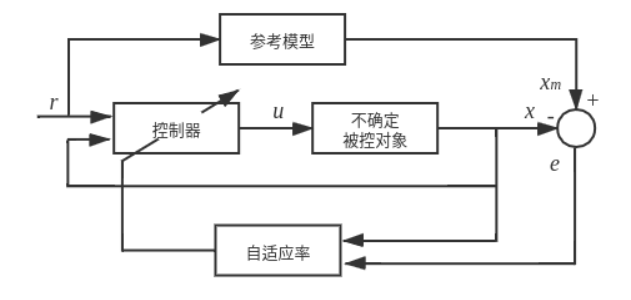

# MRAC

模型参考自适应控制（Model Reference Adaptive Control, MRAC）起源于20世纪50年代的航空航天领域，最初由Whitaker等人提出。当时面临的主要问题是飞机在不同飞行条件下（高度、速度、载荷变化）的控制参数需要实时调整，传统的固定参数控制器无法满足全飞行包络的性能要求。

MRAC的核心思想是通过设计一个自适应控制器，使得受控系统的输出能够渐近地跟踪参考模型的输出。参考模型是一个预先设计好的、具有期望动态性能的系统模型。受控系统在运行过程中，控制器会根据系统输出与参考模型输出之间的误差，实时调整控制参数，以实现对参考模型的跟踪。其工作流程如下：

1. 给定一个期望参考模型（理想响应）；
2. 在线计算误差（系统输出 vs 参考输出）；
3. 使用自适应律（如Lyapunov理论）调节控制参数；
4. 实时更新控制器，使误差趋于零。

## 一、问题描述

### 1.1 系统建模
考虑如下线性时不变动态系统：
$$
\dot{x} = A x + B u + \Delta(x)
$$
其中：
- $x\in\mathbb{R}^n$ 为系统状态向量
- $u\in\mathbb{R}^m$ 为控制输入向量
- $A\in\mathbb{R}^{n\times n}$ 为系统矩阵
- $B\in\mathbb{R}^{n\times m}$ 为输入矩阵
- $\Delta(x)\in\mathbb{R}^n$ 是未知不确定项（包括建模误差、外部干扰等）

**假设1**：矩阵对 $(A,B)$ 可控，即存在控制增益 $K$ 使得 $A-BK$ 的特征值位于左半平面。

**假设2**：不确定项 $\Delta(x)$ 可以用已知基函数的线性组合近似：
$$
\Delta(x) = W^* \Phi(x) + \varepsilon
$$
其中 $W^*\in\mathbb{R}^{l\times n}$ 为未知理想权重矩阵，$\Phi(x)\in\mathbb{R}^l$ 为已知基函数向量，$\varepsilon$ 为有界逼近误差，满足 $\|\varepsilon\| \le \varepsilon_0$。

### 1.2 控制器设计
设计如下自适应控制器：
$$
u = -K_x x + K_r r - \hat\Delta(x)
$$
其中：
- $K_x\in\mathbb{R}^{m\times n}$ 为状态反馈增益矩阵（待自适应调节）
- $K_r\in\mathbb{R}^{m\times p}$ 为前馈增益矩阵（待自适应调节）
- $r\in\mathbb{R}^p$ 为参考输入
- $\hat\Delta(x) = \hat{W}^T \Phi(x)$ 为不确定项的估计
- $\hat{W}\in\mathbb{R}^{l\times n}$ 为权重估计矩阵（待自适应调节）

**控制器结构分析**：
- 第一项 $-K_x x$ 提供状态反馈，用于稳定系统并改善动态性能
- 第二项 $K_r r$ 提供前馈补偿，确保稳态跟踪精度
- 第三项 $-\hat\Delta(x)$ 提供不确定性补偿，增强系统鲁棒性

### 1.3 参考模型
期望跟踪参考模型定义为：
$$
\dot{x}_m = A_m x_m + B_m r
$$
其中：
- $x_m\in\mathbb{R}^n$ 为参考模型状态
- $A_m\in\mathbb{R}^{n\times n}$ 为参考模型系统矩阵（Hurwitz稳定）
- $B_m\in\mathbb{R}^{n\times p}$ 为参考模型输入矩阵

**参考模型设计原则**：
1. $A_m$ 必须是Hurwitz矩阵（所有特征值实部为负）
2. 参考模型应具有期望的动态特性（如阻尼比、自然频率）
3. 通常选择 $A_m$ 和 $B_m$ 使得 $x_m$ 对 $r$ 的响应满足性能指标

### 1.4 跟踪误差定义
定义跟踪误差为：
$$
e = x - x_m
$$
控制目标是设计自适应律，使得：
$$
\lim_{t \to \infty} e(t) = 0
$$

## 二、闭环误差动力学

### 2.1 误差动力学推导

推导闭环误差动力学的核心思想是：首先得到包含自适应参数的闭环系统动态方程，然后通过引入理想参数的概念，将实际系统与参考模型的差异表达为参数估计误差的函数。
将设计的控制器 $u = -K_x x + K_r r - \hat{W}^T\Phi(x)$ 代入原系统 $\dot{x} = A x + B u + \Delta(x)$，并利用不确定项的结构 $\Delta(x) = W^* \Phi(x) + \varepsilon$，得到：
$$
\dot{x} = A x + B(-K_x x + K_r r - \hat{W}^T\Phi(x)) + W^* \Phi(x) + \varepsilon
$$
这个方程描述了在自适应控制器作用下的实际系统动态。注意这里同时包含了控制器对不确定项的估计补偿 $-\hat{W}^T\Phi(x)$ 和真实的不确定项 $W^* \Phi(x)$。将上式重新整理：
$$
\dot{x} = (A - BK_x)x + BK_r r + B(W^* - \hat{W})^T\Phi(x) + \varepsilon
$$

根据定义 $e = x - x_m$，有 $\dot{e} = \dot{x} - \dot{x}_m$。将闭环系统方程和参考模型方程代入：
$$
\dot{e} = (A - BK_x)x + BK_r r + B\tilde{W}^T\Phi(x) + \varepsilon - A_m x_m - B_m r
$$
其中权重估计误差 $\tilde{W} = W^* - \hat{W}$

### 2.2 理想参数匹配

为了实现完美跟踪，理想情况下应有：
$$
(A - BK_x^*)x_m + BK_r^* r = A_m x_m + B_m r
$$

这要求存在理想参数 $(K_x^*, K_r^*)$ 满足：
$$
A - BK_x^* = A_m, \quad BK_r^* = B_m
$$

### 2.3 误差动力学最终形式

定义参数估计误差：

- $\tilde{K}_x = K_x - K_x^*$ （状态反馈增益估计误差）
- $\tilde{K}_r = K_r - K_r^*$ （前馈增益估计误差）
- $\tilde{W} = \hat{W} - W^*$ （权重估计误差）

则闭环误差动力学为：
$$
\dot{e} = A_m e + B\left(-\tilde{K}_x x + \tilde{K}_r r - \tilde{W}^T\Phi(x)\right) + \varepsilon
$$

## 三、自适应律设计

### 3.1 Lyapunov函数的选取

选择如下复合Lyapunov函数：
$$
V = e^T P e + \frac{1}{2}\text{tr}(\tilde{K}_x^T \Gamma_x^{-1}\tilde{K}_x) + \frac{1}{2}\text{tr}(\tilde{K}_r^T \Gamma_r^{-1}\tilde{K}_r) + \frac{1}{2}\text{tr}(\tilde{W}^T\Gamma_W^{-1}\tilde{W})
$$

其中：

- $P \succ 0$ 是如下Lyapunov方程的正定解：
  $$
  A_m^T P + P A_m = -Q
  $$
  其中 $Q \succ 0$ 为任意正定矩阵

- $\Gamma_x \succ 0$, $\Gamma_r \succ 0$, $\Gamma_W \succ 0$ 为自适应增益矩阵（学习率）

由于 $A_m$ 是Hurwitz矩阵（所有特征值实部为负），对于任意 $Q \succ 0$，Lyapunov方程
$$
A_m^T P + P A_m = -Q
$$
有唯一正定解 $P \succ 0$​。

### 3.2 求导计算

对 $V$ 沿系统轨迹求导：
$$
\begin{aligned}
\dot{V} &= 2e^T P \dot{e} + \text{tr}(\tilde{K}_x^T \Gamma_x^{-1}\dot{\tilde{K}}_x) + \text{tr}(\tilde{K}_r^T \Gamma_r^{-1}\dot{\tilde{K}}_r) + \text{tr}(\tilde{W}^T\Gamma_W^{-1}\dot{\tilde{W}})
\end{aligned}
$$

由于 $\dot{\tilde{K}}_x = \dot{K}_x$, $\dot{\tilde{K}}_r = \dot{K}_r$, $\dot{\tilde{W}} = \dot{\hat{W}}$（理想参数为常数），有：
$$
\begin{aligned}
\dot{V} &= 2e^T P \dot{e} + \text{tr}(\tilde{K}_x^T \Gamma_x^{-1}\dot{K}_x) + \text{tr}(\tilde{K}_r^T \Gamma_r^{-1}\dot{K}_r) + \text{tr}(\tilde{W}^T\Gamma_W^{-1}\dot{\hat{W}})
\end{aligned}
$$

将误差动力学代入（忽略有界干扰项 $\varepsilon$ 对稳定性分析的影响）：
$$
\begin{aligned}
2e^T P \dot{e} &= 2e^T P [A_m e + B(-\tilde{K}_x x + \tilde{K}_r r - \tilde{W}^T\Phi(x))] \\
&= 2e^T P A_m e + 2e^T P B(-\tilde{K}_x x + \tilde{K}_r r - \tilde{W}^T\Phi(x))
\end{aligned}
$$

利用Lyapunov方程 $A_m^T P + P A_m = -Q$：
$$
2e^T P A_m e = e^T (P A_m + A_m^T P) e = -e^T Q e
$$

因此：
$$
2e^T P \dot{e} = -e^T Q e + 2e^T P B(-\tilde{K}_x x + \tilde{K}_r r - \tilde{W}^T\Phi(x))
$$

### 3.3 自适应律设计

利用矩阵迹的性质：$\text{tr}(AB) = \text{tr}(BA)$ 和 $a^T b = \text{tr}(ab^T)$，有：

$$
\begin{aligned}
2e^T P B \tilde{K}_x x &= 2\text{tr}(x e^T P B \tilde{K}_x^T) = 2\text{tr}(\tilde{K}_x^T x e^T P B) \\
2e^T P B \tilde{K}_r r &= 2\text{tr}(r e^T P B \tilde{K}_r^T) = 2\text{tr}(\tilde{K}_r^T r e^T P B) \\
2e^T P B \tilde{W}^T\Phi(x) &= 2\text{tr}(\Phi(x) e^T P B \tilde{W}) = 2\text{tr}(\tilde{W}^T \Phi(x) e^T P B)
\end{aligned}
$$

将所有项代入 $\dot{V}$ 表达式：
$$
\begin{aligned}
\dot{V} &= -e^T Q e - 2\text{tr}(\tilde{K}_x^T x e^T P B) + 2\text{tr}(\tilde{K}_r^T r e^T P B) + 2\text{tr}(\tilde{W}^T \Phi(x) e^T P B) \\
&\quad + \text{tr}(\tilde{K}_x^T \Gamma_x^{-1}\dot{K}_x) + \text{tr}(\tilde{K}_r^T \Gamma_r^{-1}\dot{K}_r) + \text{tr}(\tilde{W}^T\Gamma_W^{-1}\dot{\hat{W}})
\end{aligned}
$$

为使 $\dot{V} = -e^T Q e \le 0$，需要消除所有耦合项。设计自适应律：
$$
\begin{aligned}
\dot{K}_x &= \Gamma_x\, x\, (e^T P B)^T = \Gamma_x\, x\, B^T P^T e\\
\dot{K}_r &= -\Gamma_r\, r\, (e^T P B)^T = -\Gamma_r\, r\, B^T P^T e\\
\dot{\hat{W}} &= \Gamma_W\, \Phi(x)\, (e^T P B)^T = \Gamma_W\, \Phi(x)\, B^T P^T e
\end{aligned}
$$

注意：由于 $P$ 为实对称矩阵，有 $P^T = P$，因此：
$$
\boxed{
\begin{aligned}
\dot{K}_x &= \Gamma_x\, x\, e^T P B, \\
\dot{K}_r &= -\Gamma_r\, r\, e^T P B, \\
\dot{\hat{W}} &= \Gamma_W\, \Phi(x)\, e^T P B.
\end{aligned}}
$$

> **投影算子定义**：对于参数 $\theta$ 和投影集合 $\Omega$，投影算子定义为：
> $$
> \text{Proj}(\theta, y) = \begin{cases}
> y & \text{if } \theta \in \text{interior}(\Omega) \\
> y & \text{if } \theta \in \partial\Omega \text{ and } y^T \nabla g(\theta) \le 0 \\
> y - \frac{y^T \nabla g(\theta)}{\|\nabla g(\theta)\|^2} \nabla g(\theta) & \text{if } \theta \in \partial\Omega \text{ and } y^T \nabla g(\theta) > 0
> \end{cases}
> $$
> 其中 $g(\theta) \le 0$ 定义了约束集合 $\Omega = \{\theta : g(\theta) \le 0\}$。

为防止参数发散（特别是在存在干扰或激励不足时），采用投影式自适应律：
$$
\boxed{
\begin{aligned}
\dot{K}_x &= \Gamma_x\, \text{Proj}(K_x,\; x\,e^T P B), \\
\dot{K}_r &= -\Gamma_r\, \text{Proj}(K_r,\; r\,e^T P B), \\
\dot{\hat{W}} &= \Gamma_W\, \text{Proj}(\hat{W},\; \Phi(x)\,e^T P B).
\end{aligned}}
$$

## 四、稳定性分析

Barbalat 定理告诉我们：

> 若一个函数$ f(t)$ 有界且可微，且其导数$ \dot f(t)$ 可积，即
> $$
> \int_0^\infty |\dot f(\tau)|\, d\tau < \infty,
> $$
> 则$ f(t)$ 收敛到某个常数$ c$，即$ f(t) \to c$ 当$ t \to \infty$。
>
> 若进一步满足$ \dot f(t) \le 0$（单调非增），则可以推出
> $$
> f(t) \to 0, \quad t \to \infty.
> $$

### 4.1 Lyapunov 导数与误差有界性

由前述自适应律设计，可得 Lyapunov 函数导数：

$$
\dot{V} = - e^T Q e \le 0
$$

这表明：

1. $V(t)$ 单调非增，因此 $V(t) \le V(0)$，即 Lyapunov 函数有界。
2. 由 $V$ 的定义，跟踪误差 $e$、参数估计误差 $\tilde{K}_x, \tilde{K}_r, \tilde{W}$ 均被约束在一个有界区域内。
3. 因此闭环信号全局有界（Bounded Input–Bounded State, BIBS）。

### 4.2 跟踪误差收敛性

对误差动力学：

$$
\dot{e} = A_m e + B(-\tilde{K}_x x + \tilde{K}_r r - \tilde{W}^T \Phi(x))
$$

注意到：

- $e(t)$ 有界；
- $\tilde{K}_x(t), \tilde{K}_r(t), \tilde{W}(t)$ 有界；
- $\Phi(x)$ 有界（假设基函数为常用有界函数）。

因此误差导数 $\dot{e}$ 有界。由 Barbalat 定理可知：

$$
e(t) \to 0, \quad t \to \infty
$$

这说明系统在参考模型下渐近跟踪。

### 4.3 参数估计误差的有界性

采用投影式自适应律保证：

$$
K_x(t) \in \Omega_{K_x}, \quad K_r(t) \in \Omega_{K_r}, \quad W(t) \in \Omega_W
$$

其中 $\Omega_{(\cdot)}$ 是事先设定的参数界限集合。投影操作防止参数发散，使 $\tilde{K}_x, \tilde{K}_r, \tilde{W}$ 有界，从而保证整个闭环系统的鲁棒性。

### 4.4 闭环系统渐近稳定性

综上可得：

1. Lyapunov 函数 $V(t)$ 有界且单调非增；
2. 跟踪误差 $e(t)$ 有界且 $\dot{e}(t)$ 有界；
3. Barbalat 定理保证 $e(t) \to 0$；
4. 参数估计误差 $\tilde{K}_x, \tilde{K}_r, \tilde{W}$ 有界，且在满足持久激励（PE, Persistent Excitation）条件下可以收敛到真实值。

因此闭环系统具有 **渐近稳定性**，且跟踪误差可以收敛到零，参数在投影约束下保持有界。闭环系统所有信号均有界（Uniformly Ultimately Bounded, UUB）。
