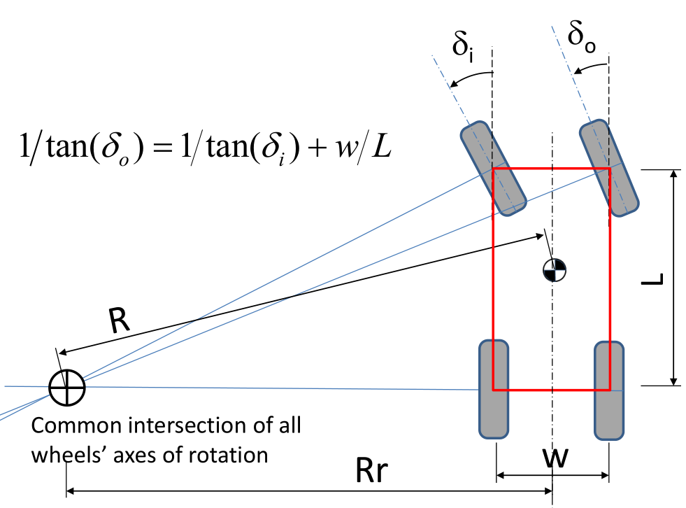

# 哈密顿函数与最优控制

> “给我一组协态变量，我就能引导系统的最优轨迹。”
>  —— 献给那些试图通过最优路径规划未来的工程师们

## 1. 拉格朗日的困境：微分约束的挑战

在上一篇中，我们看到拉格朗日力学如何优雅地处理几何约束——那些可以写成 $\phi(q_1, q_2, \ldots, q_s, t) = 0$ 的约束。但现实世界远比理想单摆复杂。

### 1.1 完整约束与非完整约束的根本区别

在经典力学中，约束可以分为两大类：

**完整约束（Holonomic Constraints）**：

- 定义：仅涉及坐标和时间的约束，形如 $\phi(q_1, q_2, \ldots, q_s, t) = 0$
- 特点：可通过坐标变换完全消除，减少系统自由度
- 几何意义：限制系统在某个子流形上运动

**非完整约束（Nonholonomic Constraints）**：

- 定义：涉及广义坐标导数的约束，形如 $f(q_1, \ldots, q_n, \dot{q}_1, \ldots, \dot{q}_n, t) = 0$，且无法积分为纯坐标关系
- 特点：不能通过坐标选择消除，不减少位形空间维数但限制切向量空间
- 几何意义：在每一点处限制允许的切向量方向，定义一个分布（distribution）

### 1.2 非完整约束的物理直觉

非完整约束的核心特征：**局部受限，全局可达**。

- **局部受限**：在任意瞬时，系统只能沿某些特定方向运动
- **全局可达**：通过适当的运动序列，系统可从任意状态到达任意其他状态

经典例子：

1. **车辆转弯**：在每个瞬时，车辆只能沿着某一方向改变速度，但可以通过一系列转弯最终到达任何位置。
2. **航天器姿态控制**：当航天器受到角动量守恒约束时，虽然每一时刻其姿态调整受限，但通过连续的小范围调整，航天器可以达到任意的姿态。
3. **滚动物体**：一个球在平面上滚动，每次只能沿着接触点的法线方向滚动，但通过连续滚动，球体可以达到任意位置与角度。

| 约束类型   | 数学形式                | 拉格朗日处理   | 典型例子               |
| ---------- | ----------------------- | -------------- | ---------------------- |
| 完整约束   | $\phi(q,t) = 0$         | ✓ 广义坐标消除 | 刚体、单摆             |
| 非完整约束 | $\sum A_i\dot{q}_i = 0$ | ✗ 无法直接处理 | 车辆转弯、航天姿态控制 |

### 1.4 为什么拉格朗日方法不好？

拉格朗日方法的核心是通过选择合适的广义坐标，使约束自动满足。但对于非完整约束：

1. **维数悖论**：$n$ 个坐标受 $m$ 个非完整约束，位形空间仍是 $n$ 维的，但在每点处只有 $n-m$ 个独立的速度方向
2. **积分不存在性**：无法找到 $n-m$ 个独立的广义坐标来参数化所有可能的运动
3. **约束力未知**：约束反力不能通过消除约束来避免，必须显式引入

---

## 2. 阿克曼转向：汽车的几何智慧

### 2.1 从四轮到两轮的简化

1817年，德国工程师阿克曼设计了著名的转向几何。对于四轮车辆，内侧车轮和外侧车轮必须满足不同的转角关系：

$$
\cot\delta_o - \cot\delta_i = \frac{w}{L}
$$

其中 $w$ 是轮距，$L$ 是轴距，$\delta_i$ 和 $\delta_o$ 分别是内外轮转角。

但在控制理论中，我们通常采用**自行车模型**简化：将前轮等效为一个虚拟车轮，后轮同样处理。

### 2.2 自行车模型到刀片小车

考虑一个理想的自行车模型：
- 状态：$(x, y, \theta)$ —— 位置和航向角
- 控制：$(v, \delta)$ —— 线速度和前轮转角
- 参数：$L$ —— 轴距

运动学方程为：

$$
\begin{cases}
\dot{x} = v \cos\theta \\
\dot{y} = v \sin\theta \\
\dot{\theta} = \frac{v}{L} \tan\delta
\end{cases}
$$

关键的**非完整约束**是：车辆不能侧向滑动，即速度方向始终沿车身方向。

当前轮转角很小时，$\tan\delta \approx \delta$，我们得到更简单的**刀片小车**（或称unicycle）模型：

$$
\begin{cases}
\dot{x} = v \cos\theta \\
\dot{y} = v \sin\theta \\
\dot{\theta} = \omega
\end{cases}
$$

其中 $\omega = \frac{v\delta}{L}$ 是角速度。**非完整约束**变为：

$
\dot{y}\cos\theta - \dot{x}\sin\theta = 0
$

这个约束体现了刀片小车的本质特征：
- **瞬时限制**：只能沿当前车身方向运动，不能"蟹行"
- **全局可达性**：通过转向-移动的组合，可到达平面上任意位置和方向
- **非完整性**：无法通过坐标变换消除，必须显式处理约束力

**这个约束无法写成位置的函数，是拉格朗日方法无法直接处理的典型非完整约束。**

---

## 3. 哈密顿力学：相空间中的新天地

在哈密顿力学中，系统的状态并不是仅仅通过配置空间（position space）来描述的。配置空间仅仅提供了粒子或物体在空间中的位置，但并不能完全反映出系统的动力学行为。因此，哈密顿力学引入了**相空间**的概念，这是一个结合了物体位置和动量的空间。

在经典力学中，系统的状态可以通过一组位置坐标 $ q_i $ 和其对应的动量坐标 $ p_i $ 来描述，其中 $ i $ 表示系统中每个自由度的索引。通过将这些位置和动量的组合纳入考虑，哈密顿力学为物理系统提供了一个更为全面的描述。

**配置空间与相空间的关系：**

- **配置空间（Configuration Space）**： 这是一个仅由位置坐标 $ q = (q_1, q_2, \ldots, q_n) $ 组成的空间。在此空间中，我们能够描述物体的位置，但无法得知物体的运动状态。
  
- **相空间（Phase Space）**： 这是一个由位置坐标 $ q_i $ 和动量坐标 $ p_i $ 组成的空间。每个状态点都可以用一个 $ (q, p) $ 对来表示，给定 $ q_i $ 和 $ p_i $，我们不仅知道物体的位置，还能推算出它的动量，从而全面描述物体的运动状态。

在哈密顿力学中，系统的运动是通过相空间中的**轨迹**来描述的，随着时间的推移，物体在相空间中沿着一定的路径演化。这个演化过程由哈密顿方程控制，这些方程能够揭示系统在相空间中如何发展。

### 3.1 从配置空间到相空间

哈密顿的革命在于**升维降阶**：将 $n$ 个二阶微分方程转化为 $2n$ 个一阶微分方程。

定义广义动量：

$$
p_i = \frac{\partial L}{\partial \dot{q}_i}
$$

哈密顿量（总能量）：

$$
H(q,p,t) = \sum_i p_i \dot{q}_i - L(q,\dot{q},t)
$$

哈密顿方程：

$$
\begin{cases}
\dot{q}_i = \frac{\partial H}{\partial p_i} \\
\dot{p}_i = -\frac{\partial H}{\partial q_i}
\end{cases}
$$

### 3.2 处理约束：拉格朗日乘数法的运用

对于带微分约束 $\psi(q,\dot{q},t) = 0$ 的系统，哈密顿方法引入拉格朗日乘数 $\lambda$：

$$
H^* = H + \lambda \psi
$$

约束力通过乘数自然体现，不再需要事先消除。

### 3.3 刀片小车的哈密顿分析

对刀片小车，定义拉格朗日量：

$$
L = \frac{1}{2}m(\dot{x}^2 + \dot{y}^2) + \frac{1}{2}J\dot{\theta}^2
$$

约束：$\dot{y}\cos\theta - \dot{x}\sin\theta = 0$

广义动量：
$$
p_x = m\dot{x}, \quad p_y = m\dot{y}, \quad p_\theta = J\dot{\theta}
$$

约束哈密顿量：

$$
H = \frac{p_x^2}{2m} + \frac{p_y^2}{2m} + \frac{p_\theta^2}{2J} + \lambda(p_y\cos\theta - p_x\sin\theta)
$$

哈密顿方程组：

$$
\begin{cases}
\dot{x} = \frac{p_x}{m} - \lambda\sin\theta \\
\dot{y} = \frac{p_y}{m} + \lambda\cos\theta \\
\dot{\theta} = \frac{p_\theta}{J} \\
\dot{p}_x = -\lambda p_y\sin\theta - \lambda p_x\cos\theta \\
\dot{p}_y = \lambda p_y\cos\theta - \lambda p_x\sin\theta \\
\dot{p}_\theta = 0
\end{cases}
$$

加上约束条件，系统完全确定。微分约束不再是障碍，而是系统描述的组成部分。

## 4. 最优控制中的哈密顿函数

> 🌟 为什么最优控制的哈密顿函数形式上跟力学的哈密顿量这么像？

因为它们**都源于变分原理（variational principle）**，使用了相似的数学工具（如勒让德变换、拉格朗日乘子法、泛函极值问题），自然就会“长得像”。

### 4.1 **共同的数学基础：变分法**

- 在**力学**中，我们从**最小作用量原理**（Hamilton's principle）出发：
  $$
  \delta \int_{t_0}^{t_f} L(q, \dot{q}, t) \, dt = 0
  $$
  推出拉格朗日方程，再做勒让德变换得到哈密顿量。

- 在**最优控制**中，我们试图极小化一个性能指标：
  $$
  J = \int_{t_0}^{t_f} L(x, u, t) \, dt, \quad \text{s.t. } \dot{x} = f(x, u)
  $$
  为了处理约束，我们引入**拉格朗日乘子**（协态变量 $\lambda$），形成扩展拉格朗日，再推导出哈密顿函数。

👉 两者都在优化一个泛函，都用到了“拉格朗日 + 动态约束 + 极值条件”的组合，因此形式自然趋同。

### 4.2 **勒让德变换的角色**

设 $f: \mathbb R^n \to \mathbb R$ 为**严格凸**的 $C^2$ 函数，其**勒让德变换** $f^*$ 定义为  
$$
f^*(p)=\sup_{x}\!\bigl\{p^{\mathsf T}x-f(x)\bigr\}.
$$
**共轭变量**：$p=\nabla f(x)$。  

**逆变换**：$(f^*)^*=f$，变换为**对合**（involution）。

- 力学中：
  $$
  H(q, p) = p \dot{q} - L(q, \dot{q})
  $$
  
- 控制中：
  虽然不是显式做勒让德变换，但通过构造：
  $$
  \mathcal{H}(x, u, \lambda) = L(x, u) + \lambda^\top f(x, u)
  $$
  实质上也相当于引入“共轭变量”  $\lambda$ 替代了状态导数，承担了类似的角色。

👉 换句话说，最优控制的协态变量 $\lambda$，**在结构上就像**力学里的动量 $p$。

### 4.3 **PMP 与 哈密顿正则方程结构一致**

从庞特里亚金最大值原理（PMP）推出的协态方程：

$$
\dot{x} = \frac{\partial \mathcal{H}}{\partial \lambda}, \quad \dot{\lambda} = -\frac{\partial \mathcal{H}}{\partial x}
$$
结构上和哈密顿正则方程：

$$
\dot{q} = \frac{\partial H}{\partial p}, \quad \dot{p} = -\frac{\partial H}{\partial q}
$$

### 4.4 协态变量的直观理解

协态变量的作用是帮助我们**“衡量”**和**“优化”**状态方程的约束。例如，在最优控制问题中，我们有一个性能指标（如代价函数），并希望找到最优的控制 $u(t)$ 和路径 $x(t)$，使得这个指标最小化。协态变量通过与系统的动力学方程进行配对，帮助我们将代价函数与状态方程的约束进行统一优化。

直观地说，协态变量就像是“**成本梯度的反向推导**”。它们并不直接控制系统的行为，而是影响如何从**系统的目标函数（如代价函数）**和**约束条件**（如动力学方程）中计算最优控制。

在最优控制问题中，**最优规划**实际上是**规划协态变量的演化**，而不是直接规划控制 $u(t)$ 或状态 $x(t)$。我们可以这样理解：

1. **目标是最小化代价函数**：通常，最优控制问题的目标是最小化某个性能指标 $J$，例如：
   $$
   J = \int_{t_0}^{t_f} L(x(t), u(t), t) \, dt
   $$
   其中 $L(x, u, t)$ 是瞬时代价函数。

2. **引入协态变量**：为了处理系统的动态约束，我们通过引入协态变量 $\lambda(t)$，将问题转换为“**拉格朗日乘子法**”的形式。协态变量的作用就是对每个状态变量施加一个**“成本”**，帮助我们在最优性条件中找到控制和状态的最佳配合。

3. **最优规划：** 通过庞特里亚金最大值原理（PMP），最优控制问题的最优性条件给出了关于协态变量和状态变量的关系。协态变量的演化轨迹实际上影响了整个系统的控制决策和状态演化。我们可以通过解协态方程和状态方程来“规划”系统的演化轨迹。

   - **协态方程：**
     $$
     \dot{\lambda}(t) = -\frac{\partial L}{\partial x}(x, u, t) - \frac{\partial f}{\partial x}(x, u, t)^\top \lambda(t)
     $$
   
   - **控制优化：**
     $$
     u^*(t) = \arg\max_u \mathcal{H}(x(t), u(t), \lambda(t), t)
     $$

   所以，**最优控制问题的关键**其实是规划协态变量 $\lambda(t)$ 的演化，这决定了状态 $x(t)$ 和控制 $u(t)$ 的最优路径。

假设我们有一个**自动驾驶汽车**，目标是通过最优控制算法规划一条从起点到终点的最短路径，并尽量避免油耗过高。我们考虑以下几种因素：

- **状态变量** $x(t)$：车辆的速度、位置等。
- **控制输入** $u(t)$：油门、刹车的操作。
- **性能指标**：路径长度 + 油耗。
- **约束**：车辆的运动方程（动力学）和油门刹车的物理限制。

通过最优控制，我们要找到**最优的油门和刹车控制策略**，使得总油耗最小化。这个问题可以通过协态变量来建模：

- 协态变量 $\lambda(t)$ 表示与车辆当前的动力学约束（比如位置和速度）相关的“成本”。
- $\lambda(t)$ 的演化决定了车辆应如何在不同时间段调整油门和刹车操作，以在不违反物理约束的前提下，最小化油耗。

**最优控制**并不是直接规划油门或刹车的操作，而是通过调整协态变量 $\lambda(t)$ 来间接影响这些控制输入的选择。

### 4.5 **更深层的联系：庞特里亚金原理的几何解释**

在更高阶的数学视角（微分几何），两者都可以被统一描述为**辛几何系统（symplectic system）**上的轨道演化：
- 力学系统演化在**相空间** $(q, p)$
- 控制系统演化在**协态空间** $(x, \lambda)$

都保持某种“守恒结构”（辛结构不变）。

## 5 总结

| 项目       | 力学                                | 最优控制                           |
| ---------- | ----------------------------------- | ---------------------------------- |
| 原则       | 最小作用量                          | 最小代价泛函                       |
| 优化变量   | 轨迹 $q(t)$                         | 控制 $u(t)$                        |
| 状态       | $q$                                 | $x$                                |
| 共轭变量   | $p = \partial L / \partial \dot{q}$ | $\lambda$：协态变量                |
| 哈密顿函数 | $H = p \dot{q} - L$                 | $\mathcal{H} = L + \lambda^\top f$ |
| 正则结构   | 是                                  | 是                                 |
| 函数意义   | 能量                                | 辅助优化量                         |

它们“长得像”不是巧合，而是因为**最优控制理论其实就是受到了解析力学的深刻启发**，本质上都是变分法框架下的不同应用。

正如哈密顿的力学思想：  

> "时间只是一个参数，真正的物理学发生在相空间中。"

而在最优控制的语境下，我们可以补充：  
> "控制只是一种手段，真正的智慧体现在协态空间的轨迹设计中。"

### 参考文献
- [辛几何与哈密顿力学 - 小时百科](https://wuli.wiki/online/HamCan.html)
- [微分几何——Frobenius定理 - 知乎](https://zhuanlan.zhihu.com/p/501190939)

