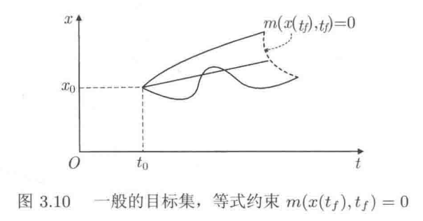

# 从拉格朗日力学到最优控制

> “给我一条作用量，我就能预言宇宙。”  
> —— 写给所有想用最小代价理解世界的人

---

## 1. 从牛顿到拉格朗日：一次优雅的降维打击

1686 年，牛顿在《自然哲学的数学原理》中写下第二定律
$$
\vec F = m \ddot{\vec r}
$$

从此，经典力学似乎被“力”垄断。这一理论在处理简单系统时表现出色，但当面对复杂的多体系统或约束系统时，牛顿方法往往显得力不从心。两个世纪后，拉格朗日给出了另一种视角：**与其纠结于“力”，不如关注“能量”**。

| 方法 | 核心变量 | 方程形式 | 典型困难 |
|------|----------|----------|----------|
| 牛顿力学 | 力、加速度 | 二阶矢量方程 | 约束力未知、耦合难解 |
| 拉格朗日力学 | 能量（T-V） | 标量方程 | 需选广义坐标、变分思想 |

拉格朗日的革命在于：**用能量差 $L = T - V$ 取代力，用广义坐标消去约束**。这不仅让单摆问题从 3 个耦合方程降为 1 个独立方程，更为后续的最优控制埋下伏笔。

---

## 2. 两种视角下的同一单摆

### 牛顿视角：力的分解

摆长为 $l$ 的单摆，在直角坐标系中需解

$$
\begin{cases}
-T \dfrac{x}{\sqrt{x^2+y^2}} = m \ddot x \\[6pt]
mg - T \dfrac{y}{\sqrt{x^2+y^2}} = m \ddot y \\[6pt]
x^2 + y^2 = l^2
\end{cases}
$$

未知张力 $T$ 让问题变得复杂。

### 拉格朗日视角：能量的游戏

选摆角 $\theta$ 为广义坐标，动能和势能分别为

$$
T = \tfrac{1}{2} m l^2 \dot \theta^2, \quad V = mgl(1-\cos\theta)
$$

代入拉格朗日方程

$$
\frac{d}{dt}\left(\frac{\partial L}{\partial \dot \theta}\right) - \frac{\partial L}{\partial \theta} = 0
$$

瞬间得到熟悉的单摆方程

$$
\ddot \theta + \frac{g}{l} \sin\theta = 0
$$

**没有张力，没有约束方程，只有能量在跳舞。**

---

## 3. 虚功、变分与两条殊途同归的路

### 3.1 虚功原理：约束力的“隐身术”

达朗贝尔将牛顿第二定律改写为

$$
(\vec F - m \ddot{\vec r}) \cdot \delta \vec r = 0
$$

其中 $\delta \vec r$​ 是**虚位移**——满足约束的瞬时假想位移。若约束理想（不做功），则约束力自动消失，留下纯粹的动力学。虚功原理表述为：**在平衡状态下，主动力在任意虚位移上所做的虚功之和为零。**

### 3.2 广义坐标与广义力

对于具有 $$s$$ 个自由度的系统，我们可以选择 $$s$$ 个独立的广义坐标 $$q_1, q_2, \ldots, q_s$$ 来完全描述系统的位形。质点位置与广义坐标的关系为：

$$
\vec{r}_i = \vec{r}_i(q_1, q_2, \ldots, q_s, t)
$$

虚位移可表示为：

$$
\delta\vec{r}_i = \sum_{j=1}^{s} \frac{\partial\vec{r}_i}{\partial q_j}\delta q_j
$$

定义广义力：

$$
Q_j = \sum_{i=1}^{n} \vec{F}_i \cdot \frac{\partial\vec{r}_i}{\partial q_j}
$$

则虚功原理变为：

$$
\sum_{j=1}^{s} Q_j \delta q_j = 0
$$

由于 $$\delta q_j$$ 是独立的，因此：$$Q_j = 0, \quad j = 1, 2, \ldots, s$$

### 3.3 达朗贝尔原理与拉格朗日方程

将达朗贝尔原理与虚功原理结合，对于动态系统有：

$$
\sum_{i=1}^{n} (\vec{F}_i - m_i\vec{a}_i) \cdot \delta\vec{r}_i = 0
$$

其中惯性力项：

$$
\sum_{i=1}^{n} m_i\vec{a}_i \cdot \delta\vec{r}_i = \sum_{i=1}^{n} m_i\frac{d\vec{v}_i}{dt} \cdot \delta\vec{r}_i
$$

通过复杂的数学推导（涉及对时间求导与变分运算的交换），最终可得到拉格朗日方程的第二类形式：

$$
\frac{d}{dt}\frac{\partial T}{\partial \dot{q}_j} - \frac{\partial T}{\partial q_j} = Q_j
$$

当系统为保守系统时，存在势能函数 $$V$$，使得 $$Q_j = -\frac{\partial V}{\partial q_j}$$，定义拉格朗日量：

$$
L = T - V
$$

得到著名的拉格朗日方程：

$$
\frac{d}{dt}\frac{\partial L}{\partial \dot{q}_j} - \frac{\partial L}{\partial q_j} = 0, \quad j = 1, 2, \ldots, s
$$

### 3.4 最速降线与欧拉方程

1696 年，约翰·伯努利提出最速降线问题：在重力作用下，小球从点A滑到点B，什么形状的曲线能使滑行时间最短？

设曲线方程为 $$y = y(x)$$，质点从 $$(0,0)$$ 滑到 $$(x_1, y_1)$$。根据能量守恒：

$$
\frac{1}{2}mv^2 = mgy
$$

即 $$v = \sqrt{2gy}$$

弧长元素：$$ds = \sqrt{1 + (y')^2}dx$$

总时间：

$$
T = \int_0^{x_1} \frac{ds}{v} = \int_0^{x_1} \frac{\sqrt{1 + (y')^2}}{\sqrt{2gy}} dx
$$

这是一个典型的变分问题：寻找函数 $$y(x)$$ 使积分 $$T$$ 取最小值。

考虑一般的变分问题：求函数 $$y(x)$$ 使泛函
$$
I = \int_{x_1}^{x_2} F(x, y, y') dx
$$

取极值，其中 $$F$$ 是关于 $$x, y, y'$$ 的已知函数。

设 $$y(x)$$ 是使 $$I$$ 取极值的函数，$$\eta(x)$$ 是满足边界条件 $$\eta(x_1) = \eta(x_2) = 0$$ 的任意函数。考虑函数族：

$$
Y(x) = y(x) + \epsilon\eta(x)
$$

其中 $$\epsilon$$ 是小参数。将其代入泛函：

$$
I(\epsilon) = \int_{x_1}^{x_2} F(x, y + \epsilon\eta, y' + \epsilon\eta') dx
$$

极值条件要求：

$$
\frac{dI}{d\epsilon}\bigg|_{\epsilon=0} = 0
$$

计算得：

$$
\frac{dI}{d\epsilon}\bigg|_{\epsilon=0} = \int_{x_1}^{x_2} \left(\frac{\partial F}{\partial y}\eta + \frac{\partial F}{\partial y'}\eta'\right) dx
$$

对第二项进行分部积分：

$$
\int_{x_1}^{x_2} \frac{\partial F}{\partial y'}\eta' dx = \frac{\partial F}{\partial y'}\eta\bigg|_{x_1}^{x_2} - \int_{x_1}^{x_2} \frac{d}{dx}\frac{\partial F}{\partial y'}\eta dx
$$

由于 $$\eta(x_1) = \eta(x_2) = 0$$，第一项为零，因此：

$$
\int_{x_1}^{x_2} \left(\frac{\partial F}{\partial y} - \frac{d}{dx}\frac{\partial F}{\partial y'}\right)\eta dx = 0
$$

由于 $$\eta(x)$$ 是任意的，必须有：

$$
\frac{d}{dx}\frac{\partial F}{\partial y'} - \frac{\partial F}{\partial y} = 0
$$

这就是著名的**欧拉-拉格朗日方程**。巧合的是，它与上节拉格朗日方程**形式完全一致**！

---

## 4. 最小作用量原理：从力学走向控制

### 4.1 哈密顿的洞察

1833 年，哈密顿统一两条线索：  
- **力学**：拉格朗日方程对应能量泛函极值  
- **数学**：欧拉方程对应路径泛函极值  

于是提出**最小作用量原理**：

> **真实运动使作用量 $S = \int_{t_1}^{t_2} L(q,\dot q,t)\,dt$ 取极值。**

变分给出拉格朗日方程

$$
\frac{d}{dt}\left(\frac{\partial L}{\partial \dot q}\right) - \frac{\partial L}{\partial q} = 0
$$

### 4.2 从哈密顿原理推导拉格朗日方程

考虑广义坐标的变分 $$\delta q$$，满足边界条件 $$\delta q(t_1) = \delta q(t_2) = 0$$。

$$
\delta S = \int_{t_1}^{t_2} \left(\frac{\partial L}{\partial q}\delta q + \frac{\partial L}{\partial \dot{q}}\delta \dot{q}\right) dt
$$

注意到 $$\delta \dot{q} = \frac{d}{dt}(\delta q)$$，对第二项进行分部积分：

$$
\int_{t_1}^{t_2} \frac{\partial L}{\partial \dot{q}}\delta \dot{q} dt = \frac{\partial L}{\partial \dot{q}}\delta q\bigg|_{t_1}^{t_2} - \int_{t_1}^{t_2} \frac{d}{dt}\frac{\partial L}{\partial \dot{q}}\delta q dt
$$

由于边界条件，第一项为零，因此：

$$
\delta S = \int_{t_1}^{t_2} \left(\frac{\partial L}{\partial q} - \frac{d}{dt}\frac{\partial L}{\partial \dot{q}}\right)\delta q dt = 0
$$

由于 $$\delta q$$ 的任意性，得到拉格朗日方程：

$$
\frac{d}{dt}\frac{\partial L}{\partial \dot{q}} - \frac{\partial L}{\partial q} = 0
$$

### 4.3 迈向最优控制

最小作用量原理的精髓在于：  
- **状态**：广义坐标 $q$  
- **控制**：广义速度 $\dot q$（或控制输入 $u$）  
- **代价**：作用量 $S$

现代最优控制只是把  
- $L$ 换成**代价函数** $\ell(x,u,t)$  
- 约束换成**动力学方程** $\dot x = f(x,u,t)$  

便得到庞特里亚金极大值原理——拉格朗日力学的直系后裔。

---

## 5. 通向最优控制理论

### 5.1 最优控制问题的数学表述

最优控制问题的一般形式为：

给定系统状态方程：$$\dot{x} = f(x, u, t)$$

初始条件：$$x(t_0) = x_0$$

目标泛函：$$J = \int_{t_0}^{t_f} L(x, u, t) dt + \Phi(x(t_f), t_f)$$

求控制函数 $$u(t)$$ 使 $$J$$ 最小。

### 5.2 变分法与庞特里雅金最大值原理

庞特里雅金最大值原理是最优控制理论的核心结果，它的推导同样基于变分法的思想。定义哈密顿函数：

$$
H(x, u, \lambda, t) = L(x, u, t) + \lambda^T f(x, u, t)
$$

最优控制必须满足：

1. **状态方程**：$$\dot{x} = \frac{\partial H}{\partial \lambda}$$
2. **协态方程**：$$\dot{\lambda} = -\frac{\partial H}{\partial x}$$
3. **最大值条件**：$$H(x^*, u^*, \lambda, t) = \max_u H(x^*, u, \lambda, t)$$

这些方程的形式与经典力学中的哈密顿方程惊人地相似！

### 5.3 从拉格朗日力学到现代控制

从拉格朗日力学到最优控制理论的发展历程，体现了以下重要思想的传承：

1. **变分原理**：从最小作用量到最优性原理
2. **哈密顿形式**：从经典力学的哈密顿方程到最优控制的协态方程
3. **对偶性**：位置-动量对偶到状态-协态对偶
4. **整体优化**：从自然规律到人工系统的最优设计

## 6. 结语：一条原理，两种语言

| 拉格朗日力学 | 最优控制 |
|-------------|----------|
| 广义坐标 $q$ | 状态 $x$ |
| 拉格朗日量 $L = T-V$ | 代价函数 $\ell(x,u,t)$ |
| 欧拉-拉格朗日方程 | 伴随方程 |
| 最小作用量 $\delta S = 0$ | 极小化代价 $J = \int \ell\,dt$ |

从单摆到火箭，从虚功原理到庞特里亚金，我们看到：  
**当世界被正确描述时，最复杂的运动往往源于最简单的极值原理。**

---

### 参考文献
- [知乎专栏： 从零学分析力学（拉格朗日力学篇）](https://zhuanlan.zhihu.com/p/156760739)
- [知乎问答：拉格朗日方程从何而来？](https://www.zhihu.com/question/49361447)
- [虚功原理 - 中国大百科全书](https://www.zgbk.com/ecph/words?SiteID=1&ID=230462)
- [哈密顿力学 - 小时百科](https://wuli.wiki/online/HMD.html)
- [广义力 - 小时百科](https://wuli.wiki/online/LagEqQ.html)

